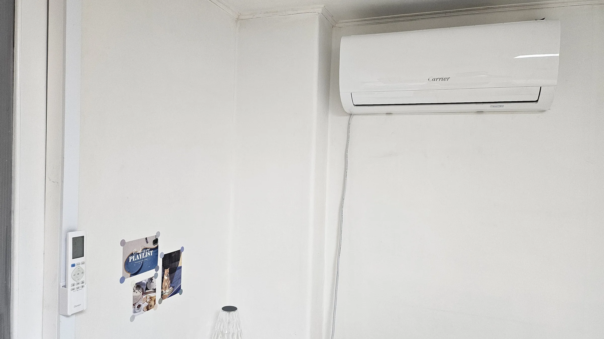
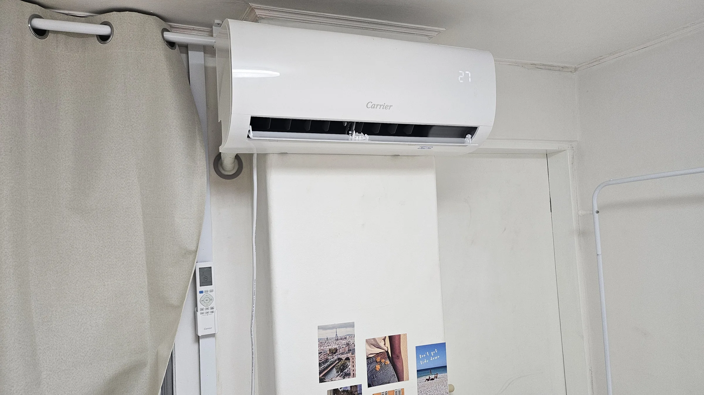
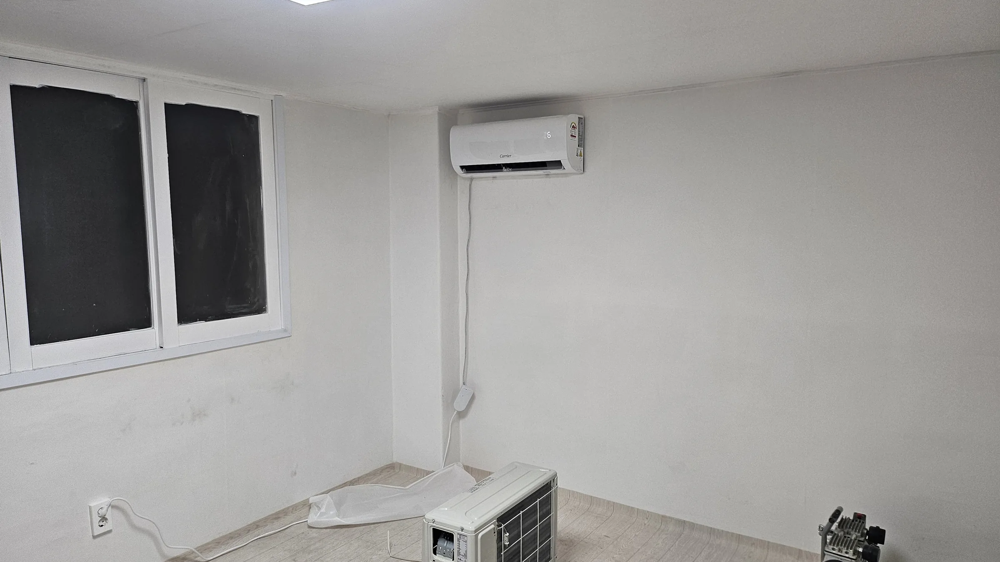

Summer is over. The machine that ran every night since June is about to
be switched off and not thought about again until next May.

**That is the moment worth catching.** All summer it smelled faintly of
a damp towel for the first thirty seconds — you noticed, it faded, you
forgot. That smell is water: cooling pulls moisture out of the air, it
condenses on the cold metal inside the unit, and if it never dries it
grows things.

Now do the arithmetic on the off-season. A unit switched off wet in
September **sits wet for eight months**, in a sealed plastic box, in a
room nobody ventilates in winter. Whatever is in there in September is
what greets you in May, with a winter to develop.

The end of summer is not a leftover time to deal with this. **It is the
right time**, and this article is about why, and about what the job
actually is.

## The filter is yours

Open the front panel — it hinges upward on most wall units — and there
are one or two mesh filters that slide out. This part is designed for
you to do.

Rinse them under a tap, no detergent needed, and **let them dry
completely** before they go back. A damp filter reinstalled is the
problem you were trying to solve. In a Korean summer, once every two
weeks is a reasonable rhythm.

If the airflow has been getting weaker and the room takes longer to
cool, a blocked filter is the first thing to rule out, and it costs
nothing to check.

*The filters live behind the front panel, and they slide straight out · ⓒ @BalliBalliSeoul*

## Everything past the filter is not

Behind the filter is the heat exchanger — a dense block of aluminium
fins — and behind that a long barrel fan, and under both a drain tray.
That is where the smell actually lives, and none of it is reachable
without taking the machine apart.

People try. A can of aircon spray through the vents is sold everywhere
and mostly moves the problem deeper, because whatever it dissolves
drips into the drain tray and stays there.

*Past the louvres it is fins and a fan, and they do not rinse · ⓒ @BalliBalliSeoul*

## Why the shoulder season is the whole point

Two separate reasons, and they stack.

**The machine gets a proper rest.** A clean in July buys you six weeks
before the unit is running hard again. A clean in September means it
goes into eight months of standstill dry and empty rather than damp —
which is the difference between a machine that smells next May and one
that does not. **Nothing you do in July gets you that.**

**And it is the cheaper, faster half of the year.** Everyone books in
June and July. Those months have the longest wait and the least
negotiable price — the discounts that run the rest of the year quietly
disappear when the queue is full. Late spring and the end of summer are
when you get a date within days and a crew that is not rushing to the
next job.

If you are reading this in August with a smell already, the order is:
rinse the filter, run fan mode after every session, and book the strip
for September. **The smell is unpleasant, not urgent** — and waiting a
few weeks gets you a better job for less money.

## 분해청소 or 간단청소 — this is the distinction that matters

Korean cleaners offer two different jobs and quote them as if they were
the same product. Ask which one you are being sold.

| | 간단청소 (simple clean) | 분해청소 (full strip) |
|---|---|---|
| What happens | Cover off, filter washed, fins sprayed and wiped | Casing, fan and drain tray removed from the wall bracket |
| The barrel fan | Not reached | Taken out and washed separately |
| Drain tray | Wiped if visible | Removed and cleaned |
| Water used | Cloth and spray | Pressure washer, with a bag hung to catch runoff |
| Does the smell come back | Usually, within weeks | Not for a season or two |

If the complaint is a smell rather than dust, **간단청소 is not the job
you want.** The smell is coming from the fan and the tray, and a clean
that never reaches them is a clean you will pay for twice.

The tell on the day is the plastic. A full strip means a large bag or
sheet hung under the unit to funnel dirty water into a bucket. If
nobody is hanging plastic, nobody is stripping anything.

## The type of unit changes the job

Not all aircon cleaning is the same size of job, and quotes that ignore
this are quotes that get revised on the day.

- **벽걸이 (wall-mounted)** — the standard case, and the quickest.
- **스탠드 (floor standing)** — the tall cabinet units in living rooms.
  More panels, more time.
- **천장형 / 시스템 (ceiling cassette)** — mounted in the ceiling,
  usually needs two people and sometimes access above the panel.

Tell whoever you are asking which type you have, how many units, and
send a photo. It is the single thing that makes a quote hold.

## What it costs

Aircon cleaning is priced **per unit and by type**, not by the hour, and
a full strip costs meaningfully more than a wipe-down because it is a
different amount of work. Guide ranges as of 2026:

| Unit type | 간단청소 (wipe) | 분해청소 (full strip) |
| --- | --- | --- |
| **벽걸이** wall-mounted | ₩40,000–60,000 | **₩60,000–90,000** |
| **스탠드** floor standing | — | ₩100,000–150,000 |
| **2-in-1** (stand + wall unit sold as a set) | — | ₩150,000–220,000 |
| **천장형 / 시스템** ceiling cassette | — | ₩100,000–170,000 |

Two things get added on top. **Heavy mould or smell** often carries a
high-pressure sanitising or anti-microbial coating option, commonly
**₩20,000–30,000** per unit. And the **outdoor unit, a call-out fee, or
unusually bad contamination** are usually quoted separately.

Look at the wall-mounted row again. **The gap between a wipe and a strip
is roughly ₩20,000–30,000** — which is small enough that paying twice
for the wrong one is the expensive outcome, not the strip.

Before you agree to anything, get three things in writing: which of the
two jobs it is, the price per unit for your type, and whether the quote
covers the outdoor unit as well. That last one is a common gap.

*Both halves of one aircon, before the second one goes outside · ⓒ @BalliBalliSeoul*

That photograph is worth a second look, because it is the thing people
forget. **An air conditioner is two boxes, not one.** The half you look
at every day is indoors; the half that sits in the weather, collects
leaves and dust and traps heat against a wall, is the one you never see —
and the one a quote will quietly leave out.

## Who pays — you or the landlord

The aircon is usually the landlord's fixture, so a fault — it will not
cool, it leaks water into the room, it trips the breaker — is a repair
question and normally theirs.

Routine cleaning is different. It is maintenance arising from ordinary
use, and it tends to land on the tenant, which is why the filter habit
is worth having. Where it gets argued about is a unit that was already
filthy when you moved in — and that is a good reason to photograph it
on day one, along with
[everything else worth photographing](/blog/photograph-your-flat-move-in-day/).

## Stop it coming back

The reason the smell returns is that the machine is switched off wet.

Run **송풍 (fan mode) for ten to twenty minutes** after you finish
cooling, especially the last time you use it each day. It dries the
fins and the tray, and it is the difference between cleaning once a
year and cleaning twice.

**The one that matters most is the last session of the year.** Whatever
moisture is inside the unit when you shut it down in September is
sealed in there until you turn it on again. Ten minutes of fan mode on
that final evening is the cheapest maintenance in this article — and
the one nobody remembers, because by then you are thinking about
jackets rather than aircon.

Two more things worth doing: keep the drain hose sloping downward and
unblocked, because standing water in the line is its own smell, and if
the unit is also throwing damp into the room, check whether you have a
[mould problem that is not really the aircon](/blog/mould-behind-baseboard-korea/).

## The Korean part

1. **Asking for the right job.** 분해청소 and 간단청소 are different
   words for different work, and getting the wrong one is how people
   end up cleaning twice.
2. **Describing the unit.** Type, count, and whether there is a
   ceiling panel involved.
3. **The landlord question.** Whether this is maintenance or a repair
   is a conversation, and it goes better in writing.
4. **Checking the work.** Ask to see the runoff water. A full strip
   produces a bucket of it, and you will not need it explained.

> **Not sure which one you are being quoted?** Send us a photo of the
> unit on [WhatsApp](https://wa.me/821075191282) — we'll ask the
> question in Korean and come back with a price per unit for the job
> you actually want. First answer is free.

## Get it sorted

Rinse the filter, run fan mode after cooling, and if the smell is
already there, book a full strip rather than a wipe. Those three moves
cover almost every version of this.

**And if the season is turning as you read this, that is the timing, not
a coincidence.** Book it now, run fan mode on the last warm evening, and
the machine spends the winter dry.

We arrange it in English, confirm which job is being quoted before
anyone is booked, and stay on it afterwards. The
[cleaning page](/cleaning) has the guide ranges for the rest of the
house.
