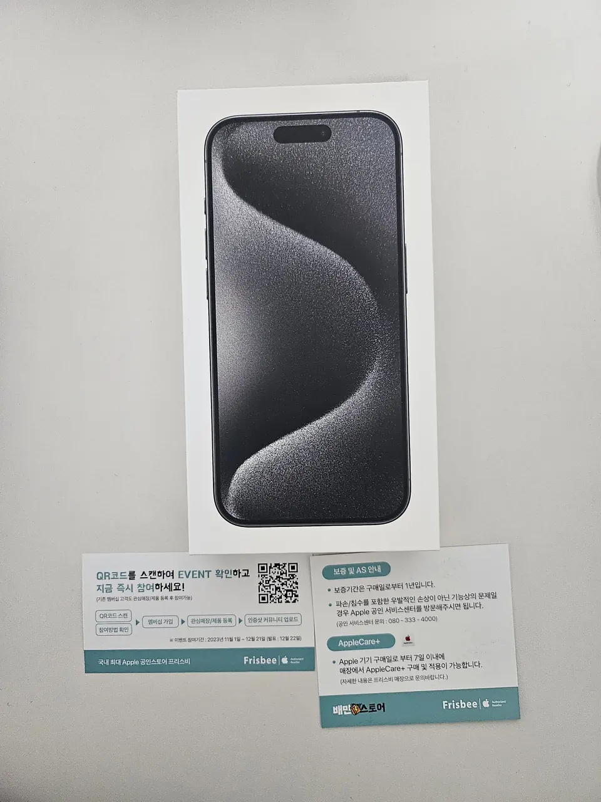
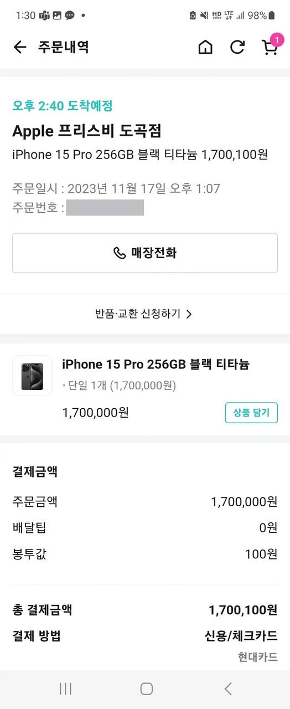
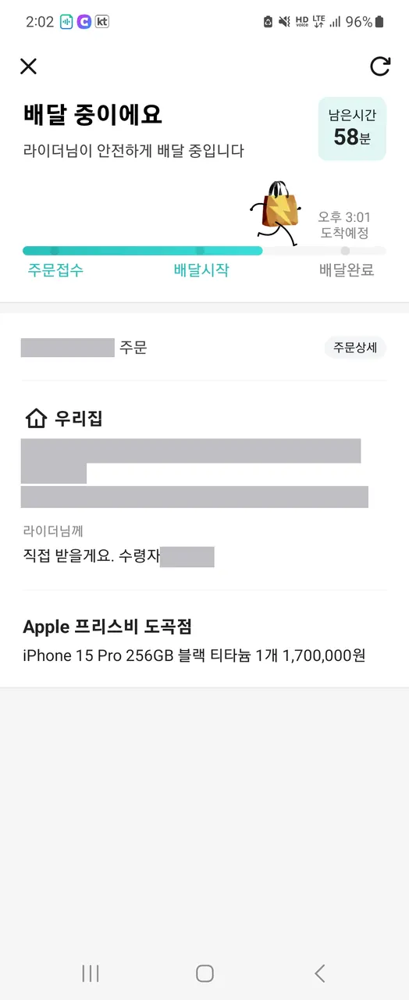

Your phone is broken, or gone, and you need a working one today. In most
countries that means a shop trip. In Korea it can mean opening the app
you use for fried chicken.

**Baemin (배달의민족)** — the yellow one, the scooters, the cartoon —
does not only carry food.

It also brought this to a flat in Seoul: **a sealed iPhone 15 Pro, from
an Apple authorised reseller, in under two hours.** No courier, no
tracking number, no waiting in for a parcel. A rider.

*Sealed box, warranty card, AppleCare+ leaflet — and the Baemin Store logo on the card · ⓒ @BalliBalliSeoul*

## The order, as it happened

This is the real thing rather than a description of the feature.

| | |
|---|---|
| **Ordered** | 17 November 2023, 1:07 pm |
| **Store** | an Apple authorised reseller, Dogok branch |
| **Item** | iPhone 15 Pro 256GB, Black Titanium |
| **Item price** | ₩1,700,000 |
| **Delivery fee** | **₩0** |
| **Bag charge** | ₩100 |
| **Total paid** | **₩1,700,100** |

*The order screen — delivery fee ₩0, bag ₩100 · ⓒ @BalliBalliSeoul*

**The delivery fee on a ₩1,700,000 phone was zero.** The only add-on was
a hundred won for the bag it came in.

*Live tracking, same as a chicken order — address and name redacted · ⓒ @BalliBalliSeoul*

Tracking behaved exactly like a food order: order accepted, rider
assigned, live progress bar, an arrival estimate. The estimate moved
once — first 2:40 pm, later 3:01 pm — which is worth knowing if you are
timing this around being at home.

**Roughly ninety minutes to two hours, door to door.** *(Order placed
November 2023; treat the model and price as of then.)*

## How to actually order one

The mechanics are the same as ordering dinner, with two decisions that
matter more because of what is in the bag.

1. **Open Baemin and move off the food side.** The non-food listings sit
   under **배민스토어 (Baemin Store)** — a separate section from
   restaurants. Menu labels shift between app versions, so look for the
   store tab rather than a fixed path.
2. **Search the product, not the shop.** Typing the model is faster than
   browsing categories, and it tells you immediately whether anything
   near you carries it.
3. **Check who is selling.** For a phone, you want an **authorised
   reseller** rather than an unfamiliar shop. The listing names the
   store; the warranty card in the bag should name it too.
4. **Set the address to where you will actually be in ninety minutes.**
   This is a rider, not a courier — nobody will re-attempt tomorrow.
5. 🔑 **Use the rider instruction box.** Write **직접 받을게요**
   (*I'll take it in person*) so an expensive box is handed to you
   rather than left at a door or a lobby. This one line is the
   difference between a delivery and a problem.
6. **Pay with a Korean card**, and watch the live tracking the same way
   you would for food.

**What you need before any of this:** a Baemin account, which wants
Korean phone verification. That wall comes first, and it is the same one
that stands in front of most Korean apps.

## The part that is easy to miss

Baemin runs **배민스토어**, a non-food side of the app. Convenience
stores, pharmacies, flowers, groceries — and, in some areas, consumer
electronics from real authorised shops rather than resellers of unclear
origin. The device above arrived sealed, with the shop's warranty and
AppleCare+ cards in the bag.

That is the bit worth internalising as a newcomer: **in Korea, "delivery"
is not a category of business. It is a layer over the shops that already
exist near you.** The same rider network that moves dinner moves a phone,
a phone charger, or a bottle of shampoo, because the shop two streets
away is listed in an app.

## Why this is useful when you have just arrived

Ordinary Korean e-commerce is where foreign residents hit walls: identity
verification, a Korean phone in your own name, payment gateways that
reject foreign cards. We wrote up
[the Coupang version of that problem](/blog/coupang-korea-shopping-guide/),
which is the same chain the
[bank account guide](/blog/open-bank-account-korea/) sits in the middle of.

Delivery apps have their own sign-up wall — the same Korean-phone
verification — but once you are through it, **the thing you buy comes
from a shop near you rather than a warehouse, so there is no parcel to
miss and no delivery address to explain twice.**

Two practical consequences:

- **You do not need to be home for a delivery window.** You order when
  you are home. Ninety minutes is a window you can actually hold.
- **You can buy something the same day you realise you need it** — a
  charger the evening yours dies, a phone the day you drop yours.

## The catches

Be realistic about this rather than dazzled by it.

- **Availability is local.** Non-food listings depend on which shops near
  you have joined. A dense Seoul district will show far more than a
  quieter neighbourhood.
- **The price is the shop's price**, not a discount. You are paying for
  speed and for not leaving the house, and on a phone that can be worth
  it — but do not assume it beats buying in person.
- **The app still wants Korean verification** to set up. That is the wall,
  and it comes before any of this is available to you.
- **This example is from 2023.** The capability is what matters here, not
  that specific model at that specific price.

## The Korean part

The app is Korean-first. The listings are Korean, the shop names are
Korean, and the rider instruction box — the one that decides whether your
delivery arrives at your door or your lobby — is Korean.

For food that is survivable. For something that costs as much as a
month's rent, guessing is less comfortable: which shop is authorised,
what the warranty card says, what happens if it arrives damaged.

That is the part we do. Tell us what you are trying to buy and
[we will find whether it is deliverable near you](/etc), read the shop's
terms, and put the right thing in the rider box in Korean.
