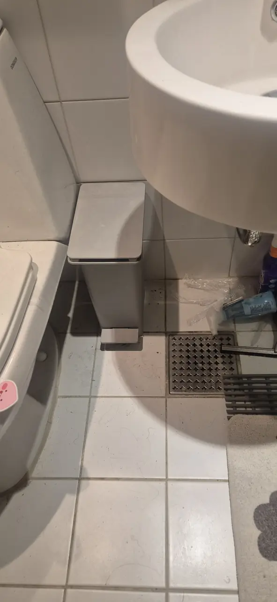
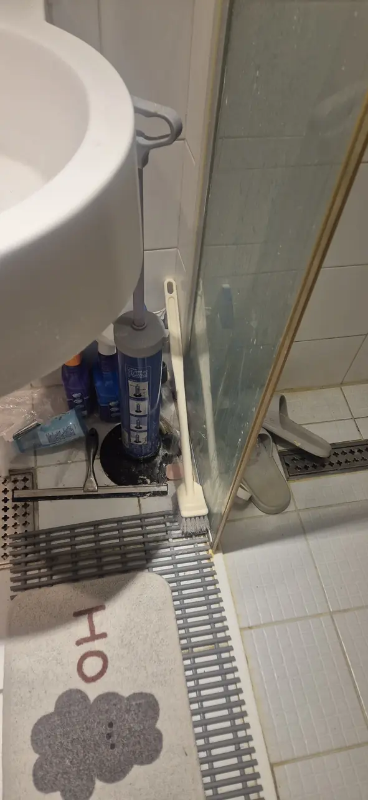
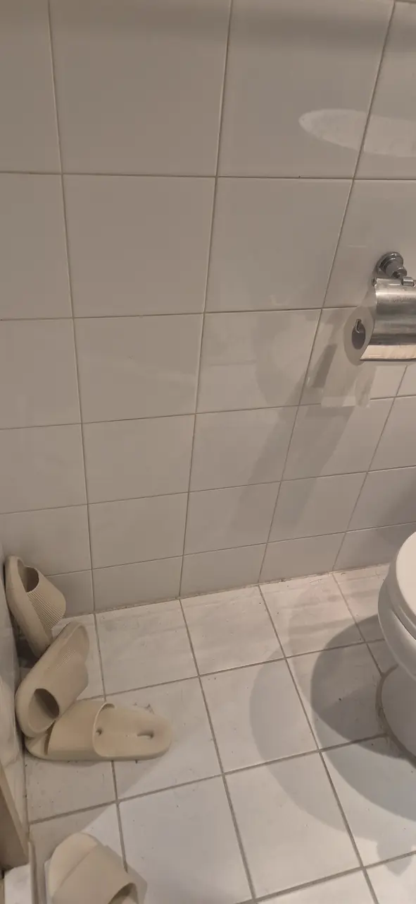
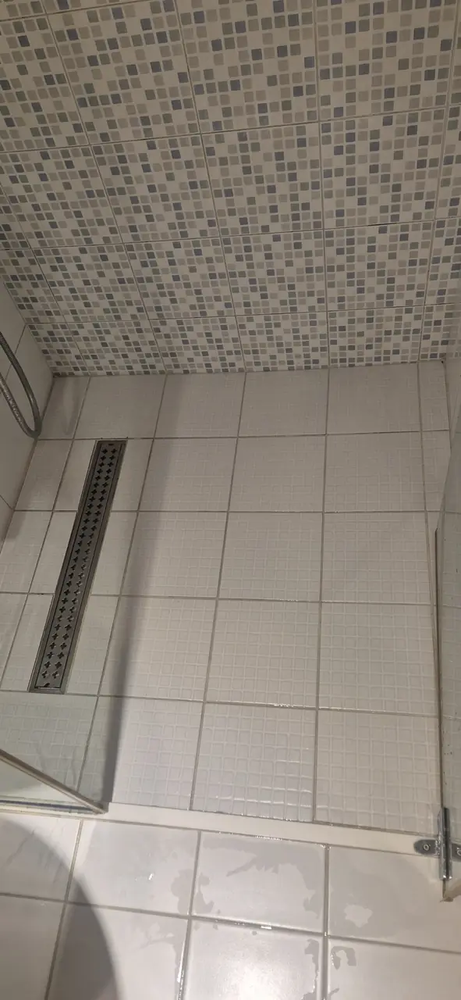
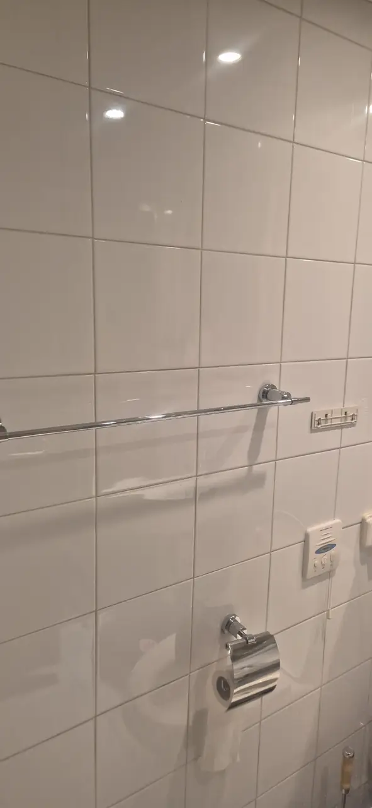
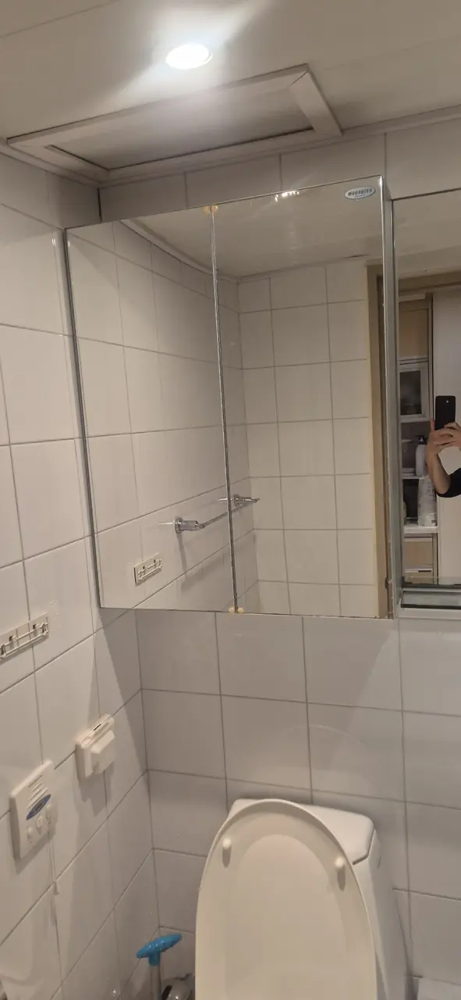
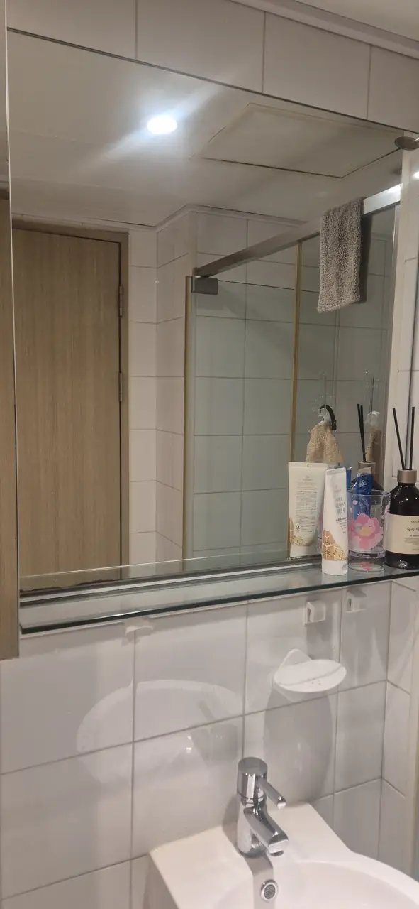
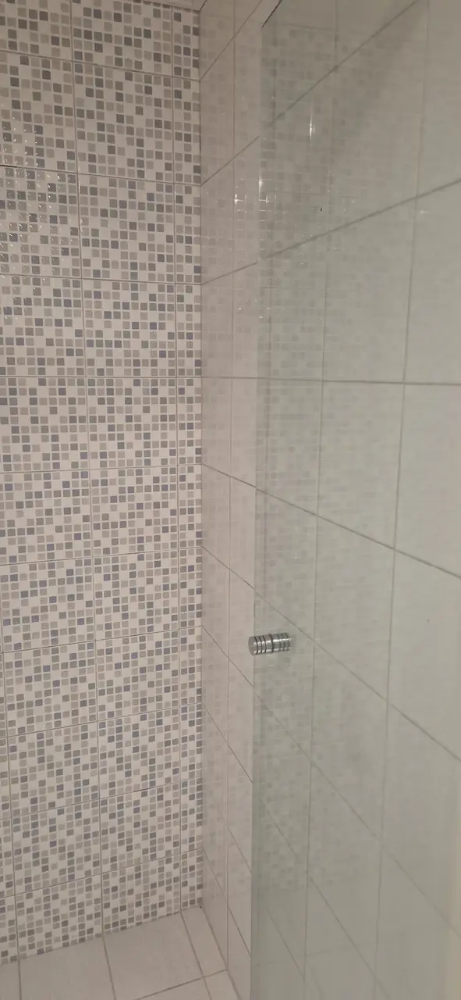
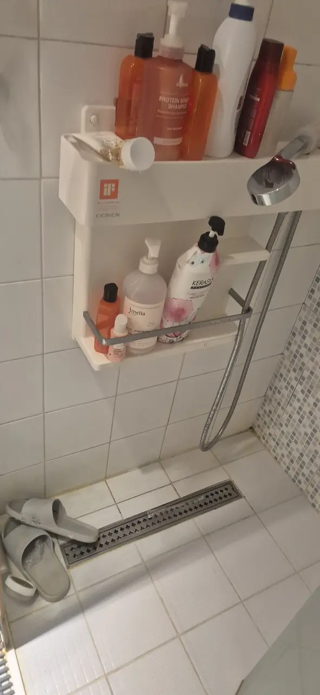

A Korean bathroom is a wet room. There is a drain in the floor, the shower
sprays onto tile rather than into a tray, and the whole room is designed to
get wet and then dry itself out.

It mostly works. What it does not solve is the joints — the grout lines, the
silicone where tile meets tile, the seal around the shower screen — and those
are where a bathroom quietly goes from clean to grim while you are wiping the
parts you can see.

This is what a bathroom deep clean does about that, what it cannot fix, and
what it costs. **The photographs are one bathroom in Seoul, before and after
a single day's work**, and they are ordinary — this is a flat somebody lives
in, not a disaster.

## Why Korean bathrooms go black at the joints

Three things stack up, and none of them is about how tidily you live.

**The room gets soaked, all of it.** With no shower tray, water reaches the
walls, the skirting tiles, the back of the toilet and the base of the basin
pedestal. Everything is a wet surface, so everything is a potential mould
surface.

**Ventilation is usually one ceiling fan**, often on a timer nobody adjusted,
and in the rainy season the air it pulls in is already saturated. A room that
never fully dries between showers keeps the joints damp permanently.

**Silicone and grout are porous, and they are the low point.** Water and soap
residue collect exactly where two surfaces meet. That is why the tile face
can look fine while the line between two tiles is black.

This is what that looks like in an ordinary flat. Nothing here is neglect —
it is a bathroom in use.

*Before — the floor drain and the grout lines around it · ⓒ @BalliBalliSeoul*

*Before — that cloudiness on the glass is mineral, not dirt · ⓒ @BalliBalliSeoul*

*Before — the tile faces look fine. Look at the lines between them · ⓒ @BalliBalliSeoul*

## What a bathroom deep clean actually covers

This is 부분청소 (bubun cheongso), a partial clean: one room, done properly,
in an occupied flat. The full set of Korean cleaning categories is in
[deep cleaning in Korea](/blog/deep-clean-korea-sorting-first/).

A crew works through:

- **Grout lines**, wall and floor, with brushes and a cleaner left to dwell
  rather than scrubbed on and wiped straight off
- **Limescale on glass** — the cloudiness on a shower screen is mineral, not
  dirt, and it needs an acid descaler rather than effort
- **The floor drain**, including lifting the cover and clearing the trap
  underneath, which is where the smell lives
- **Taps, shower head and rails**, descaled
- **The toilet base and the back of it**, which is the spot most household
  cleaning skips
- **The ceiling and the extractor grille**, both of which collect a film you
  only notice when it is gone
- **Mirror and cabinet**, inside and out

And this is the same room afterwards.

*After — the same floor and drain channel · ⓒ @BalliBalliSeoul*

*After — the grout lines are the difference, and they are what takes the hours · ⓒ @BalliBalliSeoul*

*After — the cabinet, inside and out · ⓒ @BalliBalliSeoul*

*After — glass shelf, mirror and the tiles above the basin · ⓒ @BalliBalliSeoul*

## What it cannot fix

For the parts that do come off and get washed, across the whole flat rather than one room, see [what actually comes apart in a deep clean](/blog/deep-clean-what-comes-apart/).

Being straight about this saves you from paying twice.

**Silicone that has gone black all the way through does not come back.**
Mould that has grown into the sealant is under the surface. A crew can lift
the film off the top and it will look better for a fortnight. The actual fix
is to **cut the old bead out and lay a new one**, which is a repair rather
than a clean, and it is cheap compared with the alternative of ignoring it.

**Grout that has crumbled needs regrouting**, not cleaning. If you can catch
grit with a fingernail, no amount of brushing will restore it.

**Rust is damage.** Frames, rails and fittings that have corroded are on the
landlord's side of the line rather than the cleaner's — the same distinction
[mould behind the baseboard](/blog/mould-behind-baseboard-korea/) draws for
walls.

**Damp that comes back within a week is not a cleaning problem.** If black
spots return almost immediately, the issue is ventilation or water getting in
from somewhere, and cleaning it monthly is treating a symptom.

*After — the screen and the corner joint, descaled · ⓒ @BalliBalliSeoul*

## What it costs in Seoul

| Job | Guide price (as of 2026) |
|---|---|
| Bathroom only, partial deep clean (부분청소) | **From around ₩80,000** |
| Add a second bathroom | Usually less than the first |
| Silicone cut out and replaced | Quoted separately — a repair, not a clean |
| Whole flat while occupied (거주청소) | Priced by size; the bathroom is included |

Two things move the number: **how long it has been**, and **whether the
silicone is being replaced**. A bathroom cleaned every few months is a
different job from one that has not been touched since the last tenant.

**Two items that are not in the table, and are not hidden either:**

- **VAT is added on top.** Korean quotes for this work are normally given
  **부가세 별도 (VAT excluded)**, so add 10% unless the quote says otherwise.
  Ask which one you are being told — it is a normal question here, not a rude
  one.
- **Parking is charged at cost.** If the building has no free visitor space,
  whatever the crew actually pays goes on the bill at what it cost, with
  nothing added. We tell you before the day rather than after it, and if your
  building has a visitor slot, say so when you book and it disappears.

> **Not sure whether yours needs a clean or a repair?** Send photos of the
> joints and the shower screen on
> [KakaoTalk](https://pf.kakao.com/_RJxhSX/chat) or
> [WhatsApp](https://wa.me/821075191282?text=Hi%20Balli%20Balli%21%20I%27d%20like%20a%20cleaning%20quote.%0A%0A-%20Name%3A%0A-%20Phone%3A%0A-%20Address%3A%0A-%20Home%20size%20%28pyeong%20or%20m2%29%3A%0A-%20What%20I%20need%20%28move-in%20deep%20clean%20%2F%20housekeeping%20%2F%20mold%20%2F%20Airbnb%29%3A%0A-%20Preferred%20day%20%28e.g.%20Sat%204%20Oct%2C%20or%20weekdays%29%3A%0A-%20Preferred%20time%20%28e.g.%2010am%2C%20or%20morning%29%3A%0A%0A%28Photos%20help%20a%20lot%21%20Please%20book%20at%20least%202%E2%80%933%20days%20ahead%20%E2%80%94%20ideally%20a%20week.%20Same-day%20or%20next-day%20requests%20may%20not%20be%20possible.%29)
> — we will tell you which one it is before anyone is booked.

## Keeping it that way

The habits that matter in a wet room are small and dull.

**Run the fan after, not during.** Twenty to thirty minutes after a shower
does more than running it while the water is on.

**Squeegee the screen.** Ten seconds, and it is the single thing that stops
limescale building up on glass.

**Leave the door open** when the room is empty, so the air actually moves.

**Keep the floor drain wet.** A trap that dries out lets sewer smell back up
— which is a different problem from a dirty drain, and it is why a bathroom
can smell worse after a holiday.

**Deal with black joints early.** Silicone caught at the grey stage cleans up.
Silicone left until it is black gets replaced.

*Before — every bottle on that shelf has to come off before anything under it can be cleaned · ⓒ @BalliBalliSeoul*

**Clear the surfaces the night before.** Bottles, mats, slippers, the bin.
The crew will move them if you have not, but that time comes out of the hours
you are paying for.

## The Korean part

Booking one of these runs by phone, and the questions come fast: how many
bathrooms, how big, what is the condition, is it occupied, which floor, and
when.

The one worth preparing is **the condition**, honestly described. A crew that
knows it is dealing with black silicone and scaled glass brings different
chemicals from one expecting a tidy-up — and a crew that arrives expecting
the tidy-up gives you a revised price at your door instead of in the chat.

## Get it sorted

Send us photos of the joints, the screen and the floor drain. We will tell
you whether it is a clean, a silicone replacement, or a ventilation problem
that cleaning will not solve — and if it is a clean, we book it, brief the
crew in Korean, and stay in the chat until it is done.

If the whole flat needs doing rather than one room, that is
[the deep clean day](/blog/deep-clean-service-seoul/), and the
[cleaning page](/cleaning) has the rest of the price list.
