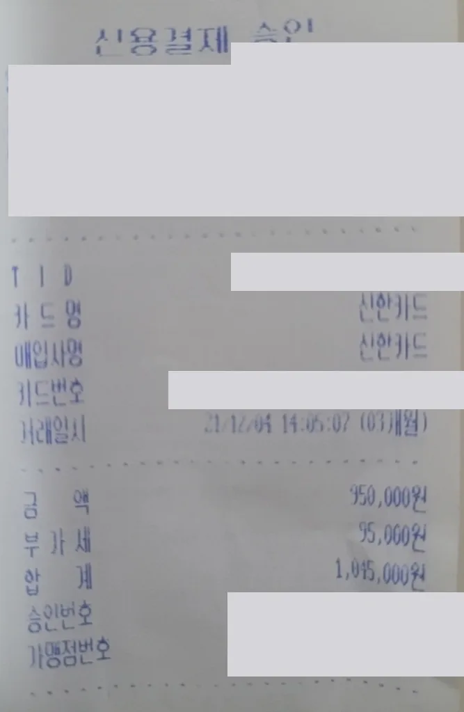
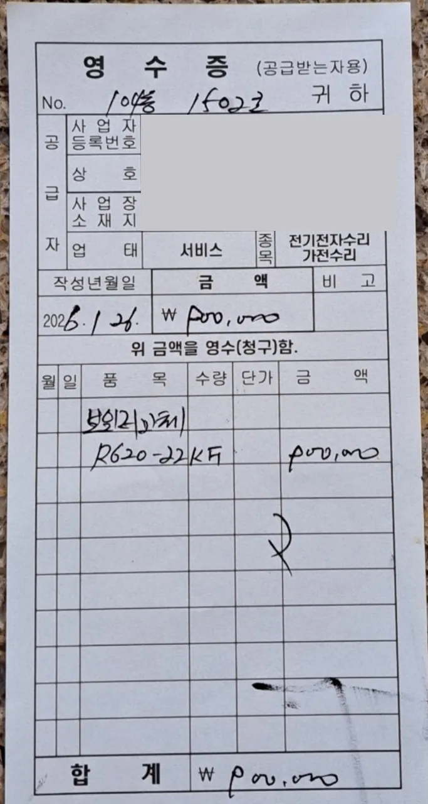
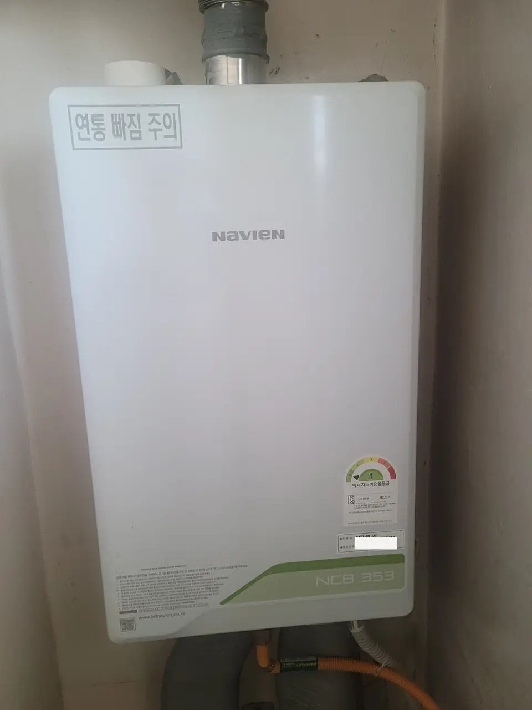

Someone has looked at your boiler and said the word *교체* — replacement.
Maybe it's fifteen years old, maybe the third part in a season has failed.
The next question is always the same, and nobody answers it in English:
**what does a new boiler actually cost in Korea?**

Here is one real answer, with the receipt behind it.

## The number, twice

We have two real receipts for the same job, **four years apart**. Together
they do something a single price never can: they show the number is stable.

### December 2021 — a Navien condensing boiler, supplied and fitted

| Line | Amount |
|---|---|
| Unit and installation | ₩950,000 |
| VAT (부가세, 10%) | ₩95,000 |
| **Total paid** | **₩1,045,000** |

*The 2021 card slip — merchant and card details redacted · ⓒ @BalliBalliSeoul*

The transaction date is on it — **21/12/04**, paid over three monthly
instalments — along with the split between the price and the VAT.

### January 2026 — another 22K unit, same job

| Line | Amount |
|---|---|
| **Boiler replacement, all in** | **₩900,000** |

*The 2026 receipt — installer's details redacted, everything else as issued · ⓒ @BalliBalliSeoul*

That is the second receipt as we received it: a handwritten 영수증 with the
date, the item line — **보일러(교체) R620-22KF** — and the total. There is no
separate VAT line, which is normal for a small independent installer working
off a receipt book rather than a card terminal.

**On both receipts we have blanked the same things** — the business's
registration number, name, address and bank or card identifiers. They are
private businesses that never agreed to appear here, and the numbers are the
point, not them. Everything that matters for checking a quote is still
readable: the date, the item, the amounts.

Same capacity class, same city, **a slightly lower number four years later.**

### What that means for you

**Plan on roughly ₩900,000 – ₩1,050,000** for a mid-size condensing boiler
supplied and fitted in Seoul — about **US$625 – 730** at ₩1,440 to the
dollar. That is the whole bill: the boiler, the fitting, the old unit taken
away.

Two dated receipts four years apart is not a market survey, but it is two
more than most people get before they say yes to a quote. **If a number comes
back at two or three times this, you now know enough to ask why** — and to
get a second quote before agreeing.

What moves the price is capacity, fuel type and how awkward the installation
is — not the brand badge. A bigger flat needs a bigger unit. A boiler in a
tight balcony recess with old pipework costs more to fit than a straight swap.

## What the box actually tells you

Korean boilers carry their entire specification on one label, and once you can
read four fields you can check that the unit being fitted is the unit you
agreed to. This one:

| Field | Value | What it means |
|---|---|---|
| **모델명** (model) | NCB353 | Navien's condensing series |
| **용량** (capacity) | **22K** | ~22,000 kcal/h — sized for a typical flat |
| **연료타입** (fuel) | **LNG** | City gas. The other option is LPG — **they are not interchangeable** |
| **배기타입** (flue) | **FE** | Forced exhaust — a fan pushes flue gas out, so it can sit indoors |

**Check the fuel type before anything is unboxed.** LNG and LPG boilers look
identical and are not the same appliance. Most Seoul flats are on city gas
(LNG), but if you are outside the mains network you may be on LPG cylinders,
and a wrong unit is a wasted day at best.

**콘덴싱 (condensing)** is the part that shows up on your bills. A condensing
boiler recovers heat from its own exhaust instead of throwing it out of the
flue. The one above is rated **에너지소비효율등급 1** — energy efficiency
grade 1, the top band — at **92.1%** heating efficiency. Korea has pushed hard
toward condensing units for exactly this reason, and there are government
subsidy schemes for eco-friendly boiler replacement. **Ask your installer
whether your replacement qualifies**, because the paperwork is theirs to file
and they will not volunteer it.

*The same unit, fitted — energy grade 1, 92.1% · ⓒ @BalliBalliSeoul*

## The line on the box that is not marketing

Printed on the label, under the spec fields: **CO경보기 필수 설치** — *carbon
monoxide alarm installation required.*

That is not a suggestion from the marketing department. A gas boiler that
burns imperfectly produces carbon monoxide, which has no smell and no colour,
and Korea has had fatal accidents from flue pipes that worked loose. The
installed unit above carries a second warning stencilled on its own casing —
**연통 빠짐 주의**, *caution: flue detachment* — which tells you what the
industry actually worries about.

Two things follow from that, and they cost almost nothing:

- **Make sure a CO alarm is fitted and working.** If the installer doesn't
  raise it, raise it yourself.
- **Look at the flue pipe occasionally.** It should be firmly seated where it
  leaves the boiler and where it passes through the wall. If it looks
  separated or you see soot marks, that is a same-day call, not a
  next-week one.

## Before you agree to a replacement

Replacement is the expensive answer, and it is not always the right one.
Intermittent hot water — hot, then cold, then hot again — usually points at a
single valve rather than a dead boiler, and that is a
[sub-₩100,000 repair](/blog/korea-boiler-hot-water-problems/). We wrote that
one up separately because it is the most common false alarm.

The honest signals that it really is the boiler:

- **Age.** Domestic boilers run around **8–10 years.** Past ten, worn
  internals burn less cleanly — rising gas bills, and more carbon monoxide.
- **Repeated failures.** One valve is a repair. Three call-outs in a season is
  a boiler telling you something.
- **The efficiency argument.** Replacing a fifteen-year-old conventional unit
  with a grade-1 condensing one is not only about breakdowns; it changes what
  you pay every winter.

## Who pays — and this is the important bit

If you are renting, on either **월세 (monthly rent)** or **전세 (deposit
lease)**, **this is usually not your bill.**

Korean civil law puts the duty of keeping a rented property usable on the
landlord, and a boiler is not decoration — it is the equipment that makes the
flat habitable in winter. Replacement due to age or ordinary wear therefore
falls to the **landlord (집주인)**, the same as a leaking roof. What tenants
are generally responsible for is damage they actually caused — a boiler frozen
because the flat was left unheated through a cold snap, for example.

### Why landlords agree more readily than you'd expect

This is the part worth knowing before you open the conversation, because it
changes its tone completely.

A boiler replacement is **not money your landlord simply loses.** In Korea it
counts as a **자본적 지출 (jabonjeok jichul)** — a capital improvement to the
property, rather than routine upkeep. When they eventually sell, that spend is
treated as a **필요경비 (piryo gyeongbi)**, a necessary expense: **the capital
gains tax is calculated on the sale profit minus costs like this one.**

So the money partly comes back to them at sale, on a piece of equipment that
had to be replaced sooner or later anyway. Owners generally know this. It is
why *"the boiler is fifteen years old"* is a far easier conversation than
*"I'd like new wallpaper"* — wallpaper and flooring are treated as ordinary
upkeep and don't get the same treatment.

Two practical consequences for you:

- **The paperwork has to be in their name.** A proper tax invoice
  (세금계산서) or a card or bank record showing the landlord as the payer is
  what makes the expense claimable later. If you're the one arranging the
  work, make sure it is **billed to them, not to you** — otherwise you have
  handed them a cost they can't use and a reimbursement argument you don't
  need.
- **You can say this out loud.** Politely, and as context rather than as a
  lecture: this is a replacement, not a redecoration, and it doesn't disappear
  from their books.

*(Tax rules and what counts as adequate documentation do change, and their
tax position is theirs, not ours to advise on — treat this as the reason the
answer is often yes, not as a promise about their return.)*

So the sequence matters:

1. **Report it, in writing, before anything is agreed.** A message with the
   date and the symptom is enough, and it is your evidence later.
2. **Do not commission the replacement yourself** and expect to be reimbursed.
   Get the landlord's agreement first, even if you arrange the fitting.
3. **Keep the receipt** — like the one this article is built on. It is what
   settles a deposit argument at move-out.

If your building is managed, the **관리사무소 (management office)** often has a
boiler firm it already uses, which is usually faster and rarely more
expensive.

### If you own the flat, it's yours

None of that applies if you bought the place. There is no landlord to ask —
the boiler is your equipment and that ₩900,000-odd is yours to find.

The same tax logic works for you, though, which is the argument for doing it
properly rather than cheaply: **keep the receipt.** When you sell, a boiler
replacement is the kind of capital expense that comes off your taxable gain,
and the document that makes it count is exactly the sort of receipt this
article is built on. File it with your purchase paperwork the day it arrives —
it may be years before it matters, and by then you will not remember which
drawer it went into.

## The Korean part

Nothing above is complicated. It is just that all of it happens in Korean —
the diagnosis on the phone, the quote that arrives as a text message with no
breakdown, the argument about whether this is wear or misuse, and the
landlord conversation that decides who pays.

That last one is where most foreign tenants lose money. Not because they are
wrong, but because making the case in Korean, to a landlord who would rather
patch it again, is hard.

That is what we do. Send us the symptom, the quote you were given, or the
message from your landlord, and our
[English-speaking plumbing service](/plumbing) will read it, tell you whether
the number is fair, and make the call in Korean.

> **Been quoted for a boiler?** Send us a photo of the quote and of the boiler
> on [WhatsApp](https://wa.me/821075191282) — we'll tell you what the spec
> means and whether the price is in the normal range. Asking costs nothing — you pay only for the work you book.

The one-line version: **a condensing gas boiler fitted in Seoul lands
between ₩900,000 and ₩1,050,000, check that 용량 and 연료타입 match your flat, insist
on the CO alarm — and if it's age or wear, the bill belongs to your landlord,
who can write it off against their gain when they sell.**
