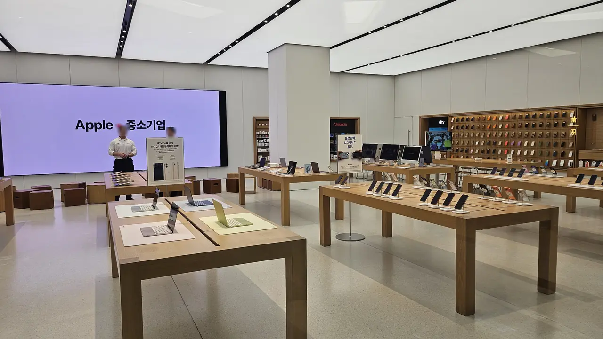
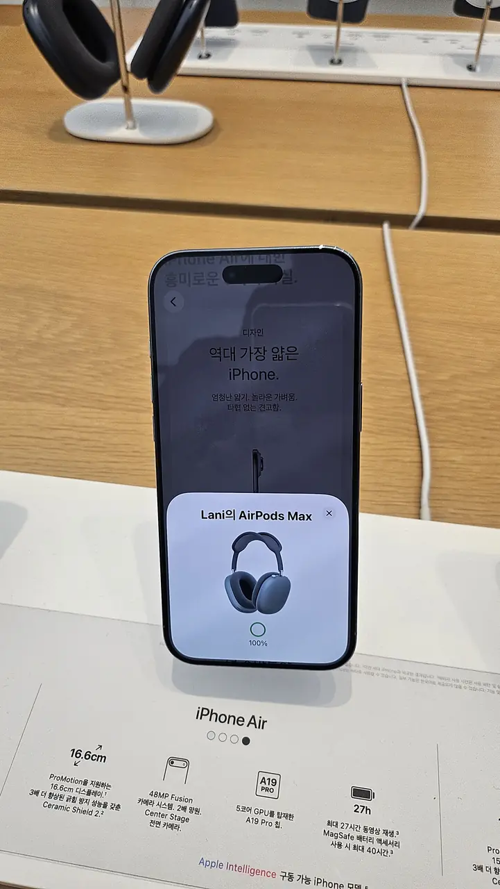
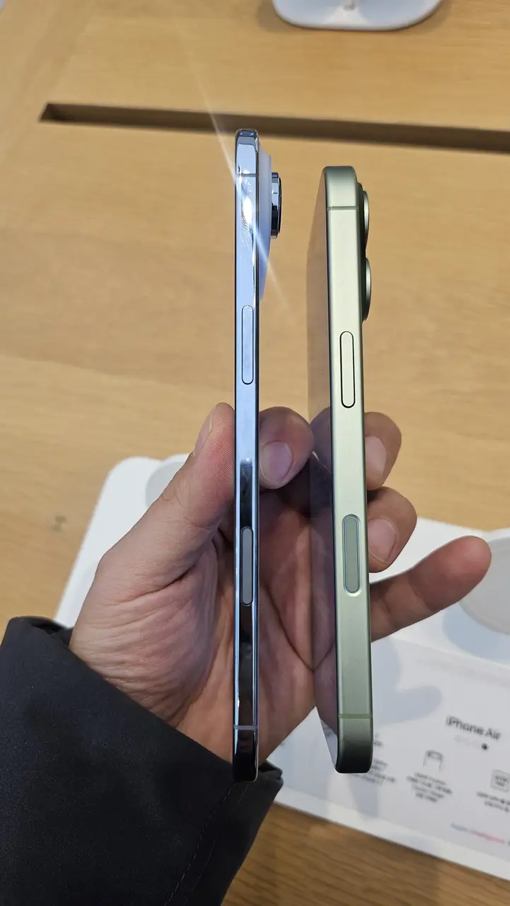

Apple announced the **iPhone Duo** — its first foldable — on 9 September
2026, with pre-orders on 16 October and phones in hand from 23 October.
Korean pricing starts at **₩3,290,000**. Which means a lot of people are
about to walk into a Korean Apple Store for the first time.

Short answer to the question every visitor eventually asks: **yes — an
iPhone bought in Korea is unlocked and will work in the US and almost
anywhere else.** But the full answer involves one of the strangest
quirks in the smartphone world — a camera shutter sound with a mind of
its own — plus a few buying details worth knowing before you swipe.
Here's the whole picture, for iPhones and Galaxys alike.

## Unlocked by default

Korea essentially doesn't do carrier-locked phones. Phones sold at
Apple Stores and electronics retailers are **자급제** (*jagupje* —
"self-supply", the unlocked retail model), and even carrier-sold
iPhones start unlocked. Buy it, put any SIM or eSIM in it — Korean
prepaid today, a US carrier's BYOD plan next month — and it works.
Modern iPhones ship with globally comprehensive band support, so US
networks are fine (the occasional support-desk confusion aside; the
hardware is global).

## The shutter sound saga

Now the famous part. **Phones sold in Korea (and Japan) have a forced
camera shutter sound** — it fires even in silent mode, a
privacy-culture regulation baked into the firmware. For years this
was the reason travelers avoided buying phones here.

The modern twist: **recent iPhones geo-detect their location** — take
your Korean-bought iPhone abroad and the forced shutter sound
disables itself; bring it back into Korea and it returns. So a
Korean iPhone in the US behaves exactly like an American one. (The
reverse is also why some Koreans import foreign iPhones: a phone
bought outside Korea/Japan never has the forced sound, even when
used here.) If a silent camera matters to you and you live in Korea,
that detail decides where you buy.

## Where to buy, and for how much

- **Apple Stores** — Seoul has six (Garosu-gil, Gangnam, Myeongdong,
  Yeouido, Jamsil and Hongdae) plus one at Starfield Hanam. Staff handle
  English comfortably and stock is same-day for most models.
- **Electronics retailers and Coupang** — 자급제 phones flow
  through Hi-Mart, department stores and
  [Coupang](/blog/coupang-korea-shopping-guide/), occasionally
  with card-company discounts Apple itself won't give.
- **Galaxy phones** — everything above applies, with Samsung's
  home-turf bonus: launch-week trade-in and carrier promotions here
  are among the world's most aggressive, though the headline deals
  usually assume Korean carrier contracts and Korean credit cards.

On price: Korean iPhone pricing tracks global rates converted to
won and is **rarely a bargain against US prices** — the reason to
buy here is convenience and immediacy, not arbitrage.

## Paying for it is the hard part

Three things at the till catch foreign buyers, and only one of them is
about money you can save.

*This sign is doing a lot of work, and not for you · ⓒ @BalliBalliSeoul*

**The 0% instalments are not for you.** Every Apple Store in Korea
advertises **최대 24개월 무이자 할부** — up to 24 months, interest free —
and it is genuinely how most Koreans buy a phone. It runs on **Korean
credit cards**, issued by Korean card companies. A foreign card cannot
split the payment, so the ₩3,290,000 lands on your statement at once.
The same applies to the **보상판매** trade-in discount advertised beside
it: it needs a device to hand in and a Korean payment method to settle
against.

**Your card may simply be declined.** Large single transactions on a
foreign card are exactly what an issuer's fraud rules stop. Tell your
bank the amount and the country before you go, and carry a second card.

**The tax refund has one trap worth knowing.** Visitors who qualify can
reclaim the 10% VAT on an in-store purchase — show your passport before
you pay and the staff will either process it at the till or hand you the
refund paperwork. **What does not qualify is an online order, including
one you collect from the store.** If the refund matters, buy at the
counter, not on the app.

That refund is for short-stay visitors. **If you live here on an ARC you
are a resident, and you do not get it** — which is the answer to a
question we are asked constantly.

## If you are buying the Duo, read this first

*Every display model has a Korean spec card beside it · ⓒ @BalliBalliSeoul*

The iPhone Duo is **eSIM only, everywhere in the world.** There is no
tray. Apple's own announcement says the space went to the battery.

For a Korean resident that is a non-event. **For a visitor it is a
planning problem**, because a good deal of Korea's short-stay mobile
market still runs on a physical SIM handed to you at an airport counter.
If your plan is "land, buy a tourist SIM, put it in the new phone", check
your provider does eSIM before you fly — many do, but not all, and the
cheap counter deals are the likeliest to be plastic.

The rest of the range still takes a physical SIM, so this is a Duo
problem rather than an iPhone problem. What to do about it is in
[SIM cards and phone plans](/blog/internet-installation-korea/) — the
same verification wall shows up there too.

*Worth handling before you commit — the specs do not tell you this part · ⓒ @BalliBalliSeoul*

## Buying it online instead

If you would rather not queue, the unlocked (자급제) models sell through
Korean retailers online, and **Coupang is the one that works most easily
in English** — the app has an English mode and delivers next morning
across Seoul. What you give up is the tax refund, which online orders do
not qualify for, and the chance to hold the thing first.

> **Disclosure:** the three links below are Coupang Partners affiliate
> links, and we earn a small commission if you buy through them. It costs
> you nothing extra and it does not change what we recommend — we say
> above that buying in store is better if you want the VAT back, and that
> is still true.
>
> 이 포스팅은 쿠팡 파트너스 활동의 일환으로, 이에 따른 일정액의 수수료를 제공받습니다.

  

    <strong style="color:var(--fg)">Buy online</strong> — unlocked models, next-morning delivery in Seoul. No VAT refund on online orders.
  

  

    
    
    
  

  

    Affiliate links — we earn a small commission if you buy through them, at no extra cost to you. 
    이 포스팅은 쿠팡 파트너스 활동의 일환으로, 이에 따른 일정액의 수수료를 제공받습니다.
  

We will add an iPhone Duo link once it is orderable. If you have never
used the app before, the sign-up and the payment wall are covered in
[how to use Coupang in English](/blog/coupang-korea-shopping-guide/).

## The secondhand lane

Korea's used-phone market is deep and cheap — Galaxys depreciate
fast here, and lightly-used iPhones circulate constantly on the
secondhand apps. Two safety rules if you go this route: meet in
person and test the phone with your SIM before paying, and
**check the IMEI against Korea's lost/stolen registry** (the
carrier shops can run it, and checking services exist online) — a
reported-lost phone gets network-blocked no matter how honest your
purchase was. A used Korean iPhone follows all the same
unlocked-and-geo-shutter rules as a new one.

One software footnote either way: your **Apple ID region** controls
your App Store, not the phone's origin — a Korean-bought iPhone
signed into your American Apple ID lives in the US App Store. The
few Korea-only apps you'll want (banking, delivery) may require a
Korean-region ID; many expats run a second Korean Apple ID just for
those, switching accounts in the App Store when needed.

## The fine print for taking it home

- **Warranty is regional-ish**: Apple's international service
  covers iPhones broadly, but repairs abroad for a Korean-spec
  unit can take longer if parts differ. Keep the receipt.
- **Korean-market extras**: the preloaded Korean keyboard and
  region defaults reset in five minutes of settings; nothing else
  distinguishes the hardware day-to-day.
- **eSIM travelers**: Korean-bought iPhones carry the same eSIM
  support as anywhere — activate your home plan the moment you
  land.

## The Korean part

The buying itself is easy; the edges are where we get messages:
hunting a specific model/color in stock *today*, decoding a
retailer's card-discount matrix in Korean, the tax-refund counter
conversation, or reselling your old phone on the secondhand market
before you fly. Through our
[anything-else concierge service](/etc) we do the stock-hunting and
the Korean phone calls, and get you from "I need a phone" to
activated in an afternoon.

## Get it sorted

> **Phone shopping in Seoul — or flying out with one?** Message us
> on [WhatsApp](https://wa.me/821075191282) with the model you're
> after — we'll find it in stock, check the discounts, and brief
> you on the shutter-sound situation for your destination. First
> answer is free.

The takeaway: buy with confidence, it works everywhere — and when
your camera goes quiet somewhere over the Pacific, now you'll know
it's a feature, not a glitch.
