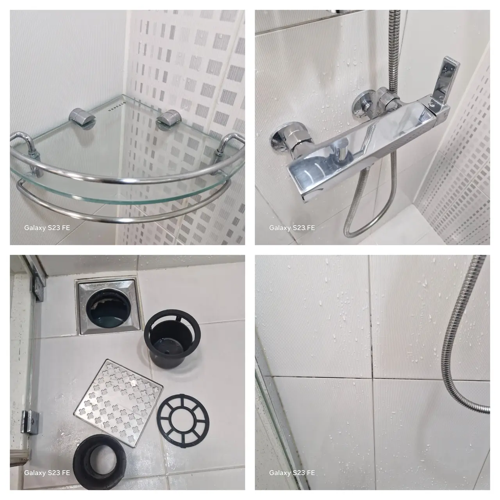
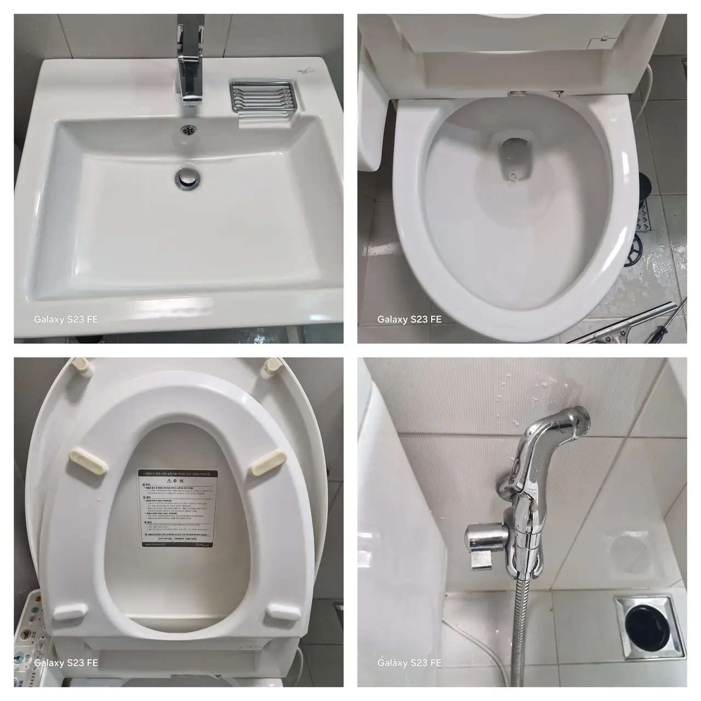
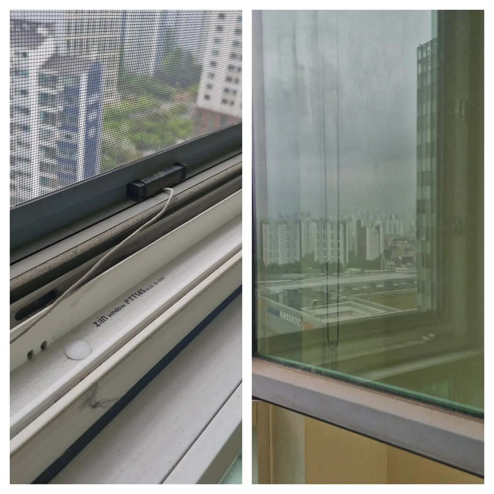
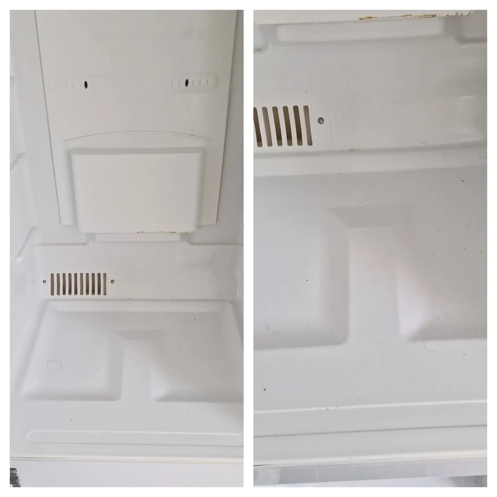
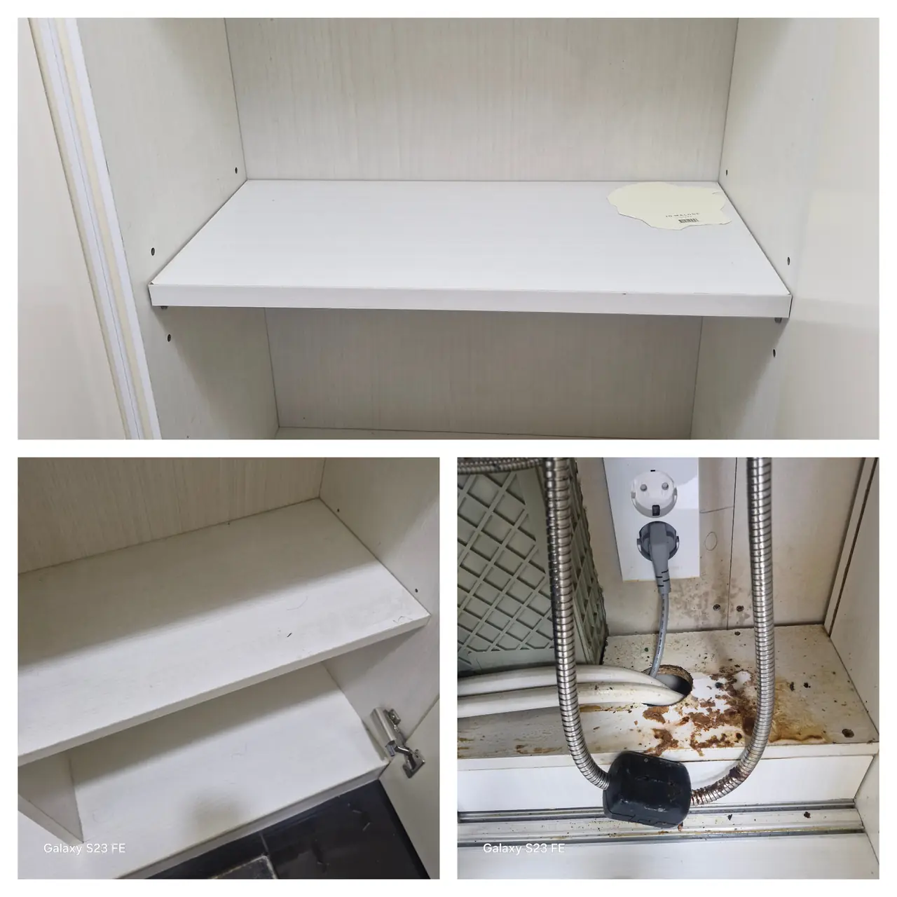

A deep clean crew will take your flat apart, wash the parts and put them back.
That is [what you are paying for](/blog/deep-clean-what-comes-apart/), and it
is worth it once or twice a year.

In between, there are **four things you can do yourself in about twenty
minutes**, with nothing but washing-up liquid and a sink. They are the four
that make the biggest difference, and almost nobody living in a Korean rental
does them — not out of laziness, but because nothing in the flat tells you
they come apart at all.

## 1. The range hood filters (5 minutes)

*Covers off, and the wall behind them · ⓒ @BalliBalliSeoul*

The metal mesh panels under your extractor **slide out**. There is a small
catch or a handle; push, tilt, and they drop into your hand.

They are usually saturated with oil, because a Korean kitchen fries a lot and
the filter is the first thing the smoke meets.

**How to wash them:** hot water, washing-up liquid, and twenty minutes of
soaking in the sink before you touch them with a brush. For the ones that are
genuinely bad, add a spoon of baking soda to the hot water. Dry them before
they go back.

**How often:** every month or two if you cook most days.

## 2. The aircon filters (5 minutes)

*The grille comes off, the two filters slide out behind it — and the ceiling light cover comes down the same way · ⓒ @BalliBalliSeoul*

The front panel of a wall unit **unclips** — usually two tabs at the bottom
edge — and lifts up. Behind it are one or two mesh filters that slide
straight out.

**How to wash them:** rinse from the back under the tap so the dust comes out
the way it went in, not through the mesh. Washing-up liquid if they are
greasy. **Dry completely** before refitting, because a damp filter in a dark
unit is how a Korean aircon starts to smell.

**How often:** monthly through the summer. Two minutes each.

**Where to stop.** Filters are yours. The drum, the fins and the drain pan
behind them are not — that is a 분해세척, a full strip-down with machinery,
and it is [a separate job](/blog/aircon-cleaning-korea/). If the unit smells
when it is running and the filters are clean, the smell is behind them.

## 3. The bathroom floor drain trap (5 minutes)

*Bottom left: the pieces a Korean floor drain is made of · ⓒ @BalliBalliSeoul*

This is the one that surprises people. A Korean floor drain is not a hole —
it is **a stack of three parts**: the metal grating, a plastic cup underneath
that holds a seal of water, and a rubber collar below that.

Lift the grating. Lift the cup out. **That cup is where the smell lives**,
and pouring anything down the drain while it is in place achieves very
little.

**How to wash it:** gloves, hot water, a brush, and put the cup back *with
water in it* — the water is the seal that stops sewer gas coming up. If your
bathroom smells after a holiday, this is why: the seal dried out.

**How often:** monthly, or whenever the drain is slow or smells.

*While you are in there: the bidet seat unclips from its bracket · ⓒ @BalliBalliSeoul*

## 4. The insect screens and window tracks (5 minutes)

*Before, and after · ⓒ @BalliBalliSeoul*

The **방충망 (bangchungmang)** — the insect screen — lifts out of its frame.
Wash it flat with a sponge, both sides, and let it dry leaning against a wall.

The track underneath is the part that makes a flat look cleaned or not. A
narrow brush, then a damp cloth, then a dry one.

**How often:** twice a year is plenty. Spring, before you start opening
windows, and autumn.

## What else is worth ten minutes, while you are at it

*Fridge shelves come out and wash in the sink · ⓒ @BalliBalliSeoul*

**Fridge shelves and drawers lift out.** Wash them in the sink rather than
wiping them in place, and wipe the cabinet while they are out.

*The cupboard under the sink is the one nobody opens · ⓒ @BalliBalliSeoul*

**Look under the sink once in a while.** It is where a slow leak announces
itself, and finding it early is the difference between a cloth and a
[plumber](/plumbing).

## Where to stop

Four things are not yours to do, and knowing the line saves money.

| Leave it | Why |
|---|---|
| **Aircon strip-down (분해세척)** | Machinery, chemicals and a drain pan you cannot reach |
| **Silicone gone black through its depth** | A repair — cut out and replaced, not cleaned. See [bathroom deep clean](/blog/bathroom-deep-clean-seoul/) |
| **Anything gas** | The hob's burner parts wash in the sink; the gas line and fittings do not get touched |
| **A drain that is slow after the trap is clean** | The blockage is further along. [Clearing it](/blog/toilet-unclogging-cost-seoul/) is a trade |

## The Korean part

None of the four jobs above needs Korean. The shopping might: ask a hardware
shop or a Daiso staff member for **주방세제** (washing-up liquid), **베이킹
소다**, or **청소솔** (cleaning brush) and you will be pointed at the right
shelf.

Where Korean starts to matter is the moment something does not go back
together, or the smell persists after you have done everything on this page.
That is a phone call, and it is the one we make for you.

## Get it sorted

Do the twenty minutes. It is genuinely most of the benefit, and it costs
nothing.

When you hit the line — the aircon that still smells with clean filters, the
drain that is still slow with a clean trap, the silicone that has gone black
— send us a photo. We will tell you which trade it is and what it should
cost, and book it in Korean if you want us to.

If the flat has not had a proper going-over in a year, that is the
[deep clean](/blog/deep-clean-korea-sorting-first/) rather than the twenty
minutes, and the [cleaning page](/cleaning) has the price list.
