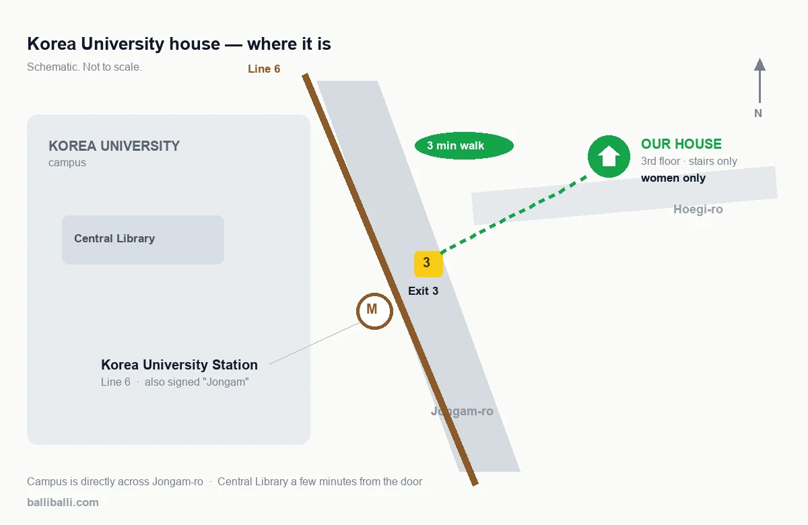
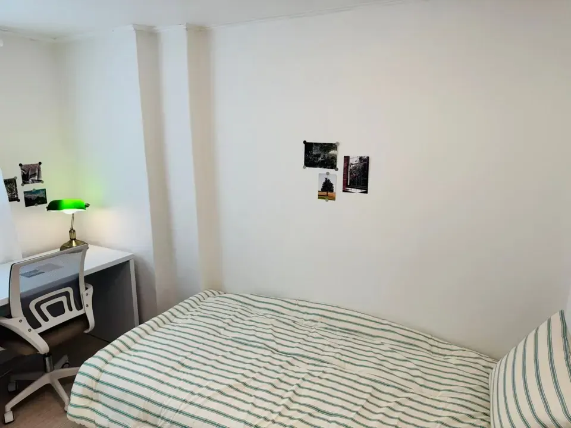
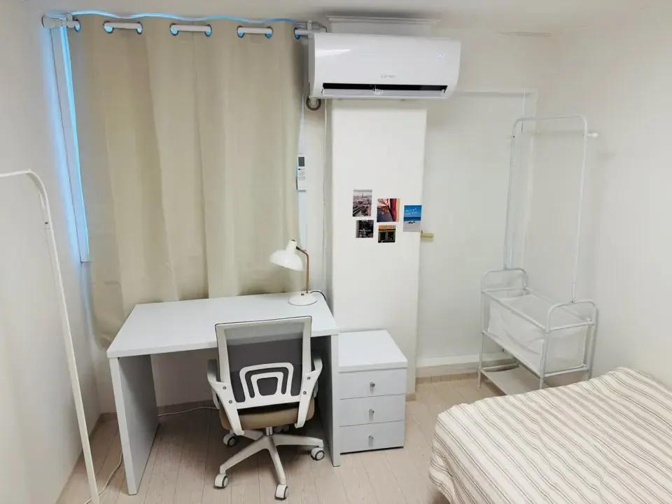
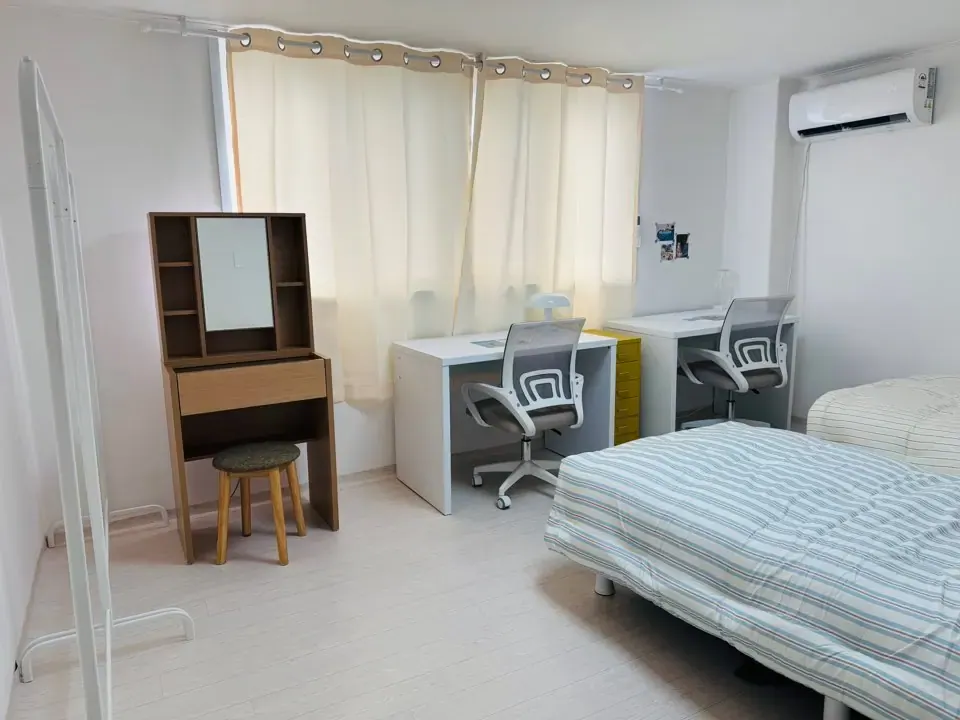
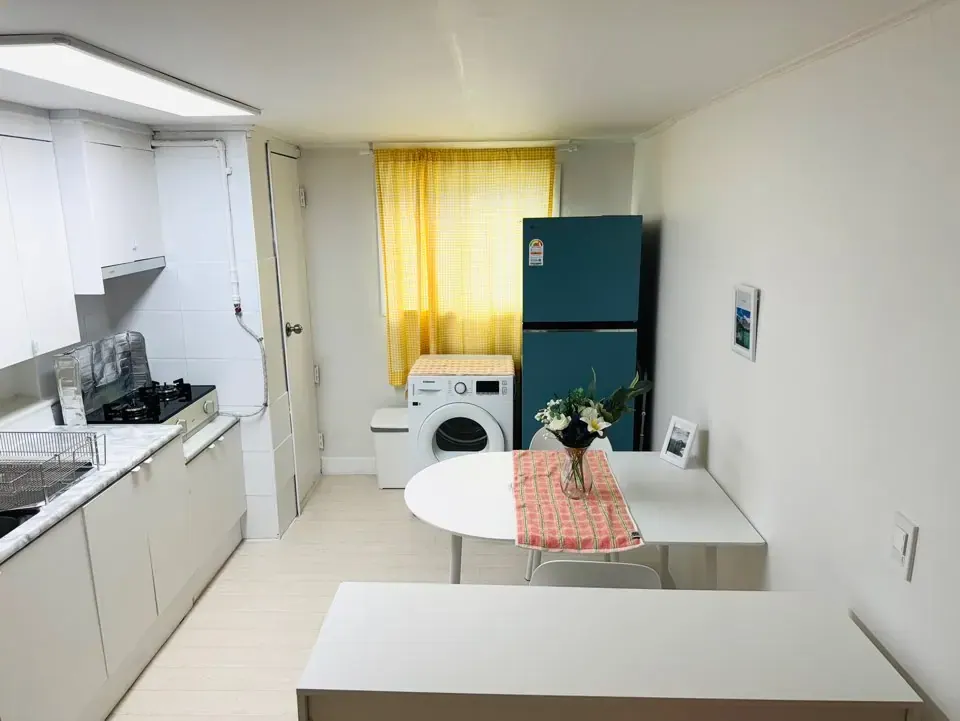
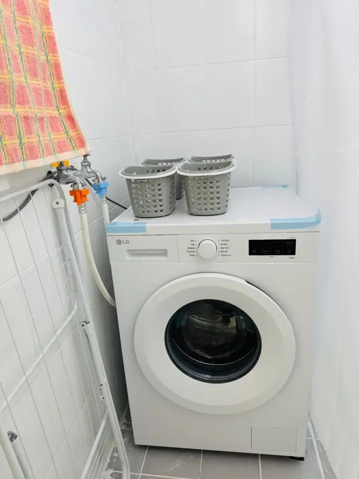
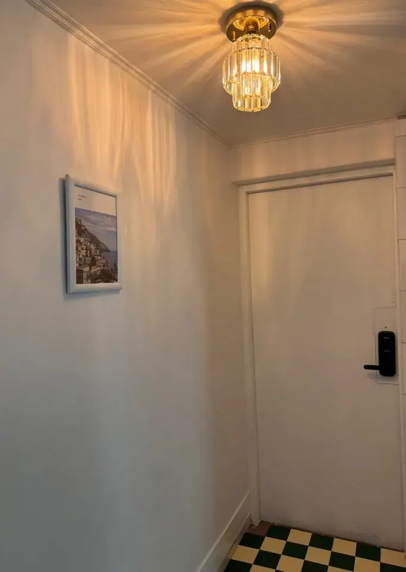

We run **three coliving houses in Seoul**, and we run them
ourselves — we're the operator, not an agency listing someone
else's rooms. Each one is within walking distance of a university
campus:

| House | Beside | Rooms |
| ----- | ------ | ----- |
| **Kyung Hee University** (경희대) | Hoegi / Dongdaemun-gu | Single and twin |
| **Hankuk University of Foreign Studies** (한국외대) | Same neighbourhood | Single and twin |
| **Korea University** (고려대) | Anam | **Opening late August 2026 — single rooms** |

## 🆕 New house: Korea University, opening late August 2026

The newest one is finishing now, and it's a bit different from the
other two.

> ### The essentials
>
> - **Three single rooms** — no twin rooms in this house
> - **Women only**
> - **Three minutes' walk from Korea University Station, Exit 3**
>   (Line 6)
> - **Third floor, stairs only — there is no lift**
> - Furnished and finished in the same style as our other houses
> - **Opening late August 2026** — taking enquiries now

**Where it is, precisely enough:** the house sits just off
**Jongam-ro**, near the Hoegi-ro junction, a few minutes north of
**Korea University Station on Line 6** — the station is signed both
고려대 and 종암, which trips people up when they're following a map.
The campus itself is directly across the main road; **Korea
University Central Library is a few minutes' walk from the front
door.**

*Not to scale — but this is the whole geography · ⓒ @BalliBalliSeoul*

Let's be straight about the stairs, because it's the one thing that
will matter to some people and not at all to others: **it's a
third-floor walk-up.** If you're moving in with two large suitcases,
that's a real consideration for one afternoon. After that, what you
notice instead is that the subway is three minutes away — which in
Seoul housing terms is a trade most people take happily.

**Who it suits:** students at Korea University, students at the
**Korea University Language Institute**, university staff, and women
working nearby who commute through Korea University Station.

**When the three rooms are taken, we'll say so in this article.**

## What a room actually includes

Rooms come furnished. That means you arrive with luggage and start
living, rather than spending your first week buying a bed.

*Single room · ⓒ @BalliBalliSeoul*

Each room has a **bed, desk, chair, drawers, an air conditioner and
a clothes rail** — the aircon matters more than newcomers expect in
a Seoul August.

*Aircon, desk and hanging space in every room · ⓒ @BalliBalliSeoul*

Our other two houses also have **twin rooms**, which are the cheaper
option and the one most fall-semester students take:

*Twin room — two desks, and a dressing table · ⓒ @BalliBalliSeoul*

## What you share

The kitchen is the part people actually live in. Full cooking
setup, fridge, table — and a washing machine, because Korean flats
put laundry in the kitchen or the bathroom rather than a separate
utility room.

*Shared kitchen · ⓒ @BalliBalliSeoul*

*Laundry, with drying racks — Korean homes rarely have dryers · ⓒ @BalliBalliSeoul*

Two details worth pointing out, because they're the questions we get
asked most:

*Lockable personal storage, outside the rooms · ⓒ @BalliBalliSeoul*

**Storage that locks.** Shared living raises an obvious question and
this is our answer to it — each resident gets a cabinet with a lock,
outside the room.

**Keypad entry.** No physical key changes hands and nothing to lose
in a taxi. You get a code, and the code just works — including the
day you come back at midnight.

## Moving in: someone meets you

You won't be handed an address and left to work it out.

**A manager comes to the house for your move-in**, shows you around,
explains how things work — the boiler, the laundry, the bins, which
key opens your locker — and gets you settled. We arrange it by
appointment in advance.

- **Weekends are the usual slot**, and easiest to book
- **Weekdays are sometimes possible** depending on the week — ask
  and we'll see what we can do

So when you message us, tell us roughly **when you'd arrive in
Korea** as well as which month you want the room. If your flight
lands Saturday morning, we can often have you moved in the same
weekend.

## Why students choose a house like this

Renting a normal Korean flat as a new arrival is harder than it
looks: it usually wants a large deposit, a Korean phone number and
often an ARC you don't have yet. We wrote that up in full —
**[how to find housing in Seoul before you have an ARC](/blog/student-housing-seoul-no-arc/)** —
and a coliving room is the usual way around it.

If you do go the normal-flat route later, read
[what to check before you sign](/blog/what-to-check-before-renting-seoul/)
first. Most of the money people lose in Korean rentals is lost at
the viewing, not in the contract.

One thing worth sorting early if you are here to study rather than
on exchange: **Korean-taught programmes ask for a TOPIK level**, and
your score picks the level rather than you do —
[what the numbers actually are](/blog/topik-learning-korean/).

What you get with us specifically:

- **Furnished** — arrive with luggage, not a shopping list
- **No ARC or Korean phone number needed** to move in
- **Deposits sized for students**, not the ₩10,000,000+ a jeonse or
  standard monthly lease expects
- **We're the operator, not an agency.** You're dealing with the
  people who own and run the house, so anything you need sorted
  goes to us directly — one message, in English, no middleman
- **English throughout**, which is the whole reason this company
  exists

## How to ask

Rooms go by conversation, not by form. Message us and tell us which
campus, whether you want a single or a twin, and roughly when you'd
move in.

> ### 💬 Two ways to reach us
>
> - **[WhatsApp](https://wa.me/821075191282)** — fastest, in English
> - **[KakaoTalk open chat](https://open.kakao.com/o/glCt6lMh)** — if
>   you're already in Korea and on Kakao
>
> Tell us: **which university**, **single or twin**, **your move-in
> month**, and **when you land in Korea**. We'll tell you what's
> free, what it costs, what the room looks like right now — and book
> a time for the manager to meet you.

Asking costs nothing and commits you to nothing. If we don't have
what you need, we'll say so.

## The honest bits

Things we'd rather you knew before you ask than after you arrive:

- **The Korea University house is women only.** The other two houses
  are not restricted this way — ask.
- **The Korea University house is a third-floor walk-up.** No lift.
- **Coliving means sharing.** The kitchen, the laundry and the
  bathroom are shared with the other residents. Rooms are private;
  the rest of the house is not.
- **There's a minimum stay.** These aren't nightly rentals — we're
  looking for people staying a semester or longer.
- **Prices depend on the house, the room type and the season**, so
  we quote when you ask rather than printing a number here that goes
  stale.

## Get it sorted

> **Looking for a room near Kyung Hee, HUFS or Korea University?**
> Message us on [WhatsApp](https://wa.me/821075191282) or
> [KakaoTalk](https://open.kakao.com/o/glCt6lMh) — tell us the campus and
> the month, and we'll tell you what's available. In English. Asking costs
> nothing — you pay only for the work you book.

And if you end up living somewhere else entirely, the rest of this
site still applies: we're the people who
[unblock the drain](/plumbing), [open the door](/locksmith) and
[make the Korean phone call](/etc) for foreign residents across
Seoul.
