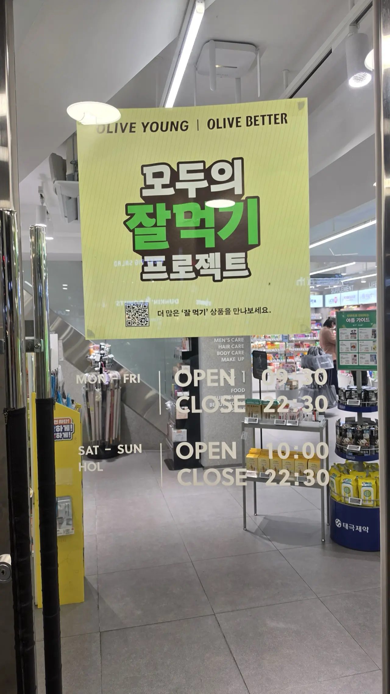
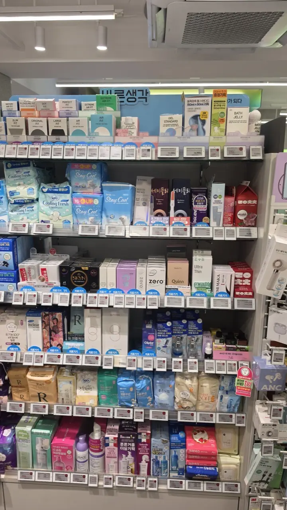
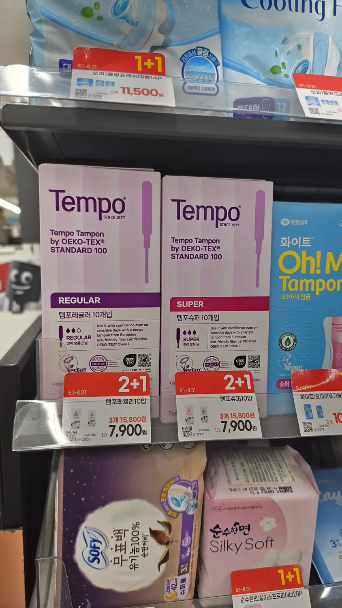
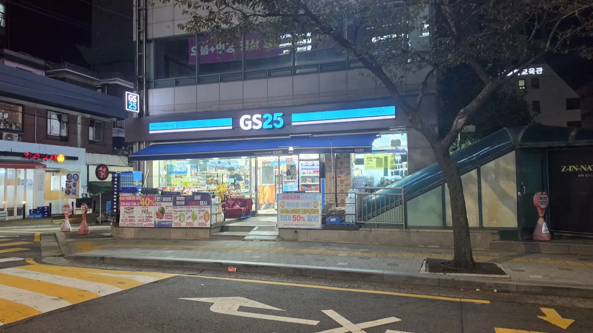

It's 11 p.m., you're in a country whose language you don't read, and
you need something you'd normally buy without thinking. Nobody
packs for this, and it's not the kind of question you want to mime
at a stranger. Here's the whole answer, plainly: what's stocked
where, what the Korean labels actually mean, and which pieces of
old packing advice you can safely ignore.

## The four places

| Where | Open | Stocks | Best for |
| ----- | ---- | ------ | -------- |
| **Convenience store** (GS25, CU, 7-Eleven, emart24) | **24/7** | Condoms, pads, liners, tampons | Right now, at any hour |
| **Olive Young** | ~09:30–22:30 | Everything, widest choice — incl. organic pads and deodorant | Choice — the one-stop option |
| **Pharmacy (약국)** | Daytime, varies | All of the above, plus advice | When you also need medicine |
| **Big mart** (E-Mart, Homeplus, Lotte Mart) | ~10:00–23:00 | Widest range, best price per unit | Stocking up, not emergencies |

Two notes on that table. **Olive Young's hours differ branch to
branch**, so read the door rather than trusting a number — the shop
below opens 09:30 on weekdays, 10:00 at weekends and holidays, and
shuts at 22:30 either way.

*The hours live on the door, in English · ⓒ @BalliBalliSeoul*

The second note is the one that matters at midnight: the
convenience store is the only line in that table that **never
closes.**

*One Olive Young aisle — condoms, pads, liners, the lot · ⓒ @BalliBalliSeoul*

The short version: **convenience store if it's urgent, Olive Young
if you want a choice** — the photo above is a single aisle, and it
has everything in this article on it. The rest is detail.

## Pads: the default here

Korea runs on pads. They're in every convenience store, usually on
an open shelf near the household goods, and the selection at Olive
Young or a mart is enormous. Two things read differently than you
might expect:

**Sizes are named by length and use, not by flow.** Instead of
"regular / super", packs are labelled roughly:

- **소형 (small)** — light days / liners
- **중형 (medium)** — the standard daytime pad
- **대형 (large)** — heavier days
- **오버나이트 (overnight)** — and Korean overnight pads are
  *long*. Wing-to-wing coverage well past what most Western brands
  sell as "night" is normal here. If you've never used one, the
  first one is a surprise; a lot of people end up preferring them.

**Organic and cotton lines are everywhere.** Korean shoppers pay
close attention to materials — a 2017 controversy over pad
ingredients permanently changed the market — so "순면" (pure
cotton) and organic lines occupy serious shelf space, especially at
Olive Young. If you have sensitive skin, this market is unusually
well supplied for you.

One more note from people who've switched: **Korean pads tend to
run a little smaller** than the equivalent size elsewhere. If you
have a size you rely on, buy one pack first and check before
committing to a bulk purchase.

Prices, from an Olive Young shelf in August 2026: packs run from
about **₩4,500 to ₩11,500** depending on brand, count and whether
it's an organic line. Convenience stores charge a small premium
over marts for the convenience you're buying.

## Panty liners: easy, everywhere

Short answer, because this one is surprisingly hard to find
information about: **panty liners (팬티라이너) are as easy to buy as
pads.** Same shelf, same shops — convenience stores, Olive Young,
pharmacies, marts — with a full range of thicknesses and scented /
unscented options.

They're also the cheapest thing in this article: a **40-count pack
for ₩3,050** was sitting on the Olive Young shelf in the photo
above. There is no version of this where packing them is worth the
luggage space.

## Tampons: the old warning is out of date

If you've read that "you can't get tampons in Korea," that advice
has aged badly. **Convenience stores and Olive Young both stock
them**, as do supermarkets, pharmacies and every online shop.
Residents say the same in threads like
[this one on r/Living_in_Korea](https://www.reddit.com/r/Living_in_Korea/comments/1atyob1/feminine_products/).

Here is a convenience store shelf — open around the clock — with
tampons on it:

*Convenience store, not a pharmacy — ₩7,900 a box, 2+1 · ⓒ @BalliBalliSeoul*

Two useful things in that photo. **The absorbency is written in
English** — the boxes say **REGULAR** and **SUPER** right on the
front, so this is one shelf you can read without any Korean. And
the red tag is a **2+1**, which drops three boxes of ten to
**₩15,800** — about ₩527 a tampon, cheaper per unit than buying one
box at a time.

What's still true is narrower:

- **The selection is smaller than for pads** — fewer brands, fewer
  absorbencies — and **prices run a bit higher**: **₩7,900 for a
  box of 10** at the convenience store above, **₩7,500 for 12** at
  Olive Young, against a pack of pads starting around ₩4,500.
- **Non-applicator styles** take up more of the shelf than they
  might at home. Applicator tampons exist; you're just choosing
  from a shorter list.

So: don't pack three months' worth. **Bring a supply only of the
specific thing you're picky about**, and buy the rest here.

**Menstrual cups** are legal and sold here, mostly online and at
larger stores, but they remain a niche product — don't count on
finding one in a hurry.

## Condoms: easier than you think

Genuinely simple. **Every convenience store sells them, 24 hours a
day**, either on an open shelf or in a small display by the
register. Olive Young, pharmacies and marts all carry them too,
with more variety.

Three practical notes:

- **Nobody cares.** There's no age check for adults, no
  under-the-counter routine, no reaction at the register. This is a
  normal purchase in a country where the transaction is quiet by
  default.
- **Fit is written in English, thickness in millimetres — don't
  confuse the two.** Boxes are labelled with fit names you can read
  at a glance: **Slim Fit, Original Fit, Large Fit**, plus texture
  variants like Air Fit or Dot Fit. The **mm number is thickness,
  not width** — Japanese and Korean brands compete on thinness, so
  **0.03mm, 0.02mm, even 0.01mm** are marketing claims about how
  thin it is (Sagami's ultra-thin line is the famous example). A
  smaller mm number does not mean a smaller size.
- **Thinness is what you're paying for.** The mm number drives the
  price far more than the brand does. On the shelf in the photo
  above: **₩13,900 for six at 0.02mm** (about ₩2,300 each) against
  **₩28,000 for five at 0.01mm** (about ₩5,600 each) — more than
  double, per unit, for one hundredth of a millimetre. Ordinary
  boxes start around **₩5,000**. If you just need condoms, ignore
  the decimals and buy the normal box.

*Empty street, open shop — this is the 2 a.m. answer · ⓒ @BalliBalliSeoul*

Vending machines exist in some motels and nightlife areas, but
you'll rarely need one. On most Seoul streets the nearest lit
window at 2 a.m. is a convenience store, and it sells what you
came for.

## Deodorant: another outdated warning

"Bring deodorant to Korea" is the single most repeated piece of
packing advice in expat forums, and it's also out of date.
**Olive Young carries plenty of it**, alongside marts and online
shops, including imported brands.

The grain of truth left in the old advice is about *type*, not
availability: the domestic market skews toward lighter,
fragrance-led products, because a large share of the Korean
population produces very little underarm odour and the category
never needed to be built out the way it was in the West. If you
depend on a heavy-duty clinical antiperspirant specifically, check
the imported shelf — or bring your usual one.

For everyone else: buy it here, like anything else.

## What you can't just buy off a shelf

One boundary worth stating: **emergency contraception (the
morning-after pill) requires a prescription in Korea.** It is not
sold over the counter at pharmacies or anywhere else — you need to
see a doctor first, typically at an OB-GYN (산부인과) or a general
clinic, and then fill the prescription at a pharmacy. Plan for a
clinic visit, not a shop run.

If you're not sure which kind of clinic you need for anything else,
our [department guide](/blog/which-clinic-korea-department-guide/)
decodes the signs — Korean clinics are labelled by specialty, not by
doctor.

## The Korean part

Honestly? Once you know the four places, this one is on you — a
camera app reads any box on that shelf, and nobody at the till will
react. The genuine gap is the last item on the list: **emergency
contraception needs a doctor**, which means a clinic that can see
you and, often, a phone call in Korean to find out who's open.
That part we [can do](/etc).

## Get it sorted

> **Need a clinic that's open, in English?** Message us on
> [WhatsApp](https://wa.me/821075191282) — we'll ring round and
> tell you who can see you and when. We don't recommend providers
> and take no money from them. First answer is free.

The one-line version: **convenience store for right now, Olive
Young for choice, pads and liners everywhere, tampons and deodorant
are available despite what the old guides say, and the
morning-after pill needs a doctor.** Almost none of this deserves
luggage space.
