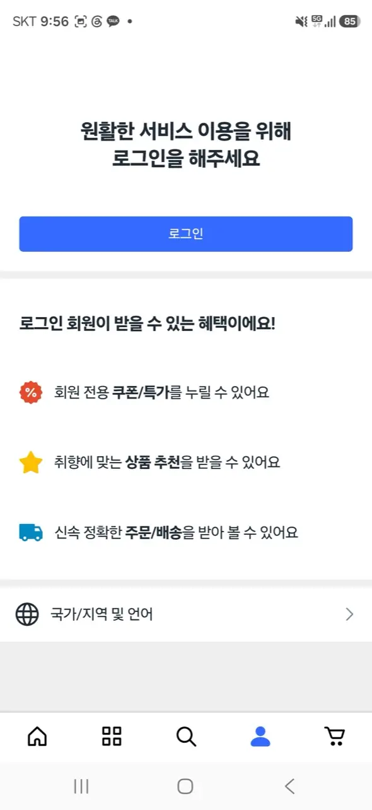
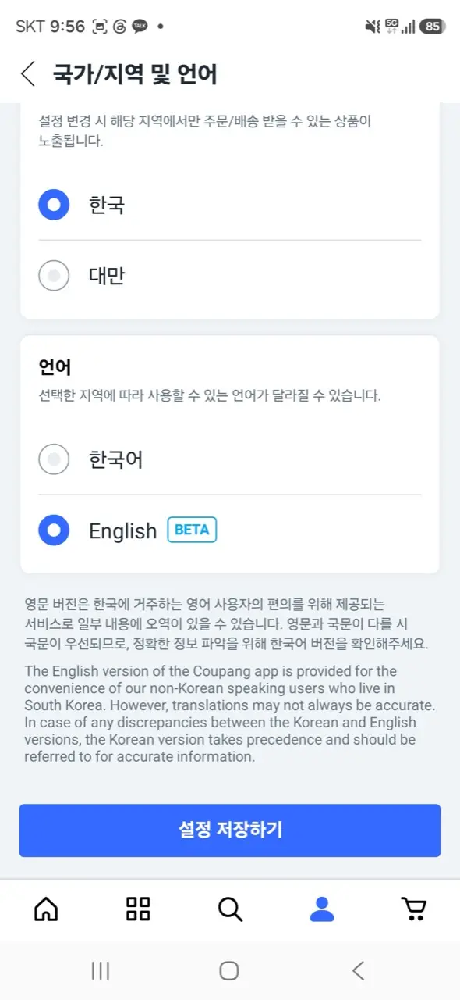
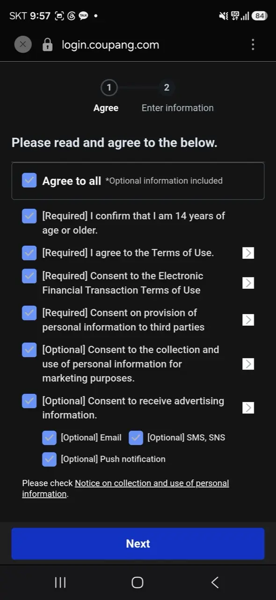
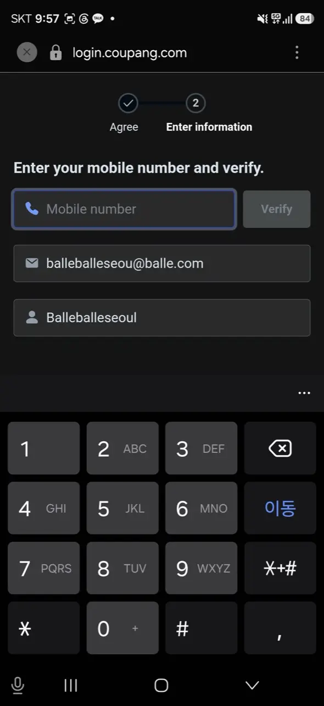
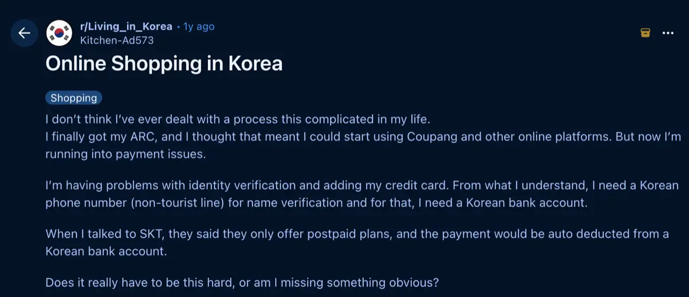

Everyone in Korea keeps telling you to "just order it on Coupang" — the fan,
the power adapter, the bug spray, the thing you need by tomorrow. They're
right: Coupang is Korea's Amazon, and most items arrive the next morning. The
catch is that signing up was built for Koreans, and foreigners hit walls that
locals never see. Here's how far you can get, and what to do when you can't.

> **✨ The tourist shortcut, up front:** no Korean number, no account, no
> problem. **If your hotel concierge or Airbnb host is okay with receiving a
> package, we can get anything on Coupang delivered straight to where you're
> staying** — usually by the next morning. Message us on
> [WhatsApp](https://wa.me/821075191282) with the item and your address, and
> skip this entire article. (Details at the bottom for everyone else.)

## Try this first

### Switch the app to English (yes, while it's still in Korean)

Download Coupang from the App Store or Play Store and open it. Here's the
catch-22 nobody warns you about: **the switch to English is buried inside
the Korean interface.** The route, with the app fresh out of the box:

1. Tap the **person icon** (bottom right).
2. Scroll to the bottom and find the row with the **globe icon** —
   국가/지역 및 언어 ("Country/Region & Language"). The globe is your
   landmark; you don't need to read the Korean.

*The globe row is the way in · ⓒ @BalliBalliSeoul*

3. On the next screen, keep the region as **한국 (Korea)**, and under
   언어 (Language), pick **English (BETA)** — then hit the blue button
   (설정 저장하기, "save settings").

*English is labeled BETA — Coupang's own honesty · ⓒ @BalliBalliSeoul*

Note Coupang's own fine print on that screen: the English version is a
**beta for foreign residents**, translations can wobble, and where the
two differ, the Korean text wins. In practice the browsing, cart and
checkout screens translate cleanly. Search works in English too, though
Korean terms still surface more results — typing the Korean product name
(ask us, or a translation app) often doubles what you find.

### Sign up — the two-step gate

Tap Sign up and you get a two-step flow: **Agree**, then **Enter
information**. Step one greets you with a stack of checkboxes:

*Don't just "Agree to all" · ⓒ @BalliBalliSeoul*

The trick here: **"Agree to all" includes the optional marketing
consents** — email, SMS and push advertising. Tick the four
**[Required]** boxes (age 14+, terms of use, e-financial terms,
third-party provision — you can't shop without them) and leave the
**[Optional]** marketing ones unchecked unless you enjoy promotional
texts in Korean. There's also a new-member carrot: sign-up coupons
worth up to ₩26,000 (as of 2026).

Step two is where foreigners hit the wall:

*The Verify button is the wall · ⓒ @BalliBalliSeoul*

Name and email are easy. The **mobile number + Verify** field is not:
it sends an SMS code to a **Korean number**, and a foreign SIM won't
pass. Two details decide whether the account works long-term:

- **A Korean phone number** for that verification step — this is the
  hard gate.
- **Your name exactly as printed on your passport or ARC** (Alien
  Registration Card). A spelling mismatch here is the classic cause of
  payment and identity verification errors weeks later.

### Add your address the Korean way

Korean addresses run big-to-small — city, district, street, then building and
unit (동/호). In your profile's address book, add the road-name address, your
building and unit number, and the **building entrance code** (공동현관
비밀번호) if your door has a shared lobby keypad — without it, dawn deliveries
get left downstairs. Korea Post's official
[English postal code search](https://www.epost.go.kr/roadAreaCdEng.retrieveRdEngAreaCdList.comm)
finds your zip code if it isn't on your lease.

### Paying

Korean debit and credit cards work every time. Foreign Visa and Mastercard
**sometimes** work — success varies by card and by day, which is exactly the
kind of lottery you don't want when you need something by tomorrow.

## Where it breaks for foreigners

If the sign-up section above felt discouraging, know that it's not you.
*"I don't think I've ever dealt with a process this complicated in my
life,"* opens
[one r/Living_in_Korea thread](https://www.reddit.com/r/Living_in_Korea/comments/1mb8az2/online_shopping_in_korea/)
from a resident who had *already gotten their ARC* and still couldn't
check out. Their discovery is the dependency chain that catches almost
everyone: Coupang's identity verification wants a Korean phone **in your
own name** (a tourist or prepaid line often won't pass) → a postpaid
phone plan wants a Korean bank account to auto-deduct from → and the
bank wanted the ARC they'd just spent weeks getting. Each step is
reasonable; the chain is brutal. The bank link in that chain has its own
guide — [opening a Korean bank account as a
foreigner](/blog/open-bank-account-korea/), including the daily transfer
limit that lands on every new account.

If what you need is urgent rather than cheap, there is a way round the
whole warehouse model: the delivery apps sell things that are not food,
from shops near you, in about ninety minutes —
[including a sealed iPhone](/blog/baemin-delivers-iphone/).

*The whole saga, in one post · via r/Living_in_Korea*

With that comfort delivered — be honest with yourself about which
situation you're in:

- **No Korean phone number** → you can't create an account at all.
- **No ARC yet** → basic ordering may work, but the good stuff stays locked:
  Rocket Wow membership, Rocket Fresh overnight groceries, and Coupang Eats
  all effectively need an ARC and a Korean number.
- **Foreign card declined** → common, and Coupang's customer service runs in
  Korean, so disputing a failed or double charge means a Korean phone call.
- **Wrong item or return** → returns are easy for members, but the process
  (and any seller chat) is in Korean.

If you're a tourist or you just landed and your ARC is weeks away, you can
burn an evening fighting these walls — or skip them entirely (see below).

## What it costs in Seoul

Coupang itself is free to use; the numbers worth knowing, as of 2026:

| Item                                     | Typical cost (as of 2026)       |
| ---------------------------------------- | ------------------------------- |
| Standard delivery (non-member)           | Free over a minimum, or a small fee |
| Rocket Wow membership                    | About ₩7,890/month              |
| Rocket Delivery speed                    | Order by midnight → next morning |
| Having us buy &amp; deliver it for you — any store, online or offline | Item price + coordination fee, quoted upfront in the chat |

Rocket Wow is Korea's version of Prime — free Rocket shipping, 30-day easy
returns, overnight groceries — and if you live here long-term with an ARC, a
couple of orders a month usually justifies it.

One thing Coupang can't do is carry the old one out. Furnishing an
empty flat usually means a pile of boxes going up and something
bulky coming down — mattresses and appliances need
[an official bulky-waste sticker](/blog/how-to-throw-away-trash-in-korea/),
and if it's a whole move, [that's ours to arrange](/moving).

One warning before you order an appliance you intend to keep:
**Korea runs on 220V at 60Hz**, and a device bought here may not
survive being taken home — or the other way round. Check
[what actually works and what quietly dies](/blog/korea-voltage-220v-adapters-guide/)
before you buy anything with a motor or a heating element.

## The Korean part

This is the part that doesn't translate, no matter what language the app is
set to: the SMS verification that needs a Korean number, the sign-up screens
in Korean, the address format, the customer service line, the seller chat
when a return goes sideways. If any of that is the wall you're stuck at,
that's where we come in.

**We buy it for you — wherever it's sold.** Tell us what you need on WhatsApp
— a link, a photo, or just "a fan that isn't loud, under ₩50,000" — and we
find the best way to get it: Coupang or Naver if it's cheapest online, Daiso
or the electronics market if it's an offline thing, the neighborhood hardware
store if it's an obscure part. (One line we don't cross: medicine — we'll
gladly point you to an English-friendly pharmacy or clinic, but purchasing
medication is between you and the pharmacist, by law.) We buy it, get it
delivered to your door, and chase the
delivery or return if anything goes wrong. You get one fixed quote (the
item's price plus our coordination fee) before anything is bought, and the
asking costs nothing — you pay only for the work you book. It's the same
[anything-else concierge service](/etc) we run for phone calls and appliance
repairs — personal shopping is just another day on it.

It also pairs well with a new apartment: while sorting your first Coupang
order we can set up the rest too — internet, utilities, and the door code
you were never given (see our
[keypad door lock guide](/blog/keypad-door-lock-dead-locked-out-seoul/)).

## Get it sorted

> **Need something but can't get past the sign-up?** Message us on
> [WhatsApp](https://wa.me/821075191282) with what you need — we'll find it
> (online or in a store), quote you one fixed price, and get it to your door.
> Asking costs nothing — you pay only for the work you book.

And once your ARC arrives, make the account anyway — set the app to English,
match your name to your ARC exactly, and Coupang becomes the single most
useful app on your phone in Korea.
