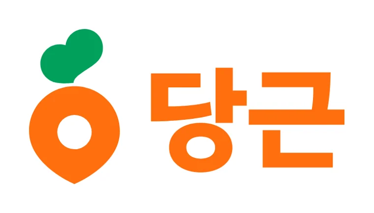
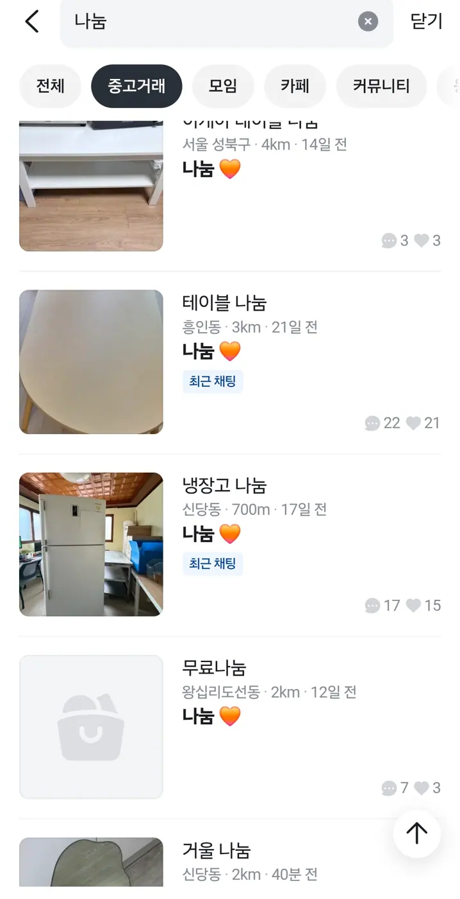

Two moments in a stay in Korea look identical from the outside and are opposite in
practice. You arrive with two suitcases and an empty room that needs a desk, a fan, a
drying rack and a kettle. Or you are leaving in three weeks with a room full of things
you cannot take and will not fit in a bin.

Both are the same app.

## What 당근 is

**당근 (Dangeun)** — "carrot", and Karrot in English — is by a distance the largest
secondhand marketplace in Korea, and it works differently from eBay or Gumtree in one
respect that decides everything else: **it is organised by neighbourhood rather than
by the whole country.**

You see what is for sale near you. Buyers and sellers meet in person and hand the
thing over. Most listings are things nobody would post to a stranger — a fan, a
microwave, a floor lamp, a bed frame — because the transaction assumes you will walk
ten minutes and carry it home.

There are plenty of foreign residents on it. It is not a Korean-only space in
practice, even though the app is Korean-first.

*The logo you are looking for in the app store · logo ⓒ Danggeun Market Inc.*

Get it from the
[App Store](https://apps.apple.com/kr/app/id1018769995) or
[Google Play](https://play.google.com/store/apps/details?id=com.towneers.www).
Install it before you need it — the verification below takes longer than the
download.

*We are not affiliated with Danggeun Market and this is not a sponsored post. We
write about it because it is the app people here actually use.*

## The neighbourhood check

**동네 인증 (dongne injeung)** — neighbourhood verification — is not optional. The
app checks by GPS that you are actually in the area you are claiming, and until you
pass it you cannot list or, for many things, contact a seller.

That sounds like a hurdle and it is really a feature. It is why a listing near you is
genuinely near you, and why a stranger meeting you at the convenience store exit is
someone who also lives around the corner.

Practically: verify from where you actually live, not from campus or the office, or
your feed will fill with things that are a bus ride away.

## Getting in: the Korean phone number

Here is the wall, and it is the same wall as everywhere else in Korean digital life:
**signing up requires identity verification against a Korean mobile number.**

No Korean number, no account. This is the single most common reason a new arrival
cannot use the app in their first fortnight, and it is why the sequence matters —
phone number, then bank account, then everything else. The account side of that is in
[how to open a bank account in Korea](/blog/open-bank-account-korea/).

If you are here short-term on a prepaid SIM, check that the number supports
verification before you rely on it. Not all do.

## Buying: what to expect

Prices are low because there is no shipping, no platform taking a cut of most deals,
and a seller who mostly wants the thing gone.

**Some of it is free.** 나눔 (nanum) — literally "sharing" — is a listing given away
rather than sold, and it is not a euphemism for rubbish. Fans, air purifiers, drying
racks, small furniture, kitchen things, sometimes a refrigerator: items somebody paid
real money for and now needs gone.

The reason is Seoul arithmetic rather than generosity. **Space costs more here than
most of what you could put in it.** A fan that will be wanted again in eleven months
has to live somewhere for those eleven months, and in a one-room that somewhere does
not exist. So it goes to whoever will carry it away today. What is a burden to
somebody leaving is precisely what somebody arriving needs, and the two of them are
usually four subway stops apart.

**Search 나눔 in the app** and check it often. The good things go within the hour,
and there are most of them around semester ends and moving season.

*A morning's 나눔 listings, refrigerator included · screenshot from the Dangeun app*

That is one ordinary search: two tables, a mirror, and **a refrigerator seven hundred
metres away**. Note what sits under each title — the neighbourhood and the distance,
because everything here is priced on how far you are willing to carry it.

**직거래 (jikgeorae) — meeting in person — is the default.** You agree a time and a
place, you look at the thing, you pay, you take it.

**Meet somewhere open, and not at your door.** The front of a convenience store, a
coin laundry, a subway exit — somewhere lit, public, and busy enough that nothing
happens unobserved. Subway exits are the easiest of the three to agree on, because
they are numbered. Two ways to say it that leave no room for confusion:

> **이태원역 1번 출구 지상에서 만나요.**
> *Let's meet at Itaewon Station, Exit 1, at street level.*
>
> **강남역 3번 출구 스타벅스 앞에서 만나요.**
> *Let's meet in front of the Starbucks at Gangnam Station, Exit 3.*

**지상 (jisang) — "above ground" — is the word worth copying.** Large stations have
underground concourses and shopping arcades, so an exit number on its own can still
leave two people thirty metres apart on different levels. Naming a shop beside the
exit does the same job. Daylight, where you can choose it. A buyer who asks which
building is yours, or a seller who offers to bring it up, is asking for something the
transaction does not need: **your address is not part of the deal.**

This matters more if you live alone, and more again for women living alone. Korea is
a genuinely safe country by most measures, and none of this is a reason to avoid the
app — it is the ordinary precaution that keeps it uncomplicated. Crime is rarer here
than in most places you have lived. It is not absent.

A few things worth knowing:

- **Ask for it to be tested in front of you** if it plugs in. A fan that does not
  turn on is a fan you have carried home for nothing.
- **Chat translation is decent, but measurements are not negotiable.** Get the
  dimensions in centimetres before you agree to anything with legs.
- **Appliances near the end of a semester are cheap and plentiful**, because everyone
  leaving is selling at once.
- If the seller wants payment before you meet and will not do 직거래, walk away
  unless you are paying through the app.

**당근페이 (Dangeun Pay)** is that in-app payment, and it is what to use when meeting
in person is not practical — the money is held rather than handed over on trust.
Anything you receive sits in the app afterwards, and you can spend it on other
listings without doing anything else.

**You do not need to register a bank account to use the app**, which is worth knowing
in your first weeks. The account only comes into it when you want to take money out
of the app rather than spend it inside it — so you can arrive, verify your
neighbourhood, and start buying long before the banking is sorted.

## Selling before you leave

This is the half people leave too late.

**Start three to four weeks out, not three days.** Things sell at the price you set
minus the urgency you show, and a listing posted the night before your flight is a
giveaway with extra steps.

**What moves fastest:** anything a new arrival needs on day one. Desk, chair, bed
frame, mattress topper, fan, drying rack, microwave, rice cooker, kettle, monitor. In
university neighbourhoods, that is exactly what someone is looking for in the same
week you are leaving.

**What does not move:** worn bedding, cheap plastic storage, anything with a smell,
and clothes at any price.

**Whatever does not sell still has to go somewhere.** Korea charges for large-item
disposal by sticker and fines street dumping, which is covered in
[how to throw away rubbish in Korea](/blog/how-to-throw-away-trash-in-korea/). Budget
a day for it. Leaving a mattress in the corridor for the next tenant is not a plan;
it is your deposit.

## About the jobs on there

Dangeun also carries local part-time work — a café needing weekend hours, someone
wanting help moving a fridge. It is a real part of the app, and people do find work
through it.

**One line matters more than any of the rest of this: you need the right immigration
status to work in Korea, and it is not optional.** Working without it puts your stay
at risk — status cancelled, and in serious cases a departure order and a re-entry ban.
It is not a technicality that gets overlooked because the job was casual or the money
was small.

Students are the group this catches most often. A student visa does not include the
right to work by itself; there is a **separate part-time work permit** that has to be
granted **before** you start, not applied for afterwards if someone asks.

We are not lawyers and we do not handle immigration matters. For what applies to your
specific status, the **Immigration Contact Center on 1345** is free, multilingual and
the correct place to ask, and a licensed administrative scrivener or lawyer is the
right person for anything more involved. Ask before you take the shift, not after.

## The Korean part

The app is Korean-first. Listings are written in Korean, the meeting arrangement
happens in Korean chat, and the words that matter — 직거래, 나눔 (giving something
away free), 예약중 (reserved), 에누리 (haggling) — are not the ones a translation app
handles gracefully in context.

Most of it you can manage. Where people get stuck is a seller who stops replying, a
meeting that needs rearranging, or a listing of your own that needs writing so it
actually sells.

## Get it sorted

If you are arriving and furnishing a room, or leaving and clearing one, tell us what
you have or what you need. We will write the listing in Korean, read the replies back
to you in English, and sort the meeting out.

If it is a move rather than a clear-out, that is a different job — see
[moving company quotes in Seoul](/blog/moving-company-seoul-quotes/).

**KakaoTalk is the easiest way to reach us**, and WhatsApp works too. Asking costs
nothing.
