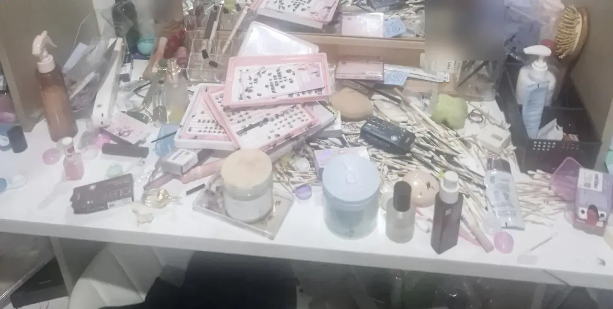
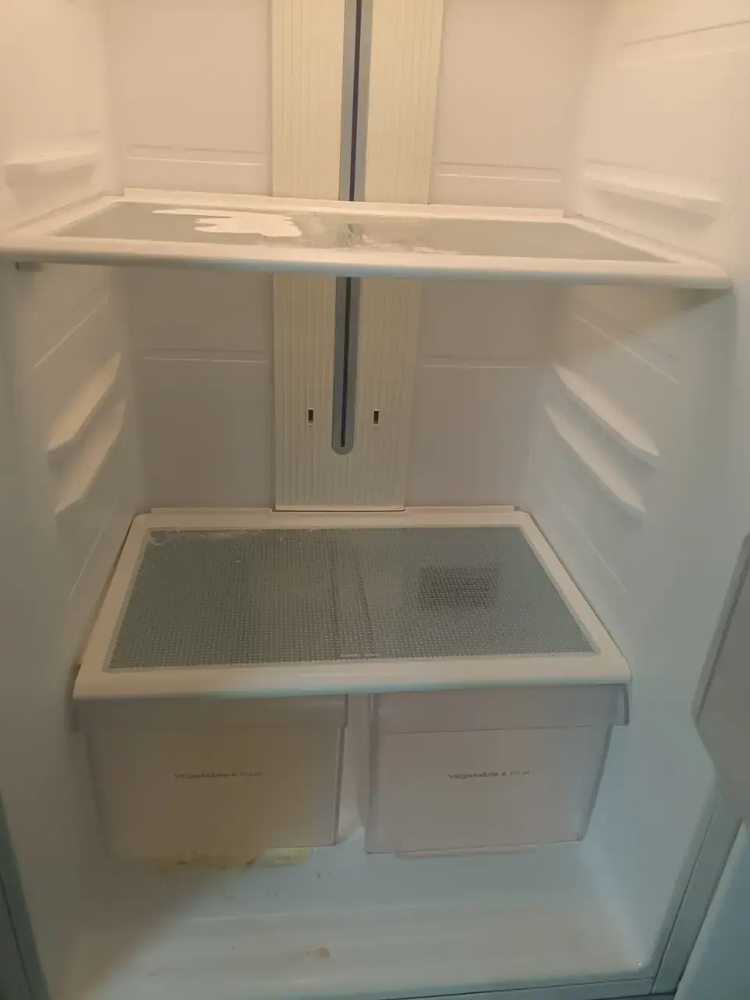
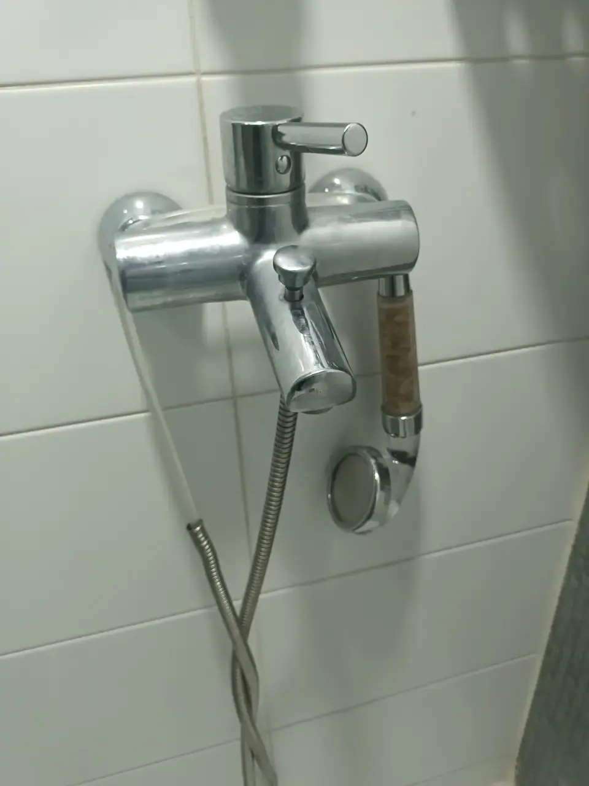

It happens gradually and then all at once. A deadline, an illness, a bad
few months, a flat that is too small for the amount of stuff in it — and
one day there is no floor.

*Pixelated on purpose. The floor is under there · ⓒ @BalliBalliSeoul*

If you are looking at something like this and searching for "deep clean
Seoul", the useful thing to know first is that **you are looking at two
jobs, and Korean companies sell them separately.** Booking the wrong one
wastes a day and a deposit.

## Korea has six of these, and they are not interchangeable

Everything below gets translated into English as "cleaning". They are
separate products with separate crews and separate prices, and the first
question every company asks is which one you want.

**The dividing line is whether the flat is empty.**

| Korean | What it is | Flat is |
| --- | --- | --- |
| **준공청소** (jungong) | Post-construction clean of a new building, ordered by the builder | Empty |
| **입주청소** (ipju) | Move-**in** clean. Strictly, removing **construction dust** from a new or newly renovated home | Empty |
| **이사청소** (isa) | Move-**out** clean. Removing the **previous occupant's** accumulated grime | Empty |
| **거주청소** (geoju) | Deep clean of a home you are **living in**, worked around your furniture | Occupied |
| **부분청소** (bubun) | Partial — one bathroom, one kitchen, one room | Occupied |
| **특수청소** (teuksu) | Clearance plus deep cleaning of a home past ordinary cleaning | Occupied, heavily |

Plus one that is not cleaning at all: **정리수납** (jeongni-sunap),
professional organising. They sort and store; they do not scrub.

Three things to take from that table.

**입주청소 and 이사청소 are advertised together and are technically
different.** Companies bundle them because the crew and the kit are the
same, but 입주 is construction dust in a new build and 이사 is years of
somebody's cooking. If your flat is a handover between tenants rather
than a new build, the second word is the accurate one — and it is worth
saying, because the two jobs are dirty in different ways.

**입주청소 is the phrase everyone searches first, and for an occupied
flat it is the wrong one.** It is the largest advertised category in
Korea, so it dominates the results — and every one of those quotes
assumes an empty room. Furniture in the room changes the price, the
method and sometimes whether they will take the job.

**If you are living there, your two options are 거주청소 and 부분청소.**
This is the gap most English-language advice leaves open. You do not have
to choose between "tidy it yourself" and "call the extreme-cleaning
people" — an ordinary deep clean of an occupied home is a normal,
bookable, moderately priced service here.

### What no cleaner will do

None of them will throw your things away. That is not squeamishness; it
is liability. Nobody wants to be the person who binned a passport, a
lease or a hard drive. **The decision about what is rubbish has to come
from you**, and every quote you get assumes that.

## Do the only part nobody can do for you

Before any company can price the job, someone has to separate three
piles: keep, bin, and undecided. You can pay a professional to stand
beside you while you do it, and 정리수납 firms are genuinely good at
that. You cannot pay someone to do it instead of you.

Two things make it easier than it looks.

**Work in bags, not in decisions.** Fill one bin bag with things that are
obviously rubbish — packaging, receipts, empty bottles, single socks.
Do not sort anything yet. The floor appearing changes the problem from
overwhelming to finite, and it usually takes under an hour.

**Put "undecided" in a box, not back on the floor.** One box, taped, with
today's date on it. If you have not opened it in six months you have your
answer. This is the standard trick professionals use, and it works
because the hard part was never the object — it was deciding in the
moment.

## The bottleneck is disposal, not cleaning

This is the part that surprises people who have done this elsewhere.
**In Korea you cannot simply put it all out on the kerb.**

- **Household waste goes in the paid bag** — 종량제봉투, bought at any
  convenience store, and the correct one for your district. The wrong
  district's bag will be left where it is.
- **Recycling is separated**, and in a villa or one-room the collection
  day is fixed by the building rather than by you.
- **Anything large** — a mattress, a chair, a bookcase — needs a paid
  disposal sticker (대형폐기물) arranged with the district office
  beforehand. Putting furniture out without one is the single most common
  way foreign residents get fined here.

The whole system is in
[how to throw away rubbish in Korea](/blog/how-to-throw-away-trash-in-korea/),
and it is worth ten minutes before you start rather than after you have
forty bags and nowhere to put them.

Two practical consequences. **Volume drives the price** of a clearance
job far more than floor area does, so an hour of your own sorting is the
cheapest money you will ever save. And **the disposal is often the part
you are actually paying a company for** — the labour of carrying it down
and the fees for getting rid of it legally.

## What is left is genuine cleaning

Once the volume is gone, what remains is surface work, and it is the part
a cleaning team is actually built for.

*Nothing here is dirty. There is simply no surface left · ⓒ @BalliBalliSeoul*

That table is the whole distinction in one photograph. It is not a
cleaning problem. Clear it and it is a five-minute wipe. Leave it and no
cleaner in Korea will touch it, because every item on it is a decision
they are not allowed to make.

The things that genuinely need a professional are the ones that have been
building up underneath.

*Emptied, not yet cleaned — and this is where smell lives · ⓒ @BalliBalliSeoul*

**Appliance interiors.** A fridge that has been emptied is not a fridge
that has been cleaned. Dried spills under the crisper drawers are the
usual source of a smell people blame on the drain.

*Scale on a shower fitting — this needs descaling, not scrubbing · ⓒ @BalliBalliSeoul*

**Limescale and silicone.** Korea's water leaves scale on fittings, and
the brown crust above is past the point where a sponge helps. Blackened
bathroom silicone is a separate case again: it usually has to be **cut
out and replaced**, not cleaned, and a quote that promises to scrub it
white is a quote to distrust.

**Behind and under things.** The gap behind the washing machine, the
floor under the wardrobe, the top of the kitchen cabinets. These are
reachable exactly once — while the room is empty — which is the honest
argument for doing a heavy clean during a move rather than around your
furniture.

What a clean will not fix is anything structural. Damp at the bottom of a
wall is not dirt, and scrubbing it changes nothing —
[mould behind the baseboard](/blog/mould-behind-baseboard-korea/) is a
building problem with a different owner and a different bill.

## What it costs, and why the quotes disagree

Published guide ranges in Korea, as of 2026, vary enormously — and it is
worth understanding why before you read them.

**The ordinary end first**, because most people reading this need it more
than they need a clearance crew. Empty-flat cleaning is priced per
**평** (pyeong, about 3.3㎡ — the number is on your lease).

| Job | Guide range |
| --- | --- |
| Move-in / move-out clean, studio or one-room (~10 pyeong) | Around ₩250,000 |
| — two-bedroom (~20 pyeong) | Around ₩500,000 |
| — 30 pyeong and up | From ₩700,000 |
| Partial (부분청소), one room | From around ₩50,000 |
| Partial, kitchen or bathroom | From around ₩80,000 |

Those work out to roughly **₩23,000–25,000 per pyeong**, which is the
number worth carrying in your head. When a quote arrives, divide it by
your floor area. A figure near that line is an ordinary job; a figure far
above it is a heavier one, and you should be able to hear why.

**A quote far below the line is also worth a question**, not just
gratitude. Korean cleaning firms warn about the same thing themselves: a
price that undercuts the market is often the shape of a job that grows on
the day, or gets done in half the hours.

**Now the heavy end**, and here the published numbers stop agreeing.

| Job | Guide range seen |
| --- | --- |
| Organising (정리수납), two professionals | From around ₩600,000 |
| Organising, 30 pyeong home | Roughly ₩600,000–1,500,000 |
| Clearance clean (특수청소), ~10 pyeong | Roughly ₩300,000–1,200,000 |
| Clearance clean, one-room in bad condition | Frequently quoted ₩800,000–1,500,000 |
| Clearance clean, 20–30 pyeong | Roughly ₩500,000–1,500,000 |

**Those ranges overlap and contradict each other, and that is the
finding.** Different firms publish figures that differ by a factor of
three for the same floor area, because floor area is not what they are
pricing. They are pricing **volume, contamination and access** — how many
bags come out, whether anything has gone bad, and whether there is a lift.

Notice the gap between the two tables. A 20-pyeong flat cleaned normally
is around ₩500,000; the same flat as a clearance job can be two or three
times that. **Almost all of that difference is stuff, not dirt** — which
is the argument for the bin bags again.

Which means a number quoted over the phone, before anyone has seen it, is
not a real number. **Send photographs.** Every firm will ask for them,
and the quote you get from photos is far closer to the final one than any
figure derived from your pyeong count.

If what you actually want is ongoing help rather than a one-off rescue,
that is a different market with different prices —
[finding a weekly housekeeper](/blog/housekeeping-service-korea/) covers
it.

## If you are renting

Two things worth knowing before you book anything.

**Photograph the flat now**, in its current state, and again after. Not
for anyone else — for you. If a landlord later argues about the condition
of the floor or the walls, a dated set of photographs is the only thing
that settles it, which is the same reason
[the move-in photos matter](/blog/photograph-your-flat-move-in-day/).

**A heavy clean before you hand back the keys is usually cheaper than the
deposit deduction it prevents.** Landlords deduct for condition, and they
deduct at their own estimate rather than at market rates.

## The Korean part

Every firm in all three categories works by phone and KakaoTalk, in
Korean, and the conversation is specific: the floor area in pyeong, the
condition, how much is coming out, the building's lift and parking, and
the date. A vague answer gets a vague price, and a vague price is where
the arguments start.

There is also a discretion problem that nobody writes about. Asking three
companies to look at photographs of your home in this state, in a
language you do not speak, is a genuinely uncomfortable thing to do. It
is also completely routine work for them — this is what the trade
exists for, and the crews have seen far worse than whatever you are
looking at.

## Get it sorted

Start with bin bags and an hour. Everything after that gets cheaper.

When you are ready for quotes, we handle the Korean side: we describe
the job accurately to firms that do this work, get you comparable numbers
in English, and sort out the access and the disposal timing. The
[cleaning page](/cleaning) has our guide ranges, and the first answer
costs nothing.
