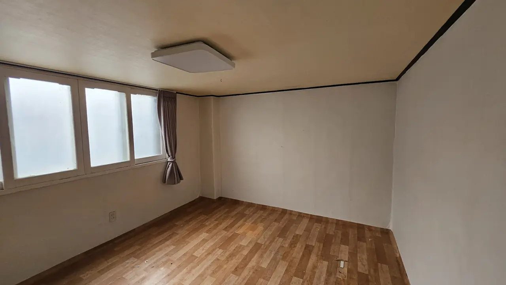
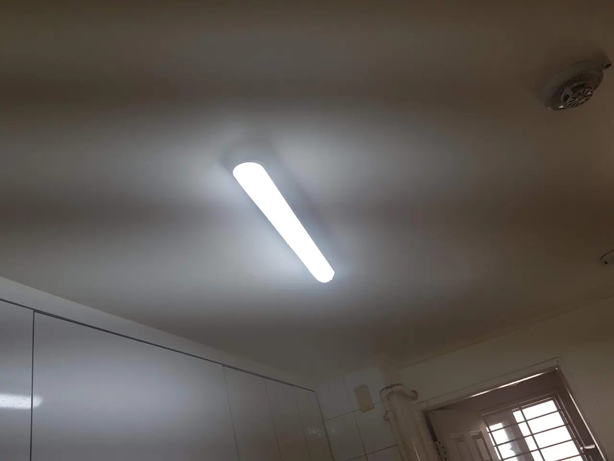
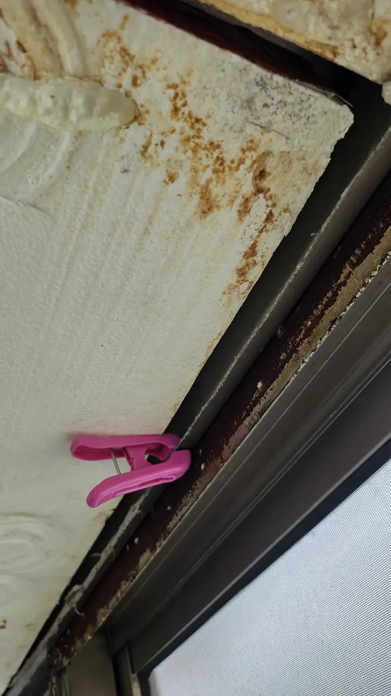
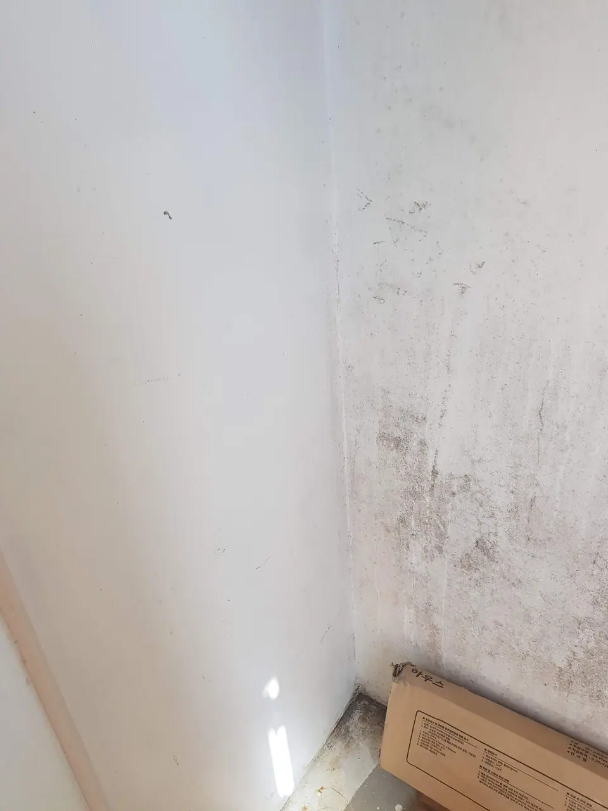
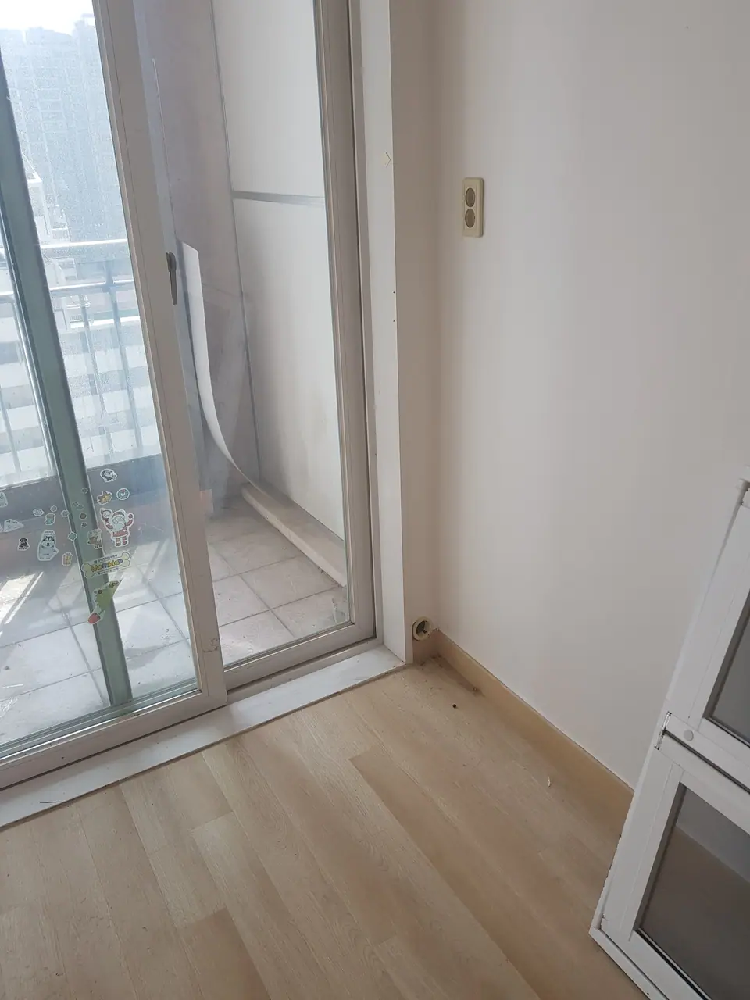

You have booked it. A date, a price per pyeong, a company name in a
KakaoTalk thread. What nobody tells you is what the day itself looks
like — and that the most valuable twenty minutes of it are the last
twenty, after the crew says they are finished and before anyone has
been paid.

This is the day, in order. If you are still deciding **which** clean
you need, or what a fair quote is, start with
[deep cleaning in Korea](/blog/deep-clean-korea-sorting-first/) — it
covers the six kinds Korean companies sell and why their prices
disagree. This piece picks up once you have chosen.

## What they need from you before they come

A Korean deep clean company prices and staffs the job from a short list
of facts. Get these right and the day goes as quoted. Get them wrong and
the number changes at the door.

| They will ask | Why it matters |
| --- | --- |
| **평수** — floor area in pyeong | It is on your lease. The whole price is built on it |
| **확장형** — is the balcony knocked through? | An extended flat is more floor and fewer walls than its pyeong suggests |
| The date, and whether it is **empty** | Every quote assumes nothing is in the rooms |
| Lift, floor, parking | Equipment comes up with the crew |
| Anything unusual | Heavy mould, stickers on walls, a smell, a pet |

Send photographs of every room, including the ones you would rather not.
A quote made from photos is the one that holds.

Two things to arrange yourself, because the crew cannot:

**Water and electricity must be on.** A clean runs on hot water, steam
and machines. If the flat is between tenants and the utilities have been
suspended, the crew arrives to a building they cannot work in.

**Access, agreed in writing.** Who opens the door, at what time, and
whether you will be there. A door code sent the night before is normal.
A crew waiting in the corridor for forty minutes is billed to someone,
and it is not the company.

## The flat they walk into

*Empty, reachable, and nobody living around it · ⓒ @BalliBalliSeoul*

That is an ordinary handover. A curtain the last tenant did not take,
grit across the floor, a ceiling light nobody has wiped in years.
Nothing about it is dramatic, and that is the point: **an empty room is
the one condition in which every surface can be reached**, which is
what you are paying a crew for.

Look past the floor, though. The light fitting, the window frames and
their tracks, the top edge of the skirting, the corners behind where
the furniture stood. Those are all in scope, and they are the places
you check at the end.

## How the day runs

Crews differ, but most follow the same logic: **top to bottom, wet rooms
and kitchen first, floors last.** A team of two to four people on an
empty two- or three-room flat is usually there most of a day.

1. **A walk-round with the team leader.** Ten minutes. This is your
   chance to point at the things you care about — *"the silicone in the
   bathroom, the balcony, inside the kitchen cabinets"*. Say it now, not
   at 5pm.
2. **Ceilings, lights and high surfaces.** Dust falls, so it goes first.
3. **Kitchen.** Hood and filter degreased, cabinets inside and out, the
   sink and its drain.
4. **Bathrooms.** Scale on fittings, grout, the drain, the extractor fan.
5. **Windows, frames and tracks**, including the balcony.
6. **Walls, doors, skirting and switches.**
7. **Floors, last**, once nothing else will fall on them.

*Step two. Nobody looks up until the end · ⓒ @BalliBalliSeoul*

You do not need to stay for the day. Many people let the crew in, do
the walk-round, and come back for the last part — which is the part that
matters.

## The final check: do it before you pay

In Korea this has a name — **검수** (geomsu), the inspection. Reputable
companies expect it: the team leader walks the flat with you, and
anything you find is fixed while the crew and their equipment are still
there. Once they have driven away, the same fix is a return trip, and
a return trip is a negotiation.

**Do it with the lights on and the blinds open.** Daylight shows streaks
on glass and film on tiles that a ceiling light hides.

Here is where to look, in the order that finds problems fastest.

**Window tracks and frames.** The single most skipped place in a Korean
clean, because it is slow and it is low.

*Run a finger along the track. Then decide what is dirt · ⓒ @BalliBalliSeoul*

Be fair about what you find there. Loose grime in a track should be gone.
**Rust and corroded paint will not be** — they are damage, not dirt, and
no crew can clean them back to new. Knowing the difference stops you
arguing about the wrong thing, and it is the same line that decides who
pays at the end of a lease, covered in
[what gets deducted at move-out](/blog/move-out-cleaning-korea/).

**The balcony.** Often quoted separately, often done last, often done in
a hurry.

*If it was in the quote, it should look different by 5pm · ⓒ @BalliBalliSeoul*

Surface mould on a balcony wall is removable, and if the balcony was in
your quote it should be visibly treated. If it comes straight back in a
few weeks, that is not a failed clean — it is damp, and it has
[a different cause and a different owner](/blog/mould-behind-baseboard-korea/).

**Then the rest, quickly:**

- **Inside** the kitchen cabinets and drawers, not just the doors
- The **range hood filter** — take it out and look
- **Tops** of the wall cabinets, the fridge space, the door frames
- Bathroom **drains** with the cover lifted, and the silicone line
- **Light switches and door handles** — the fingerprint test
- The **floor edges** where the skirting meets the floor

*The last place a mop reaches is the first place to look · ⓒ @BalliBalliSeoul*

Take photographs as you go. If something needs redoing, a photo in the
chat is clearer than any description, in either language.

## If something is missed after they leave

Most Korean cleaning companies offer **A/S** — after-service, a return
visit to fix anything missed. It is common enough to be expected, but
the terms are not standard.

Before the day, get two things in the chat:

- **How long the A/S window is.** A few days is typical; ask for the
  number
- **What counts.** A missed track is A/S. Rust, stains that are really
  damage, and mould that grows back from damp are not

If you move in and find something a week later, send the photo that day.
The longer you wait, the harder it is to show the crew missed it rather
than that it happened after.

## What it costs, briefly

Deep clean prices in Seoul are built on floor area, then adjusted for
condition. Our guide ranges on the [cleaning page](/cleaning) run from
around **₩250,000 for a studio** to **₩700,000 and up for 30 pyeong**,
and the extras that commonly change a quote — heavy mould, stickers,
a separately priced balcony — are worth naming before the day rather
than discovering on it. The full price breakdown, and why two quotes for
the same flat can differ by double, is in
[move-in cleaning in Seoul](/blog/move-in-cleaning-seoul/).

Two cleans that are **not** usually in a whole-flat price, unless you
ask: [the air conditioner, dismantled](/blog/aircon-cleaning-korea/),
and [the sofa and mattress](/blog/sofa-mattress-cleaning-korea/).

## The Korean part

Every step above happens in Korean: the facts they need up front, the
walk-round, the 검수, and — hardest of all — telling a team leader at
the end of a long day that the tracks are not done.

That last conversation is the one people skip. It is also the only one
that gets the job finished.

## Get it sorted

We book deep cleans in English. We send the company the facts they
price on, confirm the A/S terms in writing before the day, and we are on
the chat for the 검수 — so when you point at a window track, the team
leader hears exactly what you mean.

**We take no commission from any cleaning company we put in front of
you**, so we have no reason to tell you a job is done when it is not.

> **Moving in, moving out, or just overdue?** Send us your floor area,
> the date and a few photos.
> **[KakaoTalk](https://pf.kakao.com/_RJxhSX/chat) is the easiest way
> to reach us**, and [WhatsApp](https://wa.me/821075191282?text=Hi%20Balli%20Balli%21%20I%27d%20like%20a%20cleaning%20quote.%0A%0A-%20Name%3A%0A-%20Phone%3A%0A-%20Address%3A%0A-%20Home%20size%20%28pyeong%20or%20m2%29%3A%0A-%20What%20I%20need%20%28move-in%20deep%20clean%20%2F%20housekeeping%20%2F%20mold%20%2F%20Airbnb%29%3A%0A-%20Preferred%20day%20%28e.g.%20Sat%204%20Oct%2C%20or%20weekdays%29%3A%0A-%20Preferred%20time%20%28e.g.%2010am%2C%20or%20morning%29%3A%0A%0A%28Photos%20help%20a%20lot%21%20Please%20book%20at%20least%202%E2%80%933%20days%20ahead%20%E2%80%94%20ideally%20a%20week.%20Same-day%20or%20next-day%20requests%20may%20not%20be%20possible.%29) works too.
> The first answer costs nothing.

And if what you want afterwards is to keep it that way, that is a
different and much cheaper service —
[a weekly housekeeper](/blog/housekeeping-service-korea/).
