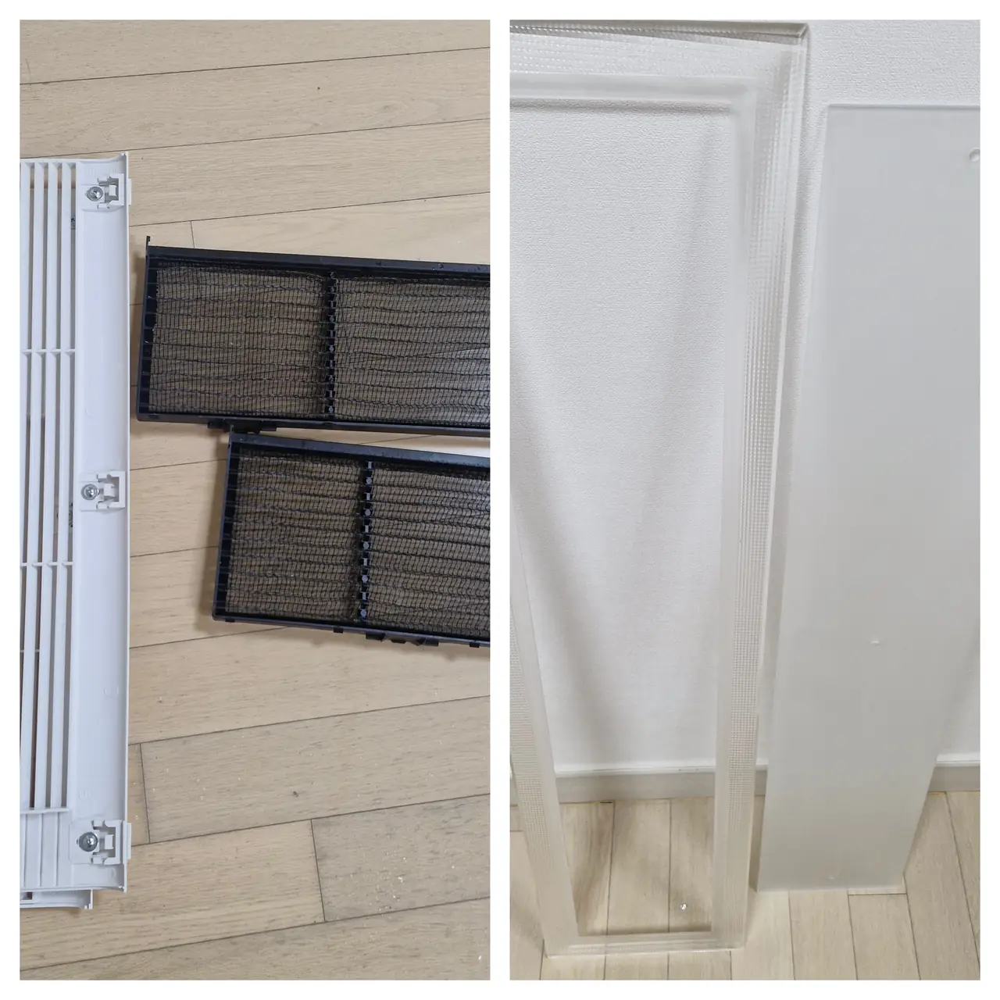
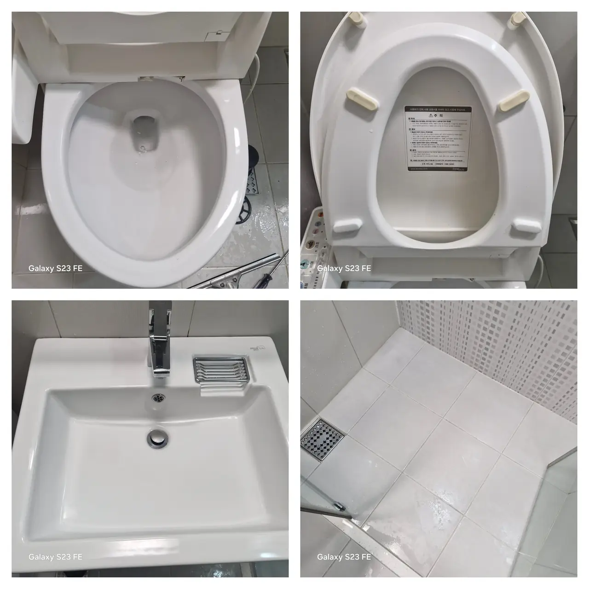
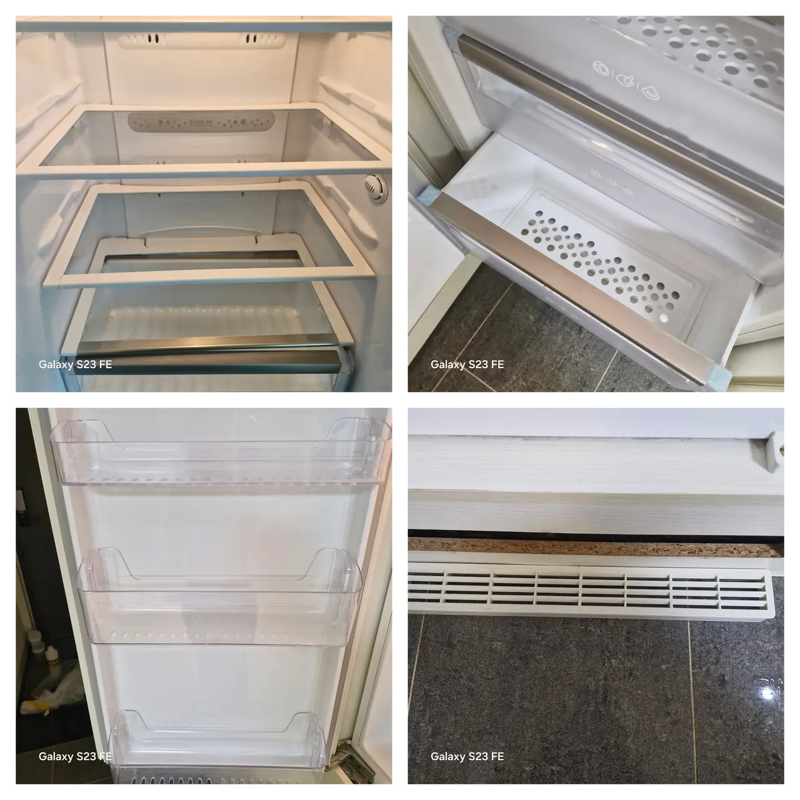
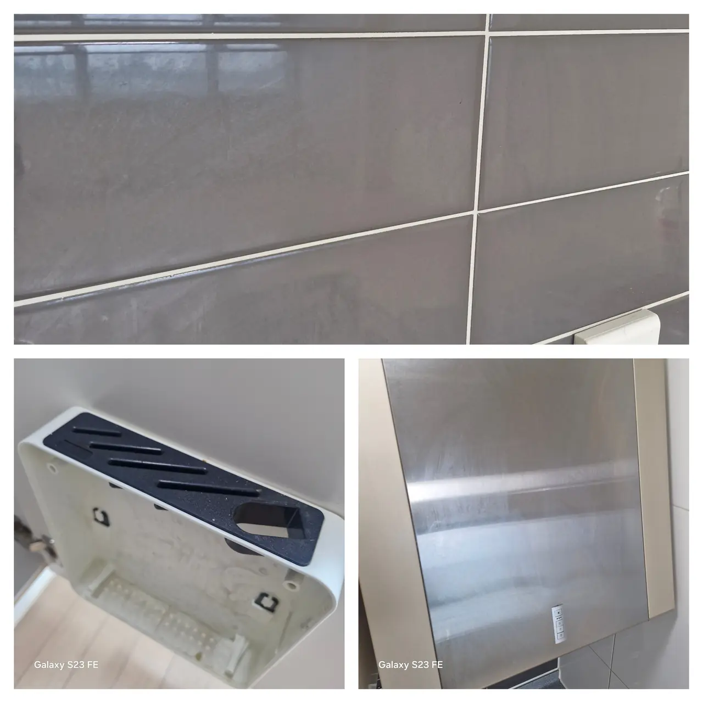
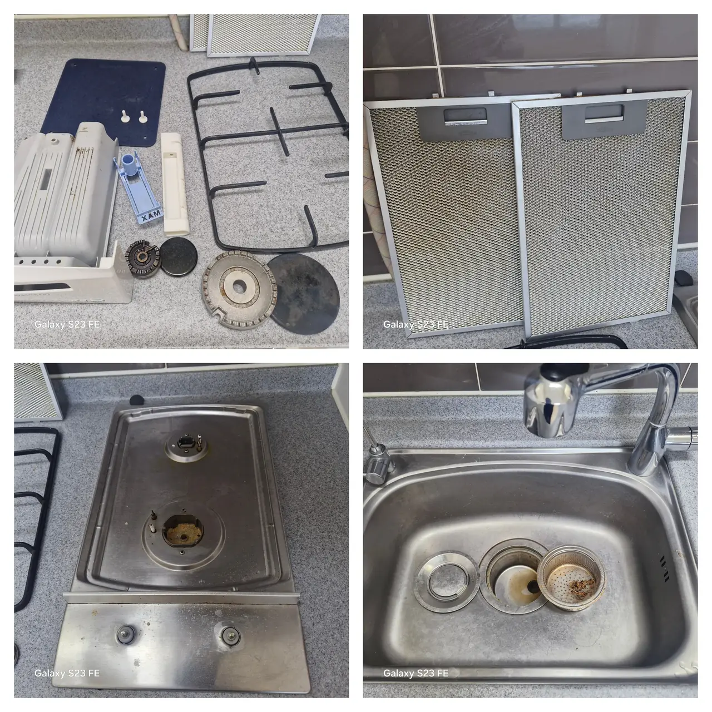
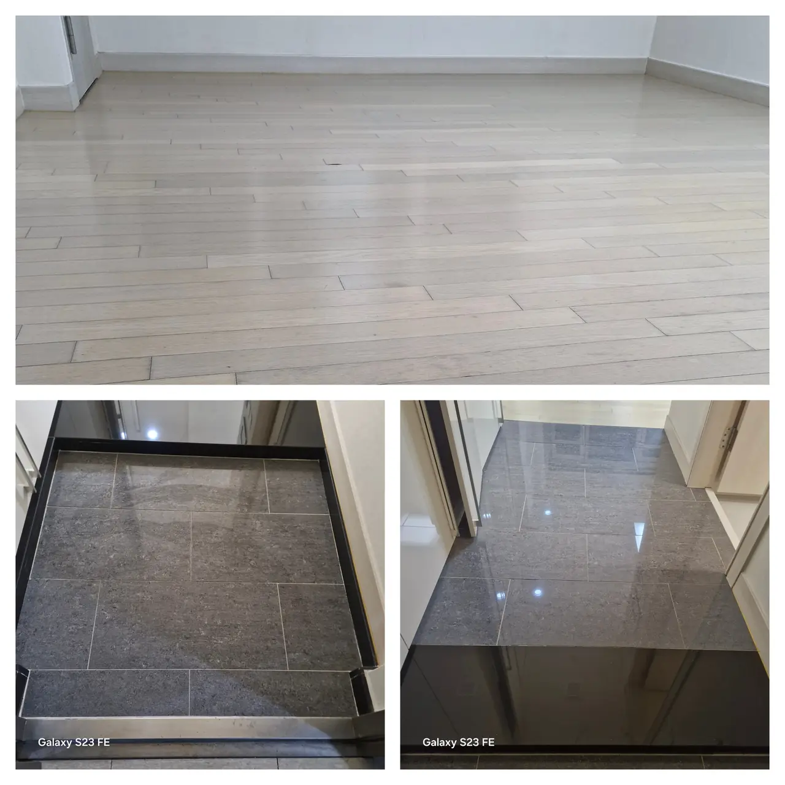

Book a deep clean in Korea and what arrives is not a person with a cloth. It
is a crew who will take your flat to pieces, wash the pieces, and put them
back.

That is the whole difference, and it is the thing that is hard to picture
before you have paid for one. So here it is in photographs: one flat, and
every part of it that came off before anything got cleaned.

## The kitchen: nearly all of it unbolts

*Burner caps, trivets, the hob tray, hood filters, the sink strainer — all removed first · ⓒ @BalliBalliSeoul*

**The range hood filters** are the single most neglected object in a Korean
rental. They are metal mesh, they slide out, and after a year of frying they
hold a film of oil you can scrape with a fingernail. Nobody who lives there
has ever removed them, because nothing in the flat tells you that they come
out.

**The hob comes apart into six or seven pieces.** Burner caps, the rings
under them, the trivets, the drip tray, the control knobs. Degreasing those
in a sink is a different operation from wiping a hob.

**The sink strainer assembly** unscrews into three parts, and the part that
smells is the one underneath.

*The same kitchen with everything refitted · ⓒ @BalliBalliSeoul*

*Parts washed separately, then put back · ⓒ @BalliBalliSeoul*

## The air conditioner: the grille is a lid

*The filter on the right spent a summer in the unit on the left · ⓒ @BalliBalliSeoul*

The front panel of a wall unit unclips, and behind it are filters that slide
straight out. **This is the five-minute job that most tenants never do**, and
the grey mat in that photograph is what you have been breathing.

Two things worth separating, because they are priced differently:

- **Filters and the grille** — part of a deep clean, no extra machinery
- **A full strip-down of the unit** (분해세척, the drum and the heat exchanger
  taken out and washed) — a specialist job, usually booked separately, and
  the subject of [aircon cleaning in Korea](/blog/aircon-cleaning-korea/)

## The bathroom: the drain is three pieces

*The floor drain, in the pieces it is made of · ⓒ @BalliBalliSeoul*

A Korean floor drain is a stack: the grating, a cup trap that holds the water
seal, and a rubber collar below it. **The smell lives in the middle piece**,
and until it is lifted out and washed nothing you pour down the drain will
make a lasting difference.

The bidet seat comes off its bracket too, which is the only way to clean
under it.

*Before, and the same room finished · ⓒ @BalliBalliSeoul*

What a crew cannot fix is the part that is damage rather than dirt — silicone
gone black through its depth, crumbled grout, rust. That line is drawn in
[bathroom deep clean in Seoul](/blog/bathroom-deep-clean-seoul/).

## The fridge: shelves out, every one

*Glass shelves, drawers and door bins, washed out of the cabinet · ⓒ @BalliBalliSeoul*

If the flat came furnished, the fridge is the appliance most likely to hold
somebody else's year. Shelves and drawers lift out and get washed in the
sink; the cabinet gets wiped with the shelves out, which is the only way to
reach the runners and the vents.

## Windows: the tracks and the screens

*The track is where the dirt collects, and where nobody looks · ⓒ @BalliBalliSeoul*

Window tracks and insect screens are the two things that make a flat look
cleaned or not cleaned, and both are usually skipped. The screens lift out of
the frame and get washed flat.

## Under the sink, behind the appliances

*Under the sink before, and the cupboards after · ⓒ @BalliBalliSeoul*

The cupboard under the sink is where a previous tenant's leaks, spills and
pest problems all end up, and it is reachable exactly once: when the flat is
empty, before your things go in. The same goes for the gap behind the washing
machine and the floor under the fridge.

This is the argument for booking the clean **in the empty window** rather
than after you move in, which is the timing problem described in
[move-in cleaning in Seoul](/blog/move-in-cleaning-seoul/).

*Floors last, after everything above them · ⓒ @BalliBalliSeoul*

## What this means for the quote you get

Three practical consequences, if you are deciding what to book.

1. **Ask what comes off.** "Do you remove the hood filters, the aircon
   filters and the floor drain trap?" is a better question than "do you do a
   thorough job?", because the first one has a factual answer.
2. **Disassembly is where the hours go.** A crew of two can wipe a flat in
   two hours. Taking the kitchen apart, washing the parts and refitting them
   is most of a day — which is why a deep clean costs what it costs.
3. **Condition moves the price more than floor area.** Send photographs of
   the hob, the hood and the bathroom drain when you ask for a quote, not
   just the pyeong.

The six Korean cleaning categories, and which one you actually need, are in
[deep cleaning in Korea](/blog/deep-clean-korea-sorting-first/).

## The Korean part

Booking this runs in Korean, and the questions come fast: how big, occupied
or empty, which floor, when, and what condition. The answer that changes the
quote most is the condition, honestly described.

Two phrases worth having, because they are the ones that decide whether the
filters come out:

- **후드 필터도 분리해서 세척해 주시나요?** — do you remove and wash the hood
  filters?
- **배수구 트랩도 분해해 주시나요?** — do you take the drain trap apart?

## Get it sorted

Send us photographs of the kitchen, the bathroom and anything that looks bad.
We will tell you whether it is a partial clean or the full job, what it should
cost, and we will put the two questions above to the crew in Korean before
anyone is booked — so that what arrives is the version that takes things
apart.

Prices are quoted before VAT, and parking is billed at what it costs. The
[cleaning page](/cleaning) has the rest of the price list.
