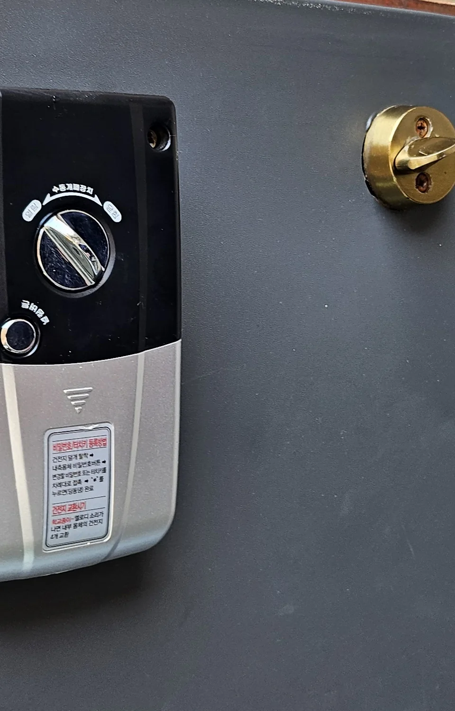
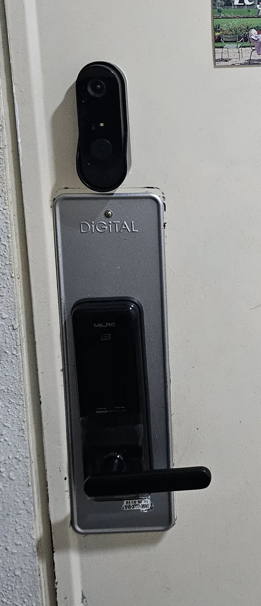

Your keypad still lights up. The buttons still work. And it is
beeping at you — in your hallway, at eleven at night, in a language
you do not read.

The good news is that the most common cause is not a fault at all,
and it stops the moment you do one thing.

## Start here: is the door actually shut?

**The single most common beep in a Korean flat is a burglar
warning, and nothing is broken.**

Korean smart locks watch the door. If it was not pulled fully
closed and then swings open — a draught, a bag knocking it, a
delivery that did not latch it — the lock treats that as someone
having got in. So it makes a noise. That is the whole design.

**Punch in your code and it stops.** Then close the door properly
and check it caught. No batteries, no locksmith, no management
office.

If you live somewhere with heavy fire doors or a strong stairwell
draught, this will happen to you more than once. It is worth
knowing before you spend an evening looking up locksmiths.

## The four things a beep usually means

Once the door is definitely shut and it is *still* beeping, you are
in one of four situations.

### 1. The battery is going

A repeating chirp every time you use the lock, or at intervals on
its own, is the standard low-power warning. It is a warning, not a
failure — the lock is telling you that you have days, not weeks.

**Deal with it now rather than at 2 a.m.** A lock that dies
completely is a different and much worse evening, and we have
written that one up separately:
[what to do when the keypad is dead](/blog/keypad-door-lock-dead-locked-out-seoul/).

Replacing them is a two-minute job:

- **Open the cover on the inside panel** — the unit on the room side
  of the door. It usually slides up, or off towards you
- **Read the sticker before you go shopping.** Korean locks print
  the answer on the inside panel. The one below says
  **건전지 4개 교환** — *replace the four batteries* — right under a
  line about the noise it makes when they are going. Yours may say a
  different number. Take a photo of it and buy accordingly

*The sticker under the turn knob: how to set a code, and — in red — 건전지 교환시기, when to change the batteries · ⓒ @BalliBalliSeoul*

That silver section is the battery cover. The dial above it is the
**수동개폐장치**, the manual turn — it locks and unlocks the door by
hand whatever the electronics are doing, which is worth knowing
about before you need it.

- **Replace every one of them at once**, with the same type. Do not
  mix a fresh battery with an old one, and do not mix brands or
  types — the lock reads the whole set as one supply, and one weak
  cell drags the rest down
- **Convenience stores sell batteries and are open all night.** GS25,
  CU and 7-Eleven all carry AA. They are dearer than a supermarket
  and it does not matter at midnight —
  [how the stores work](/blog/korean-convenience-store-guide/) if
  you have not used one yet
- **Daiso is the cheap option** in daylight hours

### 2. You got the code wrong too many times

Enter a wrong PIN several times in a row and the lock will beep and
then refuse to listen for a while. This is deliberate — it is what
stops someone standing at your door trying combinations.

**Wait it out.** The lockout clears itself after a short period.
Hammering more numbers in resets the clock and gets you nowhere.

### 3. The latch is fighting the frame

If the lock lights up, accepts your code, and then grinds or beeps
instead of opening cleanly, the motor is struggling against the
door rather than failing electrically.

Test it with the door **open**: work the lock and watch the bolt
slide in and out. If it moves freely with the door open but jams
when the door is closed, the bolt is no longer meeting its hole
squarely — the door has dropped on its hinges, or the frame has
moved.

That is a real repair, not a battery. Keep using it in that state
and you will eventually be locked out at the worst moment, because
a motor that has been straining is a motor about to give up.

### 4. Water got in

Korea's summer does this. In a flat where the front door faces an
open corridor, monsoon rain and the humidity that comes with it
reach the outside panel — the same damp that
[shows up behind your skirting boards](/blog/mould-behind-baseboard-korea/)
gets into electronics too. A touch keypad that has taken
on moisture registers presses nobody made, and beeps about them.

**Dry the panel with a soft cloth and give it time.** If it is still
misbehaving once genuinely dry, it needs looking at rather than
waiting.

## Counting the beeps will not get you far

You will find advice telling you that three beeps means one thing
and five means another. **Be careful with it.** Korean locks come
from several manufacturers — Gateman, Samsung, EZON, Milre and
others — and they do not share a code. A pattern that means low
battery on one brand means something else on the next.

**Find the brand name on the lock itself**, on the outside panel or
inside the battery cover, before you trust any beep-counting chart.
That name is what makes a search useful.

*Moulded into the panel rather than printed — easy to miss, and it is the one word worth having · ⓒ @BalliBalliSeoul*

It is usually moulded into the plastic rather than printed, so it is
easy to walk past for years without noticing it is there.

## When to stop and call someone

Some of this is a ten-second fix. Some of it is not, and knowing
which is which saves you money.

**Handle it yourself:** a burglar warning after the door swung open,
a low-battery chirp, a wrong-code lockout, a damp panel that dries
out and behaves.

**Get someone in:** a bolt that binds against the frame, a lock that
beeps and refuses a code you know is right, visible damage to the
panel, or anything that has already left you standing outside once.

**If you are in a flat with a management office, try them first.**
The 관리사무소 in most Korean apartment buildings deals with door
locks constantly and will often send someone up for nothing, or tell
you which shop the building uses. Officetels usually have the same
arrangement at the front desk.

## Renting? Ask before you pay for it

Worth settling early, because it comes up: a digital lock is
normally treated as part of the flat's fittings, while the batteries
in it are treated as something you use up — the way a light bulb is.

That is the usual understanding rather than a rule, and it can be
written differently in your contract. **Ask the landlord or the
management office before you pay a locksmith yourself**, especially
if the lock is failing rather than flat. Getting the answer
afterwards is a much harder conversation. It belongs with the other
things worth
[checking before you sign](/blog/what-to-check-before-renting-seoul/).

## The Korean part

The lock will tell you what is wrong in Korean, or in beeps, and
neither is much help at midnight. The manual is Korean. The brand's
service line is Korean. The locksmith who answers is Korean.

> **Send us a photo of the lock and tell us what noise it is
> making.** Our [locksmith service arranged in English](/locksmith)
> will tell you whether this is a battery, a hinge or a call-out —
> and if it is a call-out, we make it and stay on the line. Message
> us on [WhatsApp](https://wa.me/821075191282) or
> [KakaoTalk](https://pf.kakao.com/_RJxhSX/chat).

## Get it sorted

The one-line version: **if it started beeping after the door came
open, punch in your code and it stops. If it is chirping on its own,
change every battery at once tonight rather than at 2 a.m. If it
takes your code and then grinds, the problem is the door, not the
lock — and that one needs a person.**

<!--
🔴 발행 전 검증 필요 (2026-08-20 초안)

📌 계기: `locksmith` 전환 동선에 발행글이 **1편뿐**인데, 그 1편이 GA 조회수 2위(72회).
   수요는 증명됐고 콘텐츠가 없다 → 가장 큰 불균형

🚦 코퍼스 확인 (README 필수 절차)
   - `keypad` 2건 → 실질 1건 `door-keypad-lock-not-working-an-emergency-guide` **615단어**
   - `battery` 3건 → 같은 글 + 무관 2건
   → **선례가 615단어 한 편뿐. 이긴다**

🎯 **기존 글과의 분리 (중요)**
   `keypad-door-lock-dead-locked-out-seoul`(1,159단어)이 **9V 응급 개방을 이미 전부 다룬다.**
   그 글 본문에 *"불은 들어오는데 삐 소리만 나면 그건 다른 문제이고 9V로는 안 된다"*는
   문장이 있다 → **그 '다른 문제'가 이 글이다.** 9V 트릭은 여기서 반복하지 않고 링크만 건다
   ※ 발행 시 기존 글에서 이 글로 **되걸기 필수** (그 문장 바로 옆이 최적 위치)

🆕 **사용자 제보가 이 글의 리드다**: "덜 닫힌 상태에서 문이 열려버리면 방범 경고음이 울리고,
   비밀번호를 입력하면 해제된다." → 가장 흔하고 가장 오해받는 경우인데 영어권 글에 설명이 없다.
   고장이 아니라는 걸 첫 섹션에서 끝내는 구조로 갔다

🔴 **사용자 제공 자료 중 의도적으로 뺀 것**
   1. **"보조배터리를 비상단자에 대라"** — 비상단자는 9V 접점이고 USB 보조배터리는 5V다.
      근거 없이 쓰면 위험 → **삭제**
   2. **"압축공기로 걸쇠 구멍 먼지를 불어내라"** — 일반론이고 한국 도어락 맥락에서 검증 안 됨 → 삭제
   3. **삐 소리 횟수별 의미표** — 브랜드마다 다르다. 표를 만들지 않고
      **"횟수 세기를 믿지 말고 브랜드부터 찾아라"**로 뒤집었다. 이게 더 정확하고 실용적

✅ **해소: 건전지 개수** — 사용자 제공 사진의 내부 패널 스티커에
   **`건전지 교환시기 … 소리가 나면 … 건전지 4개 교환`**이 인쇄돼 있다.
   → "대부분 AA 여러 개"라는 뭉뚱그린 서술을 버리고 **"락이 스스로 스티커에 답을 써 뒀다"**로 전환.
   ⚠️ 이 4개는 **이 밀레 모델 기준**이다. 일반화하지 않고 "당신 것은 다를 수 있으니 찍어서 사라"로 처리
✅ **해소: 브랜드 표기 위치** — MILRE가 **플라스틱에 음각**돼 있다(인쇄 아님).
   본문에 "몇 년을 지나쳐도 못 볼 수 있다"로 반영. 사진이 근거

🔴 확인 필요
   1. **브랜드 목록**(게이트맨·삼성·이지온·밀레) — 주요 제조사가 맞는지 재확인
   3. ⚖️ **임대차 부담 주체** — "통상적 이해이지 규칙이 아니다 / 계약서에 따라 다르다 /
      집주인·관리사무소에 먼저 물어라"로 **단정하지 않았다.** 법적 단정 금지 기조 유지
   4. 관리사무소가 도어락을 무상 처리하는지는 건물마다 다름 → "often"으로 완화

📷 **사진 3장 확보 (2026-08-20, 사용자 촬영)** — 커버 + 인라인 2
   - `door-lock-panel-cover.webp` — 바깥 패널 + 인터폰 (커버)
   - `door-lock-inside-panel-battery-label.webp` — 내부 패널: 수동개폐장치 + 건전지 커버 스티커
   - `door-lock-outside-panel-brand-name.webp` — MILRE 음각 클로즈업
   ⬜ **아직 없는 컷: 건전지 칸을 연 상태.** 있으면 "4개"를 눈으로 확인시킬 수 있다 (필수는 아님)

   🔧 **회전 사고 (6번째) — 이번엔 콘택트시트로 먼저 잡았다**
   내부 패널 사진은 `exif_transpose`만으로는 패널의 한글이 옆으로 눕는다.
   4방향 2×2 콘택트시트를 만들어 **추가 90도가 정위치**임을 확인했다.
   중력(바닥 위치)만 보면 0도가 맞아 보이는데, **문이 경첩에서 분리돼 눕혀진 상태**라
   문 전체를 기준으로 삼으면 틀린다 → **패널만 타이트하게 크롭**해 해결
   📌 교훈: 회전 판단 기준을 '장면 전체'가 아니라 **'읽어야 할 글자'**에 둘 것

   ⛔ **영상은 쓰지 않는다 (2026-08-20 판단)**
   `KakaoTalk_Video_2026-08-20-16-44-42.mp4` (3.3초):
   ① **아동의 손·머리가 주피사체** — 공통 금지 규정 위반
   ② 파형 확인 결과 **삐 소리 패턴이 아니라 조작·생활음**이라 근거로 못 씀
   ③ Astro 마크다운은 mp4를 처리하지 않고, 가치가 '소리'인데 대부분 음소거로 본다

🕸️ 클러스터: 🔧 집 고장. 되걸 곳:
   `keypad-door-lock-dead-locked-out-seoul`(필수·상호) · `what-to-check-before-renting-seoul` ·
   `korean-convenience-store-guide`
   현재 아웃바운드: 위 3편 + `korea-summer-electricity-bill`(장마 문맥) + `/locksmith`

✅ **링크 오류 1건 잡음** — 초안에서 '장마'를 `korea-summer-electricity-bill`로 걸었으나
   그 글에 monsoon·humidity 언급이 **0건**이었다. `mould-behind-baseboard-korea`로 교체
   (습기가 주제이고 `cleaning` 동선이라 서비스 연결도 자연스럽다)
   📌 교훈: **문맥으로 링크를 걸었으면 대상 글에 그 문맥이 실제로 있는지 확인할 것.**
   제목만 보고 걸면 틀린다

📊 키워드 (사용자 제공, 2026-08-20)
| 키워드 | 월 검색량 | 경쟁 | CPC(하~상) |
|---|---|---|---|
| `door lock` | 100~1천 | **높음** | ₩154~754 |
| `smart door lock` | 100~1천 | **높음** | ₩101~1,154 |
| `digital door lock` | 10~100 | **높음** | ₩150~1,857 |

🎯 **머리 키워드를 쫓지 않기로 판단.** 경쟁 '높음' + CPC 낮음 = **제품 구매 의도**다
   (도어락을 *사려는* 사람, 제조사·쇼핑몰이 입찰 중). 우리 글은 고장 진단이라 의도가 안 맞고,
   0순위 규칙 "제목이 약속한 건 본문이 지킨다"에 어긋난다
   → 제목은 `door lock`을 포함하되 **`door lock beeping` 문제 의도 롱테일**을 잡는다
   **근거는 검색량이 아니라 GA다**: 기존 `keypad door lock dead`도 롱테일인데 조회수 2위(72회).
   롱테일 문제 검색이 우리에게 실제로 통한다는 게 이미 증명됨
   ※ `smart lock` 변형어는 본문 1회 자연 편입
-->
