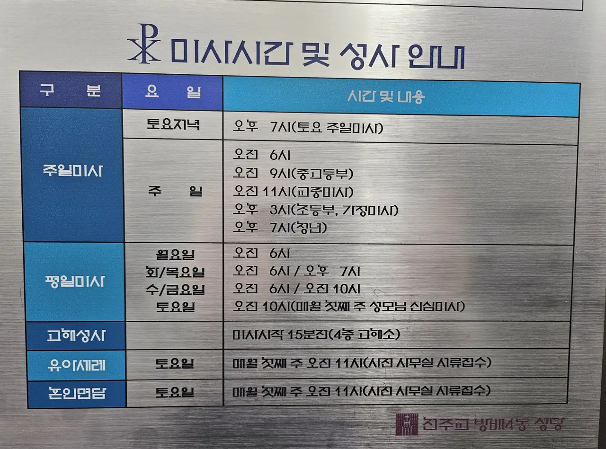

Roughly one in ten Koreans is Catholic, and **every neighbourhood
here has a parish church (성당)**, so on any Sunday you are probably
within walking distance of a Mass. The question isn't whether
there's a church. It's whether you'll understand a word of it.

Seoul answers that better than most Asian capitals. The Catholic
Church here publishes a
[foreign-language Mass schedule](https://aos.catholic.or.kr/en/encon77)
covering **eleven languages** — and five of those Masses are in
English, every Sunday.

Someone put the question plainly [on r/seoul](https://www.reddit.com/r/seoul/comments/1lpqw6v/english_or_spanish_catholic_church/) last year:

> *"I'm currently in Seoul and looking for a Catholic church that
> offers Mass in English or Spanish. I'd love to attend regularly
> while I'm here, so if you have any recommendations for welcoming
> churches you've been to, please let me know!"*

It got **two replies.** Not because nobody knows — the schedule is
published, in English, by the church itself — but because it sits on
a page almost nobody finds. So here it is, in full. Including
Spanish.

## English Mass in Seoul

| Time | Church | Phone |
| ---- | ------ | ----- |
| **Sun. 9:00 AM** | Myeongdong Catholic Church (Myeongdong Cathedral) | 02-774-1784 |
| **Sun. 9:00 AM** | Catholic International Parish, Hannam-dong | 02-793-2070 |
| **Sun. 11:00 AM** | Catholic International Parish, Hannam-dong | 02-793-2070 |
| **Sun. 4:00 PM** | Yeoksam-dong Catholic Church | 02-553-0801 |
| **Sun. 7:00 PM** | St. Ignatian Church, Sogang University | 02-705-8161 |

*Source: the Catholic Church in Korea's
[foreign-language Mass schedule](https://aos.catholic.or.kr/en/encon77),
retrieved 10 August 2026.*

A quick orientation, because the five are genuinely different
experiences:

- **Myeongdong Cathedral** is the mother church of Korean
  Catholicism — a gothic brick landmark in the middle of the city's
  busiest shopping district, and a national historic site in its own
  right. The 9 a.m. English Mass sits inside a building that has
  been at the centre of Korean history for well over a century.
- **The Catholic International Parish in Hannam-dong** is exactly
  what the name says: a parish built for foreign residents. It's
  also the one with **two English Masses** — 9 a.m. and 11 a.m. —
  and the hub for four other European languages on the same day.
- **Yeoksam-dong** is the Gangnam option, and the only afternoon
  slot before evening: **4 p.m.**
- **Sogang University** is Jesuit, so the Sunday **7 p.m.** slot
  skews student and young professional. It's also the answer if
  your Sunday morning is already spoken for.

## The catch, and it's the whole reason for this article

The schedule carries its own warning, printed right next to the
table:

> **"Please confirm the Mass Time by phone."**

They're right to. Mass times shift with the liturgical calendar,
with holidays, with a priest's reassignment, with building work. A
schedule published online can be months behind the noticeboard at
the door.

Which leaves you with a phone number and **a phone call that will
be answered in Korean.**

> ### We'll make that call for you
>
> Tell us which Mass you're aiming for and we'll ring the parish
> office, confirm this week's time in Korean, and send you back the
> answer in English — including whether it's on at all this Sunday.
>
> **[Message us on WhatsApp](https://wa.me/821075191282).** This one
> is free, and there's nothing to buy. We do it because "a phone
> call in Korean" is the exact wall this whole site exists to
> remove.

## Ten more languages

This is the part that surprised us when we pulled the schedule
together — and it's where that Reddit question gets its second
answer: **Spanish Mass runs three times a month in Seoul**, once
weekly in Hannam-dong and twice more for the Latin American
community. Seoul doesn't just accommodate English — it runs a
quietly enormous multilingual ministry, much of it built around
**migrant worker communities** rather than tourists.

| Language | When | Where |
| -------- | ---- | ----- |
| **German** | Sun. 10:00 AM | Catholic International Parish, Hannam-dong |
| **Italian** | Sun. 11:15 AM | Catholic International Parish, Hannam-dong |
| **Spanish** | Sun. 1:30 PM | Catholic International Parish, Hannam-dong |
| **French** | Sat. 6:00 PM | Catholic International Parish, Hannam-dong |
| **Spanish** (Latin American) | 2nd & 4th Sun. 11:00 AM | Pastoral Center for Labor, Bomun-dong |
| **Spanish** (Latin American) | 1st & 3rd Sun. 3:00 PM | Consolata Missionaries, Yeokgok 2-dong |
| **Vietnamese** | Sun. 12:00 PM | Vietnam Mission Station, Bomun-dong |
| **Tagalog** | Sun. 9:00 AM | Sungdong Social Welfare Center, Majang-dong |
| **Tagalog** | Sun. 1:00 PM | Doksan 1-dong Catholic Church |
| **Tagalog** | Sun. 1:30 PM | Hyehwa-dong Catholic Church |
| **Tagalog** | 1st Wed. 8:00 PM | Philippine Center, Seongbuk-dong |
| **Thai** | 2nd Sun. 4:00 PM | Pastoral Center for Labor, Bomun-dong |
| **Indonesian** | 2nd & 4th Sun. 1:30 PM | Pastoral Center for Labor, Bomun-dong |
| **Mongolian** | 3rd Sun. 11:00 AM | Pastoral Center for Labor, Bomun-dong |
| **Chinese** | 1st Sun. 11:00 AM | Pastoral Center for Labor, Bomun-dong |

*Venues confirmed against the
[original table](https://aos.catholic.or.kr/en/encon77), which merges
these rows under a shared venue: **Hannam-dong** hosts German,
Italian, Spanish and French; **the Pastoral Center for Labor in
Bomun-dong** hosts Thai, Indonesian, Mongolian and Chinese.*

Two things stand out in that table.

**Hyehwa-dong on a Sunday afternoon** is a phenomenon. The Tagalog
Mass there anchors a Filipino community gathering that spills into
the streets around Hyehwa Station — a street market, food stalls
and a weekly meeting point for Filipino workers from across the
capital region. If you want to see the multicultural Seoul that
guidebooks skip, that's the address.

**Several of these run monthly, not weekly.** Thai on the second
Sunday, Chinese on the first, Mongolian on the third. Turn up on
the wrong Sunday and there is no Mass — which makes confirming by
phone less optional than it looks.

## What to expect inside a Korean parish

If you've only ever been to Mass at home, a few things differ:

- **Arrive a little early.** Popular Masses fill, and Korean
  congregations tend to be seated and quiet well before the start.
- **The structure is identical.** It's the Roman rite; you'll be
  able to follow even a Korean-language Mass by shape alone. Many
  parishes hand out a booklet at the door.
- **Dress is neat but not formal.** No one will mind what you wear;
  most people arrive somewhere between smart-casual and Sunday best.
- **The offering** is a basket passed during the Mass — cash, and no
  one is counting.
- **Coffee afterwards is a real thing**, especially at the
  English-language and international parishes, and it's usually the
  fastest way into a community if you've just arrived in the
  country.

Confession in English is available at some of these parishes but
not on a fixed public schedule — again, a phone call.

## Finding any parish, anywhere in Korea

Outside Seoul, or just want the nearest church rather than an
English one? Search **성당** in Naver Map or KakaoMap and you'll get
every Catholic parish around you with its Mass timetable posted;
Protestant churches are **교회**, which is worth knowing because the
two words are not interchangeable and a Korean speaker will send you
somewhere quite different depending on which you use.

*The board by the door at 방배4동 성당 in Seocho-gu — the nearest parish
to Seorae Village. Almost every church posts one like it · ⓒ
@BalliBalliSeoul*

These boards all use the same handful of words, so once you can read
one of them you can read any of them:

| Korean | What it means |
| --- | --- |
| **주일미사** | Sunday Mass |
| **토요저녁** | Saturday evening vigil — counts as your Sunday Mass |
| **평일미사** | Weekday Mass |
| **교중미사** | The principal Sunday Mass, the busiest one |
| **고해성사** | Confession — on this board, 15 minutes before each Mass |
| **오전 / 오후** | a.m. / p.m., followed by the hour and 시 |

Read that one board and you can see the shape of a Korean parish
week: a vigil on Saturday evening, five Masses on Sunday split by
age group, and an early weekday Mass at 6 a.m. for people on their
way to work. Treat the photo as an example rather than a schedule —
parishes shuffle times seasonally and put the new sheet up without
announcing it anywhere online, which is exactly why the advice
below is to ring first.

Mass in Korean is still Mass. If you're new here and want the
community more than the language, your neighbourhood parish is
usually the shorter walk — and they will be genuinely pleased you
came.

Getting to any of the churches above is the easy part: all five sit
close to a subway station, and our
[guide to getting around Seoul](/blog/seoul-transportation-guide/)
covers the card, the transfers and the last train home.

## The Korean part

Every practical detail in this article ends at the same place: a
parish office, a landline, and a conversation in Korean. Confirming
a time, asking whether English confession is available, checking
whether the monthly Mass is on this weekend, asking if there's a
Korean-language class or a newcomers' group attached to the
parish — free Korean lessons at a church are
[one of the routes worth knowing about](/blog/learn-korean-seoul-free-classes/),
trade-off and all — all of it is a five-minute call for a local and a closed
door for you.

That's the errand our
[anything-else concierge service](/etc) exists for, and for
something like this we'll just do it.

## Get it sorted

> **Want this Sunday's time confirmed?** Message us on
> [WhatsApp](https://wa.me/821075191282) with the church you're
> thinking of. We'll call, ask in Korean, and reply in English.
> Free, no catch.

The one-line version: **five English Masses every Sunday — 9 a.m.
at Myeongdong, 9 and 11 a.m. in Hannam-dong, 4 p.m. in Yeoksam-dong,
7 p.m. at Sogang — plus ten other languages, several of them
monthly.**
Ring ahead; the schedule itself says to.
