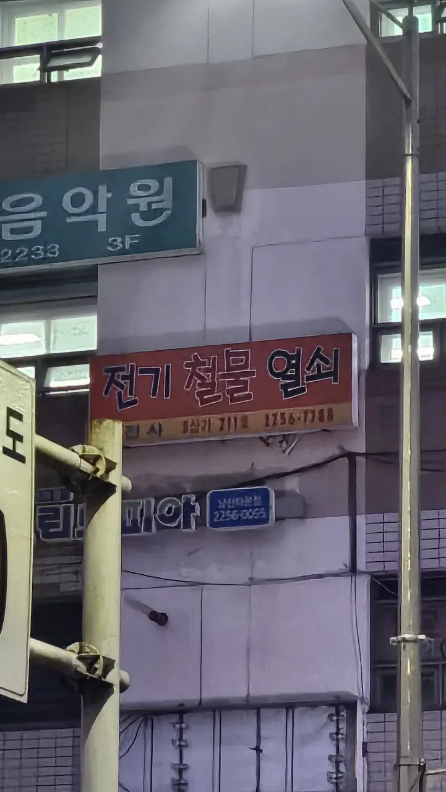
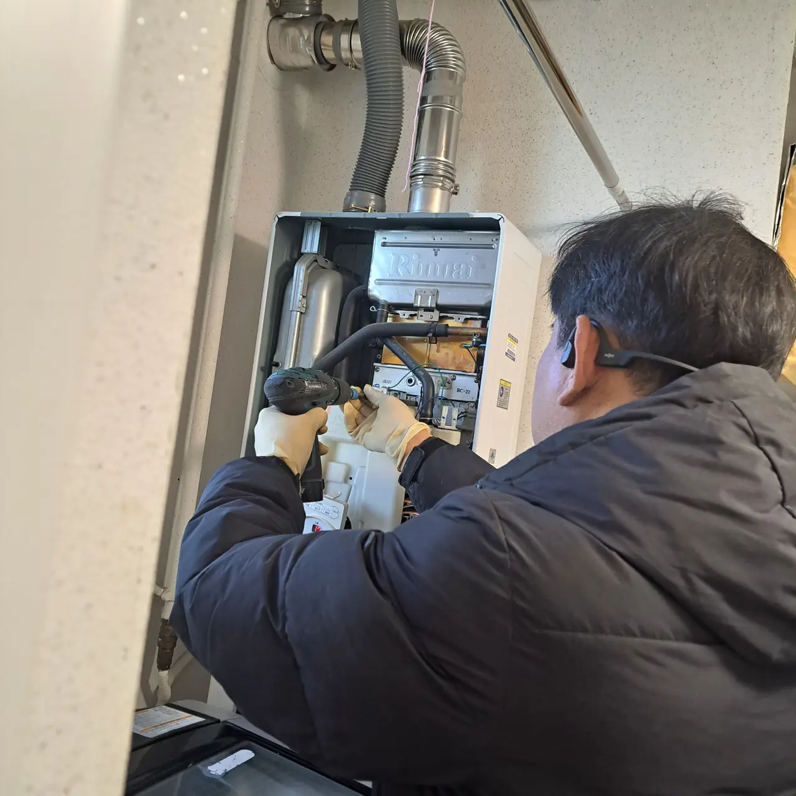
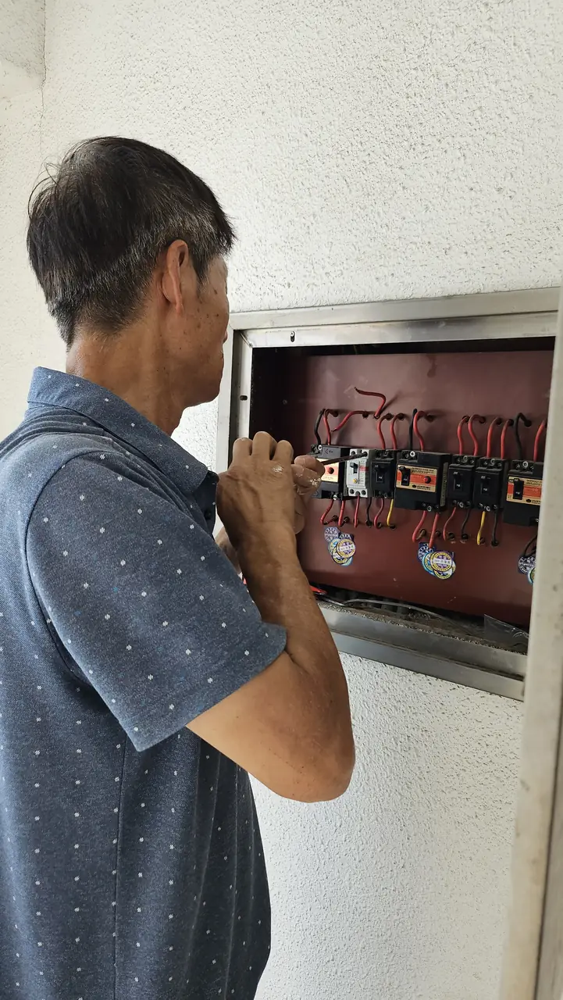
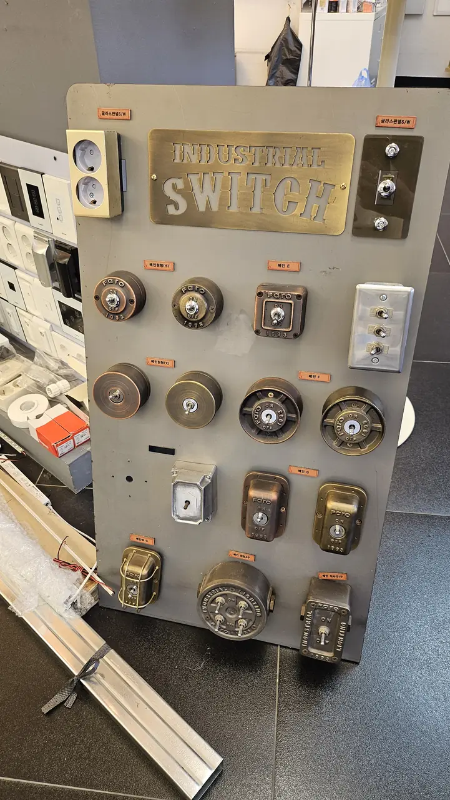
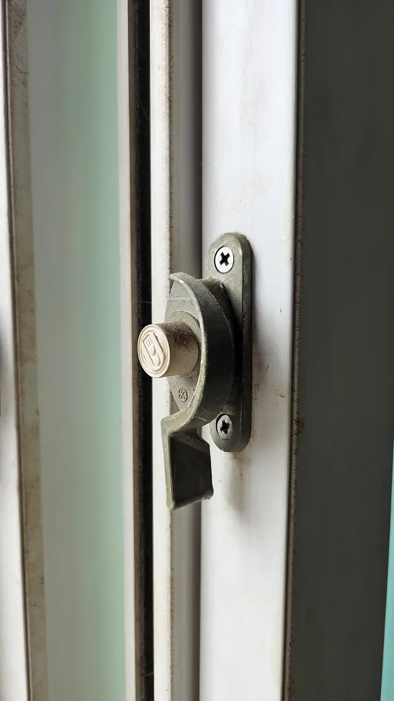
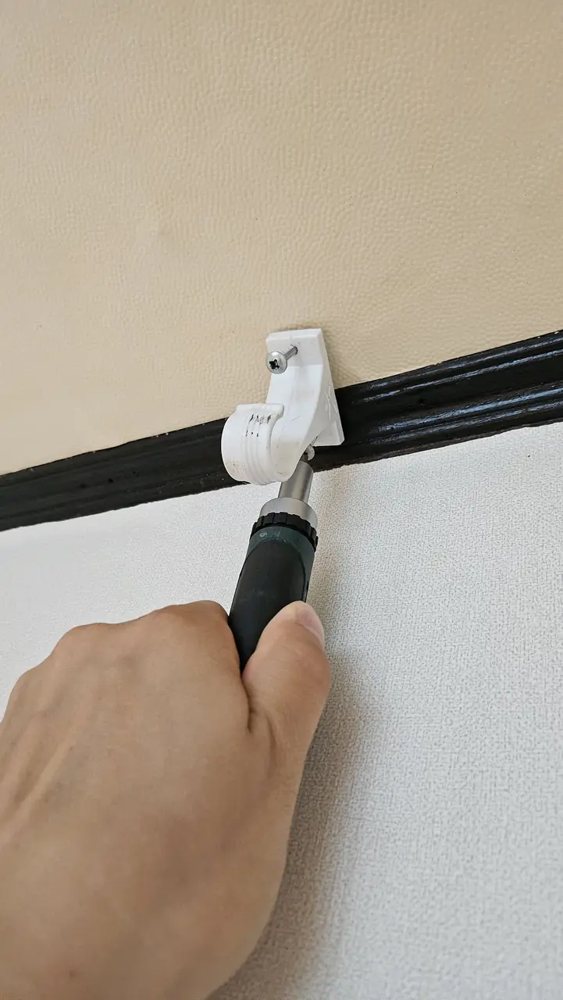

Something in the flat stops working and you look for the person who fixes
things. In most countries that person exists: one number, a van, a bag of
tools, and whatever it is gets done.

**Korea does not really have that job.** The work is split into specialisms
that do not overlap, each with its own shops, its own pricing and its own
search term in Korean. Ask for a handyman and you will get either silence or
somebody who only does one of the four things on your list.

This is a map of which trade owns which problem, what the building office
will do for nothing, and what you can hand to a shop on your own street.

*Read the signs and you can see the trades divide · ⓒ @BalliBalliSeoul*

## Why "one guy for everything" does not exist here

A Korean building leans on a different structure. The apartment complex has a
management office. Plumbing sits with 설비 (seolbi) firms. Electrical work is
a licensed trade with its own registration. Wallpaper and flooring are
another trade again, and they are the ones people call for what an English
speaker would think of as small repairs.

Three consequences you feel immediately:

1. **You need the right word, not a general one.** Searching the Korean for
   "handyman" is how people end up with nobody.
2. **The small job has a floor price.** A specialist coming out for twenty
   minutes still charges a call-out, which is why bundling jobs matters.
3. **Some of it is free and you are paying for it anyway.** The building
   office does a surprising amount, and almost nobody tells new arrivals.

*A boiler is its own trade — usually the brand's own engineer, not a general repairman · ⓒ @BalliBalliSeoul*

## Who owns which problem

| What is wrong | Who it belongs to |
|---|---|
| Blocked toilet, blocked drain, smell from the drain | Plumbing — [we arrange it in English](/plumbing) |
| No hot water, boiler showing an error code | Boiler service, often the brand's own engineer |
| Locked out, keypad dead, code change, lock replacement | [Locksmith](/locksmith) |
| Mould, grease, the flat needs a deep clean | [Cleaning](/cleaning) |
| Moving a wardrobe, a small load, disposal of furniture | [Moving](/moving) |
| Wallpaper torn or lifting, flooring damaged | 도배·장판 (dobae/jangpan) — the interiors trade |
| A shelf, a curtain rail, flat-pack furniture | A local handyman-for-hire, or the hardware shop |
| Window screen torn, silicone gone black | Small specialist shops, often same-day |
| **Anything electrical — sockets, circuits, the breaker** | **A registered electrical contractor. Not us, and not a handyman** |

*Behind this door is where a handyman stops and a licensed trade begins · ⓒ @BalliBalliSeoul*

That last row is a real line rather than caution for its own sake. Electrical
work in Korea is a licensed trade, and taking the job at all requires
registration we do not have. If a person offers to rewire a socket as a
favour, that tells you something about the rest of their work.

## What the building office does for free

If your building has a **관리사무소 (gwalli samuso)**, start there. It is
staffed, it is on site, and the work it does costs you nothing beyond the
management fee already on your bill.

What they will often handle:

- Common-area problems — the corridor, the lift, the entrance keypad, the
  parcel room
- The water supply: a shutdown, low pressure across the building, a burst in
  a shared riser
- Heating that is out for the whole line rather than only your flat
- A blown corridor light, a sticking front gate
- Telling you whether the thing you are looking at is the landlord's bill or
  yours — they have seen it a hundred times in that building

What they will not do: anything inside your flat that belongs to you or your
landlord. They also do not, as a rule, speak English.

**The useful move is to ask the office first even when you are fairly sure
the answer is no.** Thirty seconds either gets the job done free or tells you
which trade to call, and it costs nothing to ask.

## Your street has a hardware shop, and it is better than it looks

The **철물점 (cheolmuljeom)**, the neighbourhood hardware shop, is the closest
thing Korea has to the handyman you were looking for.

Look at the sign on the cover of this page: **전기 (electrical) · 철물 (hardware) · 열쇠 (keys)**, and
underneath, 도장 and 고무인 — name stamps and rubber stamps — plus car keys. One shop, five
unrelated things, and still not the trade that fixes your leaking pipe. That is the division
in a single photograph.

They sell the part, they know which one fits a Korean fitting, and a lot of
them will either do the small job themselves or tell you exactly who does.
Silicone, a tap washer, a door closer, a screen panel, a curtain rail — this
is the shop.

*The parts wall. Point at what you need and the language problem mostly goes away · ⓒ @BalliBalliSeoul*

Two things that make it work without much Korean:

- **Take the broken thing with you, or a photo of it.** Pointing solves the
  vocabulary problem entirely, and it is what Korean customers do too.
- **Ask the price before they start.** Not because anyone is dishonest, but
  because "while I'm here" grows a job, and the number is easier to discuss
  before the work than after.

*A latch like this is a part, not a call-out — the shop has it in a drawer · ⓒ @BalliBalliSeoul*

## Bundle the small jobs

Because a call-out has a floor price, one visit doing five small things is
far better value than five visits doing one. Keep a list on your phone as
things annoy you — the wobbling shelf, the door that will not close, the
silicone in the bathroom — and let it build to a visit's worth.

*Twenty minutes of work, and the reason to save it for a visit that is doing four other things · ⓒ @BalliBalliSeoul*

The exception is anything that gets worse while it waits: water, mould, a
lock. Those are not list items.

## Who pays, you or the landlord

The line most leases in Korea follow, though the contract wins if it says
otherwise:

- **Wear, age and the building itself** — the landlord. Ageing pipework, a
  boiler that has reached the end of its life, damp coming in from outside.
- **What you used or broke** — you. A blockage from what went down the drain,
  a lock you lost the key to.
- **Consumables** — you. Filters, batteries, bulbs.

Two practical notes. **Ask before you fix**, in writing, for anything that
looks structural: paying for it yourself first and asking later is how people
lose the argument. And **photograph the flat when you move in** — the
[move-in photo routine](/blog/photograph-your-flat-move-in-day/) exists
precisely so that this conversation is about evidence rather than memory.

## The Korean part

Every route above ends at a phone call in Korean, which is the actual reason
foreigners end up paying more or living with the problem.

Four places it breaks:

1. **Naming the trade.** The first question is "what kind of work?", and the
   answer decides who turns up.
2. **The building office.** In person, at a desk, with no English.
3. **Describing the symptom.** "It makes a noise sometimes" does not book a
   visit. A photo and a specific sentence does.
4. **Agreeing a price before anyone starts.** The single sentence most worth
   having in Korean, and the hardest to say.

## Get it sorted

Send us the problem — a photo and a line about what is happening. We will
tell you which trade it is, whether the building office should be doing it
for free, and what it ought to cost, in English. If it is one of the things
we arrange, we book it and stay in the chat until it is done.

If it is electrical, or something else outside what we take on, we will say
so and point you to the people who are registered for it.
