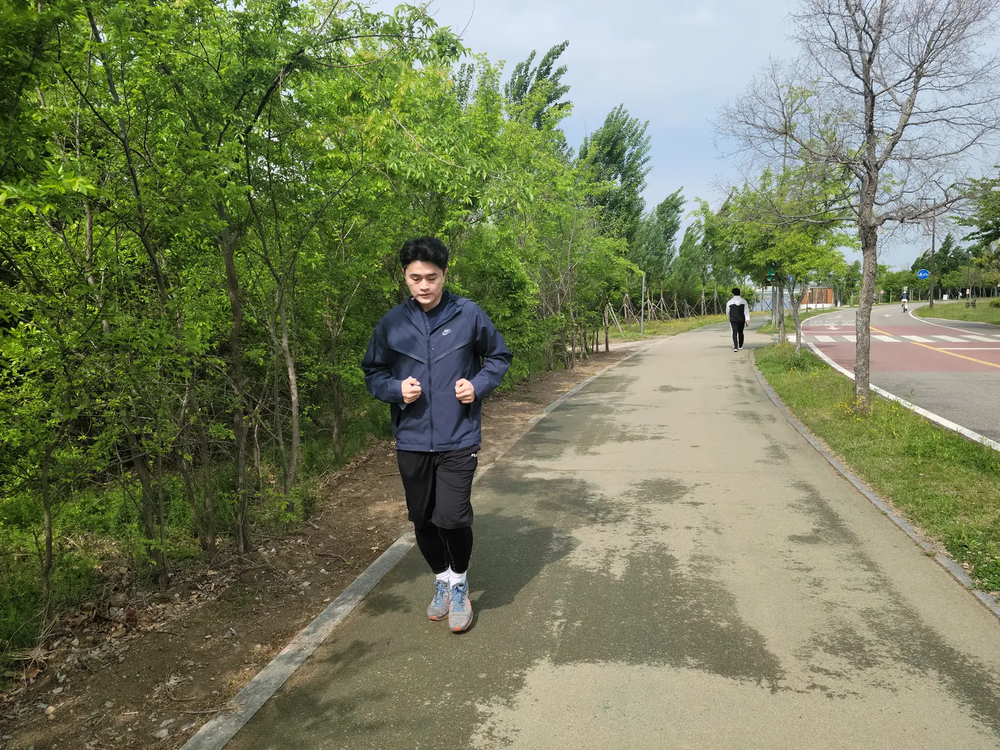
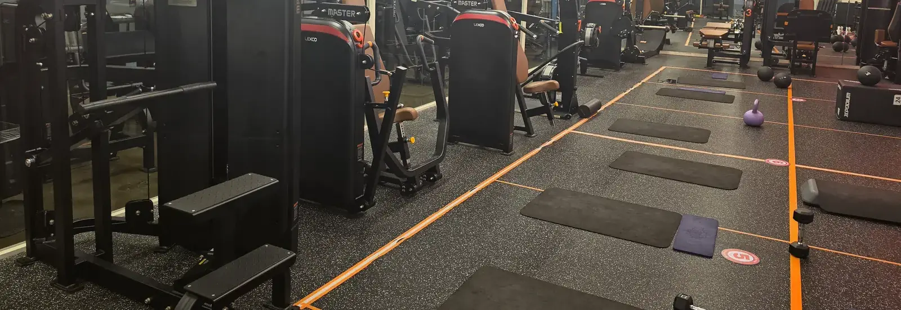
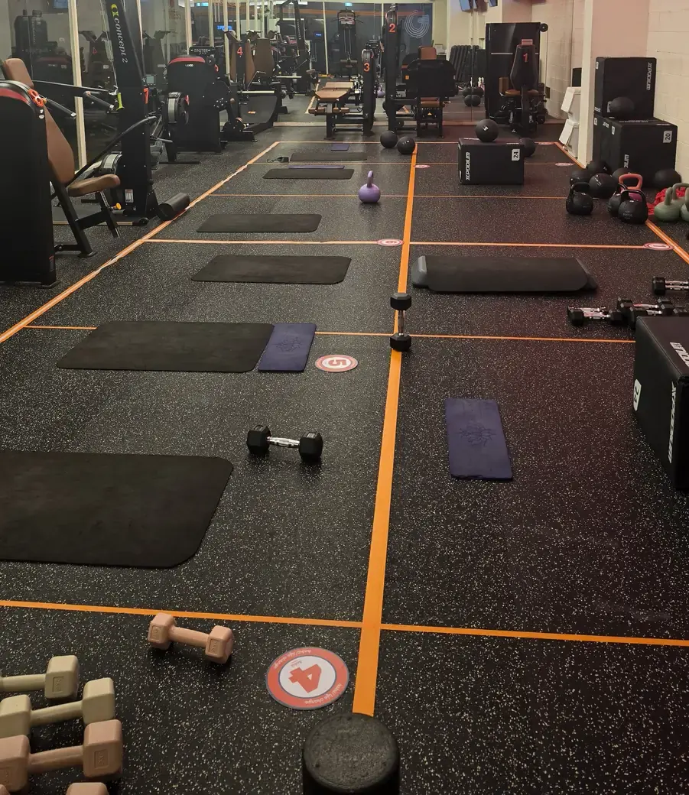

Staying fit in Seoul is cheap and easy — arguably easier than back home —
but the system is organized differently: the best facilities are public,
the gyms have contract quirks worth knowing, and the swimming pools have
one rule nobody warns you about. Here's the whole landscape, from free to
fancy.

## The Han River: Seoul's free gym

The **Han River parks** — eleven of them lining both banks — are the
city's default fitness infrastructure. Running and cycling paths run
unbroken for dozens of kilometers, free outdoor gym equipment clusters
appear every few hundred meters, and basketball courts, soccer pitches
and even fishing decks fill the space between. In summer, several parks
open **outdoor public pools** for a few thousand won.

One detail that makes the running better than it sounds: on most
stretches **the running path, the bike lane and the road are three
separate surfaces.** You are not dodging cyclists, and cyclists are
not dodging you.

*Running path, bike lane, road — kept apart · ⓒ @BalliBalliSeoul*

Two upgrades make it even better. **Ttareungyi (따릉이)**, Seoul's public
bike share, costs about ₩1,000 an hour through an app with English
support — the river path to a distant park and back is the classic
weekend ride. And the parks are where Korea's running-crew culture lives;
joining a crew (many are English-friendly) is a legitimate way to make
friends here.

## District sports centers: the best deal in the city

Every district runs public **sports complexes** (구민체육센터, plus
larger ones like the Banpo sports complex) — and they're the best
price-to-quality ratio in Korean fitness: pools, gyms, indoor courts and
running tracks at civil-servant prices. A swim session runs a few
thousand won; the in-house gym costs a fraction of a private one.

The famous catch is **swim lesson registration**: monthly sign-ups for
popular classes open online at a set hour and vanish like concert
tickets, on Korean-only district websites. **Free swim (자유수영)**
sessions — lane swimming without a lesson — are the low-drama
alternative, just check the timetable.

And the one rule that catches every foreigner: **swim caps are mandatory
in Korean pools.** No cap, no water, no exceptions — buy one at Daiso
before your first visit. Lane etiquette is orderly (circle swimming,
faster lanes toward the middle), and a pre-swim shower is expected.

## Private gyms: read before you prepay

Neighborhood gyms (헬스장) start around **₩50,000–100,000 a month**,
with 24-hour budget chains at the low end. At the other end, a
premium gym running coached group sessions can be **₩300,000 a
month**. Personal training (PT) is a big industry — sold in packages
of sessions at ₩50,000–80,000 each — and the sales pitch will find
you within minutes of your first visit. *(Figures as of August
2026.)*

**The cheap headline price usually has a condition attached.** That
₩60,000 a month on the window is often the rate for signing up for
**six months or a year, paid up front**. The one-month price is
higher, sometimes much higher, and it is the one you want as a
newcomer.

That matters because long prepaid contracts are where consumer
complaints concentrate. Gyms close, refund terms hide in Korean fine
print, and mid-contract refunds are famously painful. The
self-defense is simple — **start monthly, even if it costs more**,
and only commit long once you have been going for a while. If you do
sign a package, the refund clause is the paragraph worth translating
properly (that is a two-minute job for us).

One thing you do **not** need to budget for: **the locker you use
while you train is free.** Somewhere to put your clothes for the
duration of a session comes with the membership, and nobody will
charge you for it.

What costs extra is a **locker you keep** — a rented one where you
leave your gym shoes and kit between visits, so you can turn up
empty-handed. That runs roughly **₩10,000–30,000 a month** and is
entirely optional. Worth it only if you go often enough to resent
carrying shoes across town.

*Machines down one side, marked-out training floor down the other · ⓒ @BalliBalliSeoul*

English-speaking gyms and trainers cluster in Itaewon and Gangnam, and
the boutique scene — CrossFit boxes, climbing gyms (Korea is in a full
climbing boom), yoga and pilates studios — is everywhere, at prices
above the neighborhood gym and below what you'd guess.

## A note on gym culture

Small differences that add up.

**Workout clothes and towels are often provided.** Plenty of Korean
gyms hand you a shirt and shorts to change into and a towel on the
way out — it is worth asking, because it means you can walk in with
nothing but shoes and it saves your laundry. Locker rooms carry
everything from body scales to seated hair dryers, and stretching
zones get used seriously.

**Numbers on the floor are not decoration.** If you see numbered
circles stuck to the mats and matching numbers on the machines,
you are looking at a gym that runs **rotation classes** — a coach
sends the group from station to station, and the assignment changes
every session. If you are there on your own membership, check
whether a zone is booked for a class before you settle into it.

*Numbered spots on the floor mean a class rotates through them · ⓒ @BalliBalliSeoul*

Machines skew cardio-heavy at budget gyms; serious free-weight
floors are a mid-tier-and-up feature, so check the squat rack
situation on the tour if that is your thing. Deodorant culture is
lighter here; nobody will say anything, but you will notice.

## The rest of the menu

- **Hiking** — the actual national sport. Bukhansan is a real mountain
  inside city limits, free, with subway access to the trailheads.
- **Public courts** — tennis, futsal and basketball at river parks and
  sports complexes book through Seoul's public reservation system —
  cheap, popular, and Korean-only.
- **Winter**: the district centers keep everything indoors, and ice
  rinks pop up (including the famous cheap one at City Hall plaza).

## The Korean part

The pattern by now is familiar: the facilities are excellent and the
gateways are in Korean — lesson registration race pages, court booking
systems, gym contracts with buried refund clauses, even the sports
center's phone line. Through our
[anything-else concierge service](/etc) we register you for the swim
class before it sells out, book the courts, translate the gym contract
*before* you sign, and find the English-friendly trainer near you.
(Getting to any of it is the easy part — our
[transportation guide](/blog/seoul-transportation-guide/) covers that.)

## Get it sorted

> **Want in — pool class, court time, or a gym that won't burn you?**
> Message us on [WhatsApp](https://wa.me/821075191282) with what you're
> after and your neighborhood — we'll find it, register you, and check
> the fine print in Korean. Asking costs nothing — you pay only for the work you book.

Cheapest possible start, tonight: a swim cap from Daiso, a free-swim
timetable, and a run on the river path. Total cost, about ₩3,000 — and
you'll understand immediately why Seoul people are outside at 10 PM.
