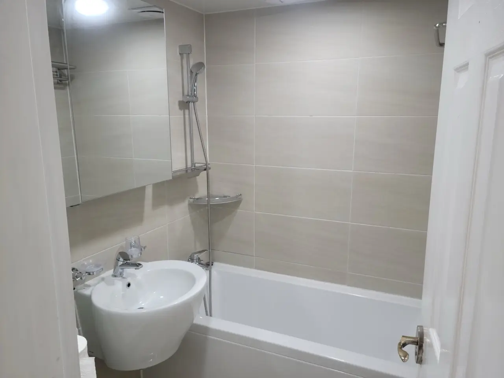

That drip from the bathroom faucet isn't just annoying at 2 a.m. — in
a country where every drop runs through a water meter you pay for,
it's a slow leak in your wallet too. The good news: in most Korean
apartments this is a **₩10,000 part and twenty minutes**, not a
plumber visit. Here's the repair, and — just as important in a rental
— whose money actually fixes it.

## Try this first

### Know your faucet (it's probably the standard one)

Nearly every Korean apartment kitchen and bathroom runs the same
fixture: a **single-lever mixer faucet** (원홀 수전) — one handle,
lift for water, swing for temperature. Inside it sits a **ceramic
cartridge** (카트리지), and a worn cartridge is behind most drips
from the spout and most handles that weep around the base. That
cartridge is a standardized ~40mm part sold everywhere.

*One basin faucet, one tub faucet — both the same design · ⓒ @BalliBalliSeoul*

Most Korean bathrooms give you two of them: one on the basin, one
feeding the tub and shower. Same mechanism, same cartridge logic,
same fix — so whichever one is dripping, read on.

### Shut the water first

Under the sink (or behind the toilet, for the bathroom basin) there's
a small chrome **angle valve** (앙카밸브) on each supply hose — turn
both clockwise until snug. No angle valve, or it's corroded stiff?
Use the apartment's **main shutoff** near the water meter (yours is
in the hallway meter box in most buildings; the building office —
관리사무소 — can point to it). One real warning: **don't muscle a
crusty old angle valve.** They snap, and a snapped valve turns a drip
into a flood. Stiff valve = stop here and get help.

### Swap the cartridge

1. Pry the small red/blue cap off the handle, undo the screw under
   it, and lift the handle off.
2. Unscrew the chrome dome, pull the old cartridge, and note how it
   sits.
3. Push the new one in the same orientation, reassemble, reopen the
   valves slowly.

Buy the part at any neighborhood **hardware store** (철물점 — bring
the old cartridge or a photo, they'll match it in seconds) or
[order it on Coupang](/blog/coupang-korea-shopping-guide/) by
searching **수전 카트리지** — ₩5,000–15,000 (as of 2026). While
you're in there: a drip from the *spout tip* on an older two-handle
faucet is usually just a worn rubber washer, and a sputtering spray
is a clogged **aerator** (the mesh tip — unscrews by hand, rinse the
grit out, done).

## When to stop and call someone

- **The leak is where the faucet meets the wall or the counter** —
  that's the seat or the plumbing behind it, not the cartridge, and
  overtightening makes it worse.
- **Water shows up inside the sink cabinet or on the floor** — supply
  hoses and connections, a different repair with real water-damage
  stakes. (While you're under there, our
  [clogged sink guide](/blog/unclog-bathroom-sink-korea/) covers the
  drain side of that cabinet.)
- **The valve won't turn, or turns and water still runs** — corroded
  valves need replacing before anything else can be fixed.
- **The faucet body itself is cracked or wobbling loose** — the fix
  is replacement, not parts.

## What it costs in Seoul

Typical ranges, as of 2026 — final prices are always confirmed in
the chat before work starts:

| Work | Typical cost |
| ---- | ------------ |
| Cartridge, DIY (part only) | ₩5,000–15,000 |
| Pro visit: cartridge or washer swap | ₩40,000–70,000 |
| Full faucet replacement (part + labor) | ₩80,000–180,000, by fixture grade |
| Valve replacement / behind-the-wall issue | Quoted after on-site look |

A mid-range Korean faucet is honestly good — if yours is fifteen
years old and dripping from two places, replacing it usually beats
chasing parts.

## The Korean part: who pays

Here's the part that matters more than the wrench work. In Korean
rentals, the split follows one principle: **normal wear on the
building's fixtures is the landlord's cost; damage you caused is
yours.** A faucet that dripped itself to death from age sits firmly
on the landlord's side — as does a corroded valve or a hose that
gave out.

But the order of operations matters: **photograph the leak and tell
the landlord (or 관리사무소) before fixing anything.** Fix first and
ask later, and you've volunteered to pay. That notification
conversation happens in Korean, which is exactly the wall we exist
for — through our
[English-speaking plumbing service](/plumbing), we contact the
landlord or building office for you, make the who-pays case with your
photos, and if it lands on you anyway, arrange the repair with the
price confirmed in the chat before anyone touches a wrench.

## Get it sorted

> **Dripping faucet and not sure if it's the ₩10,000 fix or the
> landlord's problem?** Send a photo and a 10-second video on
> [WhatsApp](https://wa.me/821075191282) — we'll tell you which part
> it is, what it should cost, and who should be paying. First answer
> is free.

And the one-line version: **cartridge for drips, aerator for spray,
photos before repairs, and never force a rusty valve.** That covers
nine dripping faucets out of ten.
