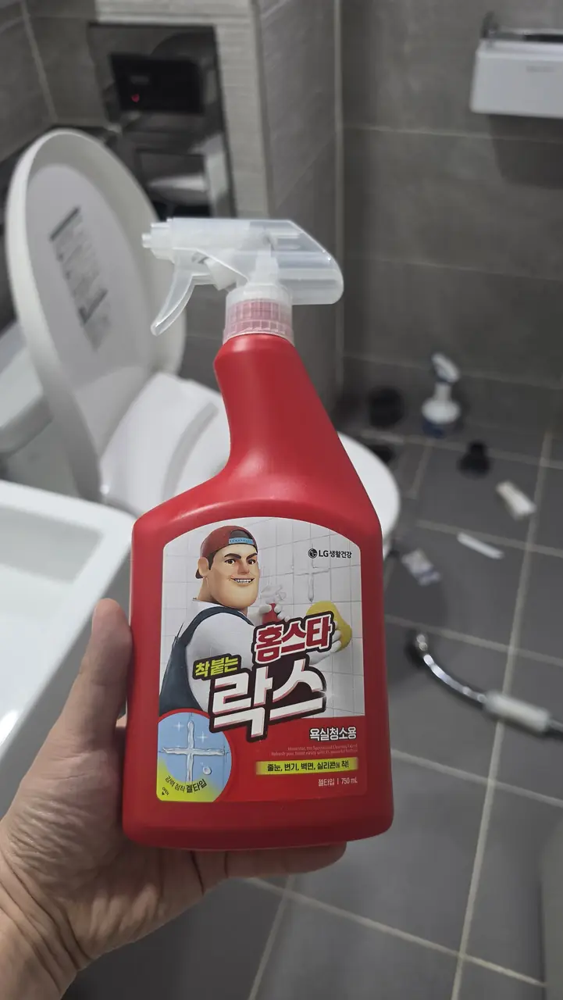
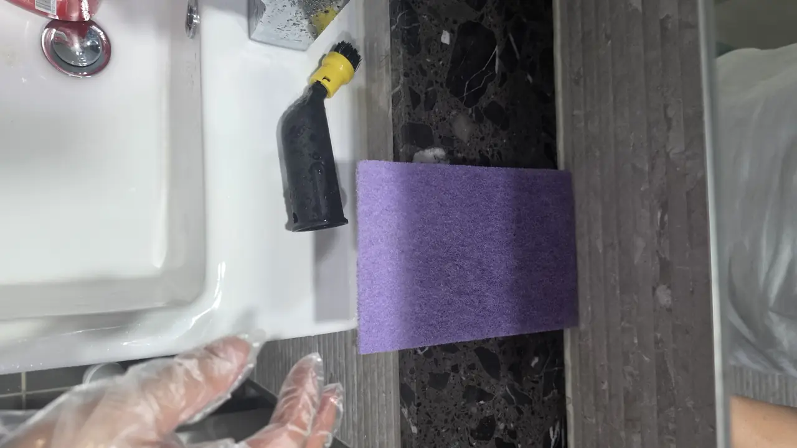
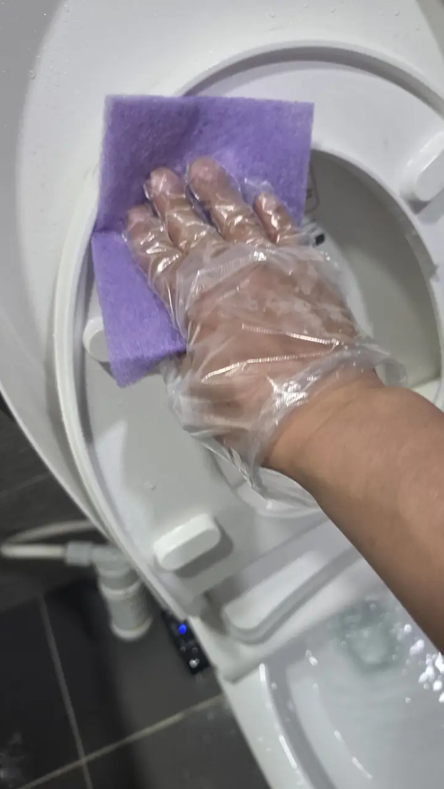
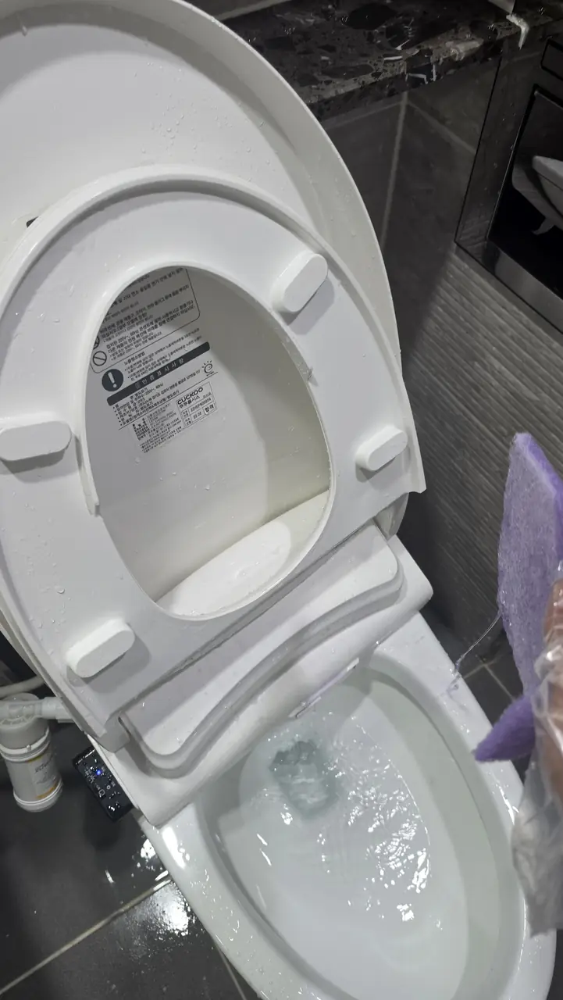
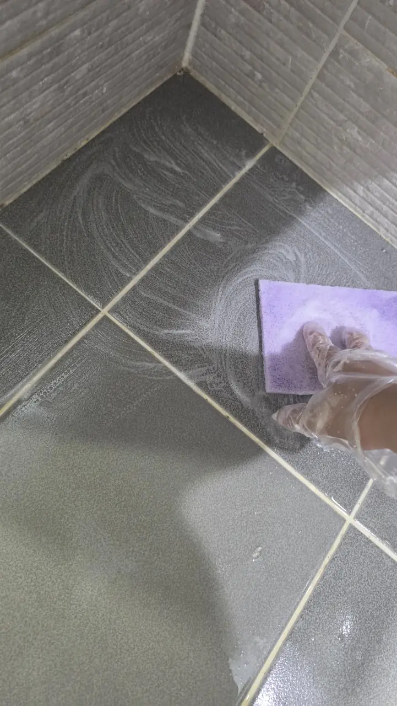
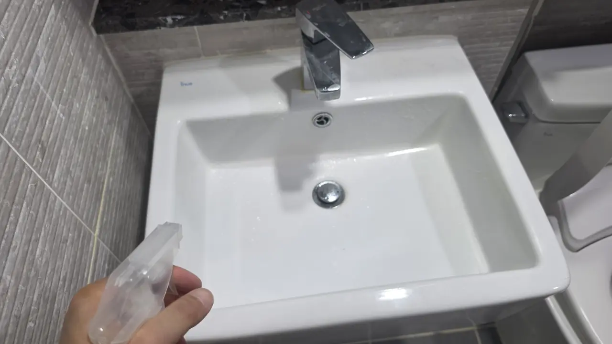
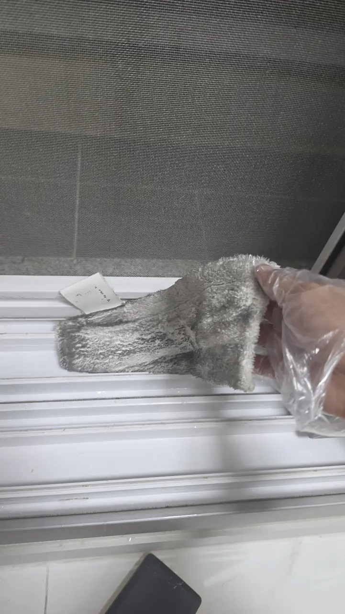

A mother in northern Europe sent us a message. Her daughter had just moved
into a flat in Gangnam and needed it cleaned before she started living in it
— the ordinary thing any parent would want, from four thousand miles away.

The date was the problem. **It was the day before Chuseok.**

## Why that date mattered

If you are new to Korea, this is the part nobody warns you about.

**The country stops for the autumn holiday.** Cleaning crews, movers,
tradespeople, most small businesses — three or four days of nothing, and the
days on either side are already taken by everyone who planned around it. Ring
around the week before Chuseok or Seollal and you will hear the same answer
from everybody.

There was nobody to send. So we went ourselves.

## What we took

- A **Miele C3** vacuum
- A **Kärcher steam cleaner**
- **Bleach (락스)** and a set of detergents
- A bag of cloths, scourers and pads

*The second of three passes in the bathroom · ⓒ @BalliBalliSeoul*

The flat was a **1.5-room studio** — the sort of place a person moves into
with two suitcases. Small enough to sound easy.

It took **three hours**.

## The balcony was the surprise

The balcony was open to the outside rather than glazed in, which in Seoul
means birds, and it was **covered in droppings**.

That is not unusual in a flat that has stood empty between tenants. It is
also exactly the kind of thing that never appears in a listing, never comes
up at the viewing, and is waiting for you on the day you arrive with your
luggage. If your new place has an open balcony, look at it before you decide
the flat is fine.

## The bathroom, in three passes

One pass is not enough on a bathroom nobody has properly cleaned in a while.
The order matters more than the effort.

1. **Detergent first.** Lifts the film of soap and body oil off every
   surface, so that what comes next can actually reach the tile.
2. **Bleach second**, left to sit on the grout and silicone rather than wiped
   straight off. Dwell time is the whole point; wiping it on and off achieves
   very little.
3. **Steam last**, into the joints and around the fittings. It is a finish
   and a disinfection step at once, and it uses no chemical at all.

*The steam brush, and the pad that does the grout · ⓒ @BalliBalliSeoul*

**Lift the bidet seat off.** Cleaning around one is not cleaning it, and the
underside is where a previous tenant's bathroom stops being polite about
itself. Korean flats nearly all have an electric bidet seat, it unclips, and
almost nobody does this.

*Under the seat · ⓒ @BalliBalliSeoul*

*Clipped back on afterwards · ⓒ @BalliBalliSeoul*

Floor last, once everything above it has been rinsed down. Doing the floor
first means doing it twice.

*Floor last · ⓒ @BalliBalliSeoul*

*Three hours later · ⓒ @BalliBalliSeoul*

## The window tracks tell the truth

Window tracks are the thing people forget, and the thing that shows. This is
one cloth, after one pass along the track of a flat that had been described
as ready to move into.

*The track was white underneath. The screen above it got the same treatment · ⓒ @BalliBalliSeoul*

**We washed the insect screens too** — 방충망 (bangchungmang), the mesh
panels in the window frames. They are easy to ignore because you look through
them rather than at them, but they hold a season of city dust, and every
breath of air you let into the flat comes through one. On a screen that has
not been washed, you can see the difference in the light afterwards.

If you are checking a flat before you accept it, run a finger along the
window track. It takes two seconds and it tells you how the last clean was
done — which tells you what else was skipped. The screens are the same test.

## Two things worth taking from this

**Book around the holidays, not into them.** Chuseok and Seollal empty the
trade calendar for most of a week, and the days either side go first. If your
move lands near one, ask early — **a fortnight ahead is not excessive**, and
the usual two or three days will not be enough.

**A parent abroad can arrange this.** The person who contacted us was not in
Korea and does not read Korean. She sent an address and a date; we sent
photographs when it was done; her daughter walked into a flat that was ready
to live in. Nothing about that is unusual to ask for.

## What this normally costs

We did this one ourselves because of the date. Most weeks it is a crew, and
the pricing, the pyeong arithmetic and what should be included are all in
[move-in cleaning in Seoul](/blog/move-in-cleaning-seoul/) — including the
question to ask before anyone starts.

For the record, on the money: **prices are quoted before VAT**, and if the
building has no free visitor parking, parking goes on the bill at what it
actually cost.

## Get it sorted

Send us the address, the date you get the keys, and the size of the place. We
will tell you what it costs, book it, and send you photographs when it is
finished — whether you are the one moving in, or the one worrying about it
from another country.

And if the date you need is anywhere near a holiday, tell us now rather than
that week.
