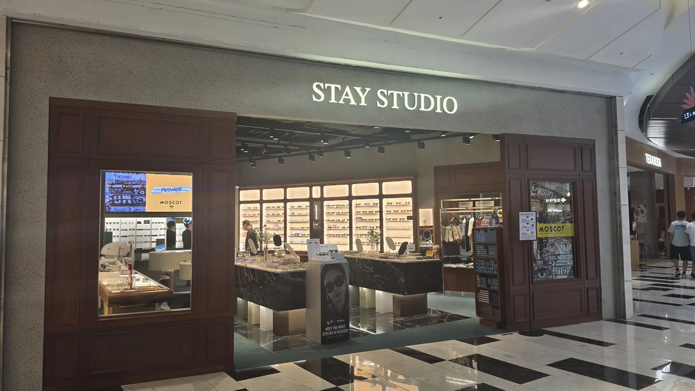

In the US, the UK and most of Europe, new glasses mean an
appointment with an eye doctor, a prescription, and then a second
trip to a shop. In Korea that entire first half does not exist.

**You walk into an optical shop, they test your eyes on the spot,
and you choose frames.** For an ordinary prescription you often
wait 15 to 30 minutes and walk out wearing them. No referral, no
prescription, no second appointment.

This is why "get glasses" quietly sits on a lot of visitors'
Korea lists, next to the skincare and the dental work.

## You do not need an eye doctor first

The person who tests your eyes in a Korean optical shop is an
**optician (안경사, *angyeongsa*)**, a licensed professional who is
allowed to measure your vision and make lenses to match. Testing is
part of the sale — it is normally free, and you are not expected to
book it in advance.

There is no gatekeeping step. You are not asked for a prescription,
a doctor's note, an ARC, or health insurance. Glasses are not
covered by Korean national insurance anyway, so everyone pays out
of pocket and nobody asks who you are.

If you already have a prescription from home, bring it — it speeds
things up and gives the optician something to check against. But it
is a convenience, not a requirement.

## How long does it actually take?

For a **standard prescription, including astigmatism**, the usual
answer is **15 to 30 minutes** while you wait. Shops keep common
lens powers in stock and cut them in the back.

It gets slower when the lens has to be ordered rather than cut from
stock. Very high prescriptions and specialist options — ultra-thin
high-index lenses, blue-light or anti-reflective coatings,
progressives — can mean coming back, and how long depends entirely
on the shop and the lens.

> **⚠️ Two rules if you are here on a trip**
>
> **Go early in your stay, not on your last day.** If the lens has
> to be ordered, a same-day plan falls apart.
>
> **Ask before you pay: "how long will this take?"** Opticians
> answer this question all day and will tell you straight. It takes
> ten seconds and it is the difference between collecting your
> glasses and abandoning them.

## What does it cost?

The honest answer is a range, because two different things move the
price and they move it independently.

**A complete pair — frame and lenses — starts around ₩100,000.** From
there it climbs through the hundreds of thousands, and brand frames
run past a million. There is no single "price of glasses in Korea";
there is a floor, and then whatever you choose to spend above it.
*(Typical range as of 2026.)*

**Say your budget out loud.** Korean opticians are used to being told
a number and working inside it — it is a normal, unembarrassing thing
to do, and it saves the whole negotiation. "이 정도로" (*this much*)
with a figure gets you shown the right shelf immediately.

### The two things that set the price

**1. The frame.** This is the part with the enormous range, and it is
entirely your choice. The same shop will have a basic frame and a
designer one on adjacent shelves.

**2. The lenses**, which is where the part you can't choose comes in.
Two factors:

- **How thin they need to be.** Korean shops talk about **압축
  (apchuk)** — literally *compression*, meaning how much the lens has
  been thinned down. **A stronger prescription needs more of it, and
  each step up costs more.** The shop quotes it as a number; higher
  means thinner, lighter and pricier. This is not an upsell you can
  simply decline if your prescription is strong — thick lenses in a
  small frame do not physically work.
- **Domestic or imported.** Korean-made lenses and imported ones sit
  at different price points for the same specification. **Ask which
  you are being quoted**, because it is a real difference and it is
  rarely volunteered.

Coatings — anti-reflective, anti-scratch, blue light — sit on top of
both, and those genuinely are optional.

None of this requires a special shop, by the way. **Thinning and
coatings are ordinary work that any neighbourhood optician does** —
you do not need to hunt for a specialist, and paying more for a
smarter-looking storefront buys you the frame, not the lens.

### The one question to ask

**"What is the all-in price, and what changes if I drop an upgrade?"**

Ask it before they start cutting. It does more for your budget than
shopping around, because it turns a package quote into a list you can
actually edit — and it is the question that reveals whether the lens
in your quote is domestic or imported.

### If you are visiting: look for the tax-free sticker

Glasses are a normal retail purchase, which means **short-term
visitors can claim the VAT back** on them like any other shopping.
Shops that handle it display a **TAX FREE / TAX REFUND** sticker in
the window — it is worth a glance before you walk in, because it is
easier than sorting it out afterwards.

Bring your **passport** if you intend to claim, ask for the tax
refund paperwork at the counter when you pay, and keep it for the
airport. Not every shop participates, and the ones in tourist areas
and department stores are likelier to.

## Where to go

The genuinely useful thing about optical shops in Korea is that
**there are a lot of them and they are broadly similar.** You do
not need to research this. There is very likely one within a few
minutes' walk of where you are standing.

If you want a cluster to browse:

- **Namdaemun** — the deepest stock in Seoul, and fast
- **Myeongdong** — many shops in a small area, tourist-comfortable
- **Sinsa** — more design-led frames
- **Department stores and malls** — brand frames, and not always as
  expensive as you would expect

*A mall optical shop — IFC Mall, Yeouido. The brand-frame end of the market · ⓒ @BalliBalliSeoul*

One thing that catches people out: some shops sell **frames only**
and partner with an optical shop nearby for the lenses. If you are
sent next door, nothing has gone wrong — that is the normal
arrangement.

Most are street-level shops near a station rather than mall units —
the one photographed at the top of this page sits a minute from Isu
Station, and it is entirely typical.

**Check the day before you make the trip.** Standalone shops keep
retail hours rather than mall hours — **10:00 to 21:00** is a
common pattern, which is friendlier than it sounds if you work —
but many independent shops **close one day a week, and Sunday is a
common choice.** That is the opposite of the assumption most
visitors arrive with.

**The hours are printed on the window**, which is why the cover photo
is worth a second look: *10:00 – 21:00, closed on Sunday*, with the
phone number under it. Every shop does this, so you can settle the
question from the pavement before you plan a trip across town.

If you happen to be in Yeouido, the shop above sits inside the same
complex we wrote about in
[escaping the heat at IFC Mall](/blog/ifc-mall-yeouido-heat-escape/).

## Contact lenses work differently — read this before you order online

This is the part that surprises people, and it is worth knowing
before you arrive with a plan.

**In Korea, contact lenses are classified as medical devices, and
selling them online is prohibited.** That includes cosmetic
coloured lenses. You cannot order them from a Korean website and
have them turn up at your hotel, and shopping apps will not have
them either.

What you do instead is simple: **buy them in person at an optical
shop.** Staff will fit and sell them over the counter, the big
international brands are widely available, and it takes about as
long as buying anything else.

The practical version: if you wear contacts, do not plan to restock
online while you are here. Walk into a shop.

## What to bring

- **Your current glasses**, if you have them. The optician can read
  the existing prescription off them
- **A prescription from home**, if you have one — useful, not
  required
- **A card.** No ARC and no insurance card needed — nobody will ask
  who you are
- **Your passport, but only if you want the tax refund.** You do
  not need it to buy glasses; you need it to claim the VAT back
- **Time.** Not much, but do not schedule this for the hour before
  a flight

## When it is an eye doctor you need, not an optician

An optical shop measures your vision. That is not the same as
checking the health of your eyes, and it is important not to
confuse the two.

Go to an **ophthalmologist (안과, *anggwa*)** rather than an optical
shop if you have:

- Eye pain, redness that will not settle, or discharge
- A sudden change in vision, or vision loss in one eye
- A sudden increase in floaters, or flashes of light
- An eye injury, or something stuck in your eye
- Diabetes, or any condition that needs regular retinal checks

Our guide to
[which Korean clinic department to walk into](/blog/which-clinic-korea-department-guide/)
covers how to find one and what happens when you get there. This
article is about buying glasses, not about medical advice — if
something is wrong with your eye rather than your vision, see a
doctor.

## The Korean part

Most of this is easy without Korean. Opticians deal with numbers
and equipment, pointing works, and the bigger shops in tourist
areas often have some English.

Where it gets harder is the middle of the conversation — the part
where you are being offered lens upgrades you cannot evaluate, in
a language you do not read, while a machine prints something. "Is
this coating worth it, or is it an upsell?" is a real question and
a hard one to ask through a translation app.

> **Want someone on the phone while you are in the shop?** Message
> us on [WhatsApp](https://wa.me/821075191282) and our
> [anything-else concierge service](/etc) will find a shop near
> you, call ahead about timing, or translate the upgrade
> conversation live so you know what you are agreeing to. First
> answer is free.
>
> One line we do not cross: contact lenses are regulated medical
> devices here, so **we will not buy them on your behalf.** We will
> get you to a shop and translate — the purchase is yours to make
> in person.

## Get it sorted

The one-line version: **walk into any optical shop, no prescription
needed, eyes tested free, 15–30 minutes for an ordinary lens — but
go early in your trip, check the shop is not closed that day, ask
how long it will take before you pay, bring your passport if you
want the tax refund, and buy contact lenses in person because
online sales are not allowed.**
