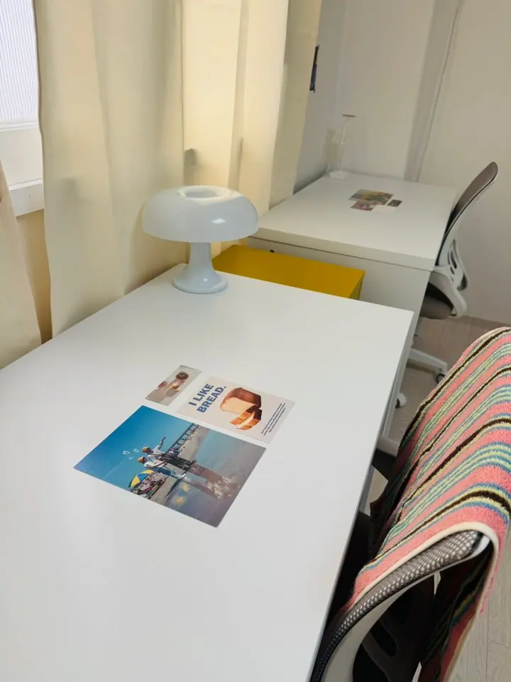
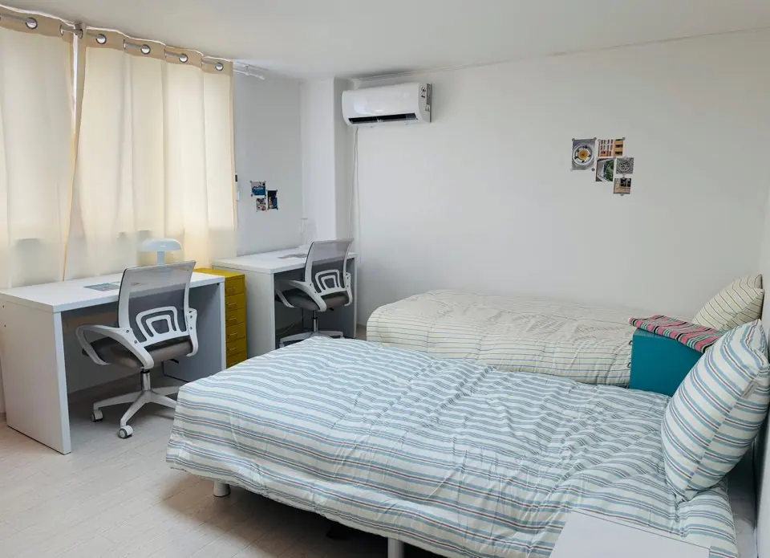
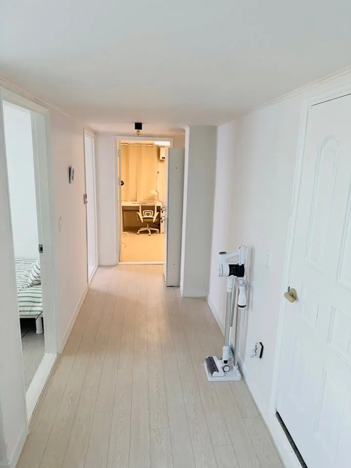
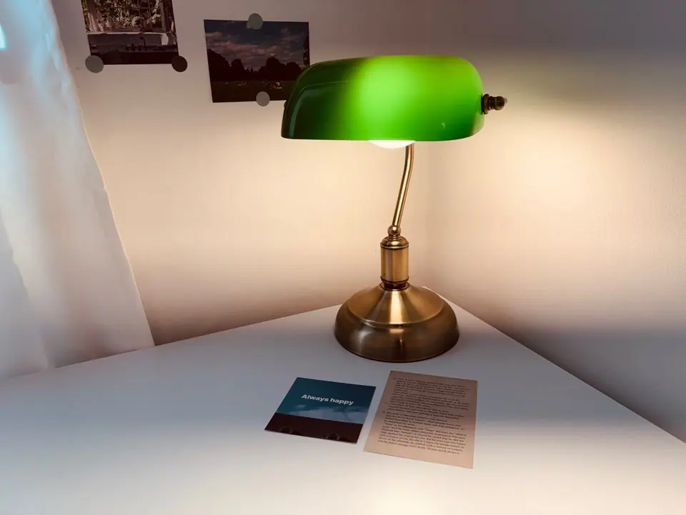

Two friends of ours spent their first months in Seoul in a goshiwon.
They are now in one of our share houses, and the reason they moved is
not the one people expect. It was not the price. It was that neither of
them could have a friend over, cook anything, or hear themselves think.

If you are looking at Korean housing in English right now, you are
probably looking at three words — **고시원 (goshiwon)**, **오피스텔
(officetel)** and **월세 (wolse)** — and getting very different numbers
for each. Here is what each one actually is.

## What a goshiwon is

A goshiwon is a building of very small private rooms along a corridor,
with shared bathrooms and a shared kitchen. The name comes from
고시 — the state exams students used to lock themselves away to study
for — and the format has not changed much since.

What you get for the money is real: a room, a bed, a desk, usually a
tiny fridge, and often no deposit at all. Rice and kimchi in the shared
kitchen are commonly free. You can move in tomorrow with a suitcase and
no Korean bank account.

What you also get is the size. Rooms are frequently a few square
metres. Many have no exterior window, which is why listings advertise
**창문 있음 (has a window)** as a feature. The walls between rooms are
thin, so you learn your neighbours' schedules whether you want to or
not.

One thing worth checking before you sign anything: **a lot of goshiwons
are mixed-gender**, sometimes along the same corridor. Others separate
men and women, and the ones worth paying for separate them **by floor**
rather than by a notice on a door. If you are going to take a goshiwon,
ask that before you ask the price — you are sharing a bathroom, and the
answer changes what that means. Our own houses are women-only, which is
one way of settling the question rather than managing it.

For a few months while you find your feet, that trade can be entirely
rational. Our two friends thought so too, at first.

## What made them leave

Not one big thing. Four small ones, compounding:

- **Nowhere to be a person.** You cannot have anyone over. There is no
  table to sit at that is not your bed.
- **Cooking stops.** A shared kitchen at the end of a corridor is fine
  for instant noodles and quietly hostile to actually cooking, so meals
  become convenience-store meals.
- **The bathroom queue.** Shared and, at the wrong hour, occupied.
- **Sound.** Thin walls plus a corridor plus people on exam schedules
  is not a combination that produces sleep.

None of that shows up in a price comparison. All of it shows up by
month three.

## Officetel and wolse — the other two doors

The obvious next step up is a place of your own, which in Korea means
either an officetel or a wolse lease on a one-room.

**오피스텔 (officetel)** is a studio in a mixed residential-commercial
building — better managed than most one-rooms, usually with a lift and
a delivery desk, and priced accordingly.

**월세 (wolse)** is the ordinary monthly-rent lease: a deposit held for
the term, then rent every month.

The problem for a new arrival is not the rent. It is the **deposit**.
A wolse one-room in Seoul commonly wants several million won held for
the length of the contract, and an officetel more — money you need in a
Korean bank account before you have a Korean bank account. That
chicken-and-egg is its own article, and we wrote it:
[renting before you have an ARC](/blog/student-housing-seoul-no-arc/).

So the real choice, for a lot of people in their first year, is not
goshiwon versus apartment. It is goshiwon versus something in between.

## What a share house costs

Ours, as of 2026:

| | |
| --- | --- |
| Deposit (보증금) | **₩2,000,000** from February 2027 — paid once, returned when you leave |
| Monthly | **₩800,000, all inclusive** |
| What "all inclusive" covers | Water, electricity, gas, internet |

That second row is the one worth reading twice. It is not a base figure
with bills arriving later. Korean utility bills are sharply seasonal —
the August air-conditioning bill and the January gas bill are the two
that catch people out — and with a fixed monthly figure, running the
aircon through a Seoul August does not change what you pay.

The deposit is the part to compare. Two million won is a number a
student can actually produce, and it comes back at the end.

*Every room has a window, a desk you can work at, and a door that
closes · ⓒ @BalliBalliSeoul*

## What you get that a goshiwon does not

A kitchen you can cook in properly. A living space that is not your
mattress. A bathroom you are sharing with a handful of housemates
rather than a corridor. And rooms with windows, which stops being a
detail somewhere around week three of a Korean winter.

*Twin rooms have two of everything — desks, beds, storage · ⓒ @BalliBalliSeoul*

*Rooms off a hallway, not off a corridor of forty · ⓒ @BalliBalliSeoul*

## Where they are

Three houses, all women-only, all beside a university:

- **Korea University** — Jongam-dong, Seongbuk-gu
- **Kyung Hee University** — Hoegi-dong, Dongdaemun-gu
- **Hankuk University of Foreign Studies (HUFS)** — Imun-dong,
  Dongdaemun-gu

The Kyung Hee and HUFS houses also serve each other's campuses — the
two are close enough that residents at one routinely study at the
other. Room details and photographs of each are in
[our coliving rooms](/blog/coliving-rooms-seoul-universities/), and the
Korea University house has
[its own write-up](/blog/korea-university-housing/).

**Rooms come free from March 2027**, and the reason is simply that
everything before then is already taken — it is the calendar, not a
policy. If you need something shorter, or month by month, ask anyway
rather than assuming: what we can do depends on what is open at the
time, and that changes.

## Come and look before you decide

You do not have to commit from a listing. If you are in Seoul, come and
see the house — the actual room, the actual kitchen, the walk from the
station — and decide afterwards. That is a normal thing to ask for and
we would rather you did.

If you are still abroad and want to hold a room before you fly, you can
send the deposit by **PayPal** — no Korean bank account needed, which
is the part that usually blocks people who have not landed yet.

Plans change, so the cancellation terms are worth having in front of
you before you send anything:

| If you cancel | Refund |
| --- | --- |
| **A month or more** before your move-in date | **100%** |
| Less than a month before, **up to the day before** | **50%** |
| **On the day** itself | None |

Nothing there is unusual for a room being held off the market for you,
but it is the kind of thing that should be written down rather than
remembered differently later.

*Furnished means furnished — you arrive with a suitcase · ⓒ @BalliBalliSeoul*

## The honest bits

Things we would rather you knew now than after you move in.

- **Women only.** All three houses.
- **It is shared.** A kitchen and a bathroom with housemates is not a
  studio, and if what you want is total privacy, an officetel is the
  honest answer and we will say so.
- **Rooms are not identical.** Layouts differ between rooms and between
  houses, which is exactly why coming to look is worth an afternoon.

## Get it sorted

If the goshiwon is doing its job, stay in it — it is a genuinely
efficient way to spend a first few months. If you recognise the four
things above, a share house is the step that costs less than a lease
and returns most of what a goshiwon takes away.

Message us any time in English and we will tell you what is free from
March, what it costs, and when you can come and look.
