Korea has a profession most English speakers have never heard of.
**정리수납전문가** (jeongni-sunap jeonmunga) — a professional organiser —
comes to your home, empties your storage, and puts everything back in a
way that you can actually maintain.

It is not cleaning. Nobody scrubs anything. And it is not the tidying
you have seen on television, where a stranger holds up your jumper and
asks whether it sparks joy.

We have had it done twice, years apart, in our own home. Every photograph
below is from that job.

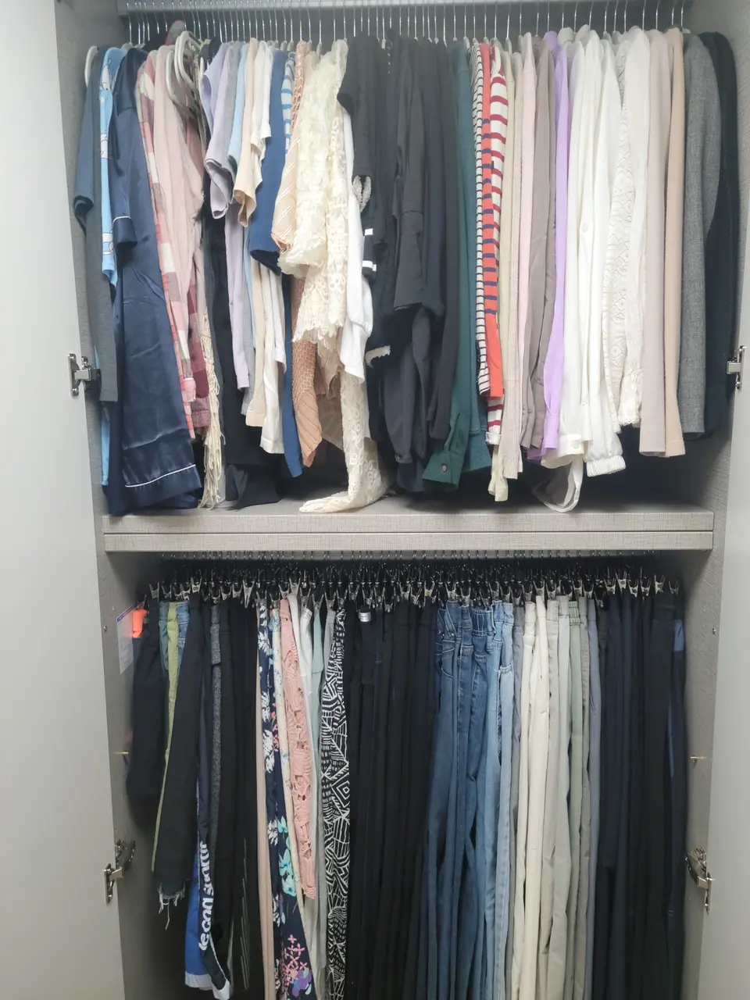

*Two systems in one cupboard: folded on the left, clipped on the right · ⓒ @BalliBalliSeoul*

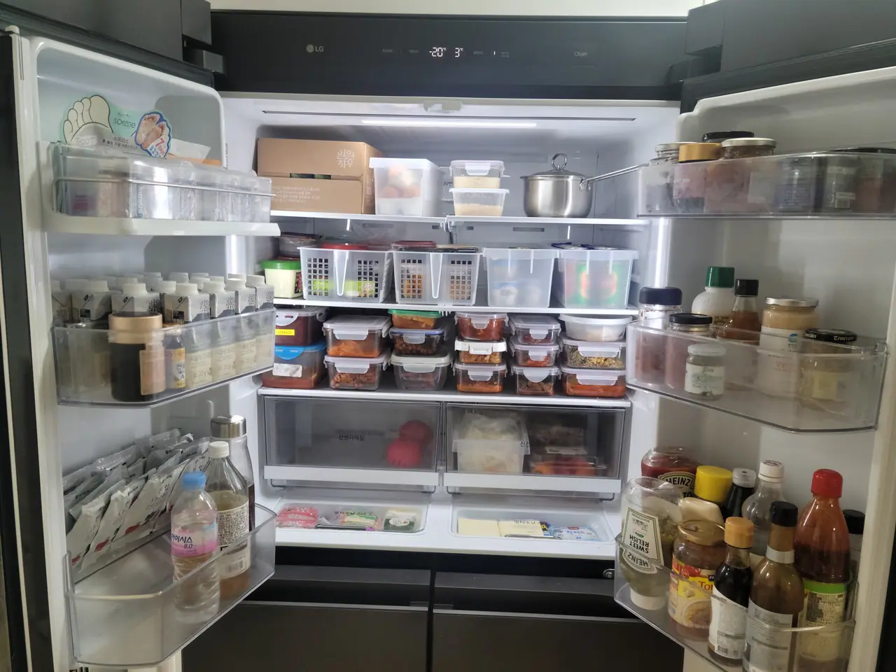

*Same job, one room over · ⓒ @BalliBalliSeoul*

**A fridge is the clearest example of what you are buying** — the food did
not change, the containers did, and now you can see every side dish
without moving anything.

## The rule that shapes the whole day

Here is the thing nobody tells you before you book, and everything else
follows from it.

**The company cannot throw anything away.** Not a single item. They will
sort, fold, group and store, but the decision to discard is not theirs to
make — and no reputable firm will take it, because the risk is entirely
one-sided. Bin the wrong envelope and there is no undoing it.

Which means: **you have to be there.** Not just at the start — from the
first box to the last bin bag. Items get moved and items get taken out of
the house, and every one of those needs your approval as it happens.
Someone holds up an object, you say keep or bin, and that repeats several
hundred times. If you were imagining handing over the keys and coming
back to a finished house, adjust the plan.

**Keep your valuables out of it entirely.** Cash, jewellery, bankbooks,
share certificates, passports — put them somewhere yourself, before the
team arrives, and do not put them into the sorting. Not because anyone is
untrustworthy, but because in a day when several hundred objects change
place, the one category you cannot afford to lose track of should never
have entered the system.

It also means the service has a hard limit. **정리의 기본은 비움** —
*the basis of organising is emptying.* A professional can make 200 items
fit a cupboard beautifully. They cannot make 300 fit. If nothing leaves
the house, what you have bought is a very tidy version of the same
problem, and it will look like this again within a year.

So the useful preparation is not cleaning up before they arrive. It is
deciding, in advance, that some things are going.

### Buy these before the day

Two things run out immediately, and both are your job, not the company's.

- **Bin bags — at least three 50-litre ones**, and more if the flat has
  been filling up for years. These are the paid municipal bags
  (종량제봉투) for your district. Running out mid-afternoon stops the
  whole operation.
- **Wet wipes, more than you think.** Everything comes out of a cupboard
  with a layer of dust on it and goes back in clean. This is the single
  most-used consumable of the day.

## It feels like moving house

This surprised us more than anything. **Almost everything comes out.**

The wardrobes are emptied onto the floor, the drawers are emptied, the
kitchen cupboards are emptied — because you cannot reorganise a space you
cannot see the bottom of. For a few hours the home looks considerably
worse than when you started, and then it comes back together.

If you have moved flat in Korea, it is that day again, minus the truck.
Plan for it accordingly: nothing else happens that day, and it is not a
day to have small children underfoot.

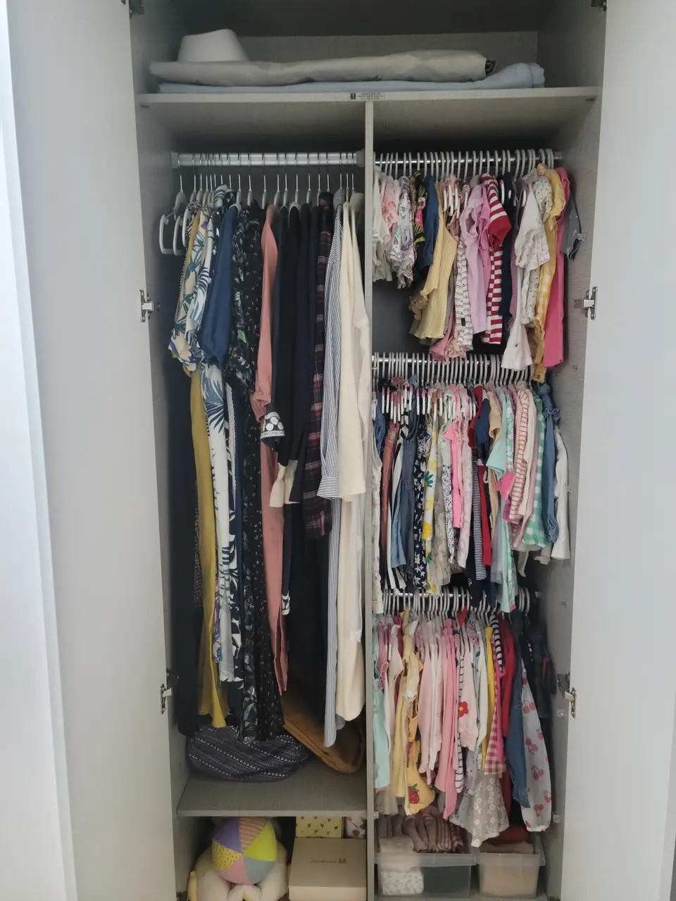

*Children's clothes sorted by size — the category that goes out of date fastest · ⓒ @BalliBalliSeoul*

## What the result actually looks like

Three things recur across every cupboard, and they are the transferable
part — you can copy them without hiring anyone.

**Everything stands up.** Folded items are stored on their edge rather
than stacked flat, so you can see every item at once and pulling one out
does not collapse the pile. This is the single biggest change and it is
free.

**Small things live in cells.** Socks, underwear and accessories go into
divided trays rather than loose in a drawer. A drawer without dividers
becomes a mixed heap within two weeks no matter how well it started.

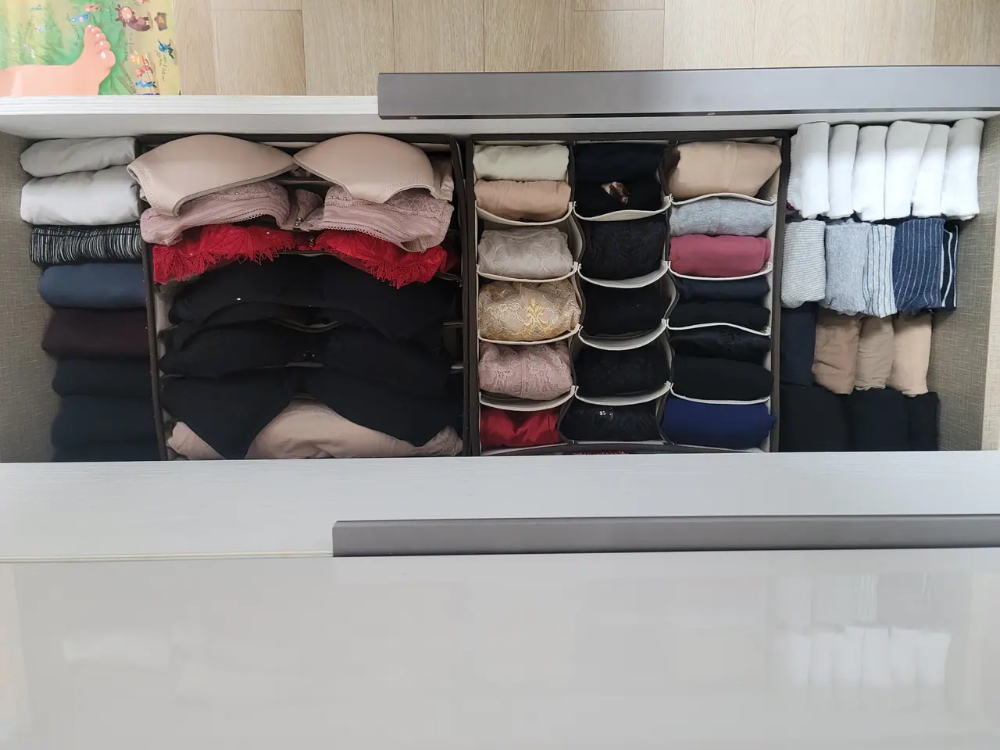

*One item per cell — this is what stops a drawer re-mixing · ⓒ @BalliBalliSeoul*

**Like goes with like, then gets a label.** Not "bedroom things" but
"swimwear", "winter accessories", "new stock". The category has to be
narrow enough that you never have to think about which box something
belongs in.

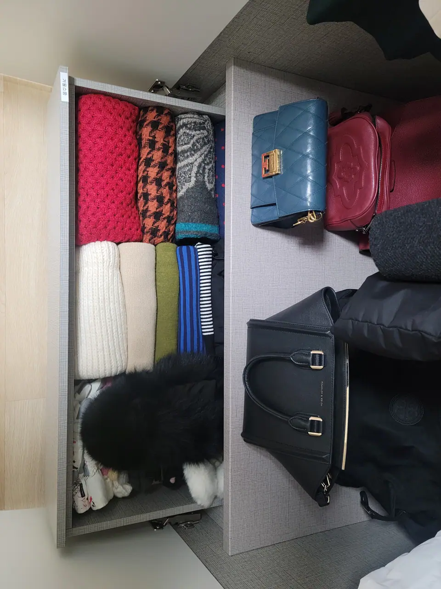

*The label is not decoration. See the next section · ⓒ @BalliBalliSeoul*

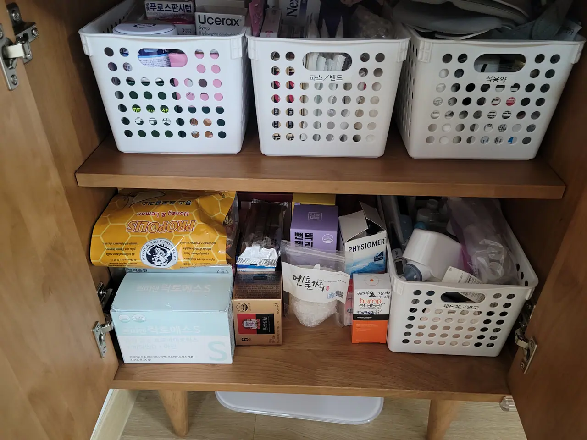

*파스/밴드 (plasters), 복용약 (oral medicine) — narrow enough to be obvious · ⓒ @BalliBalliSeoul*

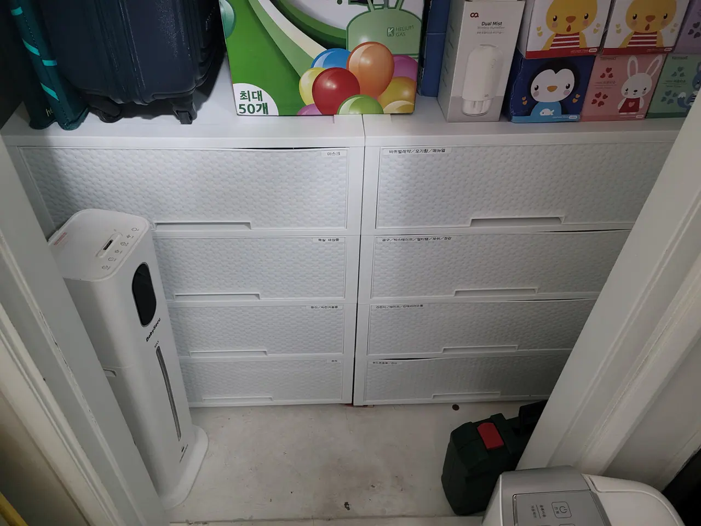

*The storage room is where labels stop being optional · ⓒ @BalliBalliSeoul*

It works on rooms other than bedrooms, too — the same logic goes into a
kitchen drawer or a shoe cabinet.

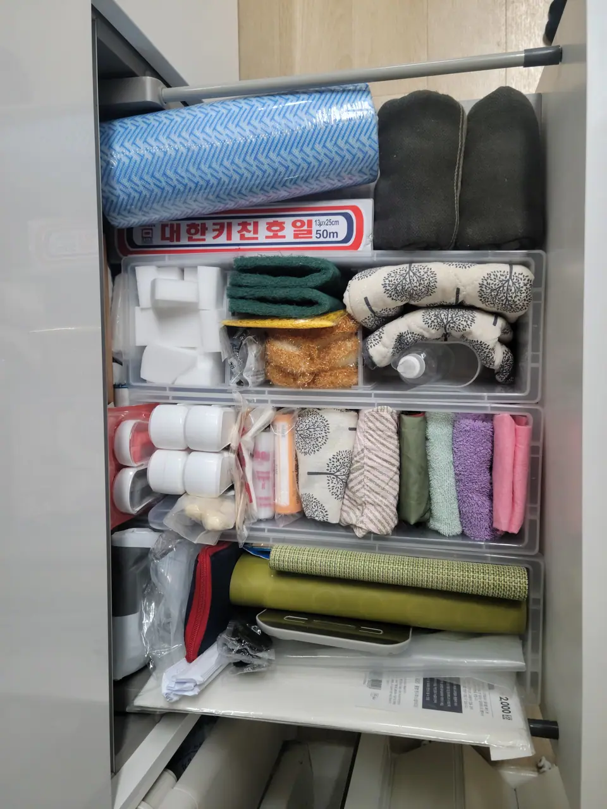

*Kitchen consumables, boxed by type · ⓒ @BalliBalliSeoul*

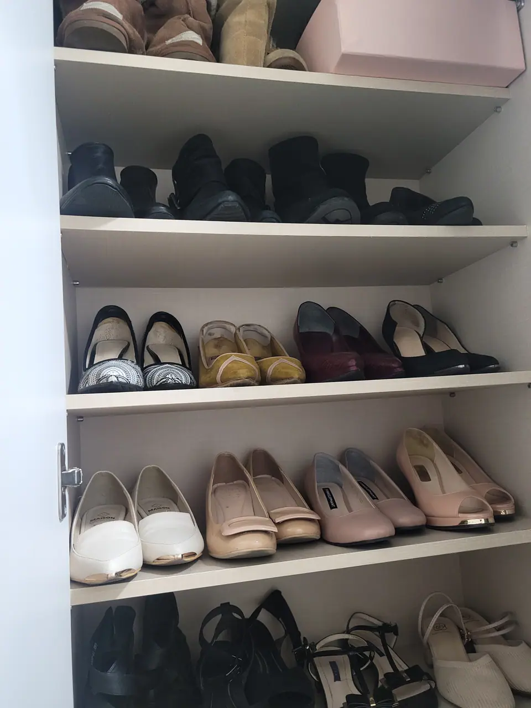

*Shoes by type rather than by who wore them last · ⓒ @BalliBalliSeoul*

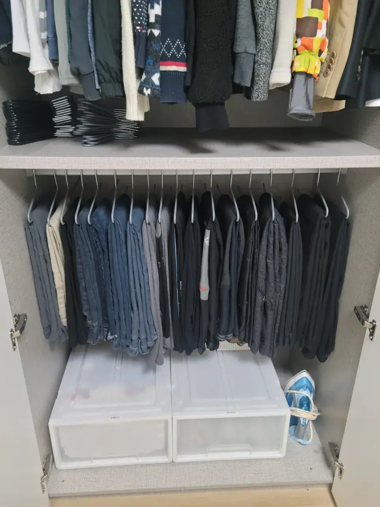

*Clip hangers: trousers hang full length instead of folding over a rail · ⓒ @BalliBalliSeoul*

## ⚠️ The warning nobody gives you

**For a while afterwards, you will not be able to find your own things.**

This is the honest downside and it is worth knowing before rather than
after. Your home has been reorganised by somebody else's logic — a good
logic, a better one than yours, but not yours. The thing you reach for
without thinking is no longer where your hand goes.

It passes quickly — **a few days of opening the wrong drawer**, not
weeks of hunting. But those few days are genuinely irritating in a house
that is objectively tidier than it has ever been, and nobody warns you
about them.

Two things reduce it, and both are worth asking for on the day:

- **Labels on everything**, including the inside of cupboard doors. This
  is what the labels are actually for. They are not styling.
- **Walk the house before the team leaves.** Open every cupboard and
  drawer with them and have them tell you what is where. Ten minutes then
  saves you most of those few days.

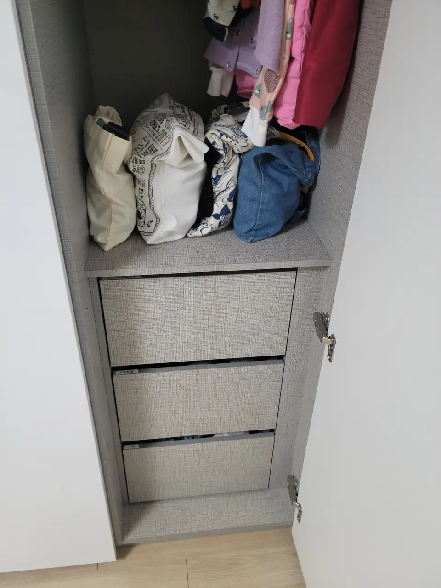

*Labels on the doors, not just inside them · ⓒ @BalliBalliSeoul*

## What it costs

**There is no price list, and you should be suspicious of one.** Korean
organising firms quote by **visiting** (방문견적) — someone comes, looks
at how much you own and what storage you have, and prices the job.
Volume, not floor area, is what they are measuring, and no photograph
conveys it accurately.

Two things to establish while they are standing there:

**Storage products are charged separately.** The trays, dividers, boxes
and hangers in the photographs above are not included in the labour
quote. This is normal and it is not a trick, but it means **the number
you are quoted is not the number you will pay.** Ask what the product
budget is likely to be, and ask whether you can supply your own.

**Ask how many people and how many hours.** Organising is priced on
person-hours, so "two professionals for a day" is the unit that lets you
compare one quote with another.

**One real number, so you have something to anchor to.** Our own job — a
**25-pyeong flat (about 82㎡)** — came to roughly **₩1,500,000**. Treat
that as one data point rather than a rate: the same floor area with half
the belongings is a different job, and a firm that quotes you without
visiting is guessing at the part that actually sets the price.

## Would we do it again?

We did. That is the honest answer — once, then again some years later.

The second booking is the useful data point, and it cuts both ways. It
means the first one was worth the money. It also means **the effect is
not permanent.** This is a reset, not a cure: a house with people living
in it drifts, children outgrow a size bracket, and a system nobody
maintains slowly stops being a system.

If you have a lot of things and no working order to them, it is worth
doing once. Go in expecting a hard day of decisions, a few days of
reaching into the wrong drawer, and a house that works properly for a
couple of years.

## The Korean part

The whole trade runs by phone and KakaoTalk, in Korean, and the visit
estimate is a conversation in your home about what you own. That is a
long way past survival Korean.

The day itself is harder than the booking. Several hundred keep-or-bin
decisions get asked out loud, quickly, by someone standing over an open
drawer — and "이거 버릴까요?" repeated three hundred times is a genuinely
draining thing to field in a second language.

## Get it sorted

Before anything else: decide what is leaving. **정리의 기본은 비움.**
Korea makes the leaving part its own project — large items need a paid
disposal sticker, and household waste goes in the district's paid bag —
which is covered in
[how to throw away rubbish in Korea](/blog/how-to-throw-away-trash-in-korea/).

If what you actually have is a home that has got away from you rather
than one that needs better shelving, the categories and the costs are in
[deep cleaning in Korea](/blog/deep-clean-korea-sorting-first/) — and the
two services are not the same purchase.

We arrange this in English: we describe the job accurately to firms that
do it, get you comparable quotes with the product budget stated
separately, and can be on the line on the day. See the
[cleaning page](/cleaning) for how that works.
