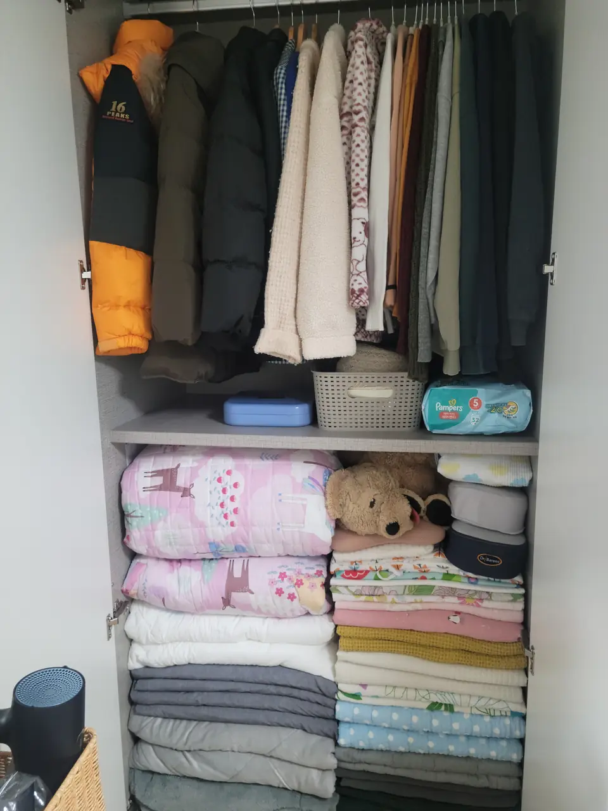
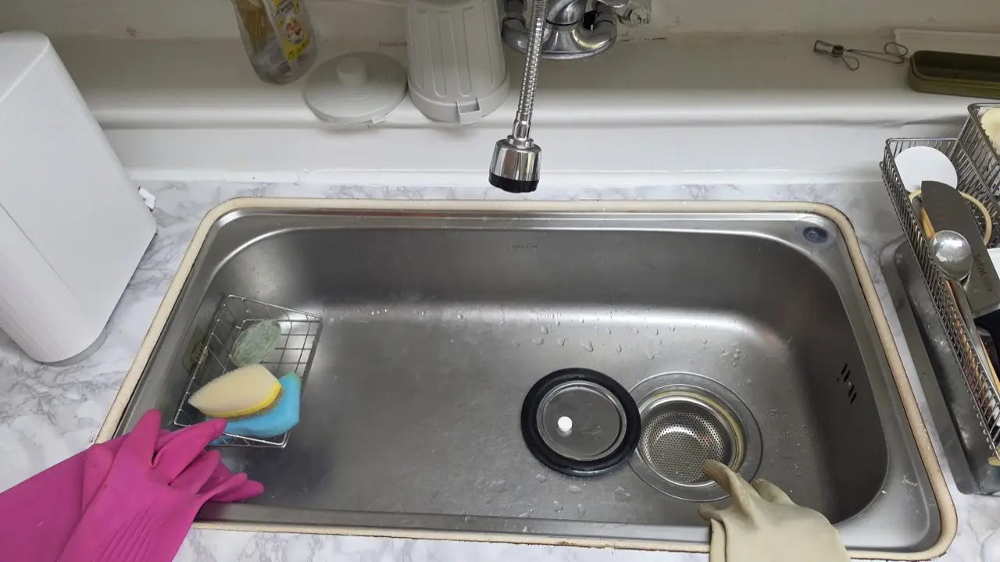
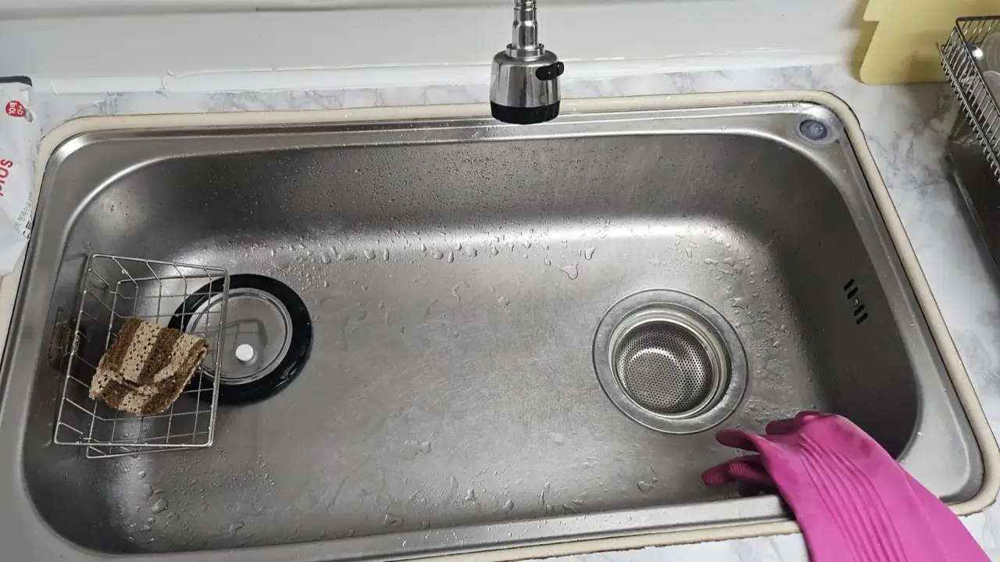

Ask around about hiring a weekly cleaner in Korea and you may get
puzzled looks — which convinces many expats it isn't a thing here.
It's absolutely a thing. Korea has a mature, app-driven home
cleaning market, plus an informal expat-facing one, and busy
working parents use both without ceremony. If you're drowning in
teaching-plus-toddler life, here's the map — because searching in
English only surfaces the move-out deep-clean companies, and that's
not what you need.

## The app tier: Korea's cleaning platforms

The domestic market runs on housekeeping apps — the big names
locals recommend are **Cleaning Lab (청소연구소)** and **Miso
(미소)** — matching vetted cleaners to homes for one-off or
recurring visits:

- **Pricing** runs by home size and hours: a standard **4-hour
  visit for an ordinary apartment runs around ₩60,000** (as of
  2026), with recurring weekly bookings priced slightly better and
  small-space options for one-rooms. A **move-in/move-out deep
  clean is a different product at roughly double that rate** —
  different crews, different equipment, one-off timing.
- **Same-cleaner continuity** is a supported feature — you can
  keep the person you like for recurring slots, and platforms
  notify you of substitutions.
- **Scope**: standard visits cover floors, bathrooms, kitchen
  surfaces and tidying; laundry-folding and extras are
  request-and-agree territory. It's house *keeping*, not the
  industrial move-in deep clean — different product, different
  crews.
- The apps are **Korean-language** with Korean sign-up and
  payment — the usual wall, and the main reason expats who'd
  happily pay never start.

An open secret of the market: after months with the same platform
cleaner, many households quietly transition to a **direct
arrangement** — same person, similar money, no platform in the
middle. It's common enough to be a cultural norm, with the obvious
trade-off that the platform's insurance and substitution system
goes away.

## The expat tier: English-speaking help

Parallel to the apps, an informal English-speaking market thrives
in the international community — cleaners and nanny-housekeepers
who work the expat circuit, found through community groups and
word of mouth. Rates run a bit above app pricing, communication
runs in English, and arrangements are personal: the same person,
weekly, for years, often flexing between cleaning and
childcare-adjacent help. For families, this tier's flexibility
(fold the laundry, receive the delivery, overlap with the
school run) is the selling point the apps can't match.

## Making the first visit go well

A few norms that smooth the start: **supplies are usually yours**
— Korean housekeepers work with the household's own cleaner,
cloths and vacuum (platforms specify; direct hires assume it), so
stock the basics before day one (a ₩20,000 Daiso run covers it).
**Declutter before they come** — cleaning and organizing your
belongings are different jobs, and a floor full of stuff turns
paid cleaning hours into paid picking-up hours. And **write your
priorities**, even in translated Korean: "bathroom mold and
kitchen grease first, skip the bedroom" gets you a better three
hours than leaving it open-ended. Recurring arrangements develop
their own rhythm by week three; the notes matter most at the
start.

*Wardrobe reset — after · ⓒ @BalliBalliSeoul*

What a visit actually looks like, kitchen edition — the sink gets
scrubbed down to the strainer baskets, not just rinsed:

*Kitchen sink, mid-scrub · ⓒ @BalliBalliSeoul*

*And after · ⓒ @BalliBalliSeoul*

## The practical details nobody writes down

- **Keys and codes**: Korean door locks make recurring access
  easy — most households issue a **temporary or secondary door
  code** for cleaning day rather than cutting keys, and rotate it
  whenever the arrangement changes.
- **Being home or not**: both are normal. First visits usually
  overlap; established routines run while you're at work.
- **The 아줌마/이모님 culture**: older Korean housekeepers are the
  backbone of this industry and often its best practitioners —
  expect brisk competence, occasional unsolicited life advice,
  and standards higher than yours.
- **Trust logistics**: platforms carry vetting and damage
  policies; direct and informal hires run on references — ask
  for them, and start with a paid trial visit either way.

## Where we fit

Regular housekeeping is exactly the kind of thing our
[cleaning service](/cleaning) arranges: we set up the recurring
schedule with vetted local cleaners, handle every Korean
conversation (the booking, the scope notes, the "please also do
the balcony this week" messages), and stay in the loop as your
communication channel — so you get the domestic market's prices
with English-language coordination. One-off deep cleans,
move-out cleans and the recurring weekly slot all run through
the same chat.

## Get it sorted

> **Drowning in work and laundry?** Message us on
> [WhatsApp](https://wa.me/821075191282) with your home size,
> neighborhood and preferred rhythm — we'll set up a recurring
> cleaner, brief them in Korean, and relay everything in
> English. First answer is free.

The permission slip, since apparently nobody local gives it:
hiring weekly help is normal here, affordable by international
standards, and the single highest-leverage purchase a
two-job-and-kids household makes. The puzzled looks are wrong —
book the cleaner.
