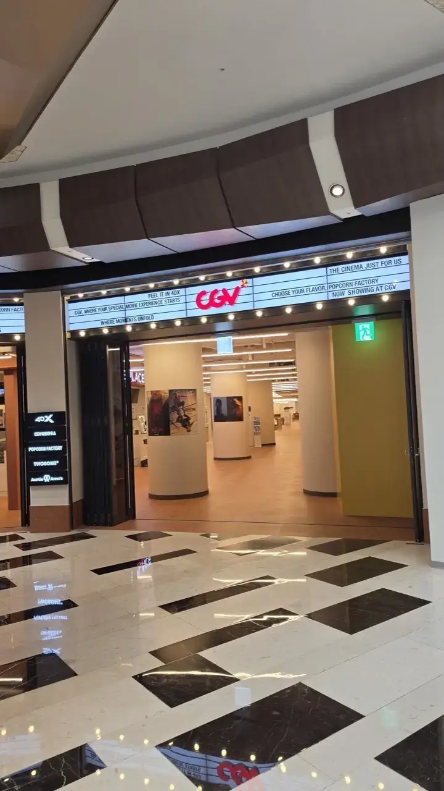
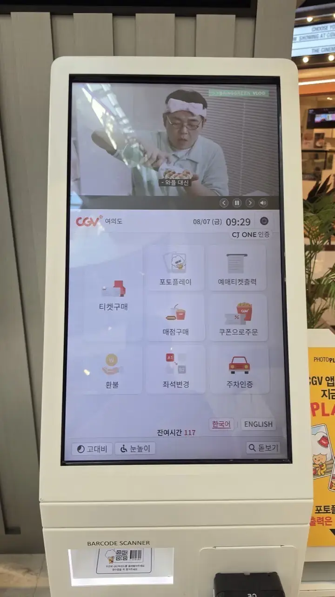
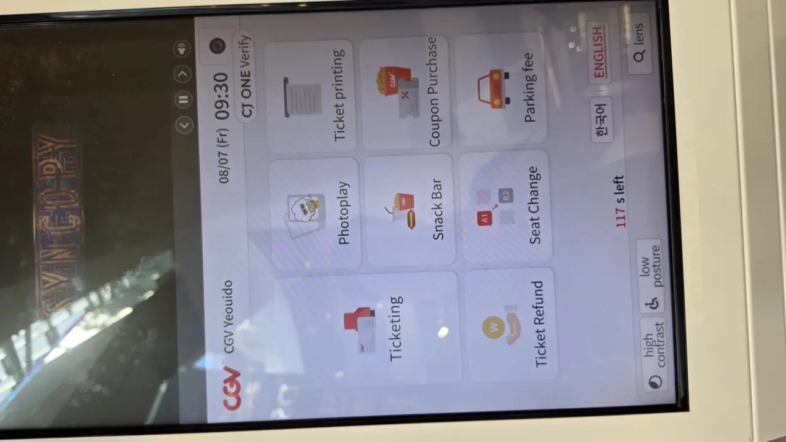
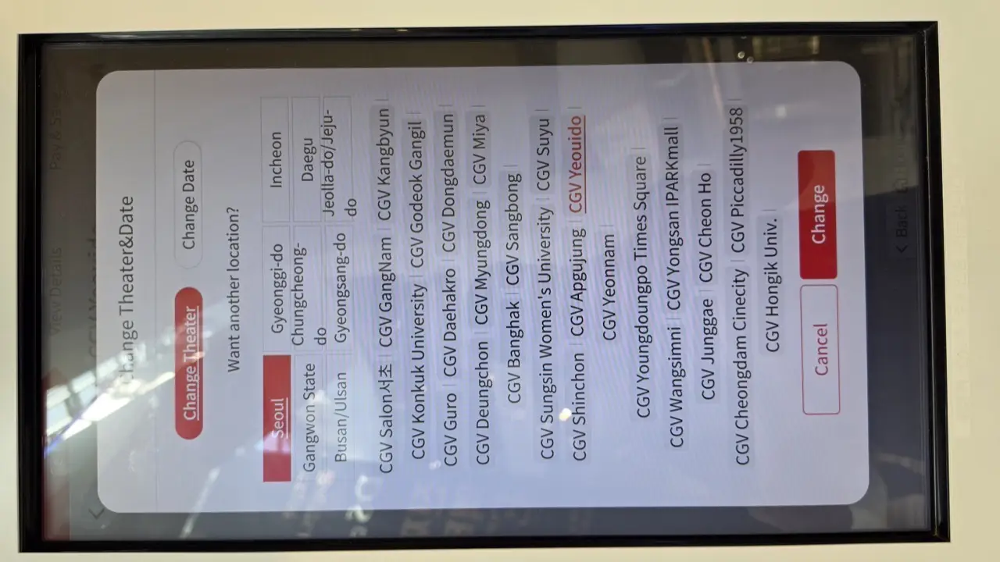

Here's a scene that plays out every blockbuster season. A traveler
planning a December Seoul trip wants to see *Avatar: Fire and Ash* on a
big Korean screen — and hits a wall weeks before the flight: **CGV and
Megabox both demand Korean phone verification to make an account**, and
even reaching customer service requires... a Korean phone number. Panic
sets in: *will it be sold out before I even land?*

The answer — and it surprises everyone — is *mostly no*, and the parts
that do sell out have workarounds. Movie night in Korea is a premium
experience at a reasonable price: recliner seats, famous IMAX screens,
popcorn flavors you'll write home about. The catch is upstream, in the
booking system that assumes you're Korean. Here's the whole thing.

## The three chains

- **CGV (cgv.co.kr)** — the biggest, with the famous special formats:
  the giant Yongsan IMAX (the one film fans fly in for), 4DX motion seats,
  and ScreenX wraparound screens.
- **Lotte Cinema (lottecinema.co.kr)** — everywhere, often inside Lotte
  malls, with its own premium halls and comfortable standard seats.
- **Megabox** — the third player, strong on Dolby Cinema and cozy
  boutique-style branches.

The chains keep their branches sharp, too — the photos in this guide are
from **CGV Yeouido in the IFC Mall**, which reopened on July 31, 2026
after a full renovation (we shot these the following week):

*CGV Yeouido, a week after its 2026 reopening · ⓒ @BalliBalliSeoul*

Quality is high across all three; in practice you pick by what's near you
and which special format you're chasing. All seating is **assigned** — you
choose your exact seat on a map at booking, and people respect it.

## The one label that matters: 자막 vs 더빙

Foreign films screen in their **original language with Korean subtitles**
by default — so Hollywood releases are fully watchable with zero Korean.
The trap is animation and family films, which often screen in two
versions: **자막 (jamak, subtitled — original audio)** and **더빙 (deobing,
dubbed in Korean)**. That one word in the showtime listing is the
difference between Pixar in English and Pixar in Korean. Korean films,
meanwhile, generally have no English subtitles — though CGV and others
occasionally run English-subtitled screenings of big Korean hits, worth
hunting for when one is having a moment.

## What it costs in Seoul

As of 2026, rough figures:

| Ticket                          | Typical price          |
| ------------------------------- | ---------------------- |
| Standard 2D, weekend evening    | Around ₩14,000–16,000  |
| Early-morning (조조) shows      | Several thousand won cheaper |
| Culture Day — last Wednesday of the month | Discounted evening shows (around half price) |
| IMAX / 4DX / Dolby / recliner halls | ₩20,000–30,000+    |

Two savings habits locals use: **조조 (jojo)** early-bird screenings before
roughly 10–11 AM, and **Culture Day (문화가 있는 날)** — the last Wednesday
monthly, when evening tickets drop steeply. Telecom memberships (SKT, KT,
LG U+) also carry standing cinema discounts if you have a Korean plan.

## How to actually book

**The apps and websites** (CGV, Lotte Cinema, Megabox) are the full-feature
route — real-time seat maps, special format schedules — but they lean
Korean: membership sign-up, phone verification, and payment steps are the
usual foreign-card lottery. CGV and Lotte both run limited English
versions of their sites that cover the basics for major branches.

**First, the reassuring math.** Blockbusters here screen at a density
that makes sell-outs rare: when *Avatar: Fire and Ash* was peaking last
winter, **COEX alone ran it about 21 times in a single Thursday** — and
that's one multiplex among dozens in Seoul. For regular 2D screenings,
even in opening weeks, a same-day seat has almost always existed. The
traveler above didn't need an account at all.

**The kiosk is your friend.** Every theater lobby has self-service kiosks
with an English mode. Walk in, tap English, pick seats, pay by any card —
no membership, no Korean phone. For a normal movie night this is honestly
the easiest route. (The catch is direction-specific: kiosks happily
*sell* you a walk-up ticket, but *picking up* an online reservation can
require the Korean-verified account that made it — so for tourists the
kiosk is a buy-here machine, not a pickup counter.)

The English switch is one tap, bottom of the home screen:

*The ENGLISH button is right there on the Korean screen · ⓒ @BalliBalliSeoul*

*And the whole machine follows — ticketing, refunds, even parking · ⓒ @BalliBalliSeoul*

And here's the kiosk trick most people — including plenty of locals —
don't know: **the kiosk isn't limited to the theater you're standing
in.** Tap "Change Theater&Date" and you can buy tickets for *any*
branch of the chain nationwide, any date — the full list comes up in
English:

*Buy here, watch anywhere — the whole chain in English · ⓒ @BalliBalliSeoul*

That turns any nearby branch into a booking office for your whole
trip: drop in while passing a mall, buy Saturday's show at the branch
near your hotel, and walk out with the tickets sorted — no app, no
verification, no race.

The flow is the same everywhere: branch → movie → showtime (check that
자막/더빙 label!) → seat map → payment. If you booked online, the kiosk
prints your ticket from the booking number or the card you paid with —
no membership required for that part. One cultural note: pre-show ads run
long, so the actual film starts around ten minutes after the printed time,
but don't push it — assigned seating means latecomers shuffle past people
in the dark.

**The special-format exception**: Yongsan IMAX and other famous halls for
a big release sell out **the moment booking opens**, days ahead — for the
*Avatar* opening that race was over in minutes. It's an app-only contest,
and exactly the kind that Korean verification walls make unfair for
visitors. (The same wall we've mapped in our
[Korean apps guide](/blog/coupang-korea-shopping-guide/).) That specific
case — "I need the famous screen on a specific night" — is when you
can't kiosk your way out, and the realistic options are a Korean friend,
or us (below).

**The art-house bonus** most visitors never hear about: Seoul's indie
cinemas — **Emu Cinema** near Gyeonghuigung and **KU Cinema** by Konkuk
University are the names regulars trade — program Korean and world
cinema, and English-subtitled screenings of Korean films turn up here
far more often than at the big chains. If your trip wish is "watch a
*Korean* film in a theater and actually understand it," start there.

## Concessions, briefly

Korean cinema popcorn is a genre of its own — caramel and onion
(yes, onion; order half-half) — plus dried squid, hot dogs and beer at
many branches. Combos are cheap enough that smuggling snacks isn't the
sport it is elsewhere.

## The Korean part

Reading 자막/더빙 labels, racing an IMAX booking window through a Korean
membership flow, or finding the one English-subtitled screening of the
Korean film everyone's talking about — that's where a movie night dies in
the planning stage. Through our
[anything-else concierge service](/etc), tell us the film, the format and
the night, and we book the seats — center block, subtitled version
confirmed — and send you the ticket. First answer is free.

## Get it sorted

> **Chasing IMAX seats or just want Friday sorted?** Message us on
> [WhatsApp](https://wa.me/821075191282) with the movie and your preferred
> time — we'll confirm the subtitled screening and book the good seats
> before they're gone. First answer is free.

And for a first taste of why Korean cinema culture is special: book a
recliner hall for a film you already wanted to see, order the half-caramel
half-onion popcorn, and thank us later.
