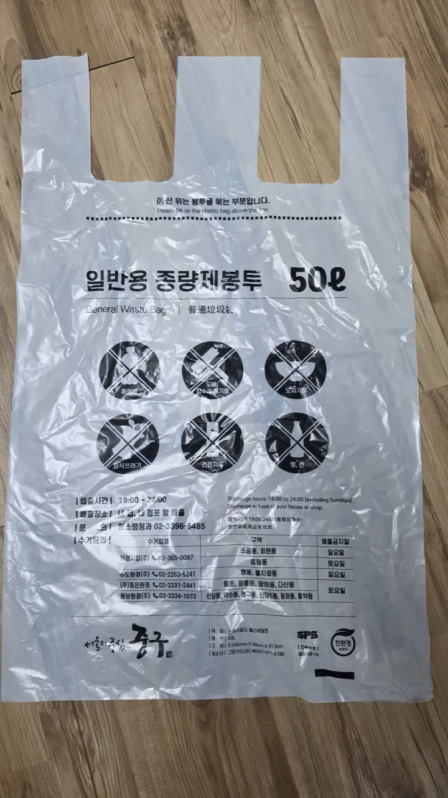
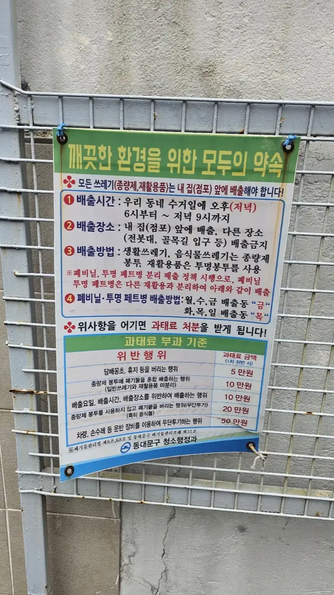
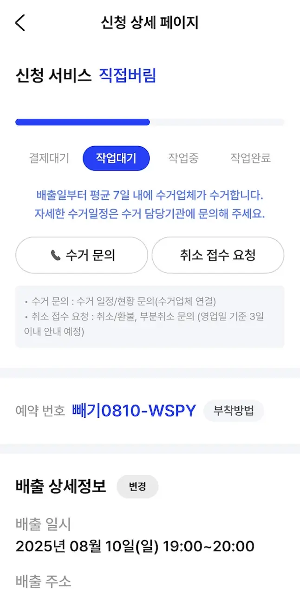

Somewhere in your first month in Korea, it happens: your trash bag comes
back. Maybe it's still by the door with a sticker scolding you in Korean,
maybe a neighbor or the building office had words. Korea takes garbage
seriously — it's sorted into four separate streams, two of them are legally
mandatory, and getting it wrong carries actual fines. Here's the whole
system, once and for all.

## The four streams

**1. General waste (일반쓰레기)** goes only in your district's **official
pay-per-volume bag** (종량제 봉투, *jongnyangje bongtu*). Buy them at any
convenience store or mart counter — they're kept behind the register, so
ask. Two rules: bags are district-specific (a Mapo bag doesn't work in
Gangnam), and a regular black plastic bag on the curb is exactly what gets
you fined.

*This is the bag to buy · ⓒ @BalliBalliSeoul*

This is what you're asking for at the counter — a 50L general-use bag from
Jung-gu. Handily, the bag itself is the rulebook: the crossed-out icons
show what can't go in (food waste, batteries, bottles and cans...), and
the fine print gives the district's put-out hours — here, 7 p.m. to
midnight, in front of your own building. Common sizes run 10L to 75L; 20L
is the sweet spot for most one-person apartments.

**2. Food waste (음식물쓰레기) — separating it is not optional.** Korea
recycles food waste into animal feed and biogas, so it never goes in the
general bag. Depending on your building, it goes in a dedicated
food-waste bag, a communal bin you unlock with an **RFID card** that weighs
and charges you, or a paid sticker on a small bucket. The food-waste bags
(음식물 봉투) are sold at the same neighborhood mart and convenience store
counters as the general ones — ask for them by name, and again, buy them
in your own district. The counterintuitive
part: things animals can't eat are *not* food waste — bones, big shells,
eggshells, tea bags and fruit pits generally belong in the general bag.
When in doubt, ask us or your building office.

**3. Recycling (재활용)** is free, but sorted by material: paper, cardboard
(flattened), plastic, PET bottles (labels peeled, caps separate in many
buildings), glass, cans, and film/vinyl as its own category. Rinse
containers first — dirty recycling gets rejected. Apartment complexes
usually run a designated recycling evening once a week at the communal
station; villas and one-rooms put sorted bags curbside on set nights.

**4. Bulky waste (대형폐기물)** — furniture, mattresses, appliances,
anything that won't fit in a bag — has its own official process. More on
that below, because it's the one that catches everyone.

## The fines are real

Illegal dumping — general trash in the wrong bag, food waste mixed in,
furniture quietly left by the curb — is an actual offense, with fines
commonly starting around ₩100,000 and climbing for repeat cases (as of
2026). Residential areas have CCTV pointed at known dumping spots, and
building offices do check bags. This isn't a "nobody really cares" rule.

District offices spell it out on posters like this one from Dongdaemun-gu:
₩50,000 for tossing cigarette butts or tissues, ₩100,000 for mixing
recyclables into the general bag or putting trash out on the wrong
day/place, ₩200,000 for dumping without the official bag (especially food
waste), and up to ₩500,000 for hauling stuff out by car or cart. It also
shows the typical put-out window — collection-day evenings, 6–9 p.m., in
front of your own building.

*A district fine schedule · ⓒ @BalliBalliSeoul*

## Bulky waste: the official process

You can't just haul a bookshelf to the curb. The legal route:

1. **Report it to your district office (구청)** — every district runs an
   online declaration system, and most now take reports through an app or
   website where you select the item type and size.
2. **Pay the disposal fee** — set by item: small furniture runs a few
   thousand won, wardrobes, sofas and large appliances more (fees vary by
   district and size).
3. **Print or write the sticker/receipt number** and attach it to the item.
4. **Put it at the designated spot** (usually beside the building's
   recycling area) on the scheduled date.

The app most Seoul districts plug into is **Ppaegi (빼기)** — you pick the
item, pay in-app, and get a reservation number instead of a paper sticker.
Here's what a filed report looks like:

*A filed report in the Ppaegi app · ⓒ @BalliBalliSeoul*

Note the fine print on that screen: pickup happens **on average within 7
days** of your chosen put-out date — the app is Korean-only, which is
exactly the kind of thing we file for you.

No internet or the site defeated you? The **local community service center
(주민센터, *jumin-senteo*)** handles the same declaration in person — bring
the item's details and pay there.

Two timing notes. Declarations aren't instant — districts assign a pickup
date, so if you're moving out, **file several days before your move**, not
the morning of. And your building may have its own rules about where bulky
items wait for pickup, so a quick word with the building office (관리사무소)
saves an argument.

Before you pay to throw furniture away, though: if it still works, Koreans
sell or give it away on secondhand apps first — one person's disposal fee
is another's free pickup. Worth an hour's try.

## The Korean part

Every step of this system speaks Korean: the district's declaration website,
the item-category dropdown menus, the 주민센터 counter, the building's
recycling-night rules, the RFID card registration for food waste. And the
rules genuinely differ by district and even by building — which is why
expat forums are full of contradicting advice.

This is a thing we handle constantly, especially around move-outs. Through
our [moving help service](/moving), we file the bulky-waste declaration for
you, get the sticker sorted, and coordinate the haul-out — and for
everything else (which bag, which bin, which night, what your specific
building expects), our [anything-else concierge service](/etc) answers in
plain English.

## Get it sorted

> **Moving out, or staring at a wardrobe you can't legally throw away?**
> Send us a photo on [WhatsApp](https://wa.me/821075191282) — we'll tell you
> what it costs to dispose of, file the district report for you, and arrange
> muscle if you need it. First answer is free.

And the one-line version to keep: **general waste in the district bag, food
waste separate, recycling rinsed and sorted, big stuff reported first.**
Follow that and your trash will never come back to haunt you.
