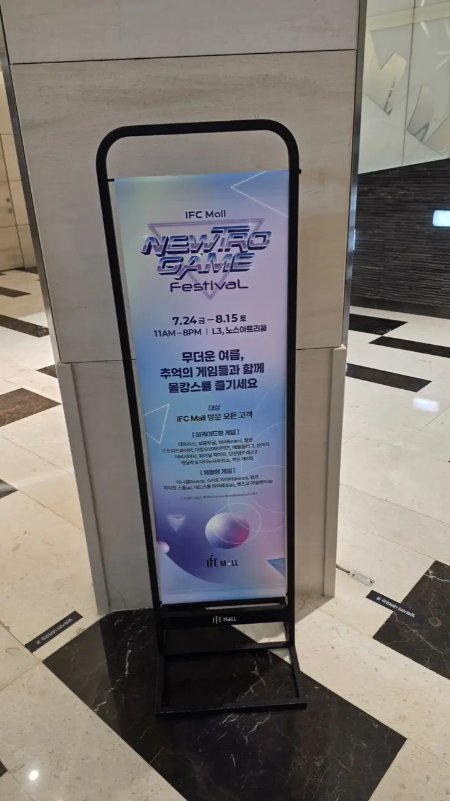

It's 38°C, the air feels like soup, and you flew a long way to see
Seoul — not the inside of your hotel room. This is the summer
problem every visitor hits, and Koreans solved it decades ago:
**you don't fight the heat, you go indoors and stay there.** The
most efficient version of that plan in Seoul right now is a single
building in Yeouido, where a cinema, a hundred restaurants, cafes,
shopping and a subway station all sit under one roof — **IFC
Mall**.

## Why this mall specifically

Seoul has bigger malls. IFC's advantage is that it's **completely
connected underground**: Yeouido Station (Lines 5 and 9) opens
directly into it, so you arrive without ever walking outside.
Three underground floors of shops and restaurants, a multiplex, a
hotel, and office towers above — you could spend eight hours here
and never see the sun.

Its other advantage is location: the **Han River park is a short
walk away** for when the sun finally drops, which makes IFC a
natural "hide until evening, then go to the river" base.

## Right now: a free retro arcade festival

The reason we're writing this in August: IFC Mall is running a
**Newtro Game Festival** on the **L3 North Atrium** — a free
pop-up arcade set up in the middle of the mall.

*The details, on a banner by the escalators · ⓒ @BalliBalliSeoul*

The essentials:

| | |
| --- | --- |
| **Dates** | July 24 – **August 15, 2026** |
| **Hours** | 11:00 – 20:00 |
| **Where** | L3, North Atrium |
| **Cost** | **Free**, for any IFC Mall visitor — around 20 minutes per person |

The cabinet lineup is a straight nostalgia raid: **Tetris, Bubble
Bobble, 1945, Tekken, Street Fighter, The King of Fighters, Metal
Slug, Final Fight, Dungeons & Dragons 2, Cadillacs & Dinosaurs**.
Alongside them sit the physical Korean arcade staples — **rhythm
and dance machines, motorbike racers, and Pump It Up-style step
games** — which is where the real spectacle is, because Korean
teenagers play those at a level that draws a crowd.

Two honest notes: it's **popular, so there's a wait** at the
fighting cabinets on weekend afternoons, and **it ends on August
15** — after that, this section is a memory and the rest of this
guide still stands.

## The rest of the building

- **CGV Yeouido** — the multiplex here reopened on July 31, 2026
  after a full renovation, so the seats are new. Buying a ticket
  is easier than you think: the kiosks have an English mode and
  you don't need a Korean account. We wrote the whole
  [movie ticket process](/blog/how-to-book-movie-tickets-korea/)
  step by step, with photos from this very branch.
- **Food** — a large basement dining floor covering Korean, fast
  food, Japanese, and chains, plus sit-down restaurants on the
  upper levels. Prices are mall prices, not street prices, but the
  variety means nobody in your group has to compromise.
- **Cafes** — several, all with the standard Korean deal: one
  americano rents you a table for as long as you want it. On a
  heat-wave afternoon that's the best value in the building.
- **Shopping** — fashion, cosmetics, electronics and a big
  bookstore, which is a fine place to lose an hour in the cold.

## Practical bits

- **Getting there**: Yeouido Station (Line 5, Line 9) — take the
  IFC-connected exits and you'll never surface. From Seoul Station
  it's a short ride; from Gangnam, Line 9 is direct.
- **Hours**: mall shops typically run late morning to 10 p.m.;
  restaurants and the cinema run later. Check before a late plan.
- **Payment**: card everywhere, and **no tipping** — the kiosks
  don't even have the option
  ([here's why](/blog/no-tipping-in-korea/)).
- **The heat itself**: this summer has broken records, and the
  heat has been serious enough to
  [shut down the national baseball league](/blog/kbo-games-cancelled-heat-wave/).
  Plan outdoor sightseeing for before 11 a.m. or after sunset, and
  spend the middle of the day in a building like this one.

## Get it sorted

> **Planning a day in Seoul around the heat — or stuck on a
> Korean-only booking page?** Message us on
> [WhatsApp](https://wa.me/821075191282) and our
> [anything-else concierge service](/etc) will map the day, book
> what needs booking, and answer the questions in English. First
> answer is free.

The one-line version: **take Line 5 or 9 to Yeouido, never go
outside, watch a film, eat, sit in a cafe, and if you're here
before August 15, play Metal Slug for free on the way through.**
Seoul in August rewards people who plan indoors.
