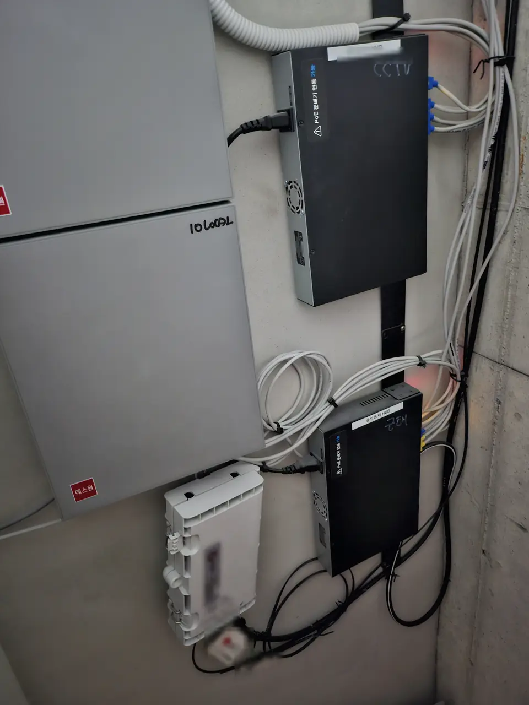
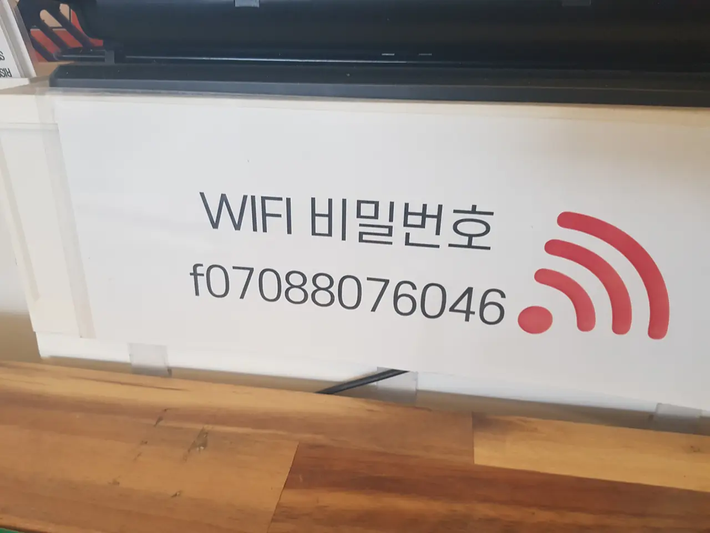
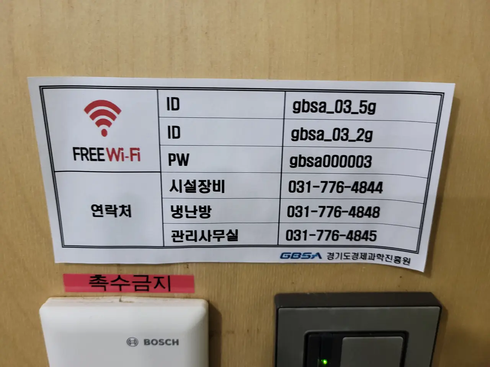

Somewhere in your first week, someone will tell you to sign up for
internet. They will quote you a very low monthly price, mention a large
cash payment coming back to you, and slide a **three-year contract**
across the table.

You may be here on a one-year visa.

Nobody in that conversation is lying to you. But the deal you are being
shown is the only one they are paid to show you, and **there is a second
option that is never mentioned unless you ask for it by name.**

## First: check whether you already have it

Do this before anything else, because the cheapest internet in Korea is
the line that is already in the wall.

**Never sign a contract before you have checked.** Not "I'll sort the
building out later" — before. **In Korea the building itself is very
often already a subscriber**, and a great many people pay for a second
line they never needed because nobody thought to ask.

- **Dormitories and student housing** are the clearest case: the
  building holds the contract and every room is on it. There is nothing
  for you to buy.
- **One-rooms and officetels** very often include internet in the
  **관리비 (maintenance fee)**. The router is already mounted, and the
  password is on a sticker or with the building office.
- **Share houses, coliving and goshiwon** almost always include it —
  it is part of what "all inclusive" means here, along with water,
  electricity and gas.
- **Some buildings have a bulk contract** with one provider. You may be
  able to join it for far less than a retail plan, and you may not be
  able to use anyone else at all.

Ask the landlord or the building office two questions: *is internet
included in the 관리비*, and *is there a building contract*. If you are
still at the viewing stage, that belongs on the same list as everything
else in
[what to check before you sign](/blog/what-to-check-before-renting-seoul/).

**If it is included, stop reading.** You are done, and you have just
saved yourself around ₩500,000 over two years.

## The offer you will actually be given

Korea has three national providers — **KT**, **SK Broadband** and
**LG U+** — plus regional cable operators. What they sell, almost
without exception, is a **3년 약정**: a three-year contract.

Two things make that contract look irresistible.

**The monthly price is roughly half.** Guide figures as of 2026, for a
500M line:

| | Monthly |
| --- | --- |
| **3-year contract** | around **₩22,000–27,500** |
| **No contract (무약정)** | around **₩42,900** |

**And you are handed cash.** Sign through one of the reseller
comparison sites and you get a **현금사은품** — a cash gift, commonly in
the **₩200,000–400,000** range depending on the provider, the speed,
and whether you add IPTV. It is paid by the reseller, not the carrier,
which is why the amount changes month to month and why the person
selling it to you is so enthusiastic.

**One catch is worth knowing before you compare anything.** Those low
monthly figures generally assume you **bundle the line with a mobile
plan from the same carrier**. If your phone is on a different network —
or on a prepaid SIM, which is where a lot of new arrivals start — the
headline number is not the number you will pay. Ask for the price
*without* the bundle, and ask for it in writing.

## Why the three-year contract is a trap on a short visa

It is not a trap for a Korean family. It is a trap for someone whose
permission to be in the country is shorter than the contract.

Leave a contract early and you pay two separate things:

**1. 할인반환금 — the discount clawback.** Every won of monthly discount
you enjoyed gets recalculated across the months you did not stay. Cancel
a three-year deal after one year and you are handing back two years'
worth of discount.

**2. The cash gift, in full.** Cancel inside the first year and the
₩300,000 that felt like free money is repayable in full. Reseller terms
vary — the obligation typically lapses somewhere between the ninth and
the thirteenth month — but **treat the gift as a loan until you are past
a year**, because that is what it is.

Neither of these is hidden. Both are in a Korean contract you signed at
speed, and both are enforced.

**So be careful about what the gift is doing to your judgement.** A
₩300,000 payment and a monthly price that looks half-off are a good
offer, and they are also the reason people sign three years for a flat
they will leave in one. The offer is not the question. **The question is
how long you can actually live at that address** — and that is set by
your lease and your visa, not by how good the deal feels in the shop.

Work that number out first. Then look at the offer.

**You can check your own number.** The carrier apps — 마이 KT, T world,
My LG U+ — show your live cancellation charge under the contract
section. Look before you decide anything, not after.

## The option nobody offers you: 무약정

**무약정 (mu-yakjeong)** means "no contract". It is a real, standard
product from all three carriers, and it is almost never the first thing
you are shown, because there is no cash gift attached and therefore very
little in it for the person signing you up.

What you get:

- **No minimum term.** Cancel any month.
- **No 위약금.** Nothing to claw back, because nothing was discounted.
- **No cash gift**, and a monthly bill roughly double the contract rate.

Put plainly: **you are paying about ₩20,000 a month to keep the freedom
to leave.**

That is a bad deal if you are staying four years. It is a perfectly
rational one if your lease is twelve months, your visa is twelve months,
and you genuinely do not know where you will be next spring.

### Which one is actually cheaper

There is no clean break-even, because the cash gift swings by hundreds
of thousands of won depending on the month and the reseller. But the
shape of it is stable:

| Your situation | Usually right |
| --- | --- |
| Staying two years or more, and fairly sure | **3-year contract.** The gap is large and the gift is real money |
| One-year lease, likely to renew | **Contract**, but read the clawback and diarise month 13 |
| One-year lease, genuinely unsure | **무약정.** You are buying certainty, and it is not expensive certainty |
| Subletting, or someone else's name on the lease | **무약정**, or nothing at all |
| Under six months | Don't install a line — see the alternatives below |

## Direct, or through a reseller

This is the part that decides whether the cash gift is on the table at
all, and almost nobody explains it.

**The carrier does not pay the gift. The reseller does.** Comparison
sites and 대리점 earn a commission from the carrier for every signup and
hand part of it back to you as 현금사은품. Go straight to KT, SK
Broadband or LG U+ and there is no middleman, so there is nothing to
hand back.

| | Through a reseller | Direct to the carrier |
| --- | --- | --- |
| Cash gift | **₩200,000–400,000** | **None** |
| What they push | The three-year contract | Whatever you ask for |
| 무약정 | Rarely offered | Ordinary request |
| English | Rare | KT runs a service for foreign customers; the other two vary |

So the honest version is this. **If you are staying two years or more
and you want the contract anyway, the gift is real money and it exists
only through a reseller.** Go and get it. Nobody should talk you out of
a few hundred thousand won that is genuinely yours.

**If you want 무약정, or you do not yet know how long you are staying,
going direct costs you nothing** — there was no gift on that product in
the first place — and it removes the person whose income depends on
talking you into three years.

### All three run a foreigner line. Here they are

You do not need anybody's help to make this call. Each of the three
carriers staffs a customer centre for foreign customers, the numbers are
public, and the freephone ones cost you nothing.

| Carrier | Free from inside Korea | Also | Languages |
| --- | --- | --- | --- |
| **KT** | **080-448-0100** | 02-2190-1180 (charged) · from abroad **+82-2-2190-0901**, free from a KT handset | English, Chinese, Vietnamese, Russian |
| **LG U+** | **080-851-1004** | **114** free from a U+ handset · from abroad +82-2-3416-7000 (charged) | English, Chinese, Vietnamese |
| **SK Telecom** | **080-252-5011** | **114** free from an SKT handset · roaming centre +82-2-6343-9000, 24/7 · callcenter@sk.com | English, Japanese |

All three keep **weekday office hours, roughly 09:00–18:00**, and are
closed at weekends and on public holidays.

**Two warnings before you dial.**

**KT closes for lunch, 12:00–13:00.** It is a real closure, not a
slowdown — ring at 12:30 and nobody answers. Assume the other two are no
better staffed over lunch.

**SK is two companies.** That number reaches **SK Telecom**, which is
the mobile business. Home internet is sold by **SK Broadband**, a
separate company in the same group, so expect to be redirected if you
ring the foreigner line about a broadband line. KT and LG U+ sell both
under one brand, which is one small reason they are easier to deal with
here.

## What you need to sign up

**There is no legal restriction on foreigners taking a fixed-line
internet service in Korea.** The obstacles are practical, and there are
three:

1. **Identity verification.** The signup runs through the same
   verification wall as everything else here, which normally means a
   Korean mobile number in your own name. This is the single most common
   place the process stops — it is the same wall described in
   [renting without an ARC or a phone](/blog/student-housing-seoul-no-arc/).
2. **An ARC, or a passport.** Long-stay residents sign with an alien
   registration card. Without one, expect a shorter menu, a deposit, or
   prepayment.
3. **A Korean payment method** for the monthly direct debit. If that is
   still outstanding,
   [opening a bank account](/blog/open-bank-account-korea/) comes first.

## Installation day

A technician comes to the flat. The visit is usually short — often under
an hour — and in most buildings the line already exists and only needs
activating at your unit.

*Your line starts here, not at your door · ⓒ @BalliBalliSeoul*

That cabinet is somewhere in your building — a riser cupboard, a
basement room, a corridor ceiling. It is why most installations are
quick: the fibre already reaches the building, and the technician is
connecting your unit to something that is already there.

Three things to sort before they arrive.

**Decide where the router goes.** It wants to be central and off the
floor, not tucked behind a wardrobe in the corner of a one-room. You
live with this decision for as long as you live there.

**Ask whether anything gets drilled.** Usually nothing does. If the
technician needs to drill through a wall or run trunking, that is a
change to somebody else's property — **get the landlord's agreement
first**, in a message rather than a doorway conversation.

**Photograph it afterwards.** The router, the wall plate, and any new
cable, on the day. It is the same reflex as
[the move-in photographs](/blog/photograph-your-flat-move-in-day/), for
the same reason: what was already there and what you added stop being
arguable.

## When you move

Do not cancel. Ask for **이전설치** — a transfer. The line moves with
you, the contract continues, and you keep the deal you signed.

**But check the new flat before you book the transfer**, because this is
where a long contract turns into a real problem. Plenty of Korean
one-rooms and officetels already have a line in the wall, or include
internet in the 관리비. Move a contract into one of those and you are
paying twice for the same thing — and you cannot simply stop, because
the contract is still running and the clawback is still waiting.

That leaves you choosing between paying for a line you do not use and
paying to end it. **Neither is a good outcome, and both are avoidable by
asking one question before you sign the new lease:** is internet
included here.

One exception is worth knowing: if the new building genuinely cannot
take your provider, that is not an ordinary cancellation, and **you
should ask directly whether the penalty is waived**. Carriers do have
provisions for this and for persistent quality failures. Ask, in
writing, before you agree to pay anything.

Book the transfer in the same week you book the movers and the clean —
it belongs in the same
[move-week sequence](/blog/moving-company-seoul-quotes/), and technician
slots on the busy end-of-month dates go early.

## Or skip the line entirely

For a short stay, a fixed line may not be worth the paperwork at all.

**An unlimited mobile plan and tethering** covers one person working
from a laptop more comfortably than most people expect. It is worse for
video calls, worse for a household, and it drains your handset.

**A pocket Wi-Fi router (에그)** rents by the day or month and needs no
installation and no technician.

Both are honestly worse than a real line. Both are also cancellable
tomorrow, which is the entire point if your plans are not settled.

**And Korea is unusually generous with free Wi-Fi.** Cafes post the
password on the counter, public buildings put it on the wall, and
neither expects you to ask.

*Cafes put it where you will see it · ⓒ @BalliBalliSeoul*

*Public buildings print the network and the password · ⓒ @BalliBalliSeoul*

None of that replaces a line at home. It does mean that the week between
moving in and getting connected is survivable, which is worth knowing
before you panic-sign three years on your second day.

## The Korean part

Every step of this is in Korean, and two of them are worse than they
look.

**The comparison sites are the market.** Almost nobody signs up on the
carrier's own website, because the cash gift only exists through
resellers. Those sites are Korean-only, the offers change weekly, and
the number you are quoted on the phone is not always the number that
arrives.

**The word 무약정 has to come from you.** Ask for the contract price and
you will be given it. Ask which options exist and you will usually be
given the contract price again. **Say the word.**

Then get three things confirmed in writing before you agree: the monthly
price *without* a mobile bundle, the contract length, and the exact
cancellation charge if you leave after twelve months.

> **Call the carrier directly — that is the short version.** The three
> numbers above are free and staffed in English, and there is no question
> on this page they cannot answer better than a website can. Ask them
> what you should be signing up for, and ask them to explain any word you
> do not recognise.
>
> **If that turns out to be hard, ask us instead.** Message us on
> [WhatsApp](https://wa.me/821075191282) or
> [KakaoTalk](https://pf.kakao.com/_RJxhSX/chat) — with your address and
> how long your lease runs if you have them, and without them if you do
> not. Asking costs nothing.

## Get it sorted

Check the 관리비 first. If internet is not included, work out how long
you are actually staying before anyone quotes you a monthly price —
that number, not the speed, is what decides this.

Then decide direct or reseller, because that decision is worth a few
hundred thousand won either way, and only you know your dates.

**Then call the carrier yourself.** That is genuinely the whole
instruction. The three foreigner lines above are free, they are staffed
in English, and for most people that call is the entire job. You do not
need a middleman and you should not pay for one.

**Ask them the questions, too.** Which product you should be on, what a
word on the quote means, whether your building already has a line — that
is what the foreigner line is for, and it is free.

**If that turns out to be hard, ask us instead.** People usually get
stuck in one of four places: the line keeps office hours you are also
working, the verification wall stops you before you get a price, the
address turns out to be complicated, or the quote does not match what
you were told. Message us on
[WhatsApp](https://wa.me/821075191282) or
[KakaoTalk](https://pf.kakao.com/_RJxhSX/chat) and we take it from there
in Korean — through our [concierge service](/etc), which you pay for and
nobody else does.

**No carrier pays us, and we take no share of any cash gift.** If a
reseller is the better answer for your dates, we will say so, and that
money goes to you rather than through us.

If the move itself is still unsettled,
[moving quotes in Seoul](/blog/moving-company-seoul-quotes/) and
[move-in cleaning](/blog/move-in-cleaning-seoul/) are the other two
things happening that week.
