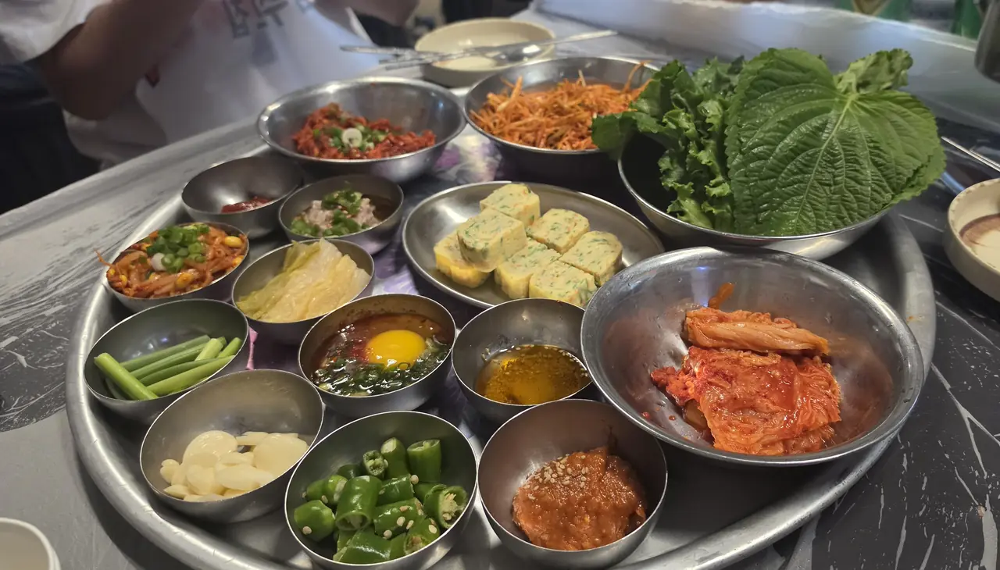
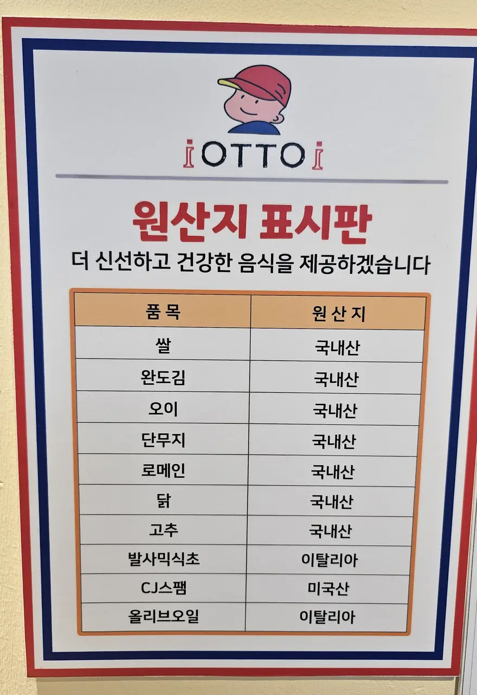
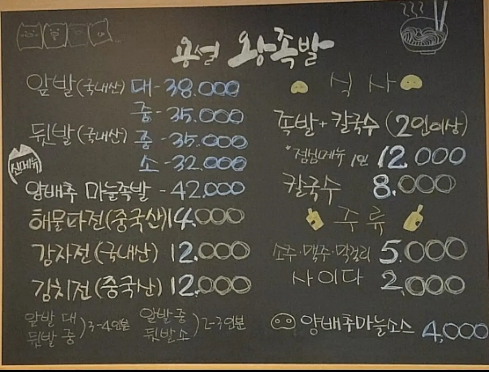

You came to Korea and you are going to eat kimchi. Good. It will arrive
before you order anything, free, and it will be refilled without you
asking.

*Nobody ordered any of this. The kimchi is the bowl on the right · ⓒ @BalliBalliSeoul*

But there is a line printed on the menu — or on a small board screwed to
the wall — that decides whether the kimchi in front of you was made from
Korean cabbage or imported cabbage. Most visitors never notice it, because
it is written in Korean and looks like fine print.

It isn't fine print. It's the law, and it's there for you to read.

## The line

Somewhere on the menu, or on a printed sheet near the counter, you will
find something like this:

> **배추김치 (국내산)**

Three things to know:

| Korean | Say it | What it means |
| --- | --- | --- |
| **배추김치** | *baechu-kimchi* | Cabbage kimchi — the default kind |
| **원산지** | *won-san-ji* | Country of origin |
| **국내산** | *gungnae-san* | Grown in Korea |
| **중국산** | *jungguk-san* | Grown in China |

That's the whole skill. Find **배추김치**, read the word in the bracket
beside it. If it says **국내산**, you're eating Korean cabbage. If it says
**중국산**, you're eating cabbage that was grown in China and very likely
turned into kimchi there too.

**Korean restaurants don't get to skip this.** Origin labelling is a legal
requirement, not a courtesy, and cabbage kimchi is specifically on the list
of items that must be declared. That's why even a tiny 분식 shop with six
tables has a laminated sheet on the wall.

It shows up in one of two formats. The first is **a board on the wall** —
two columns, 품목 (item) on the left and 원산지 (origin) on the right:

*A real one: rice, Wando gim, cucumber, pickled radish, romaine, chicken
and chilli all 국내산 — with the balsamic and olive oil declared as Italian
and the Spam as American · ⓒ @BalliBalliSeoul*

Two things that board teaches you at a glance. **It isn't only about
kimchi** — rice, meat, seafood and more all have to be declared, which is
why the list is long. And **honest imports are normal**: nobody is hiding
that the olive oil came from Italy. The label is a disclosure system, not
an accusation.

Two practical notes:

- **The sheet is usually Korean-only.** Photograph it and run it through a
  translation app — it takes ten seconds and the layout is always the same.
- **If you can't find it, ask.** *"김치 국내산이에요?"* — **kimchi
  gungnae-san-ieyo?** — "Is the kimchi Korean?" Staff hear this from Korean
  customers constantly. It is not a rude question here.

## Why so many restaurants serve imported kimchi

Not a scandal — arithmetic.

Kimchi made from Korean cabbage costs meaningfully more than kimchi made
from Chinese cabbage, and kimchi is given away free, in unlimited refills,
at a table where the main dish might be ₩9,000. For a small restaurant
running on thin margins, the side dish that nobody pays for is the first
place the cost gets squeezed.

The second format shows you this happening in real time: **the origin
written in brackets after each dish, right on the price list.**

*One board, one restaurant, three different answers · ⓒ @BalliBalliSeoul*

Read down that board and the economics are laid out for you. The 족발
(pork trotters) — the dish people come for, at ₩32,000–38,000 — is
**국내산**, Korean. The potato pancake is **국내산**. But the seafood
pancake and the **kimchi pancake are 중국산**, Chinese.

Nothing is being hidden. The restaurant buys Korean pork because Korean
pork is what the customer is paying for, and buys imported cabbage for the
₩12,000 pancake because that is where the margin lives. **The label lets
you see exactly where a kitchen decided to spend and where it decided to
save** — and then lets you order accordingly.

So the pattern is roughly this: the cheaper and more volume-driven the
dish, the likelier the cabbage is imported. Places that make their own
kimchi — and there are many — usually say so loudly, because it is a
selling point.

None of which makes imported kimchi unsafe. It makes it *not the thing you
travelled for.* You can buy Chinese-made kimchi in your own country. You
came here for the other one.

## The news that made everyone start reading labels again

In August 2026 a Chinese blogger posted video from a cabbage-buying yard in
**Kangbao County, Zhangjiakou, Hebei Province**, showing workers dipping
cabbages into a liquid before loading them onto trucks. Containers on the
truck were labelled **formaldehyde solution**. Someone on site explained
that treating the cabbage this way kept it looking fresh for another two or
three days.

The local government investigated and **confirmed the video was accurate**,
calling it an illegal act by a produce buyer trying to preserve freshness in
transit. Police took enforcement action against the people and vehicles
involved. China's central government then ordered the shipment traced and
launched nationwide spot-testing of perishable vegetables, promising that
violations would be "severely punished."

Formaldehyde is classified by the IARC as a **Group 1 carcinogen** —
the category reserved for substances with sufficient evidence of causing
cancer in humans. Using it as a food processing aid is already illegal in
China under its own food safety law.

**Now the part that most of the reposting leaves out, and that we are not
going to leave out:**

- The batch was traced to a wholesale market in **Suqian, Jiangsu**, and
  the testing done there **had not found formaldehyde above legal limits**
  at the time of reporting.
- **There is no confirmation that any of this cabbage was exported to Korea
  or anywhere else.** As of the reporting, neither Chinese authorities nor
  major Chinese outlets had established that.

So this is not "the kimchi in Seoul is poisoned." It is context — the
reason a Korean diner's eyes go to that origin line by reflex, and the
reason the labelling law exists in the first place. Read the label because
it is there and it is free information, not because you are in danger.

**Source:** [머니투데이, 24 August 2026](https://www.mt.co.kr/world/2026/08/24/2026082408313071622).

## How to end up with Korean kimchi

**At restaurants.** Look for **국내산** on the origin sheet. Restaurants
that make kimchi in-house often advertise it on the window or the menu —
**직접 담근 김치** (*jikjeop damgeun kimchi*, "kimchi we made ourselves")
is the phrase. Kimchi-forward restaurants — a 김치찌개 specialist, a
kimchi-jjim place, an old 백반 house — are the ones most likely to care,
because kimchi is the product rather than the freebie.

**At the supermarket.** Packaged kimchi carries its origin on the back
label, in the same 원산지 box. The large domestic brands sit in the chilled
aisle in bags and tubs, and there is usually a clear price gap between the
Korean-cabbage products and the cheaper imports — the gap is the label.

**At a market.** Traditional market kimchi stalls sell by weight from big
tubs, and this is the most fun version: you can taste before buying, and
they will tell you how long it has been fermenting.

## Why the Korean one is worth the trip

Kimchi is not a condiment here, it is a category. What arrives at your
table is one of dozens:

- **배추김치** — napa cabbage, the default
- **깍두기** — cubed radish, crunchy, the standard partner to soups
- **총각김치** — whole young radishes with the greens on
- **열무김치** — young summer radish greens, thin and sharp
- **파김치** — spring onion, aggressive, superb
- **물김치 / 동치미** — watery, barely spicy, cold and clean

And kimchi is **alive**. It keeps fermenting, which means age is a flavour
choice, not a defect: **겉절이** is same-day and salad-fresh, ordinary
kimchi is a few weeks along, and **묵은지** has been aging for a year or
more and is sour, deep and mainly used for cooking. Korean homes buy an
entire appliance for this — the **김치냉장고**, a fridge that exists only
to hold kimchi at a stable fermenting temperature.

Once you've eaten kimchi at three different ages, the jar back home stops
being the same food.

And the sour, older stuff is where the cooking starts: **김치찌개**
(stew), **김치전** (pancake), **김치볶음밥** (fried rice), **김치찜**
(braised until soft). If a restaurant advertises 묵은지, order it.

## The Korean part

Reading the origin sheet is genuinely a ten-second job with a phone
camera. Where it gets harder is everything past that: asking a market
stallholder what's in a tub, getting a kimchi order sent to your hotel,
finding out whether an airline will let a vacuum-packed bag ride home in
checked luggage, or calling a restaurant to ask if they make their own.

That's the sort of errand our
[anything-else concierge service](/etc) exists for — we'll make the call
in Korean and tell you the answer in English.

## Get it sorted

> **Want to know what's in a dish before you order it — or need something
> asked in Korean?** Message us on
> [KakaoTalk](https://pf.kakao.com/_RJxhSX/chat) or
> [WhatsApp](https://wa.me/821075191282) with a photo of the menu. Asking
> costs nothing — you pay only for the work you book.

While you're learning to read a Korean table, two more that pay off fast:
[how a Korean restaurant actually works](/blog/korean-restaurant-how-it-works/)
covers the side dishes, the cutlery drawer and the bill, and
[the no-tipping rule](/blog/no-tipping-in-korea/) explains why the number
on the menu is the number you pay.

The one-line version: **find 배추김치 on the origin sheet, and check
whether it says 국내산.** Two words, one glance, and you'll know whether
the free side dish in front of you is the reason you got on a plane.
