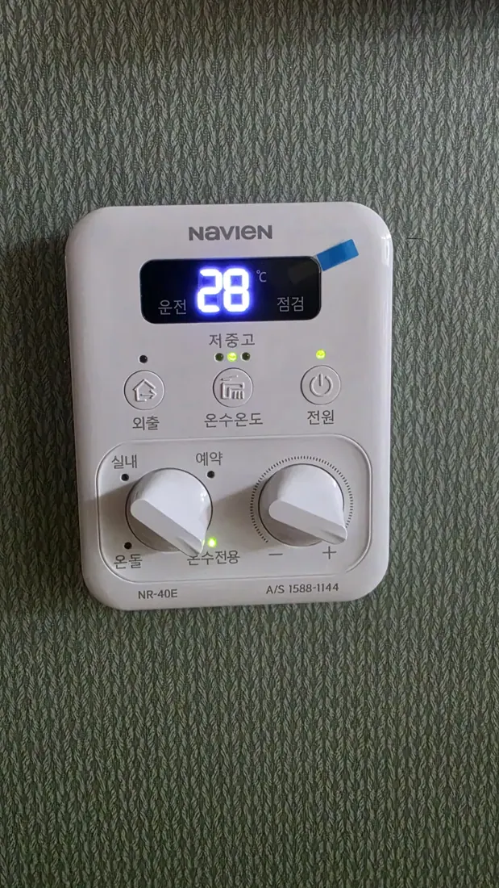

The shower runs hot, then lukewarm, then hot again. Or you get hot
water in the kitchen but not the bathroom, or only after the heating
has been on. Somebody tells you the boiler is old and you should
replace it.

**Maybe. But the symptom you're describing usually points at one
specific part that costs well under ₩100,000 to swap** — and it's
worth knowing its name before anyone quotes you for a new boiler.

## First, what a Korean boiler actually is

If you've come from somewhere with a hot-water tank in a cupboard,
the Korean setup is different in a way that matters.

**One wall-mounted gas unit does two jobs**: it heats water for your
taps, and it heats water that runs through pipes under your floor —
**온돌**, the underfloor heating that Korean homes use instead of
radiators. There's no tank. Water is heated on demand.

That's why the wall controller has modes that look strange at first:

*실내 · 온돌 · 온수전용 — the dial that confuses everyone · ⓒ @BalliBalliSeoul*

| Mode | What it does |
| ---- | ------------ |
| **실내** | Heat the room to a target **air** temperature |
| **온돌** | Heat the **floor** to a target water temperature |
| **온수전용** | **Hot water only** — no heating at all |

In summer, **온수전용** is the setting you want. And if your hot
water has stopped entirely, check this dial before anything else —
a boiler switched to a heating mode with the target already met may
simply not be firing.

## What the symptom tells you

Because one unit does both jobs, there's a component whose entire
purpose is to decide which job gets the hot water. When it starts
failing, the symptoms are distinctive:

| What you're seeing | What it usually means |
| ------------------ | --------------------- |
| **Hot water comes and goes** | The diverter valve (삼방밸브) |
| Hot water only while the heating is running | Same part |
| No hot water at all, heating fine | Same part, or the dial |
| No heat and no hot water, error code on the panel | A real breakdown — read the code |
| Water never gets properly hot, everywhere | Scale, ageing unit, or gas supply |

## The part worth knowing: 삼방밸브

**삼방밸브** — the three-way, or diverter, valve. Its whole job is to
send the heated water either to your floor or to your taps, with the
taps taking priority.

When it wears out it stops switching cleanly, and the result is
exactly the complaint at the top of this article: **hot water that
comes and goes.** It's a known wear item — reports commonly put
trouble starting somewhere around the five-year mark.

**What a repair looks like on the bill.** Korean repair invoices
break into three parts, and one documented example ran:

| Line | Example |
| ---- | ------- |
| Call-out (출장비) | ~₩18,000 |
| Part (부품비) | ~₩50,000 |
| Labour (수리비) | ~₩12,000 |
| **Total** | **~₩80,000** |

Treat that as an illustration rather than a price list — brand,
model and region all move it — but it establishes the order of
magnitude. **A diverter valve is a tens-of-thousands-of-won job, not
a millions-of-won job.**

> **The question to ask:** if someone looks at intermittent hot
> water and immediately quotes you for a whole new boiler, it is
> entirely reasonable to say: **"삼방밸브 확인해 보셨어요?"** — *have
> you checked the three-way valve?* You are not being difficult.
> You're asking the question a Korean tenant would ask.

## When it really is the boiler

Sometimes the answer genuinely is replacement, and there's a
reasonably clear line.

- **A domestic boiler lasts around 8–10 years.** Manufacturers and
  Korea's gas safety authority both point at that range as the
  window to start thinking about replacement.
- **Past ten years**, worn internals burn less cleanly. That shows
  up as rising gas bills — and, more seriously, as **higher carbon
  monoxide output.** This is the part to take seriously: an old
  boiler isn't just inefficient, it's a safety question.
- **Repeated failures of different parts** in one season is the
  practical signal. One valve is a repair. Three call-outs is a
  boiler telling you something.

**So: find out how old it is.** There's a plate on the unit with the
model and manufacture date, and the manufacturer's service number is
usually printed right there too.

## Reading the error code

If the panel is blinking a code, you don't need to translate the
manual. Every Korean boiler brand publishes its codes, and the
search that works is:

> **[brand] 보일러 에러코드 [number]** — for example `귀뚜라미 보일러
> 에러코드 E1`

The brand is written on the front of the unit — Kyungdong (경동),
Navien (나비엔), Kiturami (귀뚜라미), Rinnai (린나이), Daesung (대성).
Photograph the code and the plate at the same time; the technician
will ask for both.

## Two things to try before you call

Genuinely worth ninety seconds:

- **Check the dial and the target temperature.** A boiler in 실내
  mode with the room already at target will not fire — which looks
  identical to "broken" if you're expecting hot water.
- **Check the gas is on.** There's a valve on the gas line; if
  anyone has been working in the flat, it may have been closed.
  Korean gas supply also cuts off after an earthquake alert and
  needs manual restoration.

If the boiler has power, the gas is on, the mode is right, and hot
water is still intermittent — that's your valve.

## Who pays: you or the landlord?

This is the question that decides whether the repair is a nuisance
or an expense, and Korean practice is fairly settled.

- **Wear, age and failure of the boiler itself** — the landlord's
  responsibility. A diverter valve failing after five years, or a
  ten-year-old unit dying, is the property's problem, not yours.
- **Damage you caused** — misuse, or letting pipes freeze because
  the heating was left off while you travelled in January — moves
  the bill toward the tenant.
- **The practical move: tell the landlord in writing, early.**
  A message with a photo of the error code and the date establishes
  both that you reported it and when. It's the same discipline that
  matters when
  [water starts coming through a ceiling](/blog/water-leak-korean-apartment/) —
  document first, argue later.

Don't commission a replacement boiler yourself and expect to be
reimbursed. Report it, get the landlord's agreement on what's being
done, then let the work happen.

## A winter footnote

Worth reading before December: **a boiler left completely off in a
Korean winter can freeze**, and a frozen pipe is a much larger
repair than anything above — potentially with water damage attached.

If you travel over winter, leave the heating on a low setting rather
than off, and don't switch the boiler off at the breaker.

## The Korean part

All of this happens in Korean: the error code, the manufacturer's
service line, the technician at the door explaining what he found,
the landlord conversation about who pays, and the quote that may or
may not be reasonable.

That's what our **[plumbing service](/plumbing)** is for — we book
the visit, translate what the technician says, and confirm the price
with you in writing before anyone starts. If the answer is a valve,
you'll know it's a valve.

## Get it sorted

> **Hot water misbehaving, or a code on the panel you can't read?**
> Message us on [WhatsApp](https://wa.me/821075191282) with a photo
> of the controller and the plate on the boiler — we'll tell you
> what it's likely to be and what it should cost. First answer is
> free.

The one-line version: **hot water that comes and goes is usually the
diverter valve, that's a sub-₩100,000 repair, boilers themselves run
8–10 years — and if it's age or wear, the bill belongs to your
landlord.**
