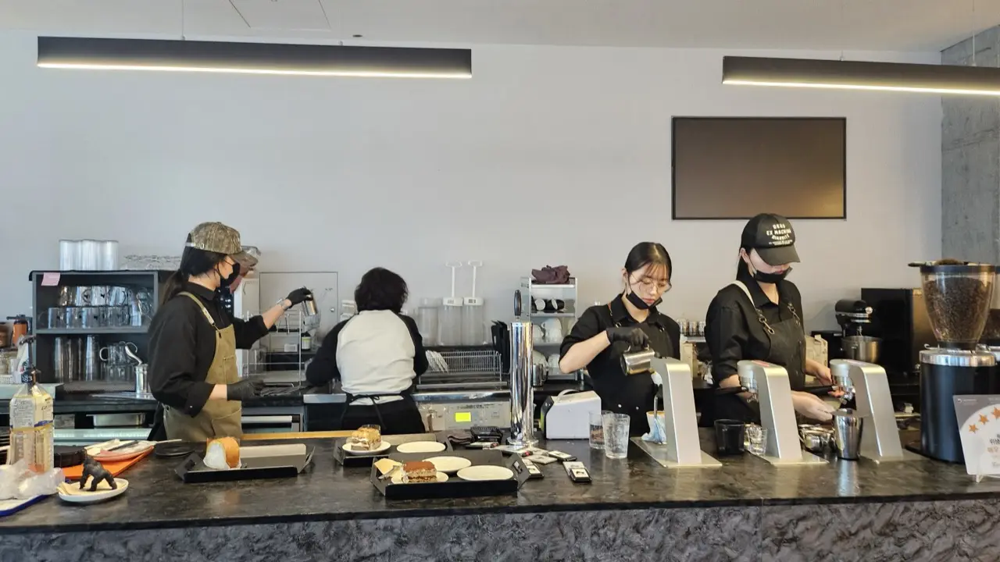
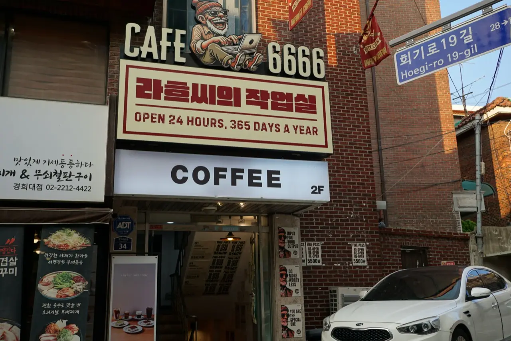
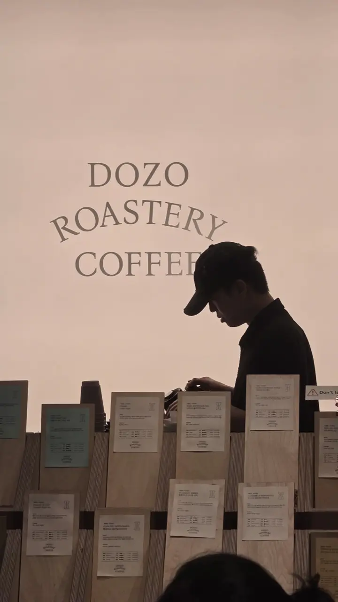

Count the cafes on one Seoul block and you'll usually run out of
fingers. Korea drinks more coffee per person than almost anywhere,
and the cafe is not just a coffee shop here — it's the living room,
the study hall, the meeting room, and in August, the air
conditioning. Here's what it costs, how to order, and the single
best-value rule in Korean daily life.

## The price tiers (as of 2026)

Coffee here is stratified, and knowing the tiers saves real money:

| Tier | Americano | Who's in it |
| ---- | --------- | ----------- |
| Ultra-budget | ₩1,500–2,500 | Mega Coffee, Compose Coffee, Paik's — takeout-first, tiny seating |
| Budget chain | ₩3,000–3,500 | Ediya and similar — proper seating, everywhere |
| Big franchise | ₩4,500–5,500 | Starbucks, Twosome Place, Hollys — the reliable default |
| Specialty roastery | ₩5,000–8,000 | Independent roasters and small chains, single-origin menus |
| Themed / dessert cafes | ₩7,000+ | The photogenic ones you saw on Instagram |

The ultra-budget wave is genuinely new and genuinely good — a
₩1,500 americano from a chain that grew explosively in the last few
years is the reason "cheap coffee" is no longer an oxymoron here.

There is a tier below all of these, and it is the one Korean offices
and homes actually run on: **a coffee stick, at roughly ₩174 to ₩420 a
cup.** That's Maxim and KANU, and we priced the whole supermarket shelf
in [the guide to Korea's coffee sticks](/blog/korean-instant-coffee-maxim-kanu/) —
including which of the two is sweet and which is black, because they
are not the same drink.

## Starbucks Korea is its own thing

Worth flagging for visitors: **Starbucks Korea runs a different
menu and a different culture** from Starbucks back home. Expect
Korea-exclusive seasonal drinks, a serious lineup of food, and
**merchandise drops that produce actual queues** — seasonal
planners, tumblers and coolers that sell out in hours and resell
above retail.

The app matters too: **Siren Order** lets you order and pay ahead
from your table or the street, which sidesteps the counter
entirely. It wants a Korean phone number and card to register,
which is the usual wall for tourists — but if you're staying,
it's the single most-used cafe app in the country.

## How to order (cafes work opposite to restaurants)

Korean restaurants bring service to your table; **cafes do not.**
The flow is:

1. **Order and pay first**, at the counter or a kiosk — before you
   sit down.
2. Take the **buzzer (진동벨)**. When it flashes and vibrates,
   collect your drink yourself.
3. When you leave, carry your cup to the **return station
   (반납대)** and separate cup, lid, liquid and trash into the
   marked bins.

*Everything happens at the counter — including your order · ⓒ @BalliBalliSeoul*

Sitting down first and waiting for a server is the classic
newcomer mistake — you'll wait forever. Restaurants are the mirror
image of this: there you *do* sit first, and you summon staff with
a call button on the table. Two opposite scripts, one city — and
[the restaurant one is worth learning
separately](/blog/korean-restaurant-how-it-works/), because that is
where the cutlery drawer and the free side dishes live.

## The all-day table

Here's the rule that reframes everything: **one drink buys you the
table for as long as you want it.** Not fifteen minutes, not "as
long as you keep ordering" — an afternoon. Laptops out, textbooks
open, nobody hovering, no passive-aggressive check on the table.

This isn't tolerance, it's the business model. Cafes here are
designed as workspaces: outlets at most seats, fast Wi-Fi, big
tables, and a culture (**카공족**, "cafe study tribe") built
entirely around it. Students revise for exams, freelancers hold
client calls, friends talk for three hours over one refillable
excuse.

Two courtesies keep it working: **don't camp on a four-person table
alone during a rush**, and if you've been there for hours, ordering
a second drink is a decent gesture — not required, just decent.

For serious study there's a paid tier: **study cafes (스터디카페)**
charge by the hour (roughly ₩2,000–3,000/hour, as of 2026) for a
silent desk, and often run 24 hours with door-code entry. If you
need to concentrate rather than caffeinate, that's the category.

And around universities, ordinary cafes take the idea to its
logical end:

*"Open 24 hours, 365 days" — and the mascot is a guy with a laptop · ⓒ @BalliBalliSeoul*

That sign is the whole culture in one frame: **24 hours, 365 days**,
and a cartoon of a man hunched over a laptop as the shop's mascot.
Places like this cluster around campuses — Hoegi, Sinchon, Anam —
because exam season runs all night, and a desk with coffee is
cheaper than a desk with rent. Some sell flat-rate day passes
(around ₩5,500) instead of drinks, which is the point at which a
cafe has quietly become an office.

## Reading a specialty menu

At roasteries the menu stops being "small/medium/large" and starts
listing beans by **origin, farm, process and roast level**. A quick
decoder:

- **Washed** — cleaner, brighter, more acidic.
- **Natural** — fruitier, heavier, sweeter.
- **Anaerobic** — the funky, experimental end.
- **Single origin vs blend** — one farm's character, or a
  consistent house profile.

*Every bag comes with its own spec card · ⓒ @BalliBalliSeoul*

Baristas at these places are usually delighted to be asked, and
many speak enough English to steer you. "Something fruity" or
"something like chocolate" gets you further than any technical
vocabulary.

## The practical bits

- **Wi-Fi is free and everywhere** — the password is usually on
  the receipt, the wall, or the table sticker.
- **Outlets** are a real selection criterion; window bar seats
  usually have them.
- **Payment**: card or phone, and **no tipping** — there's no tip
  field on the kiosk or the card terminal
  ([why, in detail](/blog/no-tipping-in-korea/)).
- **In a heat wave**, a cafe is a legitimate cooling shelter — and
  cheaper than running your own air conditioner all afternoon. It's
  the same logic as
  [spending the hot hours inside a mall](/blog/ifc-mall-yeouido-heat-escape/),
  at a fraction of the walking.
- **Late night**: 24-hour cafes exist near university districts
  and business areas, and are a normal place to be at 2 a.m.
- **If you want the quiet version**, Seoul has a whole genre of
  [book cafes worth visiting even if you can't read
  Korean](/blog/seoul-book-cafes-bookstores/).
- **And "cafe" stretches further than coffee here** — the same word
  covers gaming rooms, laundries and print shops. We took that
  apart in [why everything in Korea is a
  'cafe'](/blog/why-everything-in-korea-is-a-cafe/).

## The Korean part

Your phone can read the menu — point a camera at it and you're
fine. What your phone can't do is get you past the two walls that
actually stop people here: **an app that demands a Korean phone
number to register** (Siren Order and most loyalty apps), and a
roastery that will happily ship beans anywhere in Korea and nowhere
else. Both are errands rather than translations, and both are
[what we do](/etc).

## Get it sorted

> **Want beans shipped, or an app that won't accept your number?**
> Message us on [WhatsApp](https://wa.me/821075191282) — we'll register
> it, order it, or have it sent, in English. Asking costs nothing — you
> pay only for the work you book.

The one-line version: **order and pay first, take the buzzer,
₩1,500 to ₩8,000 depending on your tier, and the table is yours
for the afternoon.** No country makes it this easy to sit down.
