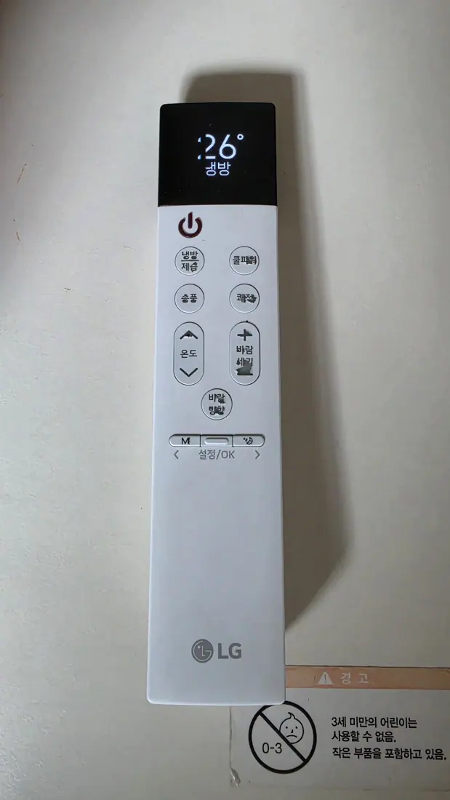
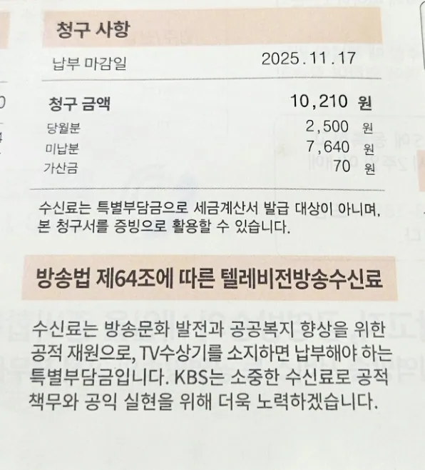
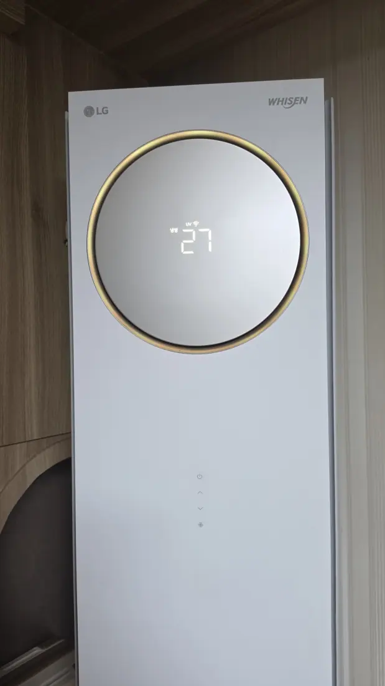

You did the sensible thing during Korea's record heat: you ran the
air conditioner. Then the bill arrived, and it wasn't 30% higher
than June's — it was triple. Nothing broke, and you weren't
overcharged. You just met **누진제 (nujinje)**, Korea's progressive
electricity pricing, and it's the single most important thing
nobody explains to foreign residents. Here's how it works, and the
three Korea-only levers that actually lower the number.

## The tier system is why the bill isn't linear

Korean home electricity isn't billed at one flat rate. It's billed
in **tiers, and each tier is more expensive than the last** — so
the last kilowatt-hour you use costs far more than the first. The
tiers reset every billing month, and there's summer relief, as of
2026:

| Tier | Normal months | **July 1 – Aug 31** |
| ---- | ------------- | ------------------- |
| 1st (cheapest) | up to 200 kWh | **up to 300 kWh** |
| 2nd | 201–400 kWh | **301–450 kWh** |
| 3rd (most expensive) | over 400 kWh | **over 450 kWh** |

Only the usage *above* each threshold is charged at the higher
rate, so it isn't a cliff you fall off. But **each tier is
substantially more expensive than the one below it**, and there is
a further penalty rate for extremely heavy use — which is how a
month of steady air conditioning turns into a bill that feels
punitive rather than merely higher.

(Rates change; **KEPCO's published tariff is the only authority**.
The thresholds above are the part worth memorising.)

The practical takeaway: **the goal isn't zero AC, it's staying
inside your tier.** Knowing roughly where you are in the month
changes what an extra evening of cooling actually costs you.

## Know your meter-reading date (검침일)

Here's the detail that breaks people's mental math: **your billing
month usually isn't the calendar month.** Each household has a
meter-reading date (검침일) — it might be the 12th, the 23rd,
whatever — and your tier counter resets then, not on the 1st.
It's printed on your bill and visible in KEPCO's app.

Why it matters: if your reading date is the 20th and a heat wave
starts on the 18th, those two blazing days land at the *end* of
one cycle (expensive, top tier) instead of the start of a fresh
one. Knowing the date is free and changes how you pace a hot week.

## The inverter question — the biggest behavioral lever

Two air conditioners, opposite instructions:

- **Inverter AC (인버터, most units made in roughly the last
  decade)**: cheapest when left running continuously at a moderate
  setpoint — around 26°C is the commonly cited sweet spot. It
  throttles down once the room is cool. Turning it off and on
  repeatedly forces expensive full-power restarts.
- **Fixed-speed AC (정속형, older units)**: the opposite. It only
  runs at 100% or off, so short bursts with the fan doing the rest
  is the cheaper pattern.

*26°C on the remote — the setpoint most guides land on · ⓒ @BalliBalliSeoul*

**How to tell which you have**: look for 인버터 on the indoor unit
label, the remote, or the model number — or send us a photo of the
sticker and we'll read it. This single question decides whether
your instinct ("turn it off when I leave the room") is saving you
money or costing you.

Two supporting habits that cost nothing: run a **fan alongside**
the AC so you feel cooler at a higher setpoint, and close curtains
on sun-facing windows during the day — a west-facing one-room in
August is essentially a solar collector.

## The free-AC map: Korea's cooling shelters

Now the strategy everyone here already uses: **the cheapest air
conditioning is someone else's.** Korean summer life migrates —
and the government has formalized it. Nationwide there are
**over 40,000 designated cooling shelters (무더위쉼터)**, open to
anyone, free, no registration, typically running from mid-May
through September. Community centers, senior centers, libraries,
public offices, subway stations.

You can find the nearest one by map:
[Safemap](https://www.safemap.go.kr) and the government's
[disaster portal](https://www.safekorea.go.kr) both list them, and
the **Safety Dimdol app (안전디딤돌)** finds them by GPS.

Beyond the official list, the unofficial ones locals rely on:

- **Bank branches** — aggressively air-conditioned, chairs, quiet.
- **Department stores and big malls** — the classic afternoon
  refuge, and the reason weekend crowds look the way they do.
- **Public libraries** — cold, silent, free, and open all day.
- **Subway stations and underground shopping streets** — cool
  corridors that go on for kilometers.
- **Cafes** — one americano legitimately buys you the table for the
  afternoon; that's
  [not tolerance, it's the business model](/blog/korea-cafe-culture-guide/).
- **Smart bus shelters** — enclosed, air-conditioned, with Wi-Fi.
- **A mall**, if you want the whole day handled — food, cinema and
  cold air in one building, which is
  [exactly what we did at IFC](/blog/ifc-mall-yeouido-heat-escape/).
- **An indoor playground**, if the problem is children rather than
  heat —
  [two hours, weather irrelevant](/blog/seoul-kids-cafe-ddp-indoor-playground/).

Spending the hottest four hours of the day out of your apartment
isn't dodging the problem. It *is* the local solution, and it's
what keeps the tier counter from climbing.

## The cashback program foreigners never hear about

KEPCO runs a **residential energy cashback (주택용 에너지 캐시백)**
scheme: use less electricity than your own past baseline, get money
back. It was **expanded from July 2026**, and the new terms are
unusually generous:

- The qualifying bar dropped from a **3% reduction to just 1%.**
- Payouts run from about **₩30 per kWh saved at 1%, up to ₩120 per
  kWh** for bigger reductions.
- Households with a smart meter got an extra trial for **July and
  August 2026**: cut usage below the average for the same time of
  day and the saving is worth about **₩500 per kWh** on top.

In other words, the scheme now pays for the behaviour you were
going to adopt anyway after reading the section above.

Apartments, houses and residential officetels can all take part as
long as household usage is separately metered. You apply through
KEPCO — the QR code printed on your bill jumps straight to the
sign-up page, or you can register at a KEPCO branch with ID. The
catch for us: the process runs in Korean, which is exactly the kind
of ten-minute errand our
[anything-else concierge service](/etc) exists for.

## The ₩2,500 you might not owe

Look down your electricity bill for a line called
**텔레비전방송수신료** — the TV licence fee. It's **₩2,500 a
month**, it funds public broadcasting, and it is charged on the
assumption that your home has a television.

*₩2,500 a month, quietly attached to the electricity bill · ⓒ @BalliBalliSeoul*

**If you don't own a TV, you don't have to pay it** — but nobody
removes it for you. You have to declare that you have no set
(TV 수상기 미소지 신고), and the charge stops from then on.

- **If the fee comes on your KEPCO bill**, call KEPCO on **123**.
- **If you live in an apartment** where it arrives inside the
  monthly 관리비, ask the building's management office
  (관리사무소) — they handle it, not KEPCO.
- **It stops going forward, not backwards.** Months already paid
  are generally not refunded, so this is worth doing in your first
  week, not your last.

One timing note, because it changed twice recently: the fee was
**split off onto a separate bill in July 2023, then merged back
into the electricity bill from late 2025**, with the combined
billing rule finalised in 2026. So if you looked for this line a
couple of years ago and didn't find it, look again — it's back on
the electricity bill.

A studio flat with no television pays **₩30,000 a year** for
nothing. It's the least interesting saving in this article and
possibly the easiest.

## The maintenance that pays for itself

A dirty air conditioner works harder for less cold. Two things
matter:

*The tower unit most Korean flats have — filters live behind the front panel · ⓒ @BalliBalliSeoul*

- **Filters** — the mesh panels behind the front cover. Rinse them
  every few weeks in summer; it takes minutes and is the highest
  return-on-effort task in this article.
- **Deep cleaning (에어컨 청소)** — a real Korean service category:
  technicians disassemble the unit and clean the heat exchanger and
  blower wheel, where mold and dust actually live. Typically done
  once a year or two, and worth it if your AC smells musty when it
  starts, or blows weak after years of use.

That second one is a booking, a scheduling call and a price
negotiation in Korean — so it's something we arrange through our
[cleaning service](/cleaning), with the price confirmed in the chat
before anyone shows up.

## The Korean part

Everything downstream of the meter speaks Korean: the paper bill,
KEPCO's app and its 123 hotline, the cashback sign-up, the AC
technician's schedule. One more wrinkle specific to renters — in
many one-rooms and villas, electricity arrives bundled inside
**관리비 (maintenance fee)** along with a shared-electricity line
item, which makes it genuinely hard to tell what your own aircon
cost. If your bill went up and you can't tell why, that's a
question worth asking before you assume it's the AC.

This heat is not normal even by Korean standards — it's already
[shut down the national baseball league](/blog/kbo-games-cancelled-heat-wave/)
— so run the AC when you need it. Just run it knowingly.

## Get it sorted

> **Bill you can't read, aircon that smells, or a cashback form in
> Korean?** Send us a photo on
> [WhatsApp](https://wa.me/821075191282) — we'll translate the
> bill, tell you which tier you're in, and arrange the aircon
> cleaning if that's the fix. First answer is free.

The one-line version: **know your tier and your meter date, leave
an inverter running at 26°C, spend the hot hours in a bank or a
library, rinse the filters, sign up for the cashback, and kill the TV
licence line if you don't own a TV.** Rates
and programs change — KEPCO is the final word, in any language.
