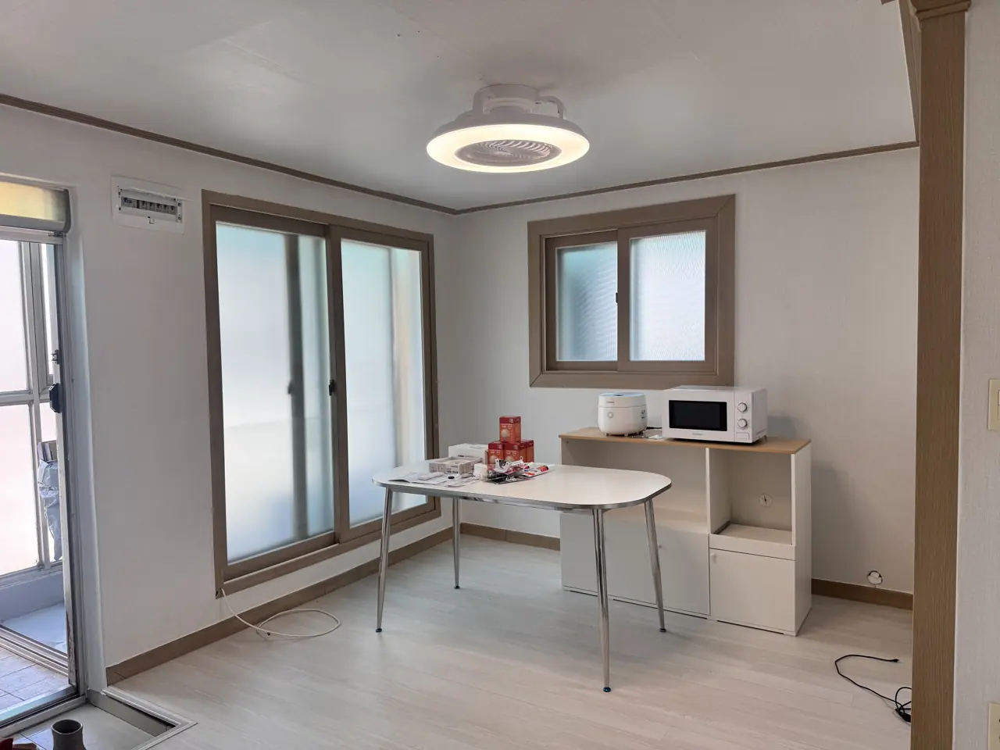
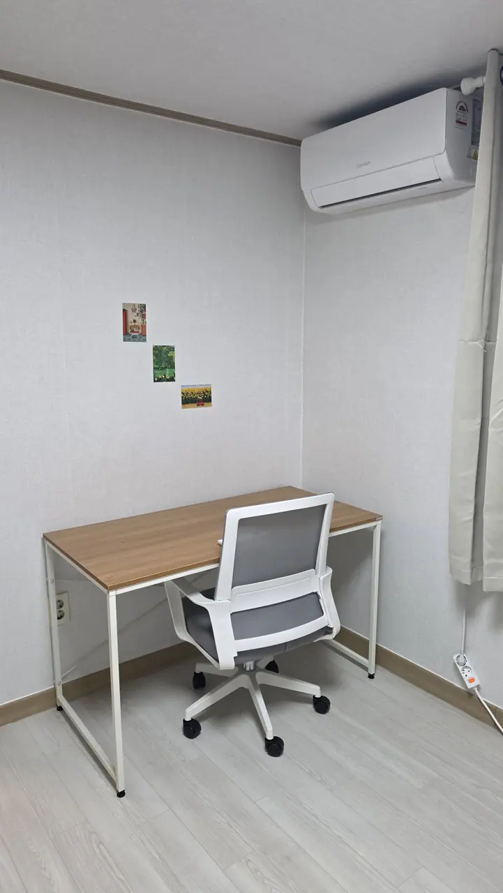
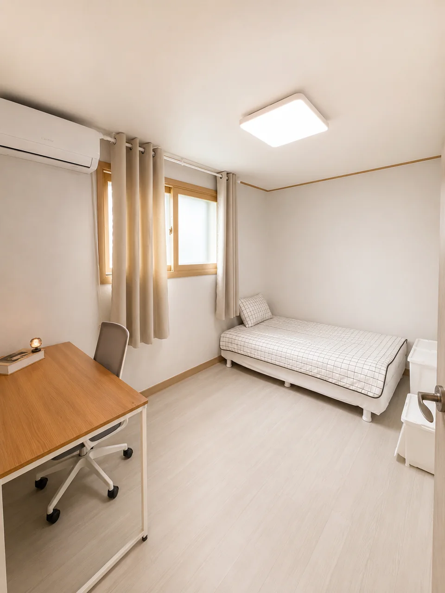
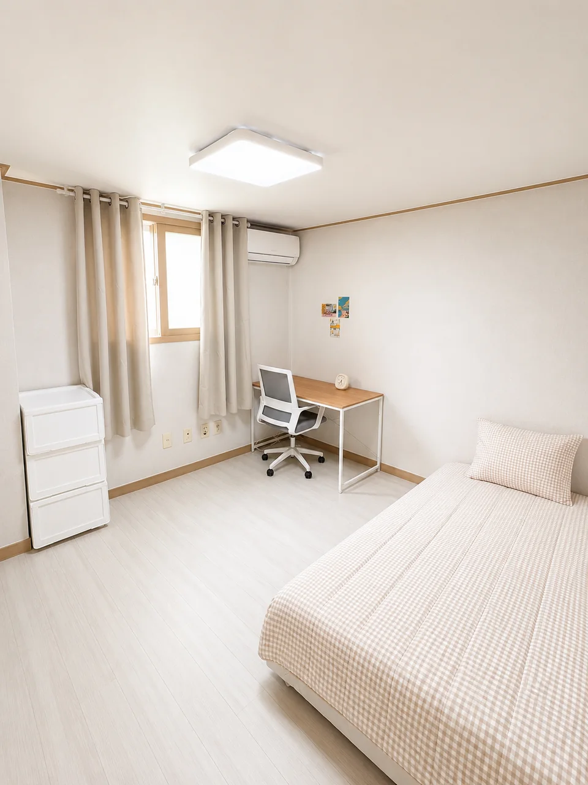
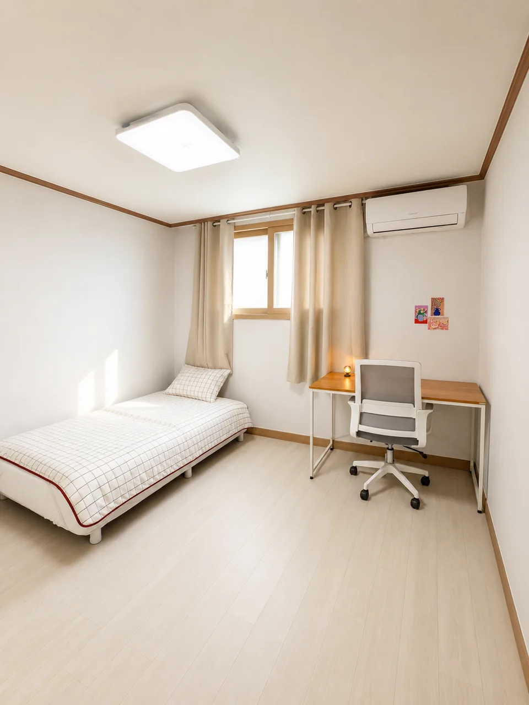
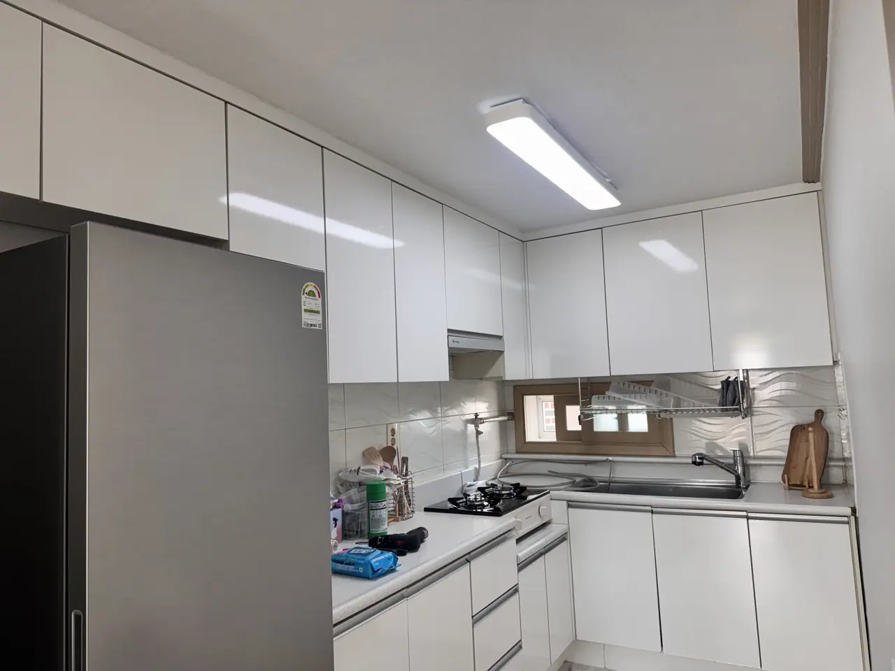
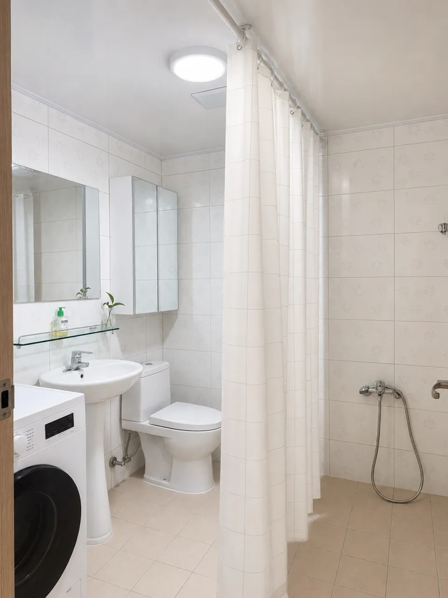

You have a place at Korea University. The dormitory is not guaranteed, and a normal
Korean studio wants a deposit of several million won that you cannot easily raise
before you have arrived, opened a bank account, or been issued an alien registration
card.

This is the third option: a room in a share house, three minutes from the station,
with a deposit sized for a student.

> ### Availability — as of 30 August 2026
>
> **All three houses are full.** Every room went on 30 August. We would rather say so
> here than get you into a chat and tell you then.
>
> **The next rooms are two singles from 24 December 2026**, across our three houses.
> That date is the four-month minimum turning over from the August intake — which is
> also the honest answer to whether the minimum stay is real. It is.
>
> A four-month stay starting then runs to late April, so it covers the start of the
> spring semester in March, and you would extend from there.
>
> **If that date does not suit you, tell us the month that does.** Rooms here come free
> on the four-month cycle rather than continuously, so the question worth asking is not
> whether one is free today but whether one will be free when you land. Tell us your
> month and we will write to you when one comes up.

*The common room · ⓒ @BalliBalliSeoul*

## The rooms

Single rooms, furnished, with **air conditioning in every room** — not one unit in
a corridor. In winter the house runs on a **boiler**, the standard Korean underfloor
system, so the floor itself is warm rather than a heater blowing at one corner of
the room.

*A desk you can actually work at, in every room · ⓒ @BalliBalliSeoul*

These photographs are properly shot and lightly styled, and it is worth saying which
is which: **the vase, the books, the postcards and the little lamps are ours, not
yours.** The furniture, the appliances and the walls are what you get.

**The rooms are not identical**, and here are three of them. Every one has a single
bed, a desk and chair, curtains, its own window and its own wall aircon. What moves is
everything else — which wall the bed goes against, where the window falls, and the
shape of the floor you are left standing on.

*Desk by the door, bed across the room · ⓒ @BalliBalliSeoul*

*Same furniture, different room — bed along one wall, desk in the corner · ⓒ @BalliBalliSeoul*

*And another, the other way round · ⓒ @BalliBalliSeoul*

So ask **which room** you are being offered, not just which house — we will tell you.
And if you would rather see a room move than sit still, which is the honest way to
judge a small space, **ask and we will send you a walk-through video** of the one that
is actually free.

## What you share

There is a **common room** — a table to eat at, sit at or work at, with a full-height
window and a balcony door behind it. That is the part a goshiwon does not have and
most share houses do not either: somewhere to be that is neither your bed nor a café
you have to buy something in.

Along the wall are a **microwave**, a **rice cooker** and a **kettle**. The rice
cooker is worth naming — a Korean share house is under no obligation to have one, and
a student living on rice notices in the first week.

The kitchen proper is next door: a **new refrigerator**, a gas hob with an extractor,
a sink, cabinets above and below, and a drying rack over the counter.

*The kitchen · ⓒ @BalliBalliSeoul*

**Wi-Fi is included.** That sounds minor until you remember a new arrival cannot
easily sign up for Korean internet without an alien registration card and a Korean
bank account — the two things you will not have in your first fortnight.

Laundry is a **washer-dryer in one unit**, not a washing machine and a drying rack.
Most Korean homes have no dryer at all, which in a wet July or a freezing January is
slower than new arrivals expect.

The bathroom is shared, and this is it — basin, toilet, shower, and the laundry in
the same room.

*The shared bathroom · ⓒ @BalliBalliSeoul*

## Where it is

**Jongam-dong, Seongbuk-gu — three minutes on foot from Korea University Station,
Exit 3**, on Line 6. The campus is across Jongam-ro, and the Central Library is a
few minutes from the front door.

One thing that catches people out before they even arrive: **Korea University
Station is signed both 고려대 and 종암.** If you are following a map in English and
looking for one of those names, you will walk straight past the other.

Jongam-dong is the quieter side of that three-minute walk. You are as close to the
gates as somebody paying Anam prices, on a street that is residential rather than
lined with bars.

**The house is the third floor of a three-storey building, and there is no lift.**
It is worth knowing before you arrive with a suitcase, and worth deciding about
before you book.

**The roof is yours to use, and it is a roof rather than a terrace.** The old decking
came up and the floor underneath is bare, so nobody is going to photograph it for a
brochure — which is why there is no picture of it here. What it is, is outdoor space
you can stand in, dry washing on, or sit out on in the evening, three flights above a
street in Seoul. At student prices that is close to unobtainable, and we would rather
undersell it than have you arrive expecting a roof garden.

## What it costs

| | |
| --- | --- |
| Deposit (보증금) | **₩1,500,000** — paid once, returned when you leave |
| Rent (월세) | **₩700,000** a month |
| Maintenance (관리비) | **₩100,000** a month — water, electricity, gas and internet included |
| **Monthly total** | **₩800,000** |

**The maintenance fee covers water, electricity, gas and internet.** All of it. So
₩800,000 a month is not a starting figure with bills to come — it is the figure.

That matters more than it sounds. Korean utility bills are sharply seasonal, and the
two that catch new residents out are the August air-conditioning bill and the January
gas bill — the first of which we
[wrote about after a summer of them](/blog/korea-summer-electricity-bill/). With a
fixed fee, running the aircon through a Seoul August does not change what you pay.

We print both halves for the same reason. A rent figure on its own is not a price:
elsewhere you will be quoted ₩700,000 and meet the maintenance fee at signing.

The deposit is the part worth comparing. A one-room studio around Anam commonly wants
several million won held for the length of the contract — money you need in a Korean
bank account before you have one. **₩1,500,000 is a figure a student can actually
produce**, and it comes back to you at the end.

## The honest bits

Things we would rather you knew before you ask than after you arrive.

- **This house is women only** — and so are our other two. It is not a policy we vary.
- **Third floor, no lift.** Three flights, every time.
- **Nothing goes into the walls.** No nails, no screws, and nothing that pulls the
  surface off when it comes down. It is the most avoidable deposit deduction there
  is, so ask us before you fix anything up.
- **Coliving means sharing.** The room is yours. The kitchen, the bathroom and the
  laundry are not.
- **The minimum stay is four months** — a Korean Language Center term is ten weeks,
  so a single term on its own does not reach it; two terms, or a university semester,
  does. **Ask anyway.** If a room is standing empty we would rather have someone in
  it than hold the rule, and a shorter stay is sometimes possible. It depends on what
  is free the week you write, so the only way to know is to ask.

## Why this rather than a dorm or a studio

**The dormitory may not come through.** KU states plainly that it cannot guarantee
accommodation for every international student, and the Language Center's Frontier
House is limited to new regular-programme students, for a maximum of one semester,
with no extension. Apply early through the
[Global Services Center](https://gsc.korea.ac.kr) — and have a second plan.

**A normal studio has a deposit wall.** A one-room around Anam runs roughly
₩400,000–800,000 a month, but the deposit behind it is commonly several million won,
held for the length of the contract. Now consider who is arriving: no alien
registration card yet, no Korean bank account for the first weeks, no Korean phone
number for the verification every property app demands, no credit history, no
guarantor. Opening the account is its own sequence, covered in
[how to open a bank account in Korea](/blog/open-bank-account-korea/).

That is why the housing that actually works for a new arrival is the housing with a
small deposit — and why we size ours for a student rather than for a lease.

If you do go the normal-flat route later, read
[what to check before renting in Seoul](/blog/what-to-check-before-renting-seoul/)
first. Most of the money foreigners lose in Korean rentals is lost at signing.

## What to ask us — or anyone else

The same short list decides most of the arguments that happen later, and you should
be putting it to every place you look at, not only to us:

- What furniture and appliances are included, and are the photos of **the room you
  are getting**?
- What does the rent cover, and is there a separate maintenance fee on top?
- Laundry — in the building, and is there a dryer?
- Bathroom — private or shared, and with how many?
- What is the minimum stay, and what happens if you leave early?

## How to ask

Tell us **which university, which month you need the room, and when you land in
Korea**. We will tell you what is available and what it costs.

**KakaoTalk is the easiest way to reach us** — it is what everyone on the Korean side
of this uses — though WhatsApp is just as welcome. We answer in English, and asking
costs nothing.

Our other two houses, beside Kyung Hee University and Hankuk University of Foreign
Studies, are in [our coliving rooms](/blog/coliving-rooms-seoul-universities/).
