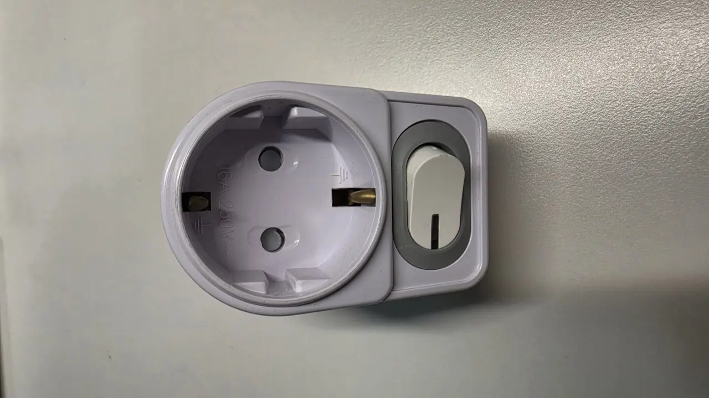
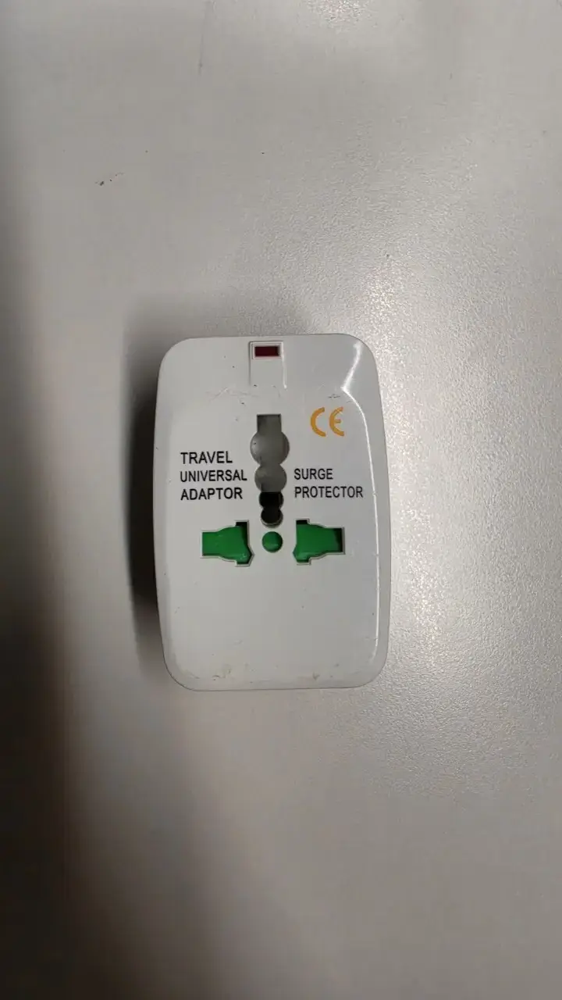

The question every American, Japanese and Taiwanese arrival asks
within a week: *can I plug my stuff in here?* Korea runs on **220
volts, 60Hz**, through round two-pin European-style sockets — and
the answer for each device is printed on the device itself, in tiny
letters almost nobody reads until something smells like burning.
Here's the two-minute literacy that saves your electronics.

## The system

- **Voltage**: 220V (the US, Japan and Taiwan run 100–120V; Europe
  and most of Asia run 220–240V — Europeans can mostly relax).
- **Frequency**: 60Hz — usefully, the *same* as North America, so
  clocks and motors that survive the voltage won't run at wrong
  speeds like they do in 50Hz Europe.

- **Plugs**: round two-pin **Type C/F** (the standard European
  shapes). Your flat-pin plugs need a shape adapter at minimum.

What all this plugs into is a bill that does not rise in a straight
line. Korean household electricity is charged in **progressive
tiers**, which is why one heavy month costs far more than you would
expect — worth reading before summer if you own an air conditioner:
[why the summer bill spikes, and what to do](/blog/korea-summer-electricity-bill/).

Here's the socket you'll be dealing with — recessed, round, and
stamped with its rating (16A 250V):

*A standard Korean wall socket · ⓒ @BalliBalliSeoul*

## Read the label — the only rule that matters

Flip over any charger or appliance and find the **INPUT** line:

- **"INPUT: 100–240V"** → **it just works.** All you need is a
  ₩1,000–3,000 plug-shape adapter (Daiso sells bins of them).
  This covers virtually every modern laptop, phone and camera
  charger, and most electric shavers and toothbrush chargers —
  they're built dual-voltage for exactly this reason.
- **"INPUT: 120V"** (or 100V, or 110V only) → plugging it into a
  Korean socket through a shape adapter sends it **double the
  voltage it was built for**. Best case, the fuse dies instantly;
  worst case, smoke, sparks, and a very memorable smell.

| What the INPUT line says | What you need | Cost |
| ------------------------ | ------------- | ---- |
| **100–240V** (or 110–220V) | A plug-shape adapter | ₩1,000–3,000 |
| **220–240V** | Nothing — plug it straight in | ₩0 |
| **120V only** (or 100V / 110V) | A step-down transformer, or don't | ₩30,000+ |

The shape adapter changes the *pins*, not the *power*. That
sentence is the entire cause of every fried appliance story in
every expat group — and it's worth staring at the adapter itself
for a second, because nothing on it warns you:

*A universal adapter converts shape only — never voltage · ⓒ @BalliBalliSeoul*

Note what that "universal" adapter is and isn't. The **EUROPE**
slider on the back is the module you push out for Korea; the
front sockets accept flat US pins, UK pins, whatever you arrive
with. "Surge protector" on the case is not voltage conversion —
it's a fuse, and it will not save a 120V hair dryer from 220V.

## The hall of casualties

The devices that burn are predictable, because they're the ones
with **heating elements and simple motors** built for one voltage:

- **Hair dryers, straighteners and curling irons** — the classic
  victims (and the classic search: yes, your American hair dryer
  will die here). The rational move: buy a Korean one — decent
  dryers start cheap, and it ends the problem forever.
- **Kitchen gadgets** — blenders, coffee makers, rice cookers from
  home.
- **Anything with "120V only" and a heating coil.**

For the sentimental single-voltage device you *must* run, a
**step-down transformer (변압기)** exists — sold online and at
electronics marts, sized by watts. Buy comfortably above your
device's wattage, and accept that a transformer big enough for a
hair dryer is a brick that costs more than a new hair dryer. For
low-watt electronics it's reasonable; for heat-making appliances
it's almost never worth it.

Japanese arrivals know the reverse of this game (Korea's 220V vs
Japan's 100V): the same transformer logic applies, just more so.

And if something does die: a dead appliance is **e-waste**, not
regular rubbish, and larger items need a disposal sticker — the
rules are in our
[guide to throwing things away in Korea](/blog/how-to-throw-away-trash-in-korea/).

## "But I read that Korea uses 110V"

You will find this on older forum posts and out-of-date packing
lists, and it's a genuine trap. Korea **used** to run 110V, and
spent decades converting: the changeover was completed in the
mid-2000s. Unless you are standing in a building that has not been
rewired since then — vanishingly rare in housing you'd actually
rent — **every socket you meet is 220V.**

If you see a flat two-pin socket somewhere, it isn't a 110V
survivor; it's almost certainly a shape adapter someone left
plugged in.

## Things people ask about specifically

- **Laptops, phones, cameras, tablets** — dual-voltage, essentially
  always. Shape adapter, done.
- **Game consoles** — modern ones ship dual-voltage power supplies;
  check the brick. An old console bought abroad is more likely to
  be single-voltage.
- **Electric toothbrushes and shavers** — usually dual-voltage, and
  usually the cheapest thing to just re-buy if not.
- **Medical devices (CPAP and similar)** — check the label like
  anything else, but **don't improvise.** If it's single-voltage,
  buy a properly rated transformer with headroom rather than the
  cheapest brick on the marketplace.
- **Hair dryers** — see above. Buy Korean. This is not a fight
  worth having.

## Setting up your desk and kitchen

Practical bits for the first week:

- **Multi-tap power strips** (멀티탭) are the Korean desk standard —
  buy locally so the sockets match, and plug your shape-adapted
  chargers into it: one adapter serves the strip, not every device.
- **USB charging** sidesteps everything — a Korean USB charger or
  powered strip charges your phones and gadgets natively.
- Check plugs when buying secondhand gear from departing expats —
  their US-plugged rice cooker plus adapter collection is how the
  problem propagates. Cheap replacements are a
  [Coupang order](/blog/coupang-korea-shopping-guide/) or a Daiso run
  away — buying Korean usually beats adapting.
- Outlets are often sparse in older apartments; the multi-tap
  habit is universal for a reason.

## The reverse trip, and other footnotes

Going the other way when you leave: a Korean 220V appliance in a
120V country doesn't burn — it just underperforms or won't start,
which is its own disappointment (the beloved Korean rice cooker
emigrating to America is a whole genre of forum question). Two
more local footnotes: Korean sockets are recessed and grounded, so
cheap unearthed shape adapters sit loose in them — the snugger
grounded type is worth the extra thousand won — and you'll notice
Korean bathrooms often have **no outlet at all** (wet-room rules),
which is why hair styling happens at desks here. Plan your
morning routine's geography accordingly.

## The Korean part

The friction here is small but real: reading a transformer's Korean
spec sheet, picking the right wattage, warranty-claiming a
half-burned device, or hunting the one adapter shape Daiso didn't
have. Through our
[anything-else concierge service](/etc) we match the right
transformer or replacement appliance to what you actually own and
[get it delivered](/blog/coupang-korea-shopping-guide/) — and if
something already released its smoke, we'll tell you honestly
whether repair or replacement wins.

## Get it sorted

> **Staring at a suitcase of chargers — or already smelled the
> smoke?** Message us on [WhatsApp](https://wa.me/821075191282)
> with photos of the labels — we'll tell you what works, what
> needs what, and order the missing pieces. Asking costs nothing — you pay only for the work you book.

The one-line version: read the INPUT label — 100–240V means a
₩2,000 adapter, 120V-only means leave it home or buy Korean. Your
hair dryer already knows which one it is.
