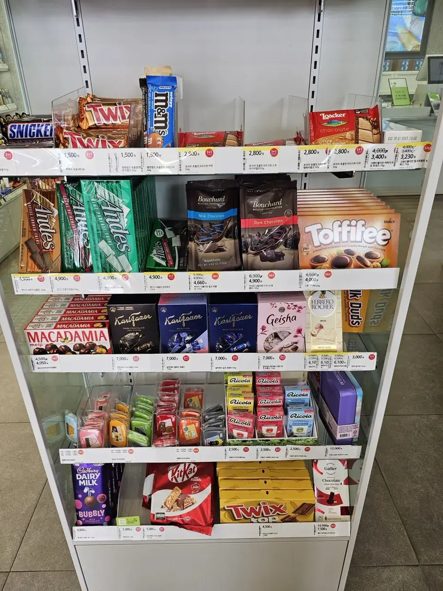
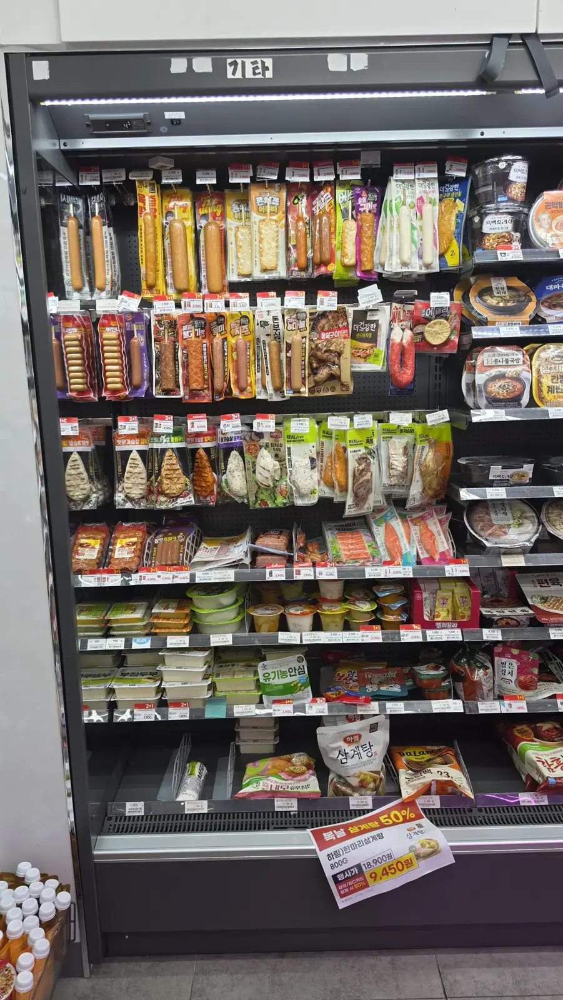
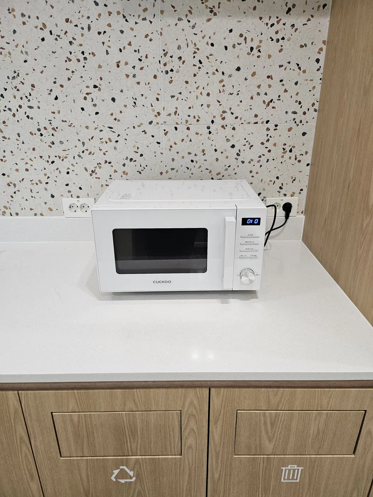
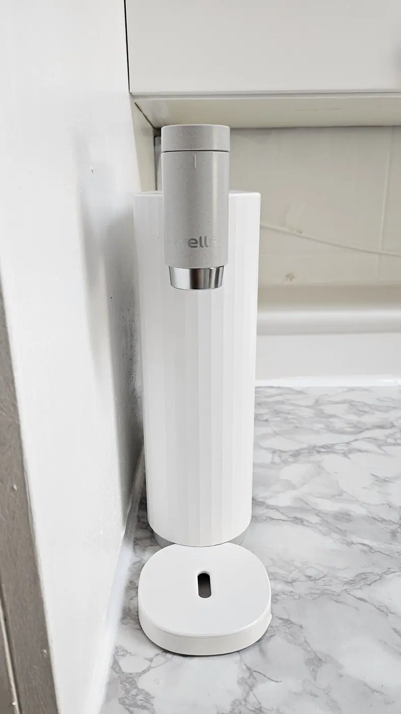

Nothing prepares you for the density. Stand on almost any Seoul
street and you can usually see a convenience store, and often two,
belonging to different chains, facing each other across the road.
They are not corner shops that happen to open late. **They're a
layer of public infrastructure that happens to sell crisps** — and
once you understand what they do, a surprising number of your
problems here have a two-minute answer.

## The four chains

**GS25, CU, 7-Eleven and emart24** dominate, and the honest summary
is that the differences are small. All four run the same basic
model: 24-hour opening, hot and chilled food, a services counter,
and an own-brand range that's usually the cheapest thing on the
shelf.

Two things do differ enough to notice:

- **Own-brand lines.** Each chain has its own coffee, snacks and
  ready meals — CU's and GS25's coffee brands are cheaper than any
  cafe and perfectly drinkable.
- **App and membership discounts.** Each runs a loyalty app, and
  **Korean mobile carriers' membership discounts** apply at
  specific chains. If you're on a Korean plan, ask which store
  yours matches — it's a standing 10–15% on some items.

## The deals system: 1+1 and 2+1

This is the single biggest lever on your grocery bill here, and it's
labelled in a way you can read without Korean.

Look for the **red circular tags** on the shelf edge:

- **1+1** — buy one, get one free.
- **2+1** — buy two, get the third free.
- A **yellow tag** with a struck-through number is a straight
  discount.

*Red circle = free item. Yellow = price cut · ⓒ @BalliBalliSeoul*

Two practical notes. **You have to actually take the extra item** —
nothing is deducted automatically if you only pick up one. And the
free item usually has to be **the same product or from the same
promotional group**, so if you want to mix flavours, ask at the
counter before queueing.

These promotions rotate monthly, and they're aggressive. Drinks,
snacks, ready meals and beer are all routinely on them.

## Food: this is a functioning kitchen

The chilled wall is the part visitors underestimate. It carries
**triangular rice balls (삼각김밥), rolled gimbap, sandwiches and
full lunchboxes (도시락)** — a lunchbox is typically ₩4,000–6,000
and is a genuine meal, not a snack.

*The chilled wall — lunch, at any hour · ⓒ @BalliBalliSeoul*

Everything here is designed to be eaten **on the spot** — and the
equipment to do it is standing right there, free to use.

*Microwave above, sorting bins below — the whole loop in one corner · ⓒ @BalliBalliSeoul*

**The microwave** heats your lunchbox; the staff will do it for you
if you ask, but most people press the buttons themselves. Look at
the cabinet doors underneath it in that photo: the **recycling and
waste symbols** mark the store's sorting bins, which is where your
container goes when you're finished. Heat it here, eat it here, bin
it here.

**For hot water**, look for a dispenser or a water purifier by the
counter — the tap that fills your noodle cup:

*Hot water for the cup you just bought · ⓒ @BalliBalliSeoul*

Chopsticks, spoons and lids sit in a box on the counter and cost
nothing. We wrote the full version of that ritual — including how
to read the noodle wall — in our guide to
[the convenience store ramyeon shelf](/blog/korean-instant-ramyeon-convenience-store/).

Watch for **discount stickers on food near its sell-by time**,
usually applied in the evening. Marked-down lunchboxes are one of
the better-value meals in the city.

## The services counter — the part nobody tells you about

Here's where "convenience" stops being a brand name. Depending on
the branch, that counter will:

- **Send and receive parcels.** Convenience-store courier
  (편의점택배) is cheap and open at any hour, and it's a common
  delivery destination for online orders — handy if you're out all
  day or don't want packages left in a shared hallway.
- **Top up your transit card.** Hand over your T-money card and
  cash. **Top-ups are cash only** — this is the one errand where
  you genuinely need notes in your pocket.
- **Give you cash.** Most branches have an ATM, and many accept
  foreign cards, though fees and limits vary by machine.
- **Take utility and bill payments**, through the in-store kiosk.
- **Sell alcohol and cigarettes** — with an ID check, and note
  that alcohol sales are legal at any hour here.

Nothing on that list requires much Korean beyond pointing. All of
it is available at 3 a.m.

## Open 24 hours — mostly

The 24-hour default is real, but not absolute: some branches in
quiet residential areas or inside office buildings close overnight
or at weekends. In practice, in any dense neighbourhood, at least
one nearby store will be open.

Two consequences worth internalising:

- **You never need to stockpile.** Small fridge, small kitchen, no
  problem — the shop is your pantry, five minutes away.
- **It's a safety net.** A lit, staffed, air-conditioned room open
  all night is a useful thing to know about when you're lost,
  overheating or unwell.

## Paying, and the small print

- **Card works everywhere**, including for a ₩900 drink. Phone
  payment too. Cash is only genuinely required for transit top-ups.
- **There is no tipping**, here or anywhere else in the country —
  [the full explanation is here](/blog/no-tipping-in-korea/).
- **The bins by the door are for store rubbish** — your cup, your
  wrapper, your noodle tub. They are not for household waste, which
  has [its own strict system](/blog/how-to-throw-away-trash-in-korea/).
- **Bags cost money** (a small charge for a plastic one), so
  regulars carry their own.

## What else it solves

Three problems that send visitors searching at midnight all have
the same answer, and we've written each one up:

- **A fever, and every pharmacy shut** — registered stores sell a
  designated list of over-the-counter medicines, including
  children's fever syrups.
  [The full ladder is here](/blog/sick-in-korea-medicine-day-or-night/).
- **A dinner you can cook and eat in the shop** —
  [the ramyeon wall, decoded](/blog/korean-instant-ramyeon-convenience-store/).
- **Pads, tampons or condoms at an awkward hour** —
  [where to buy the essentials](/blog/condoms-pads-tampons-korea/).

It's also, quietly, one of the
[things that surprises people most about living here](/blog/surprising-things-about-korea/).

## The Korean part

The labels are the easy part — your camera translates those. The
hard part is the counter: **a parcel form that wants a Korean name
and phone number, a bill-payment kiosk that only speaks Korean, a
delivery you need sent to a store rather than an empty flat.** Those
are transactions, not translations, and they're
[what we handle](/etc).

## Get it sorted

> **Need to send a parcel, pay a bill, or receive a delivery you
> can't be home for?** Message us on
> [WhatsApp](https://wa.me/821075191282) — we'll fill the Korean
> form and walk it through with you. First answer is free.

The one-line version: **red tag means a free one, the chilled wall
is a real meal, the counter sends parcels and tops up your transit
card in cash, and something nearby is open right now.**
