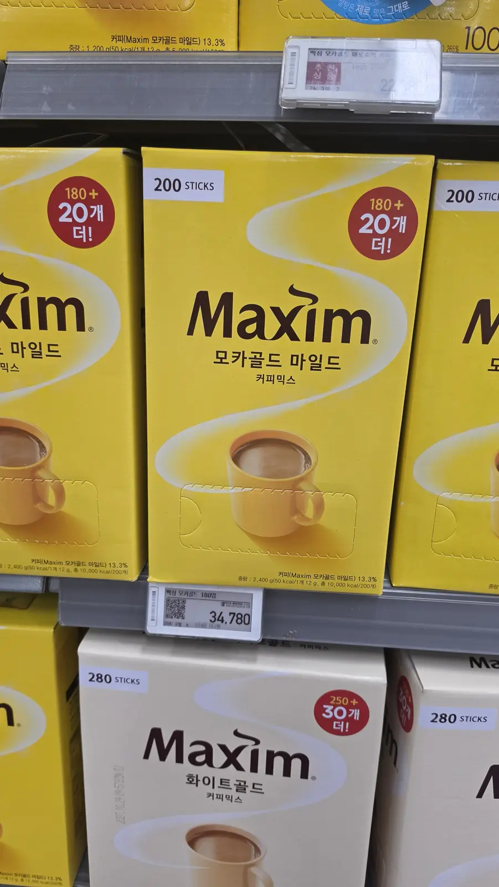
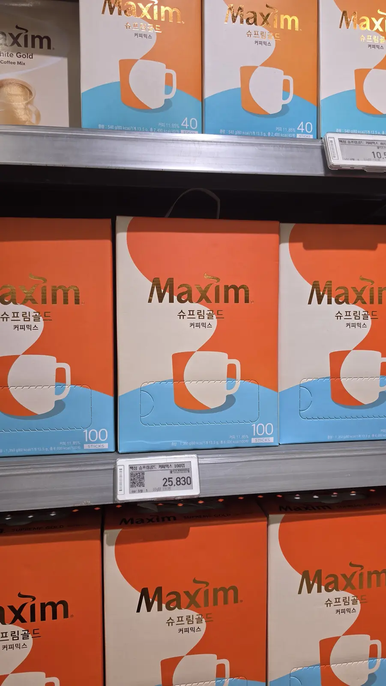
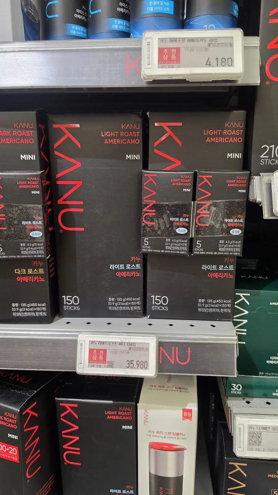
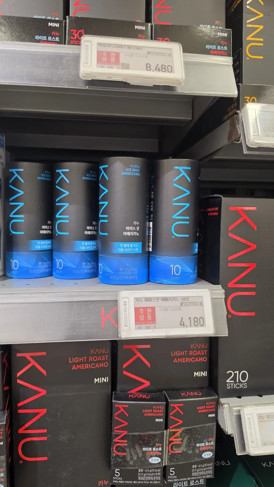
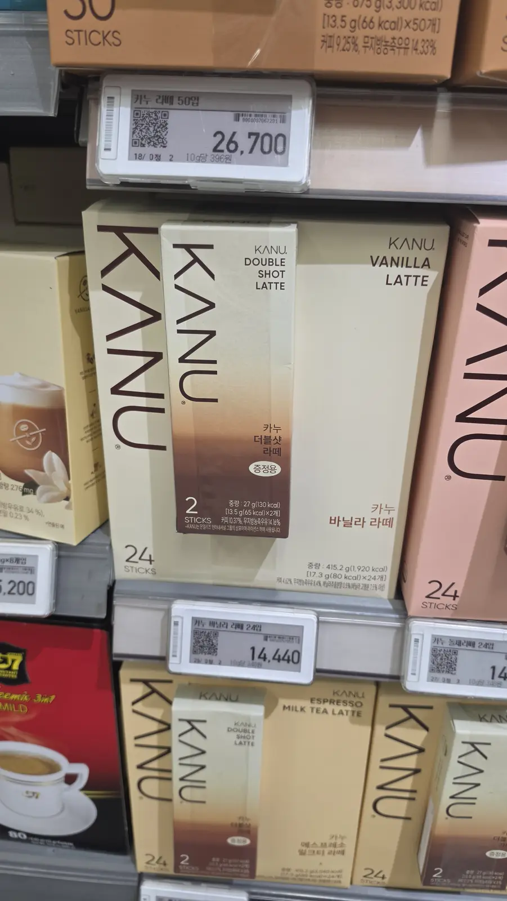
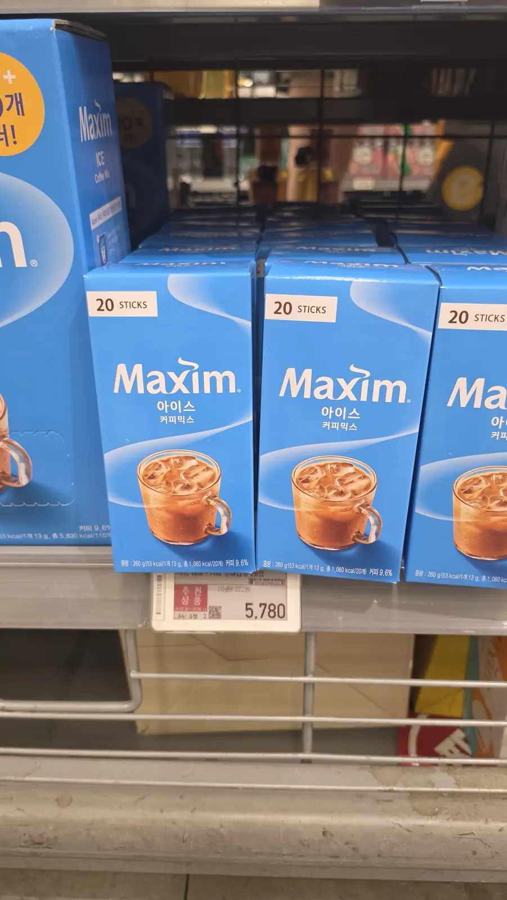

Most things people carry home from Korea get used once. The face masks
dry out, the keyring goes in a drawer, the snack you bought because the
packaging was cute turns out to be shrimp-flavoured.

The exception is the coffee. **A box of Korean coffee sticks is the one
souvenir that gets finished** — by you, at your desk, every morning for
two months, until you start looking up whether anyone ships it.

There are two brands you will see on every shelf, and almost every
visitor buys the wrong one for what they actually wanted. Here is the
difference, what it costs, what sizes it comes in — and the single best
way to drink it, which is not at home.

## First: they are not the same drink

This is the whole article in one paragraph, so let's do it first.

**맥심 (Maxim) is 커피믹스 — "coffee mix."** One stick contains instant
coffee **plus sugar plus non-dairy creamer**, already blended. You add
hot water and nothing else. It is sweet, tan-coloured, and creamy. This
is not a flaw or a cheap shortcut; it is the drink, designed this way,
and it is what Korea has been drinking since long before the third-wave
cafés arrived.

**카누 (KANU) is 아메리카노 — black instant americano.** No sugar, no
creamer. Just coffee. Add hot water and you get something that reads as
an actual americano rather than as instant coffee.

So the question "which Korean instant coffee tastes best?" — the one
that gets asked on Reddit every few weeks — has no answer, because the
two products are not competing. **Sweet and creamy, or black.** Decide
that first and the shelf stops being confusing.

## Maxim: the one Korea actually runs on

If you have watched a Korean drama, you have seen it: the yellow box in
the office pantry, someone tearing a stick with their teeth, stirring it
with the stick itself. That is Mocha Gold Mild.

*Mocha Gold Mild, 200 sticks — ₩34,780 · ⓒ @BalliBalliSeoul*

Maxim is genuinely everywhere here: office pantries, hospital waiting
rooms, government offices, motel rooms, the back of every small shop. A
Korean host handing you a paper cup of it is doing something closer to
hospitality than to caffeine delivery — **making someone a coffee is a
small act of 정 (jeong)**, the untranslatable warmth-obligation that
runs through a lot of Korean social life.

It also happens to be the Korean grocery item that travels furthest.
Walk into a Korean supermarket in almost any country and the yellow box
is there, usually near the entrance, usually stacked high.

**You can read the shelf by colour alone**, which matters when you can't
read the Korean:

| Colour | Product | What it tastes like |
| --- | --- | --- |
| 🟡 **Yellow** | 모카골드 마일드 · Mocha Gold Mild | The default. Sweetest and softest — start here |
| ⚪ **Cream** | 화이트골드 · White Gold | Creamier, less of the cocoa note. The other big seller |
| 🟠 **Orange** | 슈프림골드 · Supreme Gold | The premium line, and priced like it |
| 🔵 **Blue** | 아이스 커피믹스 · Ice | Formulated to dissolve in cold water |

*Supreme Gold — the premium tier, ₩25,830 for 100 · ⓒ @BalliBalliSeoul*

There is also a red box (오리지널) and a brown one (아라비카 100) that
run progressively less sweet and more bitter. If someone tells you Maxim
is "too sweet," the honest answer is that they drank the yellow one and
the range goes further than that.

## KANU: the americano in a stick

KANU is the newer arrival and the one a lot of Koreans now reach for
first — precisely because it is *not* sweet. Same convenience, but what
lands in the cup is black coffee.

*KANU comes in Dark Roast and Light Roast — and in boxes as small as five sticks · ⓒ @BalliBalliSeoul*

The main line is **Dark Roast** and **Light Roast Americano**, sold as
"MINI" sticks — 1.8 g of coffee and nothing else. If your normal order
is a black americano, this is the closest thing to it that fits in an
envelope.

Two variations worth knowing:

**아이스샷 (Ice Shot)** comes in a blue tube rather than a box, and the
sticks are double-size and formulated to **dissolve in cold water.** This
matters more than it sounds. Ordinary instant coffee seizes up and floats
in cold water; these don't. Cold water, ice, thirty seconds of stirring,
done.

*Ice Shot, ₩4,180 for a ten-stick tube — the tube is the travel format · ⓒ @BalliBalliSeoul*

**The latte range** is the other half of the shelf — vanilla latte,
double shot latte, espresso milk tea latte. These are closer to Maxim
territory (sweet, milky) but built on the KANU roast, and they are the
ones that tend to convert people who thought they didn't like instant
coffee.

*The latte line — vanilla, double shot, espresso milk tea · ⓒ @BalliBalliSeoul*

## You do not have to buy 200 sticks

This is the part that stops people. The boxes on the shelf are
enormous — 200 sticks, 280 sticks, "180 + 20 free" — because Korean
households buy coffee the way they buy rice. A 200-stick box of Maxim
is a serious object. It will not fit in your hand luggage, and it will
absolutely be the reason your suitcase is over.

**Both brands sell small.** You just have to look at the shelf below the
big boxes.

*Twenty sticks for ₩5,780 — this one fits in a coat pocket · ⓒ @BalliBalliSeoul*

| | Format | Price | Per cup |
| --- | --- | --- | --- |
| **Maxim Ice** | 20 sticks | ₩5,780 | ₩289 |
| **Maxim Supreme Gold** | 100 sticks | ₩25,830 | ₩258 |
| **Maxim Mocha Gold** | 200 sticks | ₩34,780 | **₩174** |
| **Maxim White Gold** | 200 sticks | ₩35,780 | ₩179 |
| **KANU Ice Shot** | 10-stick tube | ₩4,180 | ₩418 |
| **KANU Light Roast Mini** | 30 sticks | ₩8,480 | ₩283 |
| **KANU Light Roast Mini** | 150 sticks | ₩35,980 | ₩240 |
| **KANU Vanilla Latte** | 24 sticks | ₩14,440 | ₩602 |
| **KANU Latte** | 50 sticks | ₩26,700 | ₩534 |

*Shelf prices at a large supermarket, as of 14 August 2026. Convenience
stores charge more; prices move with promotions.*

Read the right-hand column before you assume the big box is the smart
buy. **Going small costs you about 18% per cup on KANU** (₩283 versus
₩240) — real, but not the difference people brace for. Maxim's small
formats carry a bigger penalty, because the giant boxes are the ones
that get the "+20 free" treatment.

Weighed against paying an airline for an extra bag, the small box wins
easily. And there is a five-stick KANU box on that shelf too — small
enough to test a roast before you commit, or to drop into someone's
Christmas card.

**One warning about the unit prices printed on Korean shelf labels:**
they are per 10 g, and Maxim sticks are around 11.7 g while KANU sticks
are 1.8 g. By weight, Maxim looks about thirteen times cheaper. It
isn't — most of that weight is sugar and creamer. Compare per cup, which
is what the table above does.

## The best cup of it you will ever have is on a mountain

Here is the thing nobody puts in the shopping guides, and it is the
reason to buy these at all.

Korea is 70% mountains, and hiking here is not a niche hobby — it is
what an enormous number of Koreans do on a Saturday, in full technical
kit, at an average age of about sixty. Go up any peak near Seoul on a
clear weekend morning and you will find the summit crowded, cheerful,
and smelling faintly of coffee.

Because this is what people carry: **a thermos of hot water and a
handful of sticks.**

You reach the top. You are warm from climbing and immediately cold from
stopping. The city is spread out under you and the wind is doing
something unkind to your ears. You pour hot water into a cup, tear a
stick with your teeth the way you have watched people do, stir it with
the empty wrapper, and drink it.

**It is, at that moment, the best coffee in the world.** Not because it
is good coffee — it is a ₩174 stick of sugar and creamer — but because
the conditions are perfect and it is hot and you earned it. Koreans know
this. It is why the sticks are in the backpack next to the boiled eggs
and the tangerines.

If you take one piece of advice from this article: **buy a small
thermos, fill it with hot water before you leave, and put four sticks in
your bag.** It works on a mountain, on a beach in October, on a cold
platform waiting for the first train, and in a hotel room at 6 a.m.
when nothing is open. Every convenience store sells thermoses, and
every convenience store has a hot-water dispenser to refill from —
which is a whole system we wrote up in the
[convenience store guide](/blog/korean-convenience-store-guide/).

## Make it properly: use less water than you think

The single most common mistake foreigners make with these is drowning
them.

**Use the volume printed on the wrapper.** Maxim sticks are calibrated
for a small Korean paper cup — roughly 120 ml — not for a Western mug.
Fill a 350 ml mug and you get brown water and conclude that Korean
coffee is weak. It isn't; you used three times the water it was built
for.

If you like a big cup, use two sticks. Koreans do this without ceremony,
and the standard household trick is mixing: **two yellow to one brown**
gives you the sweetness with more of a coffee edge. For iced, a Maxim
Mocha Gold stick plus a KANU Dark Roast stick over ice is a genuinely
good drink and costs about ₩400.

The stick itself is the spoon. Tear the top, pour, stir with the empty
sleeve, bin it. Nobody here uses a teaspoon for this.

## Where to buy, and what you're saving

**Large supermarkets** (Emart, Homeplus, Lotte Mart) have the full range
and the lowest prices — that's where the prices above come from.
**Convenience stores** carry a narrow selection at a markup, but they
are open at 3 a.m. and they are on every corner. **Traditional markets
and discount shops** sometimes beat the supermarkets on the big boxes.

For scale: a plain americano in a Seoul café runs around ₩4,500, and
[cafés here are a whole institution](/blog/korea-cafe-culture-guide/)
that we have written about separately. At ₩174 a cup, Maxim is roughly
**twenty-six times cheaper.** KANU's mini sticks are about nineteen
times cheaper. This is not an argument against cafés — you are paying
for the room, not the coffee — but it explains why the office pantry
never runs out.

If you get home and find you miss it, it does ship: Korean grocery sites
and the big marketplaces both carry it, and our
[Coupang guide](/blog/coupang-korea-shopping-guide/) covers ordering
inside Korea if you want a box sent to your hotel rather than carried
across the city.

## So which one do you buy?

| If you… | Buy |
| --- | --- |
| Want to taste what Korea actually drinks | **Maxim Mocha Gold** (yellow) |
| Drink black coffee and don't want sugar | **KANU Dark or Light Roast Mini** |
| Are buying a gift for someone who likes sweet coffee | **Maxim White Gold** or a **KANU latte** box |
| Have no suitcase space | **KANU Ice Shot tube (10)** or a **5-stick mini box** |
| Are going hiking | **Maxim, whichever colour** — and a thermos |
| Want the iced version without a machine | **KANU Ice Shot** or **Maxim Ice** |

Buy one small box of each, honestly. Between the two of them you have
covered every mood, it costs under ₩15,000, and you will know within a
week which one you should have bought the 200-stick box of.

## The Korean part

Nothing about buying coffee needs translating — the boxes are colour
coded, the mart is self-service, and the price is the price
([no tipping, no surprises](/blog/no-tipping-in-korea/)).

Where we come in is everything around it: getting a case of it sent to
your hotel before you fly out, working out whether a bulk box will clear
customs at the other end, or reading a Korean-only promotion that says
"buy two get one" in a way the translation app mangles. That's the
[anything-else concierge service](/etc), and it is exactly the kind of
small errand it exists for.

## Get it sorted

> **Want a box shipped somewhere, or stuck on a Korean-only checkout?**
> Message us on [KakaoTalk](https://pf.kakao.com/_RJxhSX/chat) or
> [WhatsApp](https://wa.me/821075191282) and we'll place the order in
> Korean and send you the tracking. Asking costs nothing — you pay only
> for the work you book.

The one-line version: **Maxim is coffee with sugar and creamer, KANU is
black, both come in sizes that fit a suitcase, and the best cup you'll
have of either is at the top of a mountain with a thermos.**

*Prices verified at a large Seoul supermarket on 14 August 2026.*
