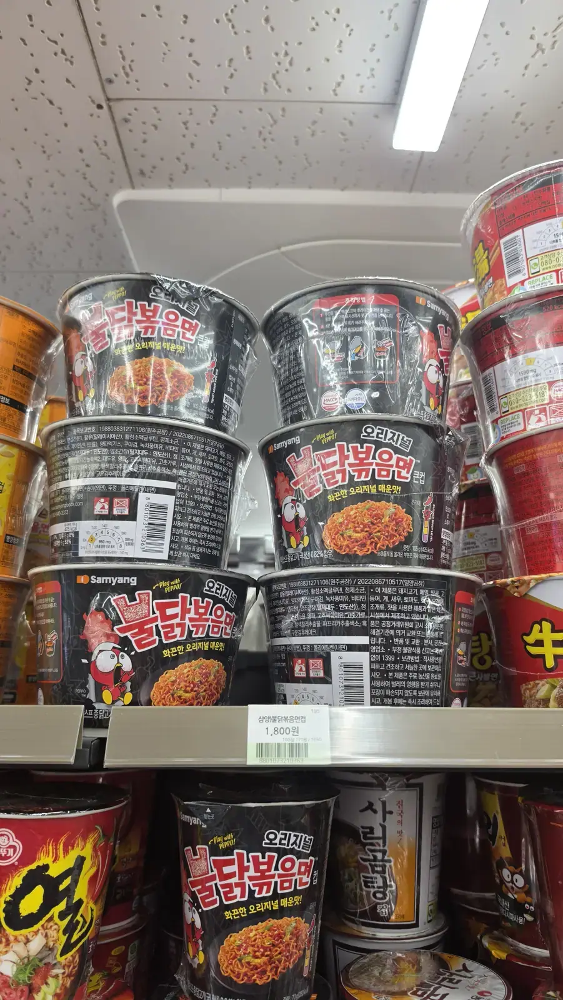
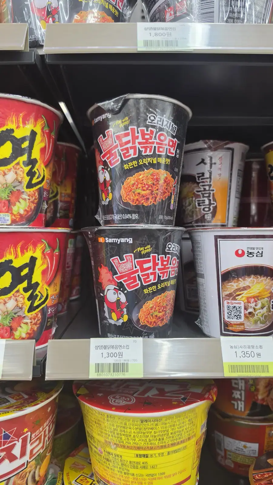
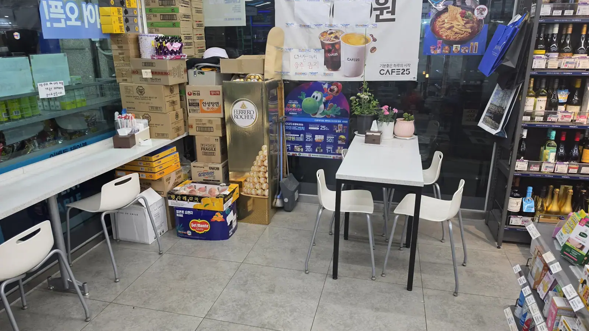
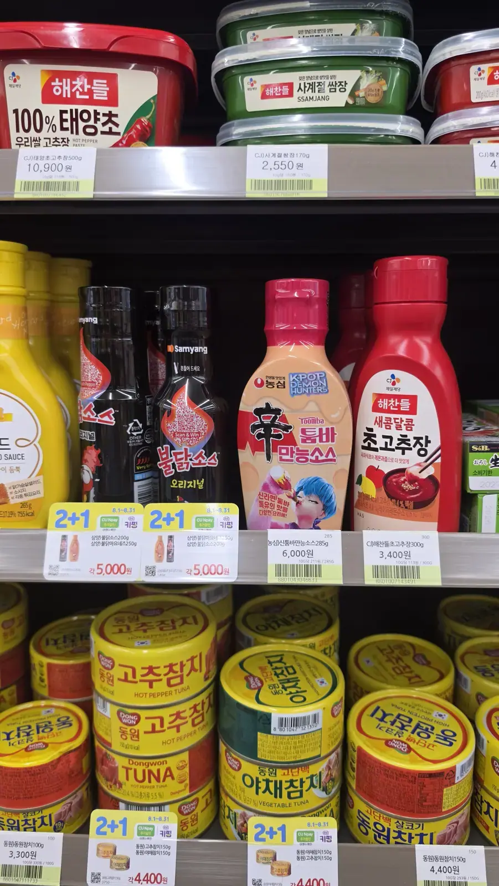

You came for one thing and you're now looking at a wall of forty
cups, most of them red, most of them shouting, none of them in a
language you read. Somewhere in there is the noodle you saw online
— and next to it are five things that look identical but aren't.
Here's how to read that shelf in about ninety seconds.

## The heat ladder

Spice is the axis everything else hangs off. Korean instant noodles
carry an official Scoville number, and the useful ones look like
this:

| Noodle | Scoville (SHU) | What that means |
| ------ | -------------- | --------------- |
| Most non-spicy cups (udon, beef soup, jjajang) | ~0 | Genuinely mild |
| **Shin Ramyun** (신라면) | ~3,400 | The national default. Warm, not painful |
| **Buldak Bokkeummyeon** (불닭볶음면) | **4,404** | The famous one. Hot, but survivable |
| **Nuclear Buldak** (핵불닭볶음면) | **8,706** | Twice the original. Treat with respect |

For scale, a jalapeño runs somewhere in the 2,500–8,000 range. So
original buldak sits in jalapeño territory — hot, but not the
apocalypse the internet sold you. **Nuclear is the one that hurts.**

## The buldak you know abroad isn't quite the one on this shelf

This trips up almost everyone. The export packs sold overseas as
**"2x Spicy"** are labelled around **10,000 SHU**, while the
domestic Korean pack called **핵불닭 (Nuclear)** is **8,706**. The
naming, the packaging and the numbers simply don't line up between
markets.

Two consequences, both practical:

- **The variety here is much wider than the export range.** Korean
  shelves carry seasonal and limited flavours that never leave the
  country.
- **Don't assume your tolerance transfers.** If you've only had the
  export version, buy one cup and find out before committing to a
  four-pack.

## Buldak is not one noodle — it's a whole product line

Look at the cover photo again and count the colours. That is a
single brand occupying an entire shelf, and the variants are not
ranked by heat in any way the packaging makes obvious:

- **Original** (black) — 4,404 SHU, the reference point.
- **Carbonara** (pink) — creamy, and **noticeably milder** than
  original. This is the one to hand a nervous friend.
- **Cheese** (yellow) — same trick, dairy blunts the burn.
- **Mala** (마라) — different heat entirely: numbing Sichuan-style
  rather than straight fire.
- **Stew / soup versions** (탕면) — buldak flavour with broth
  instead of the dry stir-fried format.

The rule of thumb: **cream and cheese variants are milder, "Nuclear"
and 마라 are the ones to approach carefully**, and the black
original is your baseline.

*Big cups, ₩1,800 · ⓒ @BalliBalliSeoul*

## Cup or bag?

Both formats sit on the same aisle and the choice is really about
where you're going to eat.

- **Cup (컵라면)** — everything is in the cup. Add hot water, wait
  three minutes. **Big cups run about ₩1,800; smaller ones ₩1,300–1,350**
  at the shelf in these photos.
- **Bag (봉지라면)** — cheaper per serving, but you need a pot, a
  hob and about eight minutes. Multipacks at a mart are cheapest of
  all.

If you're staying anywhere with a kitchen, bags win on price. If
you're out, the cup is the entire point — because of what comes
next.

*Smaller cups, ₩1,300–1,350 · ⓒ @BalliBalliSeoul*

## You can cook it and eat it in the store

This is the part nobody tells visitors, and it's the best thing
about the whole system.

**Korean convenience stores are set up for you to eat there.** Not
tolerated — designed. Near the counter you'll find a **hot water
dispenser** (온수기) and usually a **microwave**, and by the window
or outside there are tables and stools. Ramyeon is only one thing
they do — the
[full tour of what a Korean convenience store is for](/blog/korean-convenience-store-guide/)
covers the meal boxes, the deals and the services desk.

The routine:

1. Pick your cup and **pay first**, at the counter.
2. Peel the lid back to the marked line, fill with hot water to the
   inside line, close it.
3. **Wait three minutes** — the dispenser is right there, and
   chopsticks and lids are on the counter, free.
4. Eat at the table. When you're done, **bin it in the store's
   bins** — this is exactly what those bins are for, since the
   rubbish came from the store.

*Tables inside the shop — this is normal, not cheeky · ⓒ @BalliBalliSeoul*

A cup of noodles, a table, air conditioning and a coffee machine,
at 3 a.m., for under ₩4,000. It's one of the
[things that genuinely surprise people about Korea](/blog/surprising-things-about-korea/),
and it's the reason the convenience store is the answer to so many
questions here — from
[a fever at midnight to a box of tampons](/blog/condoms-pads-tampons-korea/).

If you want a chair and a laptop instead of a chair and a noodle,
that's the [cafe's job](/blog/korea-cafe-culture-guide/) — different
rules, same idea.

## The sauce shelf, for taking it home

Buldak's second act is **sauce in a bottle**, sold on the condiment
aisle rather than with the noodles. It's the same flavour in a form
that works on rice, chicken, eggs or anything else, and it has
quietly become one of the most practical souvenirs you can buy —
lighter than snack boxes and actually used at home.

*Sauces sit with the condiments, not the noodles — note the 2+1 tags · ⓒ @BalliBalliSeoul*

Watch the shelf tags: **2+1** (buy two, get one) is extremely common
on this aisle, and it's how a ₩5,000 bottle turns into three
bottles for the same money. Just remember they're liquid — pack
them in checked luggage.

## If you don't want spicy at all

Perfectly reasonable, and well catered for. The same wall carries
**beef soup (육개장), udon, seafood, kalguksu-style and jjajang**
(black bean, sweet and not spicy at all) cups. If the packaging is
red with flames, it's hot. If it's brown, yellow or blue with a
picture of clear broth, it isn't.

## The Korean part

The flavour names are in Korean, the heat warnings are in Korean,
and the difference between "very spicy" and "the one that made
people cry on YouTube" is one word on a lid. Send us a photo of the
shelf and our [anything-else concierge service](/etc) will tell you
what you're holding — before you buy four of them.

## Get it sorted

> **Standing in front of the ramyeon wall?** Snap it and message us
> on [WhatsApp](https://wa.me/821075191282) — we'll tell you which
> cup is which, in English. First answer is free.

The one-line version: **original buldak is 4,404 and manageable,
Nuclear is 8,706 and isn't, carbonara is the gentle one, cups are
₩1,300–1,800 — and you can cook it and eat it right there in the
shop.**
