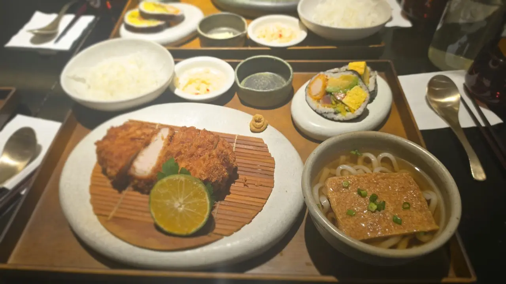
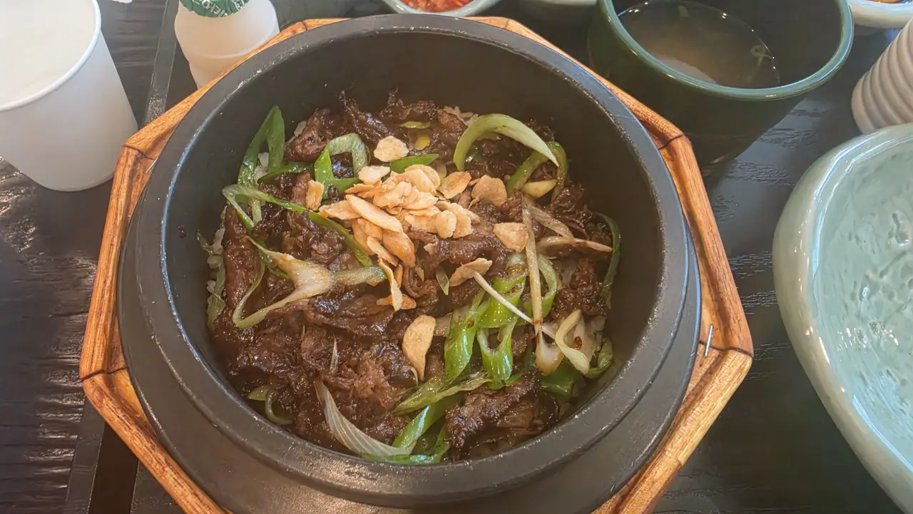

You sit down at a Korean restaurant and the table is bare. No
cutlery, no napkins, no menu handed over, and no server heading
your way. In most countries this means something has gone wrong.
Here it means everything is going exactly as designed — you just
haven't been told where the design keeps things. Five rules and
you'll order like you've done it a hundred times.

## 1. Your cutlery is in the table

Look at the **side of the table, or just under the edge**: there's
a shallow **slide-out drawer**. Inside are the spoons, chopsticks,
napkins and often wet wipes. Pull it open and set your own place.

(No drawer? Then look for a stainless steel box on the table with
the same contents, or a cutlery caddy near the water station.)

Two related notes: Korean spoons and chopsticks come as a pair —
**the spoon does the rice and soup work**, which surprises people
who assume chopsticks do everything — and you should never stand
chopsticks upright in a bowl of rice, which is what's done at
funeral rites.

## 2. Don't wait to be greeted — press the bell

In much of Europe and North America, you wait at your table until
a server comes to you. **In Korea, waiting is the mistake.** On the
table edge or the wall beside you is a small **call button
(호출벨)**. Press it, a chime sounds at the kitchen, and someone
comes to you.

No bell? Then a clear, unembarrassed **"jeogiyo!" (저기요)** across
the room is completely normal. It sounds brusque to foreign ears
and it isn't — it's just how the room works, and nobody thinks less
of you for it.

The upside of this system is speed: you're never stuck waving at
someone's back or waiting ten minutes to ask for one more thing.
Decide, press, done.

## 3. Water and banchan are free — and often self-service

Two things arrive that you didn't order: **water** and **banchan
(반찬)**, the little side dishes — kimchi, seasoned vegetables,
pickles, whatever the kitchen does. Both are **free, included, and
refillable at no charge.** You do not get billed for a second plate
of kimchi.

Refills work one of two ways: press the bell and ask, or help
yourself at the **self-service station** if the restaurant has one
— a counter with water dispensers, cups, and trays of banchan.

*A standard set: main, rice, soup, banchan, spoon and chopsticks · ⓒ @BalliBalliSeoul*

The one piece of etiquette that matters: **take what you'll eat.**
Refills are unlimited; leaving a mountain of untouched banchan is
the thing that gets frowned at, because leftover side dishes can't
be reused.

*Water, banchan, and a stone pot — the standard table · ⓒ @BalliBalliSeoul*

## 4. Cafes run on the opposite system

Everything above is for restaurants. **Cafes invert it**: you
order and pay **first**, at the counter or a kiosk, then sit down.
Nobody comes to your table to take an order, and sitting first
while you wait for service will leave you waiting forever.

After ordering you'll usually get a **buzzer (진동벨)** — a puck
that flashes and vibrates when your drink is ready, at which point
you collect it yourself from the pickup counter. When you're done,
carry your cup to the **return station (반납대)**, where cups,
trash and food waste get separated into their own bins. Leaving
everything on the table isn't scandalous, but bussing your own cup
is what locals do.

## 5. You pay at the counter, and you don't tip

No one brings a bill to your table for you to sign. The paper slip
on your table (or handed to you when the food came) goes with you
to the **counter by the entrance**, where you pay by card, cash or
phone.

And to settle the question every visitor asks: **there is no
tipping in Korea** — not in restaurants, not on the kiosk screen,
not in the taxi. The listed price includes tax and service. We
went deep on that one in
[our guide to not tipping in Korea](/blog/no-tipping-in-korea/),
because the reflex is hard to unlearn.

## The Korean part

Menus without pictures, servers who don't speak English, the
question of what's in the stew, allergies you can't explain, and
restaurants that only take Korean-language phone reservations —
that's where a meal stops being fun. Send us the restaurant or a
photo of the menu on WhatsApp and our
[anything-else concierge service](/etc) will translate it, tell you
what's spicy, and make the booking call in Korean.

## Get it sorted

> **Standing outside a place you can't read, or stuck at a table
> with no idea what to press?** Message us on
> [WhatsApp](https://wa.me/821075191282) — we'll walk you through
> it in English, live. First answer is free.

The one-line version: **cutlery's in the drawer, press the bell,
water and banchan are free, cafes want payment first, and you pay
at the counter without tipping.** Do that and the only hard part
left is choosing.
