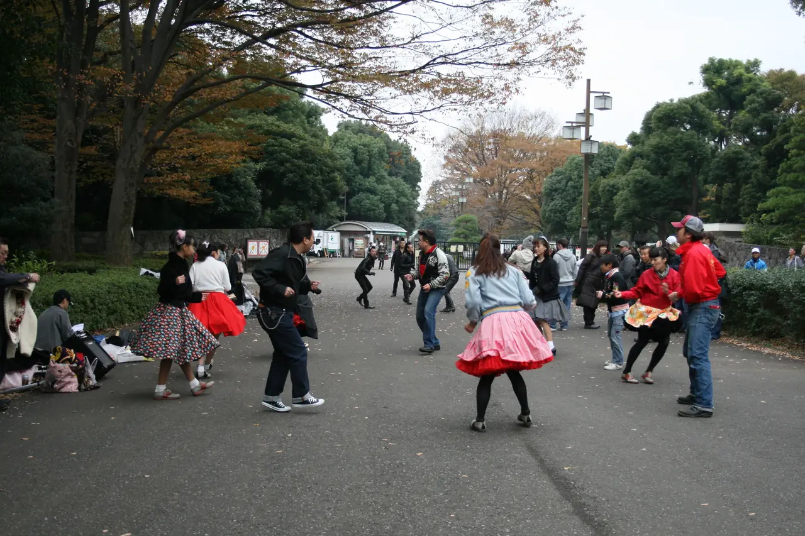

Searching **"K-pop dance classes near me"** in Seoul — or Korean pop dance
classes, if you type it the long way — gives you a handful of studios that
have built a page in English, mostly in Hongdae and Gangnam, mostly selling a
one-off class to visitors.

Those are real and they are good. They are also a small corner of what is
actually around you. The rest of it — the studios in your own neighbourhood,
where Koreans learn the same choreography every week — does not show up,
because it is not indexed in the language you are searching in.

Here is the word that opens the other door, what the two kinds of class are
actually like, and how to get into one.

## What K-pop dance classes are called in Korean

K-pop dance, as a class you sign up for, is called **방송댄스 (bangsong
dance)** — literally "broadcast dance", the style performed on music shows.
Not "K-pop dance". Not 케이팝 댄스.

**Search 방송댄스 plus your neighbourhood** — `방송댄스 홍대`, `방송댄스
강남`, `방송댄스 노원` — on Naver, which is where Korean studios actually
list, and the map fills up with places the English search never showed you.
It is the same trick as searching 설비 instead of "plumber": the English word
returns the businesses that market to foreigners, and the Korean word returns
the market.

Two related words worth knowing when you read a timetable:

- **기초 / 초급 (gicho / chogeup)** — basic, beginner. Where to start even if
  you have danced before, because the vocabulary is new.
- **커버댄스 (cover dance)** — learning a specific idol routine, usually
  split across several weeks.

## One-day classes for visitors, or a neighbourhood studio?

**One-day classes for visitors.** Run in English, bookable online, often an
hour to ninety minutes, sometimes with the video of your group at the end.
You can book one for next Tuesday from another country, and for somebody in
Seoul for a week this is the right product.

**Neighbourhood studios.** Monthly enrolment, taught in Korean, the same
rooms local teenagers and office workers use. Cheaper per class by a wide
margin, and the normal way to actually get better at it.

If you live here, the second kind is almost always what you want after the
first lesson. The barrier is not the dancing. It is that the timetable, the
sign-up and the payment are all Korean, which is the gap this site exists to
close.

### How much does a K-pop dance class cost in Seoul?

Because any number we printed here would be wrong for most of the people
reading it.

A one-day class built for visitors in Hongdae and a 방송댄스 studio two
stops from your flat are **different products at different prices**, and the
neighbourhood moves the number as much as the class does. A price list would
be a guess dressed up as information, and this site does not do that.

So we do it the other way round: **you tell us where you are, and we find out
what it costs there.** Real numbers, from the studios actually within reach
of you, before you commit to anything.

**And we ask at the local rate** — the price a Korean walking in off the
street would be quoted, not a figure adjusted because the student is
foreign. That is the entire point of having somebody make the call in
Korean.

## What a beginner class is actually like

*Dancing in public, somewhere outside Korea, 2009 — our own photograph, included for the feeling of it. Not a class, not a studio, not anything we arrange · ⓒ @BalliBalliSeoul*

Worth knowing before you walk in, because the format surprises people.

- **It runs on counts, not sentences.** Instructors teach in eight-counts and
  demonstrate everything. You can follow a Korean-language class with almost
  no Korean, which is why dance is one of the easiest hobbies to start here
  — the same reason sport works for children with no Korean, which we wrote
  about in [after-school and hobby classes](/blog/after-school-classes-seoul/).
- **Mirrors at the front, rows by confidence.** Nobody minds where you stand.
- **Filming at the end is normal.** Most classes record the final run-through.
  If you would rather not be in it, say so at the start — it is a routine
  request, not a scene.
- **A single class is a fragment of a routine.** Choreography is usually
  taught across several sessions, so dropping into week three of a cover
  class means arriving mid-sentence. Ask which week the class is on.

**What to bring:** indoor trainers that have never been outside, water, and
clothes you can move in. Studios have changing rooms; most have lockers.

## Where to find K-pop dance classes near you in Seoul

**Hongdae** has the highest density and the most English-friendly options,
and it is where most one-day classes for visitors are run.

**Gangnam** has the large academies — the ones with hobby courses, audition
preparation and instructor certification tracks running side by side.

**Everywhere else** has neighbourhood studios. This is the part people miss:
there is very likely a 방송댄스 class within fifteen minutes of where you
live, whichever district that is. It just has no English page.

## How to book a dance class in Korea without Korean

Four places this goes wrong for foreigners, and none of them is the dancing.

1. **Finding it.** The listing is on Naver, in Korean, often with the
   timetable as an image rather than text.
2. **The sign-up.** Many studios take bookings through a KakaoTalk channel or
   a Naver reservation that wants a Korean phone number.
3. **The question nobody has asked them.** Whether a foreigner can join is
   usually a yes, delivered with surprise, because nobody has asked before.
4. **Monthly enrolment.** Most neighbourhood studios sell a month at a time,
   not a single class — but many will let you try one, if you ask in the way
   that gets a yes.

> **Want one near you rather than near the tourists?** Tell us your
> neighbourhood and the evenings you are free on
> [KakaoTalk](https://pf.kakao.com/_RJxhSX/chat) or
> [WhatsApp](https://wa.me/821075191282?text=Hi%20Balli%20Balli%21%20I%27d%20like%20help%20finding%20a%20dance%20class.%0A%0A-%20Name%3A%0A-%20Neighbourhood%20or%20station%3A%0A-%20Evenings%20I%27m%20free%3A%0A-%20Beginner%20or%20experienced%3A%0A-%20One%20class%20or%20monthly%3A)
> — we will find what is actually near you and tell you what it costs.

## Can a foreigner join a Korean dance class?

**Yes — and the studio is usually surprised to be asked.** Most neighbourhood
studios have simply never had a foreign student walk in, so there is no
policy to find on their page. Somebody has to ask, in Korean, and the answer
is nearly always that you are welcome.

That is the job we do for any class: we search in Korean, we call, and we ask
the questions that are not answered on the page — can a foreigner join, is a
single class possible, what level is this one, and what do you need to bring.
Then we book it.

You can see exactly what that looks like: here is
[a real research sheet](/sample/after-school-classes-seoul) we sent a family,
with eight venues checked one by one — travel times, prices, trial options
and a straight note about which ones can handle English.

We take no commission from any studio. Whichever one you pick, we earn the
same, which is why we can tell you that the cheap one near your flat is
probably better value than the famous one across the city.

## Get it sorted

Send us three things: **where you are, when you are free, and whether you
want one class or a habit.** Add your level if you have one.

We will come back with what is actually within reach of you, what each one
costs, and an honest note about which will be hard in Korean — then book the
one you choose.

Beginner classes exist in every district. The hard part was never the
dancing.
