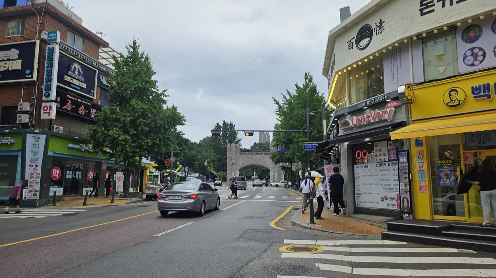
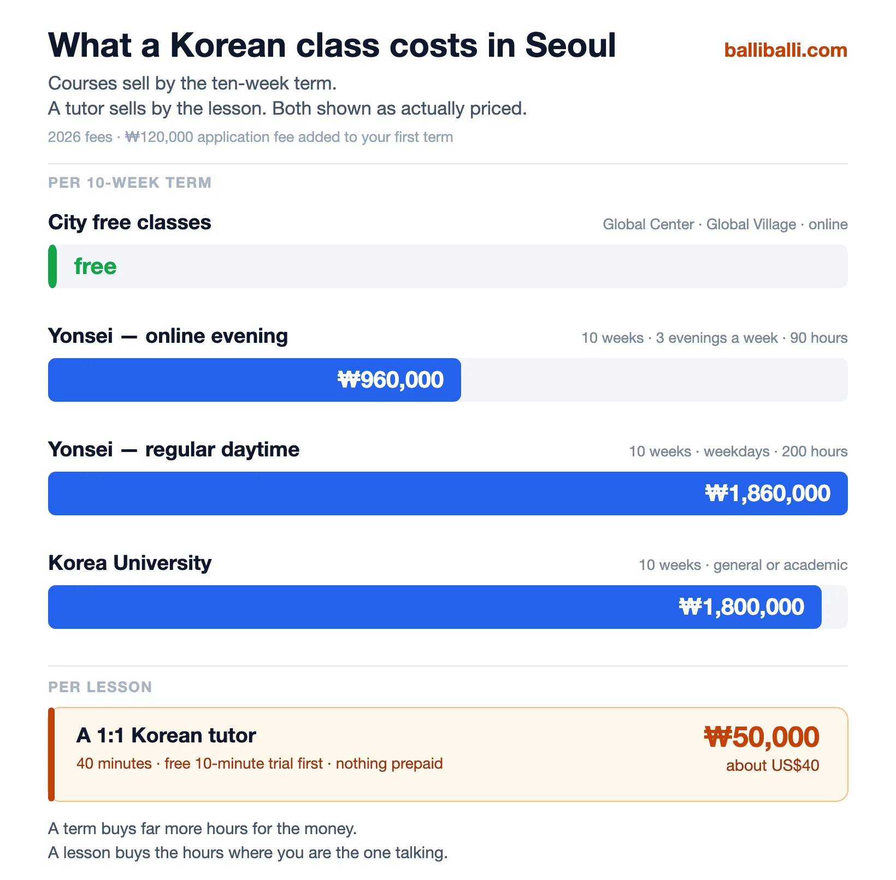

Someone on [r/Korean](https://www.reddit.com/r/Korean/comments/1f0zjrz/whats_an_affordable_or_free_way_to_learn_korean/)
put it about as plainly as it can be put:

> I've never studied a language before so I've been using Duolingo
> everyday for the past 3 months and I've learned almost nothing.
> What would you recommend?

Eighty-odd people upvoted that. The replies are not gentle about
Duolingo, and they are mostly right — but the more useful thing is
what the question exposes. **Learning Korean is not one decision.
It is four or five, taken in order**, and most people take the
easiest one first and then wonder why they have stalled.

Here is the order, and what each step costs in Seoul.

## Start with Hangul — it takes a weekend

Before anything else: **learn the alphabet.** Not "eventually" —
this weekend.

Hangul was designed to be learnable. The letters are shaped after
the mouth positions that make them, and a motivated adult gets
through it in a couple of days. There is no romanisation system
worth the trouble, and every hour you spend reading Korean through
English letters is an hour you will have to undo.

**This is the one stage where the free apps are genuinely fine.**
Nothing can go badly wrong here — you are learning symbols, not
register. Use whatever is nearest, get it done, and stop treating
it as an achievement. It is the entry fee.

## What about the apps?

Then comes the question the r/Korean poster was really asking.

The thread's verdict on Duolingo, repeated by commenter after
commenter, is not that it teaches you nothing. It is that **it
stalls.** The sentences get strange, the grammar is never
explained, and there is no obvious point at which you are supposed
to graduate from it. One reply put the useful version of the
criticism: it is a vocabulary drill wearing the costume of a
course.

Two things worth taking from that thread rather than the app-list
articles:

**Check whether the free thing is still free.** Several resources
that a 2023 recommendation calls free have since moved behind a
paywall, wholly or partly. That is not a scandal — people have to
eat — but it does mean an old forum thread is a starting point for
a search, not a shopping list.

**The learners themselves keep landing on the same free
institutions.** The King Sejong Institute material comes up
repeatedly in that thread, entirely independently of the Seoul
city page we will get to in a moment. When a learner community and
a government portal point at the same door, that is worth
something.

And the limit on all of it, which no app has solved and none is
about to: **software cannot hear you.** Hold that thought — it
decides the last section of this article.

## Which Korean class fits you, in one minute

If you read nothing else, read the table.

| If you… | Go with |
| ------- | ------- |
| Are new, on a budget, and free on a weekday | **City free classes** |
| Are disciplined and want grammar and reading | **Free online** (King Sejong) |
| Want structure and can give up your daytime for ten weeks | **A university institute** |
| Work full time but want a real course | **A university evening or online course** |
| Have a base and still cannot speak | **A Korean tutor** |
| Need Korean for your job — email, meetings, the register | **A Korean tutor** (workplace Korean) |
| Are outside Seoul, or not in Korea yet | **A Korean tutor, by video call** |
| Need proof for a visa, a university or an employer | **TOPIK preparation**, whichever route |

Now the detail.

**One disclosure first, because it matters for how you read the
rest:** we have no connection to any of the programmes below. No
partnership, no referral arrangement, nothing. We list them
because for a lot of people they are the right answer. What we run
is our own small thing — two teachers — and it comes at the end.

## Free Korean language classes, run by the city

This is the part most people never find, and it is genuinely free.

**Seoul Metropolitan Government and its partner organisations run
Korean classes for foreign residents** across the city:

- **Seoul Global Center** — 2 locations
- **Global Village Centers** — 7 locations
- **Foreign Workers' Centers** — 6 locations

**Contact: +82-2-2075-4180 · [global.seoul.go.kr](https://global.seoul.go.kr)**
(the site runs in Korean, English, Chinese and Japanese)

What you get is a real classroom with a real teacher at no cost.
What you give up is choice: **fixed timetables, fixed locations,
mixed-level groups, and terms that fill up.** If one of the
locations is near you and the schedule fits, this is unambiguously
the best value in Korean education in this city and you should
start here rather than reading on.

## Free Korean classes online

Three no-cost options worth knowing, all government or
university-backed rather than commercial apps:

| Platform | Site | Languages |
| -------- | ---- | --------- |
| **Nuri–King Sejong Institute** | nuri.iksi.or.kr | Korean, English, Chinese, Japanese, French, Thai, Vietnamese, Spanish, Indonesian |
| **Cyber University of Korea** | korean.cuk.edu | Korean, English |
| **EBS DURIAN** | ebs.co.kr/durian/us | Korean, English, Chinese, Vietnamese |

The King Sejong material in particular is the closest thing to an
official national curriculum, and it is free in nine languages.

These are excellent for reading, listening and grammar. They are
structurally incapable of telling you that what you just said
sounded rude, because nobody hears you say it.

## Churches, and the trade-off nobody states

There is a fourth free route that guides tend to either skip or
sell, and it deserves the plain version.

**A number of Korean churches offer free Korean lessons to
foreigners.** If you have ever met missionaries teaching English
in another country, this is the same arrangement running the other
way: a religious organisation with people, rooms and time, using
language teaching as a way to meet newcomers.

The trade-off is not hidden, but it is rarely stated: **the
lessons are free, and there is usually an expectation that you
will come to services.** That is not a criticism — it is the deal.
Some people are entirely happy with it and get a social circle out
of it as well as a class. Others would rather pay.

**We have not attended one, so we are not recommending or warning
you off.** We are telling you it exists, and that the arrangement
is worth understanding before you walk in rather than after.

## University Korean language institutes

The serious, structured option. Most Seoul universities run a
Korean language centre open to the public.

Contacts as listed by the **Seoul Metropolitan Government**, as of
**August 2026** — check the institute's own site before you plan
around any of it:

| University | Phone | Site |
| ---------- | ----- | ---- |
| Korea University Korean Language Center | 02-3290-2971 | klcc.korea.ac.kr |
| Konkuk University Korean Education Dept. | 02-450-3075~6 | kli.konkuk.ac.kr |
| Kyung Hee University Institute of International Education | 02-961-0081~2 | iie.khu.ac.kr |
| Dongguk University International Language Institute | 02-2260-3471~2 | interlang.dongguk.edu |
| Sookmyung Global Language Institute | 02-710-9164 | lingua.sookmyung.ac.kr |
| Soongsil University Office of International Affairs | 02-820-0783~4 | language.ssu.ac.kr |
| Sungkyunkwan (SKKU) Sungkyun Language Institute | 02-760-1341 | koreansli.skku.edu |
| Sogang Korean Language Education Center | 02-705-8088~9 | klec.sogang.ac.kr |
| Seoul National University Language Education Institute | 02-880-8570 / 5488 | lei.snu.ac.kr |
| Yonsei University Korean Language Institute | 02-2133-3465 / 8550~1 | yskli.com |
| Ewha Language Center | 02-3277-6958 | elc.ewha.ac.kr |
| Hankuk University of Foreign Studies — Korean Language & Culture | 02-2173-2262 | korean.ac.kr |
| Hanyang Institute of International Education | 02-2220-1449 | iie.hanyang.ac.kr |
| Hansung University Language Education Center | 02-760-4433 | hansung.ac.kr |

*Most of these sit in a university district, which is its own reason to go · ⓒ @BalliBalliSeoul*

Most publish in Korean, English, Chinese and Japanese, so the
enquiry itself is manageable without Korean.

### The evening course nobody mentions

The standard advice is that a university institute is impossible
if you have a job. **That is not quite true any more, and it is
the most useful thing in this article.**

Yonsei, for example, runs an **online course by Zoom, three
evenings a week** — Monday, Tuesday and Thursday, 18:30 to 21:05 —
ten weeks, ninety hours, levels 1 to 8. It costs roughly **half**
what the daytime course costs.

There is a real catch, and it is not the price: **that course
cannot get you a visa or extend your stay.** If you are here on a
student visa built around language study, the daytime programme is
the one that counts. If you are here on something else and simply
want to learn, the evening route is open.

Ask each institute whether they run one. Not all of them do, and
none of them advertise it at the top of the page.

## What a Korean class actually costs

Numbers, because everyone dances around them. These are 2026
figures published by two institutes — **Yonsei and Korea
University** — and the other twelve will differ, so treat them as
the shape of the thing rather than the price list.

| Route | Term | Hours | Fee |
| ----- | ---- | ----- | --- |
| City free classes · free online | — | — | **₩0** |
| Yonsei, online evening course | 10 weeks | 90 | **₩960,000** |
| Yonsei, regular daytime course | 10 weeks | 200 | **₩1,860,000** |
| Korea University, general or academic | 10 weeks | — | **₩1,800,000** |
| Yonsei, 3-week short course | 3 weeks | 60 | ₩1,080,000 |
| Yonsei, 5-week summer course | 5 weeks | 100 | ₩1,580,000 total |

**Add ₩120,000 to your first term.** Both institutes charge a
non-refundable application fee on top, and it is easy to miss when
you are comparing.

A private tutor is sold differently — **by the lesson, not by the
term.** Ours is **₩50,000, about US$40, for a 40-minute
one-to-one lesson**, with a free ten-minute trial first and
nothing paid in advance.

Those two things do not divide neatly into each other, and we are
not going to pretend they do. **A term buys you far more hours for
the money.** Two hundred hours of teaching for ₩1,860,000 is
excellent value and no tutor can match it on volume.

**A lesson buys you something else: the hours where you are the
one talking.** In a class of a dozen people, most of your speaking
is done by someone else. That is the entire difference, and it is
why the two are priced the way they are.

*Courses are priced per ten-week term; a tutor per lesson · ⓒ Balli Balli Seoul*

**If a free class or an institute fits your schedule, take it.**
Genuinely. Come back to this next bit when it doesn't.

## What a Korean teacher does that a class can't

Look down the list and notice what is missing from every free and
institutional option: **someone correcting your speaking, on your
schedule, about the things you personally have to say.**

City classes and university courses teach a syllabus to a group.
Online platforms cannot hear you. Both are the right tool for
building a base — and neither can rehearse you through the
conversation you are dreading at the building office on Thursday.

There is a beginner's worry that comes up on r/Korean again and
again, and it is the sharpest version of this: *what if I get
fairly far and then find out that everything I learned is slightly
off — too formal, or not formal enough — and I never knew?*

That instinct is correct. **No app will ever tell you that you
have been mildly rude to a shopkeeper for six months.** The gap
between fine and faintly impolite in Korean is a verb ending, and
only a person who hears you say it can close it.

So the case for a tutor is a narrow one:

- **You work**, and even the evening course is more than you can
  commit to
- **You have a base already** and cannot get from reading to
  speaking
- **You need specific situations** — the landlord, the clinic, the
  workplace — rather than chapter four
- **You need workplace Korean** — email, meetings, and the
  register people actually use in a Korean office
- **You are aiming at a TOPIK level** and need the writing section
  marked by a human

## 🇰🇷 Want a Korean tutor? We can introduce you

*Rim — came to teaching from the working world, so workplace Korean is her ground · ⓒ Balli Balli Seoul*

*Elli — a career teacher, and the one to ask for patient beginner work · ⓒ Balli Balli Seoul*

> **We match you with a Korean teacher** — conversation, the
> Korean for specific situations, workplace Korean, or TOPIK
> preparation.
>
> - **Free 10-minute trial**, then **₩50,000 (about US$40) for a
>   40-minute 1:1 lesson**
> - **Online by video call** — Zoom, KakaoTalk or Teams — so your
>   country and time zone do not matter. **In person in Seoul** is
>   available too
> - Booked as you go. No package, nothing prepaid
>
> Both teachers, and what each is best for, are on our
> **[Korean lessons page](/korean-lessons)**. Or message us on
> [WhatsApp](https://wa.me/821075191282) or
> [KakaoTalk](https://pf.kakao.com/_RJxhSX/chat) — first answer is
> free.

**Not in Seoul, or not in Korea yet?** Everything above this line —
the city classes, the institutes, the churches — is Seoul only.
Video lessons are the one option on this page that does not care
where you are, which is why people who are still planning the move
tend to start here.

To be straightforward: **we make the introduction and handle the
arrangement**, the teaching is the teacher's, and we do not promise
a test result.

## And TOPIK, briefly

If the reason you are learning is paperwork — a university, a visa
points table, an employer — the thing being measured is **TOPIK**,
the official proficiency test. Your score picks the level rather
than you: TOPIK I awards levels 1–2, TOPIK II awards 3–6, and it
runs six times a year.

Dates and requirements change, so use **topik.go.kr** rather than
any blog, including this one. We wrote up
[how the test actually works, with the cut scores](/blog/topik-learning-korean/)
separately.

And if your goal is not a certificate but simply being able to
speak, that is
[a different plan](/blog/korean-conversation-practice-real-situations/)
and a more common one.

## The Korean part

The irony of learning Korean here is that **signing up for it
often happens in Korean.** Free class registration runs through
district and centre websites, university institutes want
documents, application windows close months ahead of the term, and
the popular slots go to whoever could read the announcement.

> **Not sure which of these fits you?** Message us on
> [WhatsApp](https://wa.me/821075191282) with your level, your
> schedule and what you are aiming at — our
> [anything-else concierge service](/etc) will tell you honestly
> which route makes sense, including when that route is a free
> class rather than us.

## Get it sorted

The one-line version: **learn Hangul this weekend, then pick by
schedule rather than by app — the city runs free classes, King
Sejong runs free online material, the universities run the serious
courses and quietly run evening ones too, and a tutor exists for
the people none of that can fit.**

*Institute contacts compiled from the
[Seoul Metropolitan Government's English site](https://english.seoul.go.kr/service/learning/free-korean-language-education/);
fees from the institutes' own 2026 pages. All as of August 2026.
We have no affiliation with any of them.*
