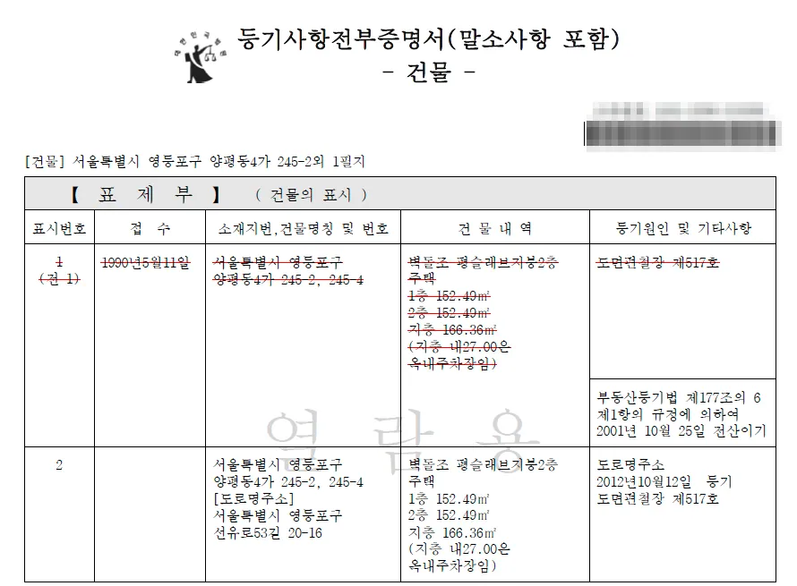
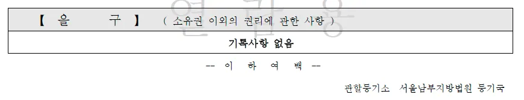
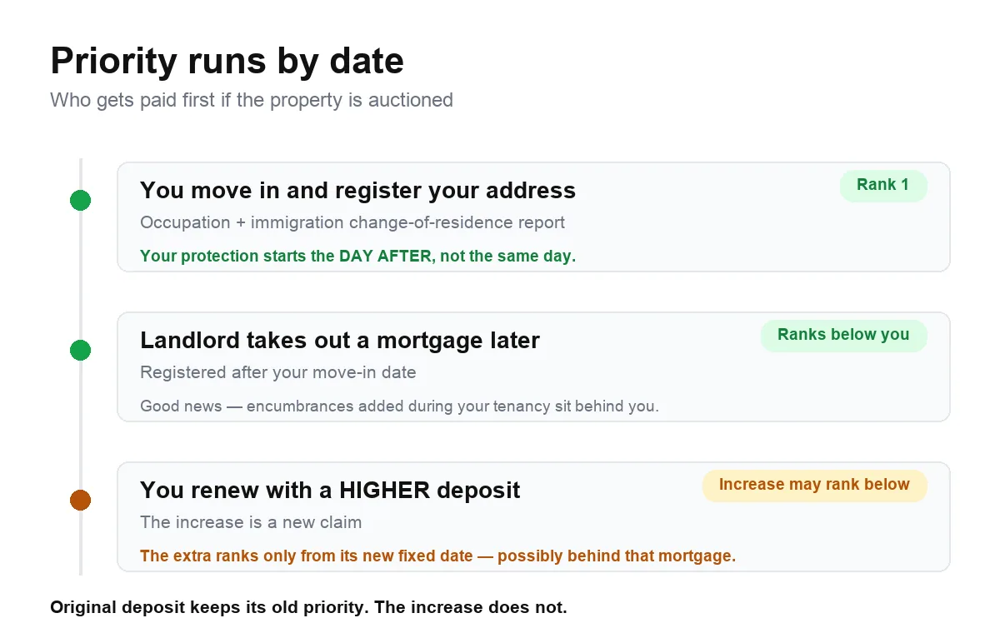

If you rent on a wolse (월세) monthly-rent contract, you have a legal right to stay
for a second two-year term, and your landlord usually cannot say no. It is called
the contract renewal request right — 계약갱신청구권 (gyeyak gaengsin cheonggugwon).

It applies to you whatever your nationality or visa. But one procedural step decides
whether the protection actually reaches you, and most foreign tenants have never
heard of it.

## What the right actually gives you

Korea's Housing Lease Protection Act — 주택임대차보호법 (jutaek imdaecha boho beop) —
guarantees residential tenants three things.

**A second two-year term.** A standard lease runs two years. You can demand one
renewal, giving you four years in total.

**One use only.** You can exercise the right once per tenancy. After that, the
landlord is free to decline.

**A 5% cap on the increase.** When you renew using this right, the landlord may
raise the deposit and rent by no more than 5% combined. Outside the renewal right
there is no legal cap.

Say you pay a ₩10,000,000 deposit and ₩1,000,000 a month:

| | Now | After renewal (max) |
|---|---|---|
| Deposit (보증금) | ₩10,000,000 | ₩10,500,000 |
| Monthly rent (월세) | ₩1,000,000 | ₩1,050,000 |

Two things people get wrong. First, **5% is a ceiling, not an entitlement** — the
landlord has to ask for an increase, and you can negotiate below it or agree to
none at all. Second, the 5% applies to the lease as a whole, so a landlord can put
the whole increase on the rent and none on the deposit, as long as the combined
figure stays inside the cap. Converting between the two uses a statutory rate tied
to the Bank of Korea base rate, so check the current figure if this comes up.

Three related protections are worth knowing:

- If your contract is written for **less than two years**, you can insist on
  treating it as a two-year lease. That is a separate provision, and using it does
  not consume your renewal.
- **Implied renewal** — 묵시적 갱신 (muksijeok gaengsin) — is not the same thing. If
  neither side says anything before the deadline, the lease continues on the same
  terms for two more years, and this does **not** use up your renewal right. You
  still have it in reserve.
- Any clause waiving these protections is **void**. The Act is one-sided mandatory
  law: terms less favourable to the tenant than the statute have no effect, even
  if you signed them.

## Whether it covers your home

The Act covers residential leases, judged by how the place is actually used rather
than how the building is registered.

**Covered:** apartments, villas, one-rooms and multi-family houses. Also
**officetels** (오피스텔) used as a home, even though they are registered as
commercial space. Sub-leases count too, where you are the registered tenant.

**Unclear:** goshiwon (고시원) and similar shared facilities. Coverage turns on
whether your unit works as an independent residence, and this is genuinely
unsettled. Get advice if it matters to you. If you are house-hunting without an
ARC yet, the trade-offs are covered in
[student housing in Seoul without an ARC](/blog/student-housing-seoul-no-arc/).

**Not covered:** company dormitories where your employer holds the lease. Your
employer is the tenant, not you. E-9 workers in employer-provided housing are
usually here.

## The step that decides everything

This is the part that trips up foreign tenants.

Your rights under the Act — the renewal right, and more importantly the ability to
recover your deposit if the property is sold or foreclosed — depend on having
**opposing power**, 대항력 (daehangnyeok). Korean tenants get it by moving in and
filing a resident-registration move-in report, 전입신고 (jeonipsingo).

**You cannot file a 전입신고. You have no resident registration.** So are you
unprotected?

No. Under Article 88-2(2) of the Immigration Act, **alien registration**
(외국인등록) and **change-of-residence reporting** (체류지 변경신고) legally
substitute for resident registration and the move-in report. The Supreme Court
confirmed this in 2016 (case 2015다14136), holding that these filings carry the
same effect for tenant protection, and extended the same reasoning in 2019 to
domestic residence reports filed by overseas Koreans.

In practice, three steps:

1. **Move in.** Physical occupation is required.
2. **Report your address to immigration within 14 days**, at an immigration office
   or through Hi Korea. Do it even if it feels like a visa formality — it is the
   legal foundation of your tenancy.
3. **Get a fixed date stamp** — 확정일자 (hwakjeongilja) — on your contract, at a
   community service centre (주민센터), a registry office, or online through the
   Internet Registry Office. Small fee, a few minutes. If you file the lease report
   described below with your contract attached, the fixed date is granted
   automatically and you can skip this.

Steps 1–2 and step 3 produce **different rights**, and they are easy to confuse.
Occupation plus registration gives you daehangnyeok, the right to stay put even if
the property changes hands. The fixed date adds **priority repayment right**,
우선변제권 (useon byeonjegwon), which decides whether you are paid ahead of other
creditors in a foreclosure. You want both. If you later renew with a higher
deposit, get a fresh fixed date on the new contract — the old stamp does not cover
the extra amount.

Your protection starts **the day after** occupation and registration are complete,
not the same day. Landlords have exploited that one-day gap by mortgaging the
property on the day the tenant moves in, which then outranks the tenant. Ask for a
contract clause barring any new encumbrance before the day after you move in.

If you skipped these steps, your position is weak — not just for renewal, but for
getting your deposit back at all. Fix it now rather than at renewal time.

> **Not sure your address report actually landed?** Send us a photo of your alien
> registration card and your lease on
> [WhatsApp](https://wa.me/821075191282) — we'll read them in English, tell you what
> is on file, what is missing, and exactly what to ask for at the counter. We handle
> the Korean side by phone and in writing; we are not lawyers, and for a dispute the
> free legal aid line at 132 is the right call. Asking costs nothing.

## The lease report, and the fine attached to it

Since June 2021 most residential leases must be reported to the local government —
주택 임대차 계약 신고, usually called 전월세신고 (jeonwolse singo). A four-year
grace period ended, and **since 1 June 2025 failing to file carries a fine.**

**Does it apply to you?** Yes, if the deposit exceeds ₩60,000,000 **or** the monthly
rent exceeds ₩300,000. Either threshold triggers it, so most wolse tenants in cities
are covered. It applies across the Seoul metropolitan area and in city (시) districts
nationwide. The definition of housing is broad — apartments, villas, one-rooms, and
also quasi-residential buildings such as goshiwon and dormitories. Even a residential
unit inside a commercial building can qualify if it is genuinely lived in.

**Who files?** Technically it is a joint duty of landlord and tenant. In practice
either can file alone by attaching a copy of the contract, and that single filing
discharges it for both.

Do not read that as "the landlord will handle it." If nobody files, **both sides are
exposed to the fine**, tenant included. Confirm who is doing it, and if the answer
is vague, file it yourself. It costs nothing.

**Deadline:** 30 days from the date the contract was signed — not from your move-in.

You can file online through the Ministry of Land's reporting system or Government24,
in person at the 주민센터 covering the property, or automatically if you signed
through the government's electronic contract system. You will need your **alien
registration number** (외국인등록번호), which substitutes for a resident registration
number on the form.

**The reason to care beyond the fine:** filing with your contract attached grants the
fixed date stamp automatically. One filing, two problems solved.

Two things to watch:

- **A renewal that changes nothing needs no report.** If you exercise your renewal
  right and the deposit and rent stay identical, no filing is required. But if the
  landlord raises the rent by 5% — or by anything — that is a change in terms and
  must be reported within 30 days.
- **The lease report does not give you daehangnyeok.** This is the trap. The report
  gets you the fixed date; the residence-registration side still needs your
  immigration change-of-residence report. A Korean tenant filing 전입신고 and the
  lease report together covers everything. You have to do the immigration filing
  separately. Do one and assume you have done both, and you end up with priority
  rights over a property you have no standing to remain in.

Late or missed filing draws a fine of roughly ₩20,000 to ₩300,000 depending on the
delay and the amount; a knowingly false filing can reach ₩1,000,000.

## Read the property register yourself

Korea went through a wave of deposit fraud — tens of thousands of tenants lost money.
Most of those cases were visible in advance, in a public document that costs about
₩1,000.

Your agent will normally pull it and walk you through it, and licensed agents are
legally required to verify and explain the property's rights situation. That is real
protection and you should use it. But agents miss things, occasionally have an
interest in closing the deal, and cannot always compel a landlord to hand over
documents. Reading the register yourself takes ten minutes to learn and is the
single highest-value skill a tenant in Korea can have. The rest of the pre-signing
checklist is in
[what to check before renting in Seoul](/blog/what-to-check-before-renting-seoul/).

**At signing, your agent provides it free.** Ask for a copy and ask them to walk you
through 을구 specifically.

**For everything else, pull it yourself.** The certified copy of the property
register — 등기부등본 (deunggibu deungbon) — is fully public. **You do not need the
owner's permission** and you do not need to be a party to anything. Anyone can pull
the register for any property in Korea using only the address, at the Internet
Registry Office (iros.go.kr), for roughly ₩700 to view or ₩1,000 to print.

*iros.go.kr — one box, one address, no login for the owner's permission*

That is when paying earns its cost: screening flats before you have committed,
re-checking on balance payment day, and re-checking at renewal — the moments when
nobody hands you a free copy. It is issued in Korean only, but the key entries are
short and formulaic. Once you have read one, you can read the next.

### The three parts

**표제부 — the property description.** Confirm the address, building name, unit number
and floor area match your contract *exactly*. In multi-unit buildings a mismatched or
missing unit number is a classic problem, and for you specifically this address must
also match your alien registration record. A discrepancy can void your daehangnyeok.

*표제부 — struck-through lines are superseded entries, not errors*

**갑구 — ownership.** The owner named here must be the person signing your lease. If
it is not, stop and get an explanation. Scan for seizure (압류), provisional
attachment (가압류), auction commencement (경매개시결정) or a trust registration
(신탁등기). A trust registration is a particular trap: the registered owner may have
no authority to lease the property at all, and a lease signed with them can be
unenforceable against the trustee.

**을구 — encumbrances.** This is where the loans are, and the part most tenants skim.

If you are lucky, it says **기록사항 없음** — no entries. That means nothing is
registered against the property beyond ownership: no mortgage, no jeonse right, no
seizure. It is the version you want to see.

*을구 with 기록사항 없음 — a clean one looks like this*

### What 을구 actually tells you

The entry to find is **근저당권설정**, a mortgage. It comes with a figure called the
**채권최고액**, the maximum secured claim.

**That figure is not the size of the loan.** It is a ceiling, conventionally set at
110–130% of the actual principal, so a ₩300,000,000 maximum claim usually reflects a
loan of roughly ₩230,000,000–270,000,000. But the ceiling is the number that legally
sits ahead of you, so use it in your arithmetic rather than your estimate of the real
debt.

A working rule of thumb:

> **Maximum secured claim + your deposit** should stay comfortably below **70–80% of
> the property's market value.**

If it does not, you are in kkangtong jeonse (깡통전세, "empty can lease") territory —
if the property is auctioned, the proceeds will not cover both the bank and you, and
the bank is ahead. Walk away, or require the landlord to discharge the mortgage
before you pay the balance and confirm it has come off the register.

Check also for an existing jeonse right (전세권) or prior tenants' claims. In a
multi-unit building, other tenants' deposits may rank ahead of yours without
appearing on the register at all, which is why the tax and priority-information
requests below matter.

### Check it three times

The register is a snapshot, and landlords have taken out mortgages in the gap between
signing and move-in. Read it **before signing**, again **on balance payment day**
immediately before you transfer the money, and again **at renewal**.

That last one has a reason behind it. Your daehangnyeok dates from your original
move-in, so any mortgage registered *after* that date ranks below you — good news,
you are protected against encumbrances added during your tenancy. But if you renew
with an **increased deposit**, the increase is a new claim. It takes priority only
from the date you get a fixed date stamp on the new agreement, which may rank
*behind* mortgages taken out in the meantime. Your original deposit keeps its old
priority; the extra does not.

*Priority runs by date, not by contract*

So before agreeing to a deposit increase, pull a fresh copy and see what has appeared
since you moved in. If the property has become heavily mortgaged, it may be safer to
take the increase as monthly rent instead — money you never hand over cannot be lost.
That is a legitimate thing to negotiate, and it is within the 5% cap either way.

While you are documenting things, photograph the flat itself:
[photograph your flat on move-in day](/blog/photograph-your-flat-move-in-day/) is the
other habit that decides whether you get your deposit back.

## Ask for the landlord's tax certificates

Unpaid taxes are the risk that does not show up on the register at all.

Tax debts owed by your landlord can be collected ahead of your deposit if they were
assessed before your fixed date. A tenant who read the register carefully, found a
clean 을구 and moved in confident can still be wiped out by a tax bill they had no way
of seeing. This was a recurring pattern in the fraud cases.

The law was amended in 2023 to address it. Under Article 3-7 of the Housing Lease
Protection Act, **when concluding a lease the landlord must show you a national tax
clearance certificate (국세 납세증명서) and a local tax clearance certificate
(지방세 납세증명서)**, along with information about existing fixed dates, rents and
deposits on the property.

**Before signing**, ask for both, ideally with the agent present. If the landlord
will not produce them, they are obliged to consent to you making the inquiry
yourself. **After signing but before your lease begins**, if your deposit exceeds
₩10,000,000 you can inspect the landlord's unpaid national taxes at a tax office
**without the landlord's consent** — bring your ID and your signed contract. Local
tax records can be checked at a community service centre or through Wetax.

Some landlords react badly, as though this were an accusation. It is not; it is a
statutory right and increasingly routine. Asking through the agent, alongside the
other standard documents rather than singling it out, usually defuses it. If a
landlord flatly refuses both the certificates and consent to your inquiry, treat that
as information about the landlord.

Note the timing gap. The strongest version of this right — inspection without consent
— only opens *after* you have signed and usually after you have paid a down payment.
That is an awkward design, and it is why asking politely before signing is worth
doing, and why a landlord's willingness to produce the documents early is itself a
useful signal.

## When to make the request

**Between 6 months and 2 months before your lease expires.**

Miss that window and the right is gone for that cycle. It is a hard deadline, not a
guideline.

One wrinkle: for contracts first signed or renewed **before 10 December 2020**, the
deadline is 1 month before expiry rather than 2. Almost everyone reading this is
under the 2-month rule, but check if your contract is old.

Calendar it at the **5-month mark**. If your lease ends 31 March, put a reminder on
31 October. Waiting until the last week leaves you no room if the landlord goes quiet
or disputes the timing.

## How to make the request

The law requires no particular form, and verbal notice is legally valid. But if there
is a dispute, the burden is on you to prove you gave notice inside the window — so
create a record. In rough order of strength:

1. **Content-certified mail** — 내용증명 (naeyong jeungmyeong), sent through a post
   office, which keeps a stamped copy proving what you sent and when. The gold
   standard, and it costs very little. If you sense any friction, use this.
2. **Text message or KakaoTalk.** Timestamped and generally accepted as evidence.
   Fine for a cooperative landlord.
3. **Email.** Acceptable, but weaker if the landlord denies receipt.
4. **Verbal only.** Legally valid, evidentially useless.

Keep it short and unambiguous:

> 임대차계약 갱신을 요구합니다. **계약갱신청구권을 행사합니다.**
> (계약 만료일: 2027년 3월 31일)
>
> *I am requesting renewal of the lease contract. I am exercising my contract renewal
> request right. (Contract expiry: 31 March 2027)*

Use the phrase **계약갱신청구권을 행사합니다** — "I am exercising my contract renewal
request right." This matters more than it looks. Courts have held that implied
renewal does not count as exercising the right, so make your intention explicit
rather than sending a vague "I'd like to stay." As the section on leaving early
explains, this sentence also decides who pays the estate agent if you move out
during the renewed term.

Send it in Korean. If your Korean is not strong, send the Korean and keep an English
copy for yourself.

## When the landlord can refuse

The Act lists nine grounds. The ones that come up in practice:

- **Arrears of two months' rent** at any point in the tenancy. Note the wording —
  cumulative, not consecutive. Two separate missed months across two years is enough
  to forfeit the right. If you have ever been late, catch up and stay current.
- **You obtained the lease by deception.**
- **You sublet without consent.**
- **You caused serious damage** through intent or gross negligence.
- **The building is being demolished or reconstructed**, where this was disclosed in
  your original contract or is required for safety.
- **The landlord, or their parents or children, will actually live there.** This is
  the contested one.
- **The landlord offered substantial compensation** and you agreed.

Everything else — "I want a higher rent", "I'd prefer a Korean tenant", "I'm selling
the property" — is **not** a valid ground. A sale alone does not extinguish your
renewal right. The buyer inherits the lease.

## If the landlord claims they're moving in

The owner-occupancy ground is the most common route to pushing a tenant out, and the
law anticipates abuse.

If your landlord refuses on this basis and then, **before your would-be renewal term
would have ended**, rents the property to someone else without justification, they
owe you damages. The statutory amount is the greatest of: three months' rent at the
time of refusal, converting any deposit to a monthly equivalent; two years' worth of
the difference between the new tenant's rent and yours; or your actual proven losses.

**You can verify this.** As a former tenant with a legitimate interest you can request
records showing whether a new tenant has registered at the address — a fixed-date
registry inquiry (확정일자 부여현황) or a household registration inquiry
(전입세대 열람). Setting a reminder for six months and a year after you move out
costs nothing.

Courts read this ground narrowly. In one reported case, a seller who no longer
intended to live in the property could not refuse renewal on behalf of buyers who had
not yet completed the ownership transfer — the buyers were not yet the landlord, and
the seller was not going to live there.

## You are not locked in for two years

A renewed lease binds the landlord, not you. During a renewed term you may terminate
at any time by notifying the landlord. Termination takes effect **three months after**
they receive your notice, and you pay rent for those three months.

There is also a money point most tenants never hear. When a tenancy ends this way,
the **landlord** pays the estate agent's commission for finding your replacement —
not you, as would normally be the case when a tenant leaves mid-contract.

**This depends entirely on how you renewed.** It follows from having exercised the
contract renewal request right. If your lease rolled over silently as an implied
renewal, or you simply signed a fresh contract without invoking the right, you are
not in this position and the commission is likely to land on you.

That is the practical reason to use the exact wording above. The sentence you send
six months before expiry is what decides who pays the agent a year later. Landlords
often assume the tenant pays regardless, so raise it early and be ready to point to
how the renewal was made.

## What foreign tenants commonly get wrong

1. **Treating the immigration address report as a visa chore.** It is your tenant
   protection. File it within 14 days, every time you move.
2. **Assuming a contract clause overrides the law.** "The tenant agrees not to
   request renewal" is unenforceable. Do not let it deter you.
3. **Assuming a Korean-only contract is unenforceable, or that a signed one cannot be
   questioned.** Both wrong. Korean-language contracts are fully binding, and you can
   still challenge terms that violate the Act.
4. **Missing the window.** Six to two months before expiry. Nothing else.
5. **Confusing implied renewal with the renewal right.** If your lease rolled over
   silently, you still hold your renewal request. Do not let a landlord tell you it
   has been used — but remember it also means you have not exercised the right, which
   changes who pays the agent if you leave early.
6. **Assuming the lease report is the landlord's problem.** It is a joint duty, and if
   it goes unfiled you are exposed to the fine too. It is also the easiest route to
   your fixed date stamp.
7. **Letting the register pass across the table unread.** Your agent hands it to you
   free at signing and is required to explain it. Take them up on it, ask specifically
   about 을구, and pull a fresh copy yourself on balance day. It costs ₩700.

## The Korean part

Almost everything above happens at a counter, in Korean, on a deadline. The
immigration office wants the change-of-residence report; the 주민센터 wants the
contract for the fixed date; the post office wants your content-certified letter
written a particular way. None of these are hard. They are just hard to do in a
language you are still learning, during working hours, when getting it wrong costs
you your deposit.

## Where to get help

| Service | Contact | Notes |
|---|---|---|
| Immigration Contact Center | **1345** | Multilingual, guidance on residence reporting |
| Korea Legal Aid Corporation (대한법률구조공단) | **132** | Free legal consultation; interpretation may need arranging |
| Housing Lease Dispute Conciliation Committee | via **132** | Formal conciliation, cheaper and faster than court |
| Danuri Helpline | **1577-1366** | Multilingual, 24 hours; oriented to multicultural families |
| Seoul Global Center | **02-2075-4180** | Seoul residents; multilingual counselling including housing |

Local global centres and migrant support NGOs in most cities help with reading
contracts and drafting notices, often free. Other useful numbers, including 1345, are
collected in [Korea's emergency and help numbers](/blog/korea-emergency-numbers-112-119/).

## Get it sorted

Four things prevent most of what goes wrong: establish daehangnyeok, get a fixed
date, read the register, and check the landlord's tax position. Do those and you are
ahead of most tenants, Korean ones included.

If the obstacle is the Korean rather than the law, that is what we do — we read the
contract back to you in English, tell you which filings you are missing, and write
the Korean you need to send: the renewal notice, the content-certified letter, the
question for the counter clerk. We handle the Korean side by phone and in writing,
and in Seoul we can sometimes come to the counter with you when the timing works —
ask, but don't build your day around it. We are not lawyers, and for a dispute the
free legal aid line at **132** is the better call.

What this guide does not cover is the rest of the deposit toolkit — deposit return
guarantee insurance, and the lease registration order (임차권등기명령) you use when a
lease ends and the landlord will not pay you back. Those deserve their own guide.

*This guide reflects the Housing Lease Protection Act as it stands in August 2026 and
is general information, not legal advice. Circumstances vary, particularly around
housing type and dispute history. For a specific situation, consult a qualified
professional or the Korea Legal Aid Corporation at 132.*
