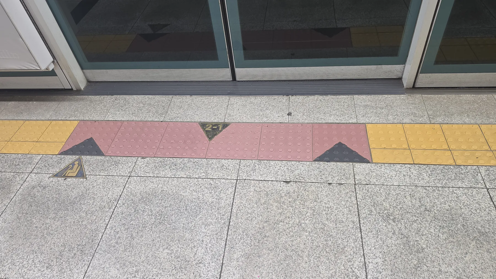
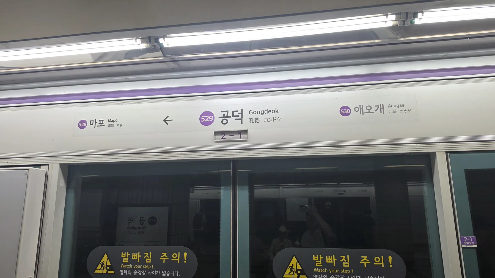
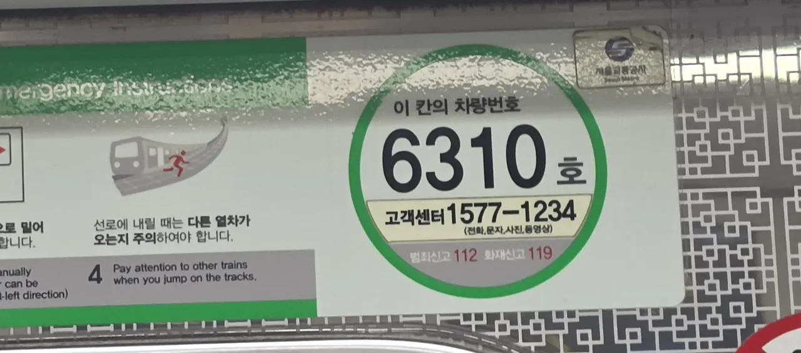
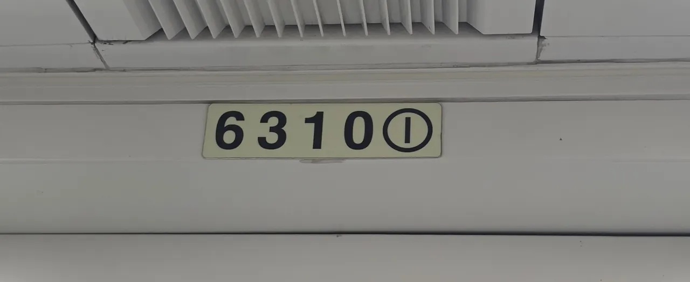
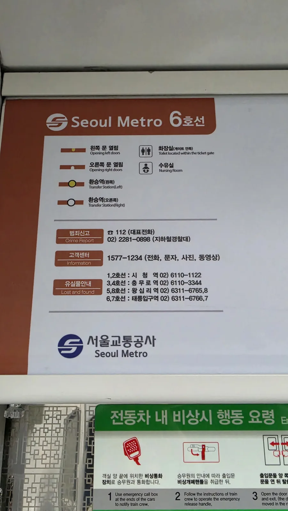

You get off the train, walk up the stairs, and your hand reaches
for a bag that is not there. It is on a seat, heading for the end
of the line.

The good news, and it is genuinely good: **Seoul's system recovers
things at a rate that surprises people who have lost items in other
big cities.** The bad news is that the phone number you need
depends on which line you were on, and almost nobody knows that
until they need it.

## First, before you do anything else: write down the door number

This is the part that decides whether you get your bag back, and it
takes five seconds.

Every Seoul subway platform is marked with a **car-and-door
number** — a small sign on the floor or the screen door reading
something like **2-1**. The first figure is the **carriage**,
counting from the front of the train. The second is the **door**
on that carriage.

*Floor marker, 2-1 — carriage two, door one · ⓒ @BalliBalliSeoul*

The same number appears **inside the train**, on the panel above
the doors, next to the station name:

*The same 2-1, above the doors — with the next stop and the line colour · ⓒ @BalliBalliSeoul*

They run from roughly **1-1 to 10-4** — up to ten carriages, four
doors each — so "somewhere on the train" becomes "carriage two,
first door" the moment you can say it.

### There is a second number, and it is even better

The 2-1 marker tells staff **where on the platform** you stood. There
is another number that tells them **exactly which carriage** — the
car's own identification number, and **every carriage in the country
has one.**

Four figures, usually, and it belongs to that physical carriage
permanently. That matters because train sets get reversed and
rearranged: "car two" depends on which end the train is facing, but
the car number does not move.

**There are exactly two places to find it inside the carriage**, and
once you know them you can read the number in about a second.

**1. The ends of the carriage** — a green circle beside the emergency
instructions panel, reading **이 칸의 차량번호** (*this car's number*)
with the number in the middle. It's the larger of the two and the
easier one to spot from a distance.

*이 칸의 차량번호 — "this car's number", 6310 · ⓒ @BalliBalliSeoul*

Two useful things ride along on that sticker: the Seoul Metro
**customer centre, 1577-1234**, and reminders that crime is **112**
and fire is **119**.

**2. Above every door** — a small plate carrying the car number and a
circled door number together, like **6310 ①**.

*6310 ① — car number and door number on one plate · ⓒ @BalliBalliSeoul*

That second one is the shortcut. **One glance at the plate above the
door gives you both numbers the lost property desk wants** — which
carriage, and which door of it. You don't have to walk to the end of
the car to get the full picture.

**That combination narrows a whole line down to one carriage** — and
it is the single most useful thing you can hand the lost property
desk.

**Why it matters so much:** staff recovering an item are looking at a
ten-carriage train. A car number turns a search into a collection.
Photograph the plate when you board, or just glance at it — a second's
habit, and worth it any time you are carrying something you would hate
to lose.

Two other things worth noting the moment you realise:

- **The station you boarded at, and the one you got off at** — this
  brackets the time window
- **Roughly what time**, and the direction of travel

## The lost property desk depends on your line

Here is the part nobody tells you. Seoul Metro does not run one
lost property office. It runs **four**, split by line, each at a
different station with its own number.

*The panel above the door in every carriage — the numbers you actually need · ⓒ @BalliBalliSeoul*

| Lines | Office at | Phone |
| ----- | --------- | ----- |
| **1, 2** | City Hall (시청) | **02-6110-1122** |
| **3, 4** | Chungmuro (충무로) | **02-6110-3344** |
| **5, 8** | Wangsimni (왕십리) | **02-6311-6765 / 6768** |
| **6, 7** | Taereung Entrance (태릉입구) | **02-6311-6766 / 6767** |

Two general numbers are worth having as well:

- **Customer centre: 1577-1234** — and usefully, it takes **text
  messages, photos and video**, not only calls. If your spoken
  Korean is not up to a phone call, this is the route
- **Police: 112** for anything stolen rather than mislaid. There is
  a dedicated subway police unit on **02-2281-0898**

**Line 9 and the outer stretches of Line 1 are run by different
operators**, so those are handled separately — ask at any station
office and they will point you to the right desk.

## What actually happens to a found item

Roughly, and it is worth knowing so you call the right place at the
right time:

1. **Staff or a passenger hands it in** at whichever station it
   surfaces — often the end of the line, because that is where the
   train empties and gets checked
2. **It sits at that station** for a day or so
3. **Then it moves to the line's lost property office** — the ones
   in the table above

So the timing matters. **Same day, ring the terminal station** or
the station where you got off. **After that, ring the line office.**

If it has moved on again, everything unclaimed in Korea ends up in
the **national police lost property system, `lost112.go.kr`**,
which is searchable — though in Korean.

## Trains are not the subway

Worth separating, because people conflate them: **KTX, ITX and the
intercity trains are Korail**, a different organisation with its own
lost property process, and stations like Seoul Station host both.

If you left something on a KTX, you want Korail rather than the
subway desks above, and the same discipline applies — **coach
number and seat number** are the equivalent of the door number, and
they are printed on your ticket. Which is the argument for not
deleting the ticket from your phone the second you arrive.

Recovery rates on the intercity trains are good too. The pattern in
traveller accounts is consistent: report it quickly, give the
train number and seat, and staff will often put the item on a train
back to you.

## Realistically, what comes back

Bags, laptops, phones, umbrellas and coats turn up at a rate that
genuinely surprises visitors. Cash is the exception everywhere in
the world and Korea is not magic.

The single biggest factor is **speed**. An item reported within the
hour, with a door number attached, is a very different search from
one reported two days later with "it was a black backpack, on the
green line, in the afternoon."

## The Korean part

The desks are staffed by people doing a practical job well, and
they are not language services. The call is in Korean, the
`lost112` site is in Korean, and the description that finds your
bag — the make, the colour, what was inside — has to survive being
translated by whoever picks up.

> **Left something on a train and not sure who to call?** Message
> us on [WhatsApp](https://wa.me/821075191282) with the line, the
> station and the door number if you have it — our
> [anything-else concierge service](/etc) will make the calls in
> Korean and tell you where your bag is. First answer is free.

If you are still working out which line you were even on, the
[colour-coded line guide](/blog/seoul-subway-lines-guide/) is the
place to start, and the
[wider transport guide](/blog/seoul-transportation-guide/) covers
the rest of the network.

## Get it sorted

The one-line version: **note the car-and-door number when you
board, call the office for your line rather than a general number,
ring the terminal station the same day and the line office after
that — and if it was a KTX, that is Korail and a different desk.**

