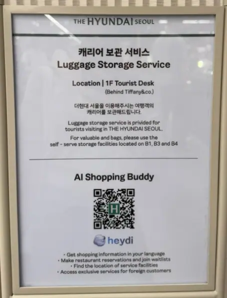
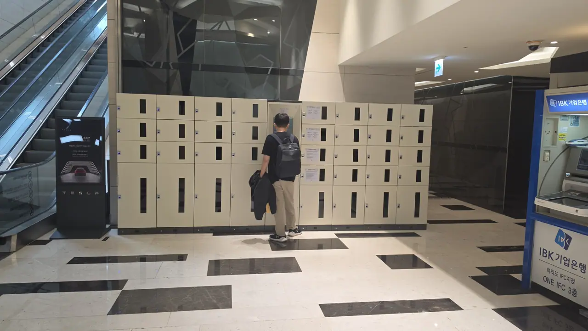
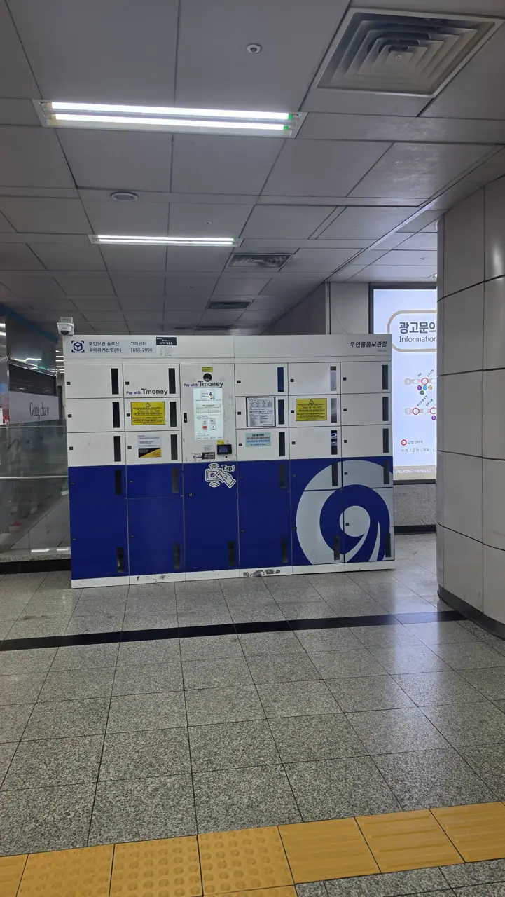
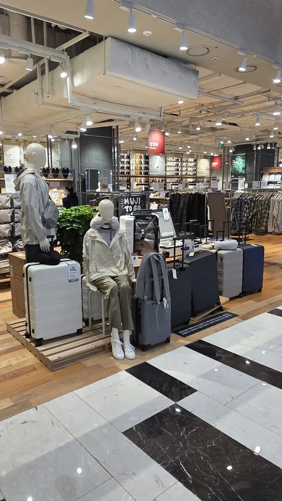

You checked out at eleven. Your flight is at nine. In between is a whole day in
Yeouido — IFC Mall, The Hyundai Seoul, the park, the river — and a suitcase you are
not going to drag through any of it.

There are four ways to put it down, and they are not equally good. **Three of them are
free** — including the best one, which is staffed rather than a locker, and which
almost nobody who has not been told about it finds.

## Start here: the tourist desk at The Hyundai Seoul

**Ground floor, behind Tiffany & Co. — the Tourist Desk takes suitcases.** A person
takes it, gives you a ticket, and it waits behind a counter rather than in a metal
box you have to fit it into.

*The sign, in English, at the desk itself · ⓒ @BalliBalliSeoul*

Three things make this the one to try first:

- **It is free**, for visitors to the store.
- **A suitcase fits.** No measuring it against a locker door, no discovering the large
  ones are all taken.
- **It is staffed**, so you are not locked out of your own bag by a screen in Korean.

**It is for suitcases specifically.** The store's own rule is that valuables and the
things you have just bought go in the self-serve lockers rather than behind the desk —
so hand over the case, keep the passport, and put the shopping downstairs.

The desk is on **02-3277-0505** if you want to check before you walk over, which is
worth doing on a day the store might be closing early.

The catch is opening hours: it is a department store, so the desk keeps store hours.
If your flight is late and the store closes at eight, the bag has to come out before
then. Plan the last leg around that rather than discovering it at closing time.

**And it closes entirely on three days a year: 1 January, the day of Seollal, and the
day of Chuseok.** Those are lunar dates, so they move — and they are exactly the days
a visitor is most likely to be out with a suitcase and nowhere to put it. If your trip
touches one of them, read the next section rather than this one.

## The Hyundai Seoul's self-serve lockers

For bags rather than suitcases, the same building has coin lockers in three places:

- **B1**, by the Osulloc counter, next to Camel Coffee
- **B3 and B4**, in the car park, beside the central escalators

Same free-and-store-hours arrangement, and this is where the store wants your
valuables and your shopping to go. Suitcase at the desk upstairs, everything else
down here.

## IFC Mall

Across the road, IFC Mall has lockers on **L1, in the passage between the Apple Store
and Nike**, alongside the ATMs. **They are free, and available from 10am to 10pm.**

**IFC does not close for holidays.** Individual shops set their own days, but the mall
itself runs year-round — which makes it the answer on 1 January and on the two lunar
holidays when the department store is shut.

*IFC Mall lockers, L1 · ⓒ @BalliBalliSeoul*

There are a decent number of them and a mix of sizes, so a suitcase is realistic here
in a way it is not at the station. And that closing time is two hours later than the
department store across the road, which makes IFC the better choice for an evening
flight.

### One thing about IFC's floors

**L1 is not the ground floor. It is one floor below it.**

IFC Mall runs downwards, and the L numbers go with it: **L1 is B1, L2 is B2, L3 is
B3.** Anyone reading "L1" as "Level 1" walks into the wrong building and starts
looking on the street.

A quick orientation, since it decides where you end up:

- **L1** — the Apple Store, and the lockers
- **L2** — Youngpoong Books
- **L3** — the cinema and the restaurants

### Travelling with a child

There is a **nursing room on L3, next to McDonald's** — a changing table, a sink and
a water dispenser. Worth knowing before you go looking, because L3 is also where the
restaurants are, which is where you were heading anyway.

## Yeouido Station

The lockers at **Yeouido Station sit between Exit 3 and Exit 4**. They take large
suitcases as well as small items, and they are paid for with a T-money card.

*Yeouido Station, between Exits 3 and 4 · ⓒ @BalliBalliSeoul*

**These are the only ones you pay for**, and they are also the ones most likely to be
full. There are not many of them, and on a weekend or a holiday you should expect the
large ones to be taken. They are the closest option to the trains, which is exactly
why they fill first.

Treat them as a bonus if one happens to be open, not as the plan — with two free
options within a few minutes' walk, there is no reason to pay unless the walk is the
problem.

## Getting between them

This is easier than it looks, because **all three sit on one line**: Yeouido Station,
then IFC Mall, then The Hyundai Seoul. The mall is between the other two, so you walk
past it either way.

From **Yeouido Station** — Lines 5 and 9 — there is one answer worth giving:

**Go underground. Take Exit 3.**

A moving walkway runs most of the 500m and delivers you to The Hyundai Seoul's **B2
entrance, already inside the building.** No stairs, no weather, and the walkway does
the carrying.

**The connecting level is IFC Mall's L2**, which links the station in one direction
and The Hyundai Seoul in the other — so the whole walk happens indoors. Note that the
lockers are one floor above that, on L1: if you are passing through and want them,
go up a level rather than straight on.

**Exit 4 is not an option at the moment.** As of **August 2026 it is under
construction**, and leaving that way means stairs — with a suitcase, in a station,
which is exactly the thing you were trying to avoid. Even after it reopens, it is
400m of open pavement in whatever the sky is doing: shorter on paper, worse with a
case behind you.

The station lockers sit between the two exits, so you pass them on the way to the
walkway regardless.

## If you are staying at the Conrad

Then none of the above applies to your check-out day. **Ask the concierge** — the
hotel holds guests' luggage both before check-in and after check-out, at no charge.
It is the easiest option of all, and the one you should use rather than walking to a
station with a case.

It also puts you in a good position for the rest of the day: **the Conrad is connected
to IFC Mall**, so you can go from the hotel to the shops, the cinema and the
restaurants without stepping outside — which matters in August, in January, and in
the rain.

## The opposite problem: your suitcase is too small

It happens to almost everyone who shops seriously in Seoul.

**MUJI at IFC Mall sells suitcases**, up to sizes that will swallow whatever the
shopping did to you.

*MUJI, IFC Mall · ⓒ @BalliBalliSeoul*

**The Hyundai Seoul sells them too**, so you can solve it in whichever building you
are already standing in. Buying a case in Seoul and checking it home is routinely
cheaper than paying excess baggage on an overweight one.

## A short version

| Where | What it takes | Cost | Hours |
| --- | --- | --- | --- |
| **The Hyundai Seoul, 1F Tourist Desk** | Suitcases | Free | Store hours; shut 1 Jan, Seollal, Chuseok |
| The Hyundai Seoul, B1 / B3 / B4 lockers | Bags, small items | Free | Store hours |
| IFC Mall, L1 by the ATMs | Suitcases and bags | **Free** | 10am–10pm, year-round |
| Yeouido Station, Exits 3–4 | Suitcases and bags | Paid, T-money | Station hours, but few of them |
| Your hotel (the Conrad is connected to IFC) | Everything | Free for guests | Ask the concierge |

## The Korean part

Locker screens are the usual obstacle — Korean-first, a payment method you may not
have loaded, and a code you cannot afford to lose. The staffed desk sidesteps all of
that, which is the real reason to start there.

If you are stuck at a screen, send us a photo of it and we will tell you which button
to press. If a bag has gone somewhere it should not have, we will make the call in
Korean.

For getting around Yeouido and the rest of the city, the
[Seoul transport guide](/blog/seoul-transportation-guide/) covers cards and fares, and
[Naver Map](/blog/naver-map-korea/) will get you to the right exit — which, for
Yeouido Station, is the difference between finding these lockers and not.

**KakaoTalk is the easiest way to reach us**, and WhatsApp works too. Asking costs
nothing.
