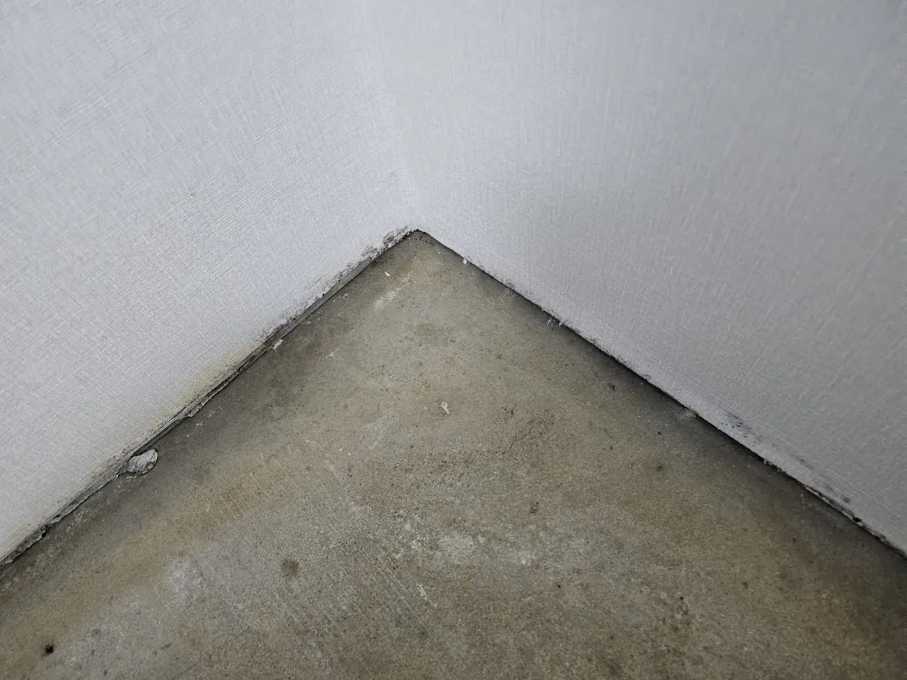
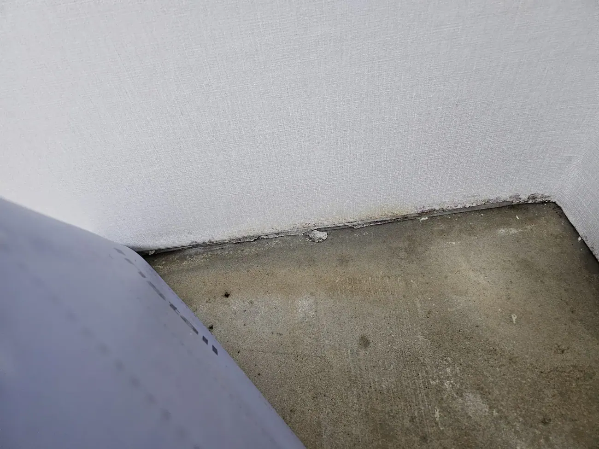
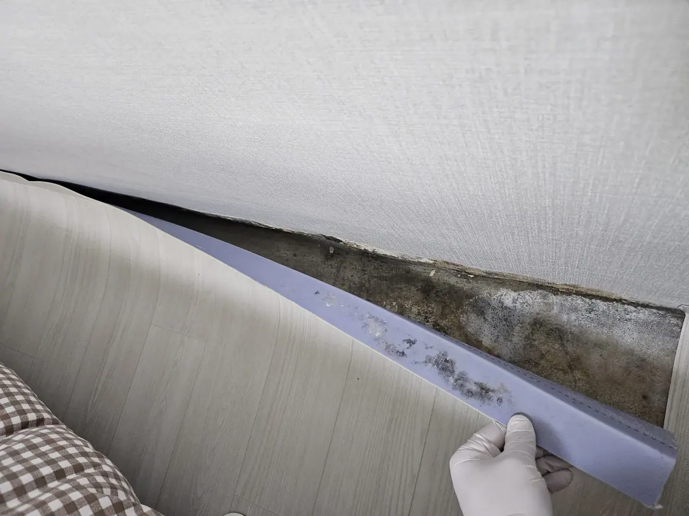
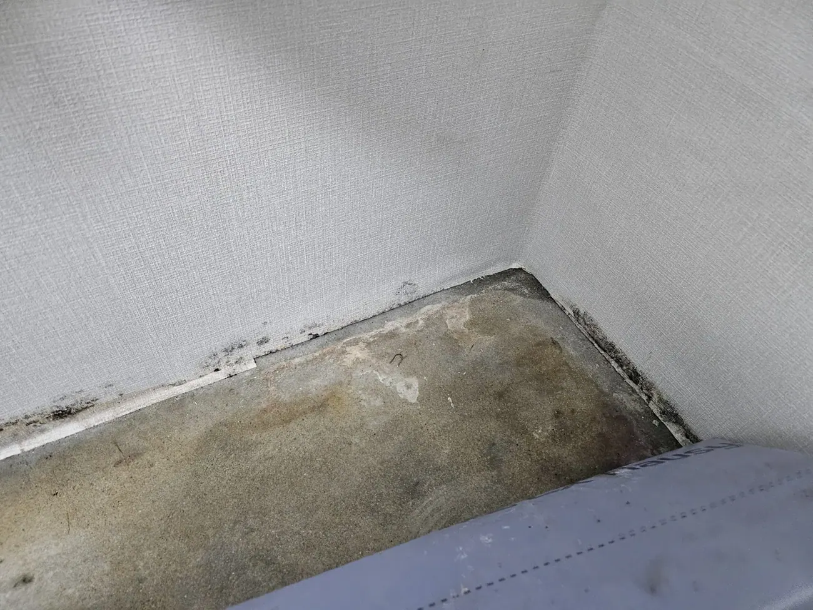
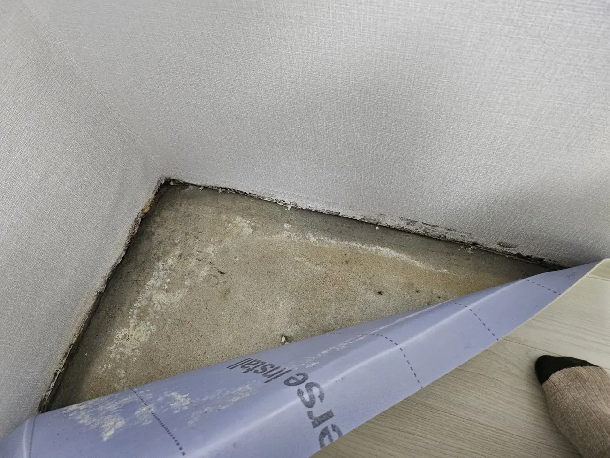

The room in these photographs looks fine. Clean wallpaper, laminate
floor, nothing on the walls, no smell that hits you at the door.
You would view it, like it, and sign.

Then you lift one plastic strip along the bottom of the wall.

*The strip comes away in one piece · ⓒ @BalliBalliSeoul*

That dark band runs the length of the wall. It was there at the
viewing. It just wasn't visible.

## Why Korean interiors hide it so well

This isn't a uniquely Korean problem — damp exists everywhere — but
**Korean finishing makes it uniquely invisible.**

Walls here are papered rather than painted, floors are covered with
vinyl sheet or laminate, and the join between them is capped with a
**baseboard strip (걸레받이)**. Three layers, all of them opaque, all
of them meeting exactly where moisture collects.

A painted wall shows damp as a stain within weeks. **Wallpaper hides
it until the paper itself gives up** — by which point what's behind
has been growing for a long time.

*This is what "the flat looked clean" can mean · ⓒ @BalliBalliSeoul*

## The white powder matters as much as the black

Look at the pale crust in this next photo, next to the black.

*White salt crystals — the giveaway · ⓒ @BalliBalliSeoul*

That white deposit is **efflorescence (백화)**: salts carried out of
the concrete by moisture and left behind as the water evaporates.

Mould tells you the surface has been damp. **Efflorescence tells you
water has been moving through the structure itself** — repeatedly,
over a long period. It's the difference between a wet towel left
against a wall and a wall that is wet.

If you see the white, the problem is not a cleaning problem.

## What to check at a viewing

You will not be pulling baseboards off during a ten-minute viewing.
You don't need to. **Five checks, none of which look strange:**

**1. Smell the corners, not the room.** Crouch near the floor in a
corner, ideally behind where furniture would go. Damp has a distinct
earthy smell that sits low and disappears at standing height. If the
flat has been aired out for you, the corners still tell the truth.

**2. Run a finger along the bottom edge of the wallpaper.** Look for
discolouration, a wavy or lifted edge, or paper that feels cool and
slightly soft. Clean paper meeting the floor in a straight, tight
line is a good sign.

*The paper edge gives it away before anything else does · ⓒ @BalliBalliSeoul*

**3. Look behind and under everything that's already there.** The
wardrobe against the outside wall, the bed head, the boxed-in
corner. Mould grows where air doesn't move, which is exactly where
furniture sits.

**4. Check the corners of exterior walls first.** Especially north-facing
ones, and especially at floor level. Corners are colder than flat
wall, so they condense first.

*Corners go first · ⓒ @BalliBalliSeoul*

**5. Ask directly, and watch the answer.** "**곰팡이 있었어요?**"
— *has there been mould?* A landlord or agent who says "it was
treated last year" has told you something important. So has one who
looks uncomfortable.

**And treat fresh wallpaper in one room only as a question, not a
feature.** New paper is how mould gets covered, not just how flats
get refreshed.

## The flats where this is most likely

Not every Korean home has this problem. These raise the odds:

- **Semi-basement (반지하) and ground-floor units** — the classic
  case, and the reason those flats are cheaper
- **North-facing rooms**, which stay cold and condense
- **Older buildings with thin or no wall insulation**
- **Villas rather than large apartment complexes**, where
  construction and maintenance standards vary far more
- **Rooms where the previous tenant kept a drying rack indoors** all
  winter with the window shut

## Why it matters beyond the ugliness

We're not going to overstate this, and we're not doctors. But the
consensus is unremarkable: **living with visible mould is associated
with respiratory irritation, coughing, worsened allergies, and
aggravated asthma.** People with existing asthma, allergies or
compromised immunity have the strongest reason to care.

The practical point for you is simpler. **You will be sleeping in
that room, with the window closed, for months.** A flat that grows
mould in the corners in August will grow more of it during the
monsoon, and you will be breathing it the whole time.

## If you already live there

- **Photograph it now, with dates**, before any conversation starts.
  This is the same discipline that matters when
  [water comes through a ceiling](/blog/water-leak-korean-apartment/)
  — the record is what settles arguments later.
- **Tell the landlord in writing**, not verbally. A message with a
  photo establishes both the problem and the date you reported it.
- **The cause decides who pays.** Mould from a building defect —
  failed waterproofing, no insulation, a leak — is the property's
  problem. Mould from a tenant drying laundry indoors with every
  window shut all winter is a harder argument to win. Expect that
  distinction to be the whole conversation.
- **Surface cleaning is not a repair.** Wiping the visible black off
  wallpaper and re-papering treats the symptom. If the concrete
  behind it is still damp, it comes back — usually within a year.

## What actually fixes it

In rough order of seriousness:

1. **Ventilate and de-humidify.** Cheapest, and genuinely effective
   for condensation-driven mould. Air the room daily even in winter;
   run a dehumidifier in the rainy season.
2. **Move furniture a few centimetres off exterior walls.** Air needs
   to move behind it. This one costs nothing and prevents a lot.
3. **Professional cleaning and treatment** for anything that has
   taken hold on surfaces.
4. **Address the source** — insulation, waterproofing, a leak. If
   there's efflorescence, you are in this category, and it's the
   building's job, not a weekend's work.

Steps 3 and 4 are where we come in: our
**[cleaning service](/cleaning)** handles the treatment, and for
anything structural we get the right trade in and translate the
diagnosis — because "the wall is wet and nobody will tell me why in
English" is exactly the problem this company was built around.

If keeping on top of it is the issue rather than fixing it once,
[weekly cleaning help is easier to arrange here than most people
assume](/blog/housekeeping-service-korea/).

This check is one of several worth doing before you sign anything.
The rest — what the deposit is telling you, the management fee, the
ten minutes at the viewing — are in our
[guide to renting in Seoul](/blog/what-to-check-before-renting-seoul/),
and once you have the keys, photograph everything you find
[on day one](/blog/photograph-your-flat-move-in-day/).

## Get it sorted

> **Viewing a flat and unsure what you're looking at?** Send us
> photos on [WhatsApp](https://wa.me/821075191282) — corners, wall
> bases, behind the furniture — and we'll tell you what we'd walk
> away from. If you already live with it, we'll tell you whether
> it's a clean or a repair. Asking costs nothing — you pay only for the work you book.

The one-line version: **crouch in the corners and smell, check the
bottom edge of the wallpaper, treat white crystals as a red flag,
and remember that fresh paper in one room is a question — not a
selling point.**
