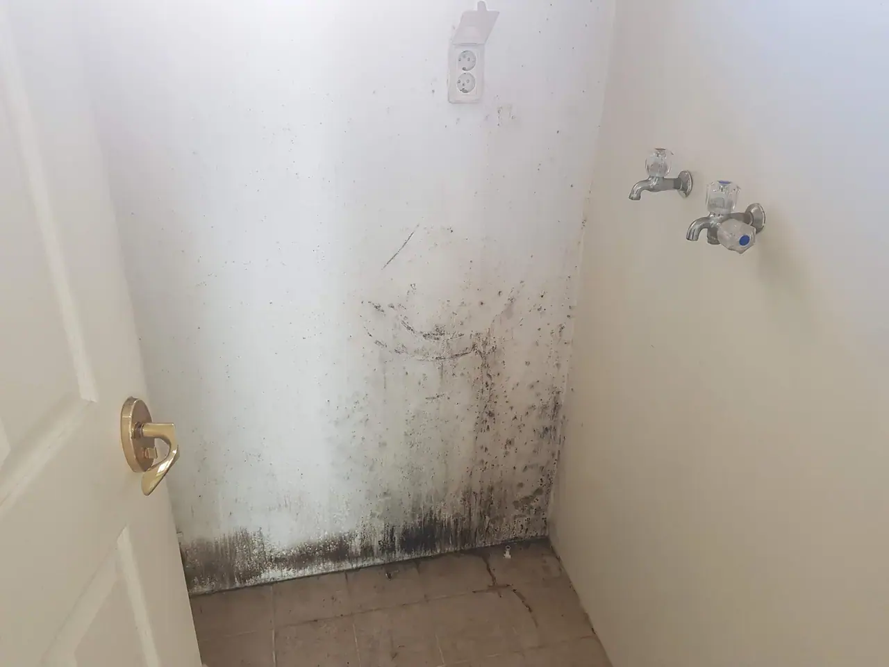
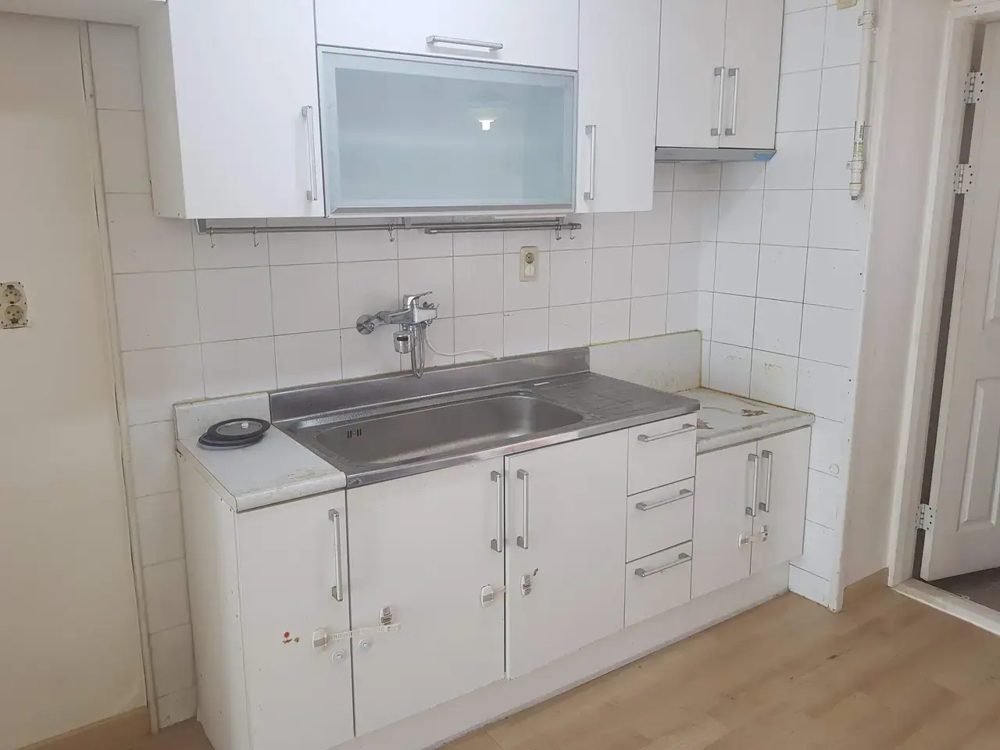
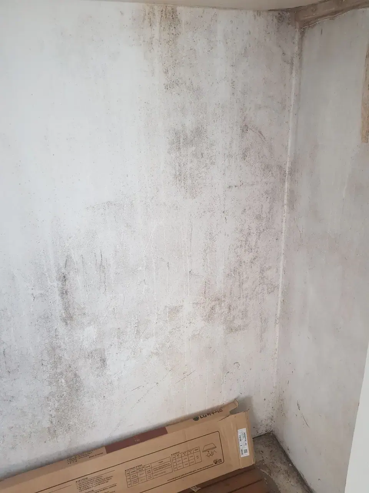
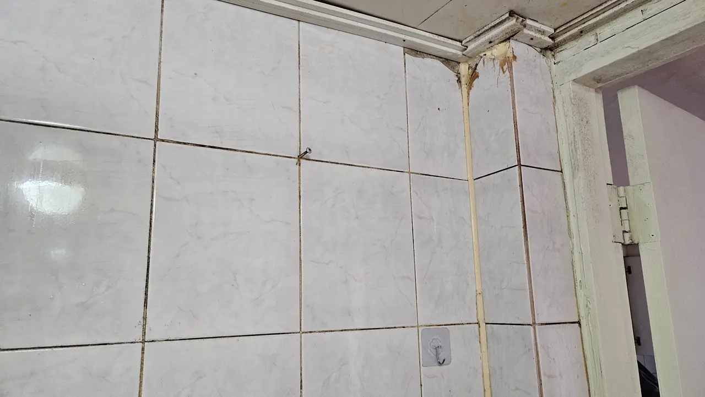
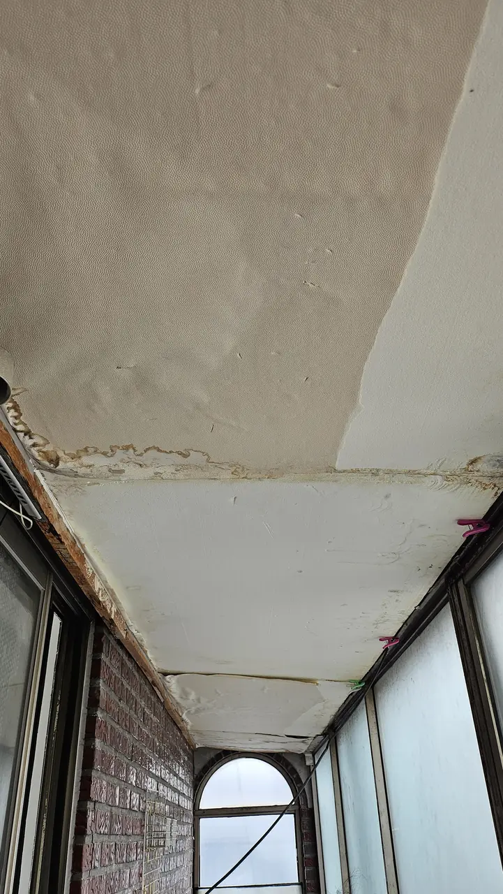

Your lease is signed and the keys come next week. Somewhere in the
handover conversation the agent says the word **입주청소
(ipjucheongso)**, waits a beat, and moves on as though you already
know what that is.

You probably don't, because most countries don't do this. Here is what
it is, what it costs, and the one scheduling detail that decides
whether it happens at all.

## What ipjucheongso actually is

*This is the room behind the door on the cover · ⓒ @BalliBalliSeoul*

That is a flat between tenants, photographed at handover. The kitchen
looks broadly fine. The utility room, one door away, does not — and
**nothing on this page is about the room that looks fine.**

It is a professional deep clean of an **empty** home, done in the gap
between the last tenant leaving and you arriving.

Strictly, Korea splits this in two. **입주청소** is for construction dust
in a new or newly renovated flat; **이사청소** is for the grime a previous
tenant left behind. Companies advertise them together because the crew
and the kit are identical, and in practice the word people use for both
is 입주청소. The full set of Korean cleaning categories is in
[deep cleaning in Korea](/blog/deep-clean-korea-sorting-first/). Not a tidy-up. The
team empties every cabinet and wipes it inside, takes down the window
screens and washes the frames, descales the bathroom, degreases the
range hood, and goes over the floor last.

In Korea this is normal rather than luxurious. Estate agents assume it
will happen. Cleaning companies advertise it as their main product.
There is a standing market of firms who do nothing else.

The reason it is a category of its own is the timing.

## Why it has to be an empty flat

Almost everything on that list is impossible once your furniture is in
the room. Cabinet interiors are behind your plates. The floor under the
wardrobe stops existing the moment the wardrobe lands on it. The gap
behind the washing machine is reachable exactly once.

So the job sits in a narrow window: after the previous tenant's things
are gone, before your movers arrive. In a lot of leases those two
events are the **same day**, which is how people end up skipping the
clean entirely and regretting it in month three.

If your dates are tight, say so when you ask for a quote. Teams that do
this every week are used to working around a moving truck arriving at
two o'clock, but they need to know in advance.

## What is included, and what you have to ask for

A standard quote usually covers the whole flat: cabinets inside and
out, window frames and screens, the bathroom including limescale and
silicone, the kitchen including the range hood, light fittings,
skirting boards, and the floor.

What is *not* automatically included varies by company, and this is
where quotes that look different are actually pricing different jobs.
Ask explicitly about:

| Ask about | Why it matters |
|---|---|
| **Air conditioner** | A wall unit taken apart and washed is a separate line item, often ₩50,000–100,000 per unit. A wipe of the front panel is not the same thing |
| **Mould treatment** | Bathroom silicone that has gone black usually needs cutting out and replacing, not scrubbing |
| **Balcony and outer windows** | Some firms price the balcony separately, and exterior glass above a certain floor may be refused outright |
| **Behind the fridge and washer** | Only possible if the appliances are out or on wheels |
| **New-build smell treatment** | 새집증후군 (saejip-jeunghugun) removal is an add-on, not part of a normal clean |

*The worktop the previous tenant left · ⓒ @BalliBalliSeoul*

*Balconies are where quotes get revised on the day · ⓒ @BalliBalliSeoul*

The single most useful thing you can send with your enquiry is
**photos** — the bathroom, the kitchen, the balcony, and anything that
looks bad. **Condition moves the price more than floor area does**, and
the two above are exactly the sort of thing a company wants to see
before it commits to a number.

## What a clean fixes, and what needs repairing

Everything so far on this page is dirt. A good deal of what you will
actually find at handover is not.

*Not dirt. This gets cut out and replaced · ⓒ @BalliBalliSeoul*

That brown stripe running down a tile joint is a failed silicone seal.
A cleaning crew can scrub it, and it will look slightly better for
about a fortnight. The actual fix is to cut the old bead out and lay a
new one — different trade, different bill, and in a rental usually a
different payer.

The same split runs through everything in an empty flat:

| What you are looking at | Whose job it is |
|---|---|
| Grease, limescale, dust, water marks, stains | The cleaner |
| Silicone gone black, or lifting | A repair |
| Paint flaking off window frames and sills | A repair |
| Wallpaper lifting, water staining, damp | The building — so, the landlord |
| Rust on frames, rails and fittings | The building |

*Water got in above that beam. No clean puts it back · ⓒ @BalliBalliSeoul*

That ceiling is not dirty. Water has been coming in above the beam long
enough to stain it and peel the paper off in one sheet. Scrubbing does
nothing to it — it is the same category as
[mould behind the baseboard](/blog/mould-behind-baseboard-korea/), a
building problem with a different owner and a different bill.

**Why this matters on the day and not later.** For a few hours the flat
is empty and none of it is yours. Every mark in it was made by somebody
else, and everybody involved knows that. Once your furniture is in and
three months have passed, the same mark turns into a question — *was it
like that when you moved in?* — and the answer is whatever you can
prove.

So walk the empty flat once, with your phone, before anything is
delivered. Sort what you find into two lists:

1. **Clean.** Send it to the cleaning company. It moves the quote, and
   it is better for them to see it now than to find it on the day.
2. **Repair.** Send it to the landlord or the agent, *that day*, with
   photographs.

The second list is the one people skip, and it is the one that pays.
Sending it costs nothing, and it is the only version of that
conversation where nobody is arguing about who caused it. What to shoot
and in what order is in
[what to photograph on move-in day](/blog/photograph-your-flat-move-in-day/).

## What it costs

Move-in cleaning is priced by **평 (pyeong)**, the Korean floor-area
unit. One pyeong is about 3.3㎡, and the number is on your lease. A
"25-pyeong" flat is roughly 82㎡.

As a guide, and as of 2026:

| Home size | Typical range |
|---|---|
| Studio / one-room (~10 pyeong) | around ₩250,000 |
| Two-bedroom (~20 pyeong) | around ₩500,000 |
| 30 pyeong and up | From ₩700,000 |

Those work out to roughly **₩23,000–25,000 per pyeong**, which is the
number worth carrying in your head. When a quote arrives, divide it by
your floor area. A figure near that range is a normal job; a figure far
above it is a heavier one, and you should be able to hear why.

**A real example.** A 25-pyeong flat cleaned recently came to
**₩700,000** — about ₩28,000 per pyeong, a little above the line and
entirely ordinary for a flat that needed more than a standard pass. The
useful part is that the arithmetic told you that before the invoice
did.

Two more things about the money. Payment terms are set by the cleaning
team rather than by us — most take cash or a bank transfer, and some
take cards. And ask for a receipt even if you do not think you need
one; it is useful later if the landlord disputes the state of the flat.

## Who pays — you or the landlord

Usually **you**, the incoming tenant. That surprises people, because
you are paying to clean up after someone you never met.

The exceptions are worth knowing:

- **A brand-new or just-renovated flat.** Construction dust is the
  builder's mess, and the landlord often covers the first clean. Ask.
- **Anything written into the lease.** If the landlord agrees to it,
  get it in the contract before you sign. Afterwards it is a favour;
  before, it is a term.
- **Move-out cleaning** is a different question with a different
  answer, and it is the one that touches your deposit. Many landlords
  expect the flat returned in the condition it was handed over, which
  is precisely why the move-in photos matter — see
  [what to photograph on move-in day](/blog/photograph-your-flat-move-in-day/).

A clean is also not an organiser. If the problem is that your own
things have no order rather than that the flat is dirty, that is a
[different trade with a different price](/blog/home-organising-korea-jeongni-sunap/).

## The Korean part

Almost every cleaning company here works by phone and KakaoTalk, in
Korean. That is the actual barrier, and it shows up in four places:

1. **Getting a quote.** They will ask for your floor area in pyeong,
   your address, the condition, and your preferred date. A vague answer
   gets a vague price.
2. **Access to an empty flat.** Somebody has to let the team in. In
   practice this is a temporary door code, or the building office
   holding a key, and both have to be arranged with people who are not
   expecting an English speaker.
3. **The handover overlap.** The previous tenant's move-out, the clean,
   and your movers often land in one 24-hour window, and the three
   parties do not talk to each other. Someone has to sequence them.
4. **Anything found on the day.** A leak under the sink or mould behind
   an appliance is a landlord conversation, and it goes better with a
   photo and a same-day message than with a complaint in month two.

> **Stuck on the Korean part?** Send us your floor area and a couple of
> photos on [WhatsApp](https://wa.me/821075191282) — we'll get you a
> quote in English and coordinate the access and the timing with the
> team. First answer is free.

## Get it sorted

If you are moving into an unfurnished flat in Seoul, book the clean for
the empty window and get the inclusions in writing. It is the one piece
of the move where a few hours of somebody else's work permanently
changes what the next year in that flat feels like.

We arrange move-in cleans in English and stay on the thread until it is
booked — the size, the quote, the access, and the timing against your
movers. The [cleaning page](/cleaning) has the guide ranges, and if you
are still sorting out the move itself,
[moving quotes in Seoul](/blog/moving-company-seoul-quotes/) covers the
other half of the same week.
