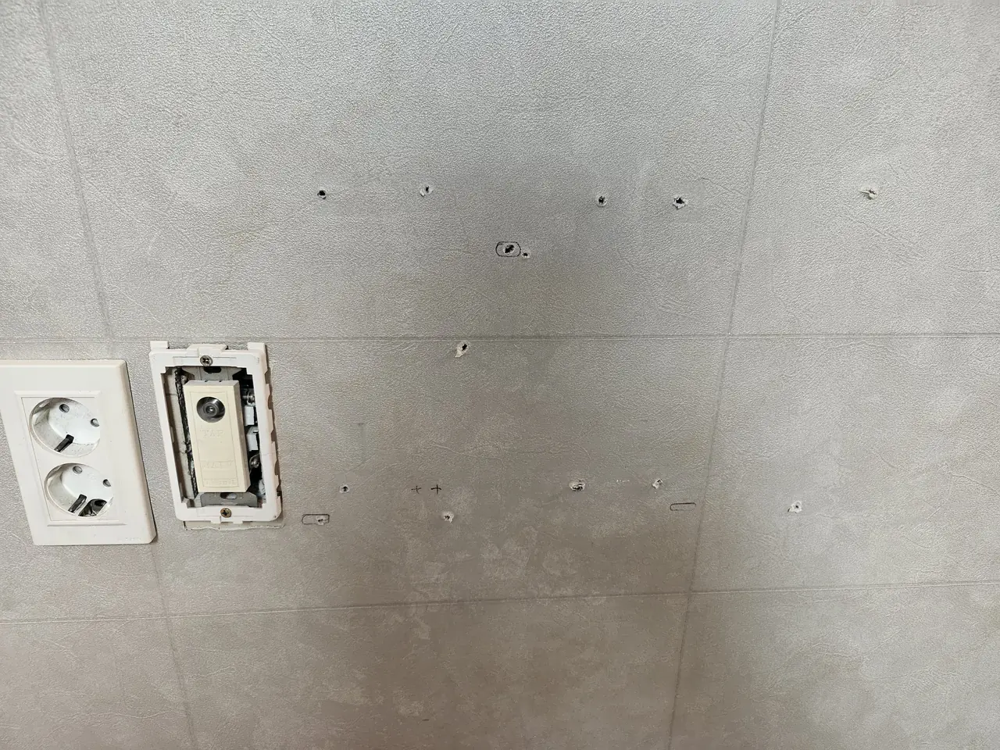
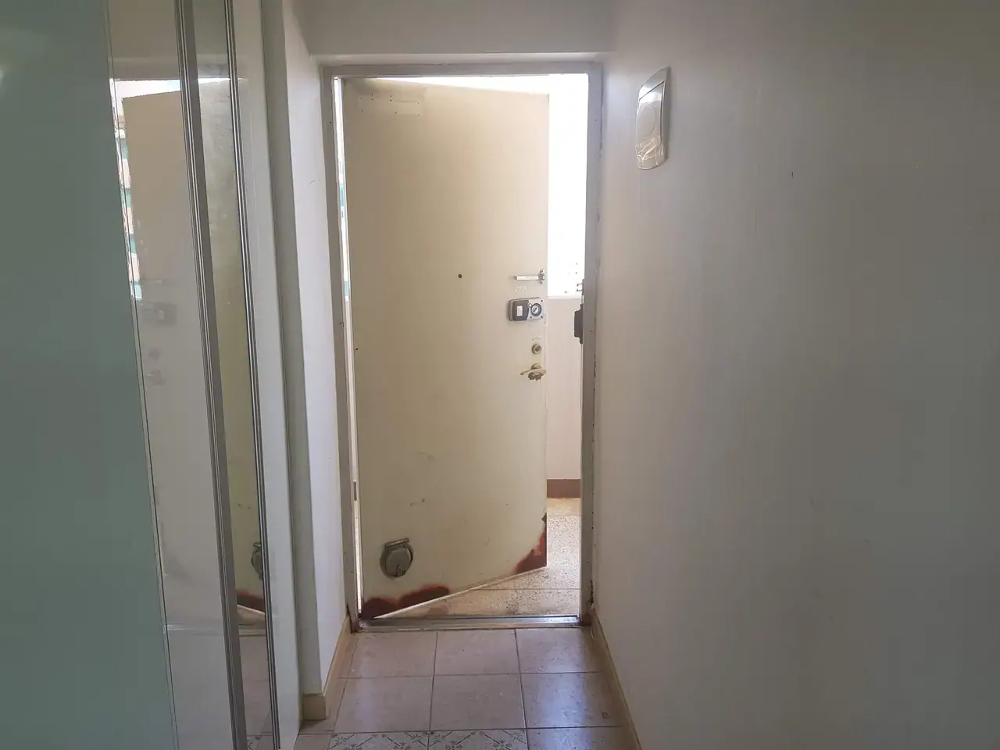
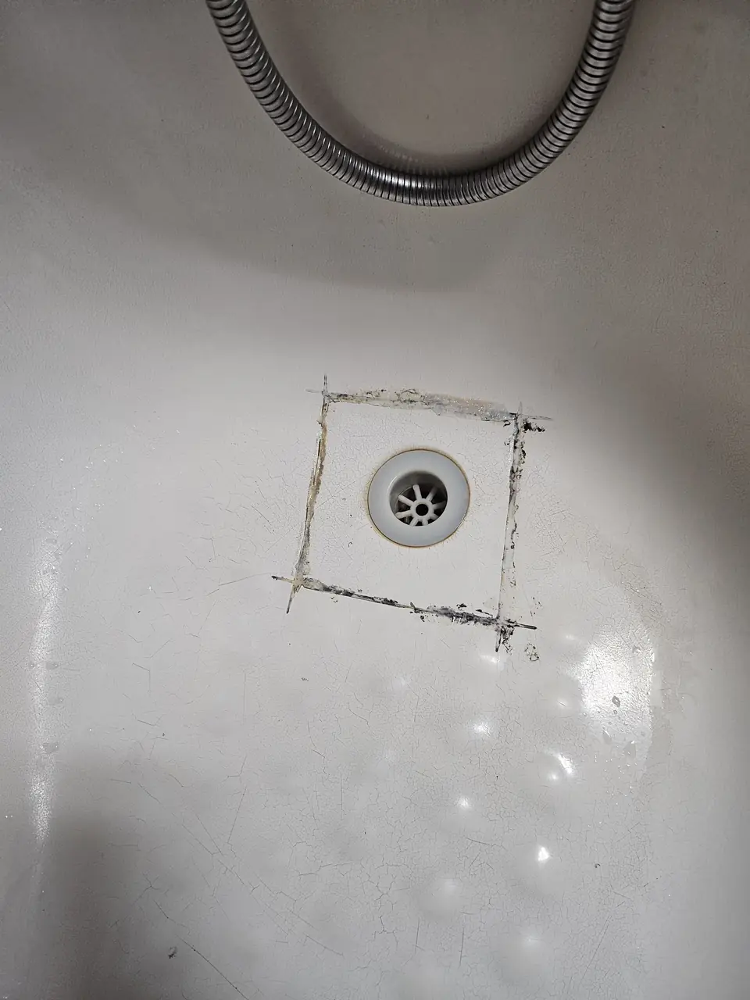
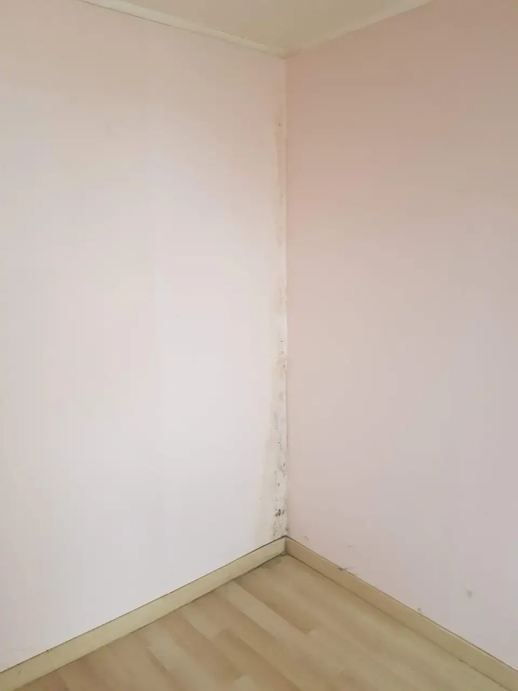

Your lease is ending. Somewhere in the last week, the landlord or the
agent will walk through the flat, look at it, and decide what to deduct.

**In Korea that decision is made against a number they estimate**, not
against an invoice you can argue with. Which is why the clean you pay
for beforehand is almost always cheaper than the clean they price on
your behalf afterwards.

## The word is 이사청소

Move-out cleaning is **이사청소** (isa cheongso). It is the same trade
and the same crew as the move-in clean — the difference is which side of
the handover it sits on, and who is paying.

It is not the same as a normal tidy. The job is the whole flat, empty:
inside every cabinet, the window frames and screens, the bathroom
including limescale and silicone, the range hood, the light fittings,
skirting boards, and the floor last. If you want the full map of Korean
cleaning categories, that is in
[deep cleaning in Korea](/blog/deep-clean-korea-sorting-first/).

**It has to happen after your things are out.** Everything on that list
is unreachable with furniture in the room, which puts the clean in a
narrow window between the movers leaving and the keys going back.

## What actually gets deducted

This is the useful part, because the list is shorter and more specific
than people fear.

**Damage, not wear.** Korean practice distinguishes 원상복구 —
restoring the original condition — from ordinary ageing. Faded
wallpaper after three years is wear. A hole in it is not.

The things that come up again and again:

| Commonly deducted | Commonly accepted as wear |
| --- | --- |
| Anchor holes and screw holes in walls | Small nail holes, in some leases |
| Burn marks, deep scratches, gouged flooring | Furniture-leg dents in 장판 |
| Sticker and adhesive residue | Sun-faded wallpaper |
| Blackened bathroom silicone | Grout discolouration |
| Cigarette smell in the wallpaper | Ordinary dust and grime |
| Missing items — remotes, keys, shelves, filters | — |
| Rubbish left behind | — |

**Two of those are worth naming.** Wall anchors are the single most
common argument, because mounting a TV or a shelf feels like a small act
and leaves a repair-sized hole. And **rubbish left behind is the one
deduction nobody disputes** — it is not a judgement call, it is a bill.

*One TV bracket, one shelf, one mirror · ⓒ @BalliBalliSeoul*

Nothing dramatic happened to that wall. It is an ordinary wall in an
ordinary flat at the end of an ordinary tenancy, and every one of those
holes is somebody who hung something up. **That is what the argument is
actually about** — not damage anyone would call damage, but a dozen
small decisions that add up to a wall someone now has to make good.

**Anything you raised on the way in is not yours on the way out.** A
flaking window frame or a failed bath seal that you photographed and
reported on move-in day is a documented pre-existing condition. The same
fault, never mentioned, is three years later indistinguishable from one
you caused — which is the whole argument for doing the
[walk-through when you arrive](/blog/move-in-cleaning-seoul/).

## Do it in this order

The sequence matters more than the effort. Out of order, you pay twice.

**1. Get rid of what is not coming with you — early.** Large items need
a paid disposal sticker arranged with the district office in advance,
and the collection date is theirs, not yours. Booking that a week out is
the difference between leaving cleanly and abandoning a mattress in the
corridor. The whole system is in
[how to throw away rubbish in Korea](/blog/how-to-throw-away-trash-in-korea/).

**2. Move out.** Furniture first, then the clean.

**3. Then the clean**, into an empty flat.

**4. Photograph it, empty and clean, before you hand the keys back.**
Walk the same route you walked on the first day and take the same shots
from the same angles — including the meters. A matched pair settles in
ten seconds what an argument takes a week to resolve, which is exactly
why the
[move-in photographs](/blog/photograph-your-flat-move-in-day/) were
worth taking.

**5. Hand over.** Ideally with the landlord or agent present, so
anything they want to raise gets raised while you are standing in the
room rather than by message a fortnight later.

*The last five minutes decide the deposit · ⓒ @BalliBalliSeoul*

## What it costs

It is the same job as a move-in clean and it is priced the same way —
by **평 (pyeong)**, working out around **₩23,000–25,000 per pyeong**, so
a one-room lands near ₩250,000. The full size-by-size table, and what to
check on a quote, is in
[move-in cleaning](/blog/move-in-cleaning-seoul/); there is no point
repeating it here.

**Now put that next to the deduction.** A landlord who decides the flat
needs cleaning does not go and get three quotes — they estimate, and the
estimate is rarely generous. On a one-room, the gap between paying
₩250,000 yourself and accepting whatever number lands on your deposit is
usually the whole argument for booking it.

Ask what is included. **Air conditioner cleaning is nearly always a
separate line item** — often ₩60,000–90,000 for a wall unit — and if you
have been running it for two summers, it is a fair thing for a landlord
to raise. That one has its own guide:
[aircon smells and what the clean actually involves](/blog/aircon-cleaning-korea/).

## The part people get wrong

**Read the lease before you assume.** Some Korean leases carry a 특약 —
a special term — requiring the tenant to hand back the flat
professionally cleaned. If yours does, this is not optional and the
receipt matters. If it does not, cleaning is still usually the cheaper
path, but it is your decision rather than an obligation.

**Do not repair things yourself at the last minute.** Look at the cover
photograph again: that is a filled hole, and it is more noticeable than
the hole was. Touching up wallpaper with the wrong roll, re-siliconing a
bath edge badly — **a visibly amateur repair can cost more than the
original damage, because now it is two jobs.** If a repair is needed,
say so and let it be priced.

*Someone re-sealed this themselves · ⓒ @BalliBalliSeoul*

That is what "re-siliconing a bath edge badly" looks like from a metre
away. The old seal was cut out and a new one laid by hand, and the
result is a grey square that pulls your eye straight to it — including
the eye of whoever is deciding what comes off your deposit. **Saying the
seal had failed and letting it be priced would have cost less.**

*Not dirt. Do not let this be scrubbed and forgotten · ⓒ @BalliBalliSeoul*

**Cleaning does not fix building problems.** Damp at the bottom of a
wall is not dirt and scrubbing it changes nothing —
[mould behind the baseboard](/blog/mould-behind-baseboard-korea/) is the
landlord's problem, and finding it on the way out is a conversation, not
a deduction.

## The Korean part

Four conversations, all in Korean, in the same week that you are moving.

1. **The district office**, for the large-item disposal stickers.
2. **The cleaning company**, for a quote that needs your floor area, the
   date, and access to an empty flat.
3. **The movers**, whose timing has to fit around the clean.
4. **The landlord or agent**, about the condition of the flat and what
   comes out of the deposit — the one that decides the money.

The fourth is the one worth preparing for. Bring the photographs, know
which items are wear and which are damage, and put anything agreed in
writing rather than in a doorway.

> **Not sure whether a deduction is fair?** Send us the photos and what
> you have been told on [WhatsApp](https://wa.me/821075191282) — we'll
> read the Korean, tell you what is normal, and put your side of it back
> in Korean if you want us to. Asking costs nothing.

## Get it sorted

Book the disposal first, the clean second, and photograph the empty flat
before you hand anything over. Those three, in that order, cover most of
what goes wrong.

We arrange move-out cleans in English and coordinate the timing against
your movers so the flat is empty when the crew arrives. The
[cleaning page](/cleaning) has the guide ranges, and if the move itself
is still unsettled,
[moving quotes in Seoul](/blog/moving-company-seoul-quotes/) is the other
half of the same week.
