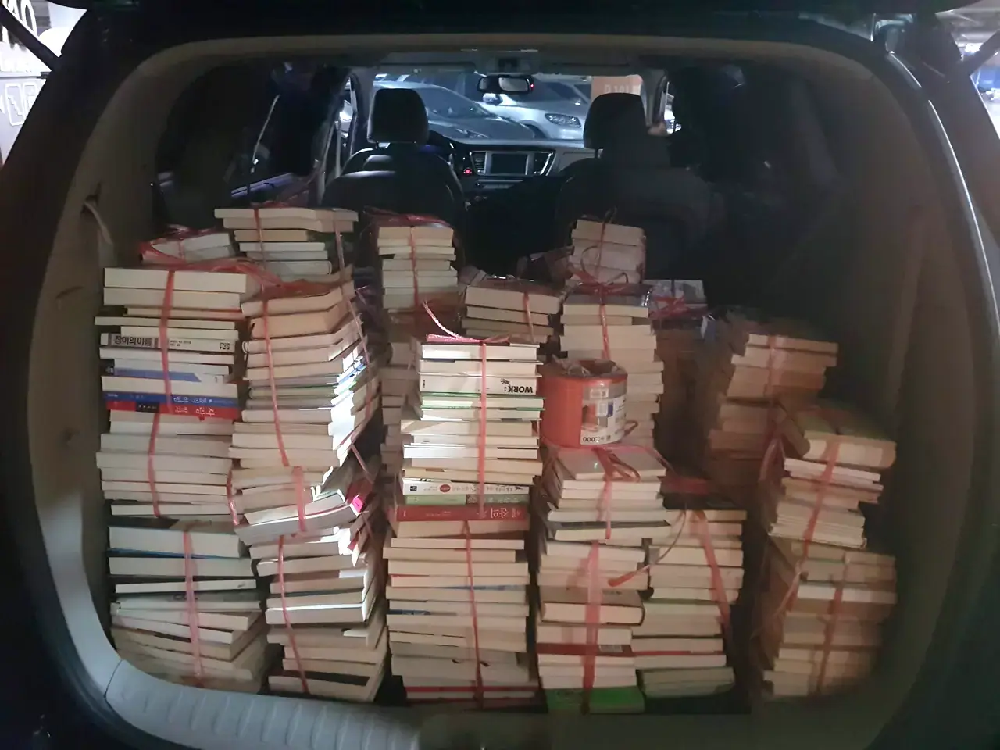
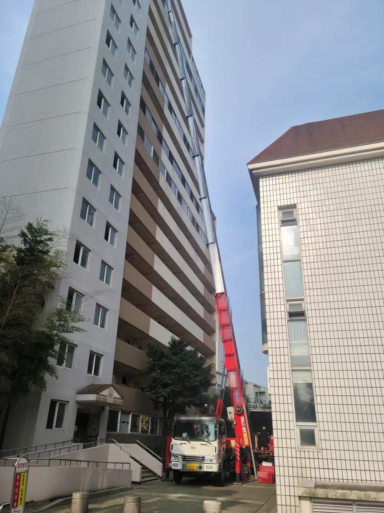

You have three quotes in front of you, all in Korean, and the highest is
three times the lowest. Nobody has explained why.

That gap is usually not one company being greedy. It is three companies
quoting three different services, and until you know which is which, you
cannot tell which number is fair.

## The three tiers, and why the price triples

Korean movers sell three distinct things. Most confusion between quotes
comes from comparing one against another.

| Tier | You do | They do |
| ---- | ------ | ------- |
| **용달** (yongdal) | Get your own boxes, pack, and expect to be part of the lifting | Provide the truck and the driver |
| **반포장이사** (banpojang isa) | Get your own boxes and pack everything yourself | Move it — load, drive, and get it into the new place |
| **포장이사** (pojang isa) | Point at things | Pack, load, drive, unpack and put away |

**용달 is the cheapest, and the most often misunderstood.** What you are
buying is a vehicle and a driver. Many drivers will help you carry
things and plenty are generous about it — but treat that as goodwill
rather than something you have paid for. Some yongdal bookings really are
vehicle-only. Ask which one yours is before the day, not on it.

**반포장 is the middle option, and the wording misleads people.** "Semi-
packing" sounds like they pack half of it. They do not. **You** buy the
boxes and pack your things; what you are paying the company for is the
moving — carrying it out, driving it, and getting it into the new place.

*Semi-pack means you pack · ⓒ @BalliBalliSeoul*

**포장이사 is what most Korean families book, and it does mean all of
it.** Packing, transport, unpacking, putting things away. It is also the
tier where the quoted number is least likely to be the final number,
for the reasons below.

### 보관이사 — when the dates don't line up

There is a fourth thing on the menu, and it solves a problem rather than a
packing preference. **보관이사** (bogwan isa) is a move with storage in the
middle: the crew empties your old place, your things sit in the company's
depot for days, weeks or months, and a second crew delivers them into the
new one.

Two situations make it worth knowing about, and both are common for
foreign residents. Your new place is being renovated and is not ready
yet — Korean flats are frequently redone between tenants. Or your lease
ends before the next one starts and you have a gap with nowhere to put a
household.

**Budget roughly double a normal move.** That is not a storage surcharge
bolted on: you are paying for two moves, because everything is loaded and
unloaded twice, plus the storage in between.

If you go this route, settle three things in advance: how the storage
itself is charged, whether the company's insurance still covers your
things **while they are in the depot**, and what the delivery date is.
The second half of a storage move is easy to leave vague, and vague is
where it goes wrong.

## What gets billed on top

Even on full-pack, some things commonly sit outside the headline price.
None of this is a scam — it is how the trade prices work — but it is
where a quote quietly grows.

**Large appliances and bulky furniture.** Fridges, washing machines,
kimchi fridges, big wardrobes, pianos. Anything heavy, awkward or
fragile enough to need extra hands or extra care can carry its own
charge.

**Disassembly and reassembly.** Beds, wardrobes, desks — anything that
has to come apart to leave the room and go back together in the new
place. **Do not assume this is included because the quote is a large
number.** Ask for it as a separate line.

**Built-in and system furniture** (붙박이장, 시스템 가구) is usually
excluded from every tier. These are fitted to the wall and normally need
the original installer. A moving crew may refuse, and they are right to —
taking one apart badly destroys it and can cost you your deposit.

**Wall mounting.** A TV bracket or shelves going back up in the new place
is a separate job, usually ₩40,000–100,000 per session.

**Air conditioners.** Aircon relocation (에어컨 이전설치) is a different
trade. It needs a licensed installer, often a refrigerant recharge, and
sometimes new pipework. Book and budget for it separately — a moving crew
will not touch it.

**A second truck.** If the load turns out to be more than the truck can
take, another one has to come, and that is usually charged. This is the
single best argument for the visit estimate described below.

Whatever you are not taking with you is its own problem: Korea charges
for large-item disposal by sticker, covered in
[how to throw away rubbish in Korea](/blog/how-to-throw-away-trash-in-korea/).

## What it costs in Seoul

Starting points as of 2026, for moves inside Seoul — not ceilings. Every
mover confirms the real number after seeing the volume, and volume,
floors, access and distance all push it up.

| Job | Guide range |
| --- | ----------- |
| Yongdal, one room, within Seoul | From ₩80,000 |
| Semi-pack, one room to a small flat | Ask the mover — visit estimate |
| Full pack, studio | From ₩400,000 |
| Full pack, family apartment | Ask the mover — visit estimate |
| Ladder truck (사다리차, sadari-cha) | Added on top, by floor |
| Storage move (보관이사) | Roughly double the equivalent move |

**Two rows deliberately have no number.** Semi-pack and a full family
move swing too widely on volume for a printed range to mean anything —
which is the same reason a mover wants to come and look. Anyone who gives
you a firm figure for those without seeing the flat is guessing.

What moves a quote up, in rough order of impact:

- **Volume.** Quoted by truck size — 1톤, 2.5톤, 5톤. More boxes, bigger truck, more crew.
- **Floors and lifts.** No lift, or a lift too small for a wardrobe, means a **ladder truck** to the window. Older low-rise buildings and villas almost always need one.
- **Distance**, and whether the truck can park near the door. A long carry from the road is charged.
- **The date.** Worth money — see below.

*사다리차 — furniture goes through the window · ⓒ @BalliBalliSeoul*

### The date is a price, not a detail

**손 없는 날 (son eomneun nal)** — "days without spirits" — are the
traditionally auspicious days to move, falling on the 9th, 10th, 19th,
20th, 29th and 30th of the lunar month. Korean families still book them
heavily, crews get scarce, and quotes rise.

**Month-end and weekends** are the other peak, because Korean leases
usually turn over then.

A Tuesday in the middle of a lunar month is the cheapest truck in Korea.
If your landlord is flexible by a few days, get quotes for both and
compare.

> **Not sure which tier you were quoted?** Send us the quote on
> [WhatsApp](https://wa.me/821075191282) — we'll read the Korean and tell
> you what it actually covers and whether the number is normal for that
> job. Asking costs nothing.

## Before you sign

Three questions, asked in this order, prevent almost every moving-day
argument.

### 1. Insist on a visit estimate

Korean movers quote by phone and properly **by visit** (방문견적,
bangmun gyeonjeok). Someone comes, looks at your things, checks the
stairs and the lift, and prices it.

For a single room with not much in it, a photo estimate is often close
enough. **Past that, a quote made from photos alone is not worth much.**
Volume and access are exactly the two things a photo hides, and they are
the two things that decide the price — including whether one truck is
enough. Visit estimates are normal and free. Prefer a company that offers
one, and be wary of a large quote from someone who never came to look.

### 2. Ask about insurance and damage cover — before you pay

Ask both questions plainly, before any money moves:

- **Do you carry insurance?** Licensed operators are required to hold
  cargo liability insurance — **적재물배상책임보험** (jeokjaemul baesang
  chaegim boheom). A cheap van found through an app may hold neither a
  licence nor a policy, which is a large part of why it is cheap.
- **What happens if something is damaged?** Ask what they actually do —
  repair, replace, or pay — and get the answer in writing.

Ask for the **business registration** and the **insurance certificate**.
A legitimate company sends both without fuss. Reluctance is your answer.

### 3. Confirm there is nothing on top, then sign

Ask directly whether anything in this move is billed as an extra — the
appliances, the disassembly, the ladder truck, a second truck if the load
is bigger than expected. Get the answer into the quote, then sign it.

A deposit (계약금) of around ten percent is normal at booking. Read what
the contract says about cancellation before you pay it.

## When something gets broken

Something gets scratched eventually. What decides whether you are
compensated is mostly what you do in the first hour and the first month.

### Check before you pay the balance

Open boxes and look at the furniture **while the crew is still there**,
before you sign anything off or hand over the rest of the money. Once the
truck has gone you are arguing about when the damage happened, and that
is a much weaker position.

Photograph the flat and your larger items before the move as well — the
same habit that protects your deposit, covered in
[photograph your flat on move-in day](/blog/photograph-your-flat-move-in-day/).

### The 30-day rule

Household moving in Korea has standard contract terms issued by the Fair
Trade Commission — **이사화물 표준약관** (isa hwamul pyojun yakgwan).
Under them a mover's liability for loss or damage generally **lapses if
you do not notify them within 30 days** of delivery, and in any case
after one year.

Thirty days sounds generous until you are living out of boxes. Unpack the
valuable things early, and put any damage in writing — a message, not a
phone call — as soon as you find it.

Not every company adopts the standard terms. Ask whether they do before
you book, and keep whatever contract you are given.

### Carry these yourself

Standard terms limit or exclude liability for valuables that were not
declared in advance. Do not put cash, jewellery, your passport, your ARC
or your laptop on the truck. Take them in your own bag.

### If it goes wrong

Try the company first, in writing. If that fails, Korea's consumer
dispute route is the **1372 consumer counselling line** run by the Korea
Consumer Agency. For help in English, the living and tourism hotline
**1330** interprets — see [the 1330 hotline guide](/blog/korea-travel-hotline-1330/).

## The Korean part

Everything above assumes you can get the quotes in the first place, and
this is where most foreign residents stall.

Comparing three movers properly means three phone calls in Korean, three
visit appointments, and three conversations about floors, lifts, dates
and what counts as an extra. The quotes then come back as Korean text
messages, itemised in terms you have not met before.

## Get it sorted

The tiers are the thing to take away. Before comparing any two numbers,
work out which of the three services each one is quoting, what sits
outside the price, and whether anyone has actually been to look.

If the Korean part is the obstacle, that is what we do: we
[arrange the move](/moving) in English, read the quotes back to you in
plain terms, and can send someone to interpret on the day. We are a
booking and coordination service — the crew is an independent local
company, and their price goes to them.

We take no commission from any mover. Whichever one you pick, we earn the
same, which is the only way we can tell you honestly which quote to take.
