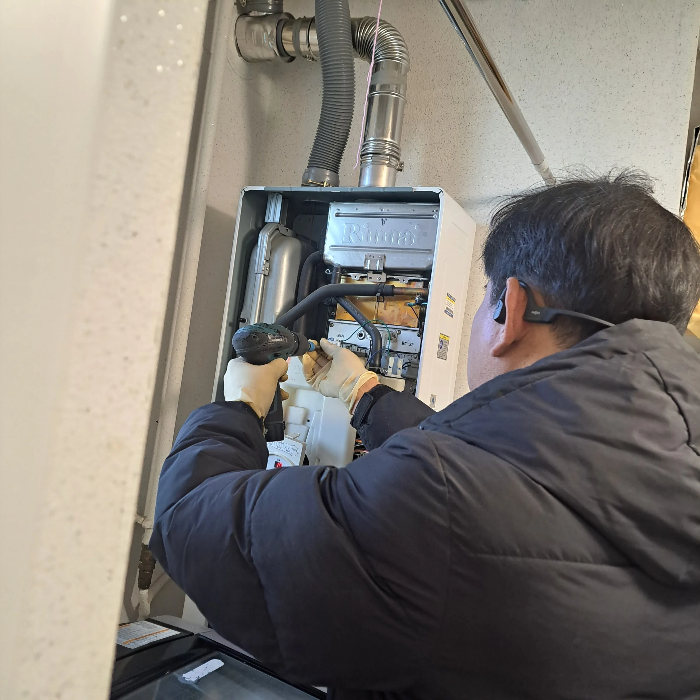
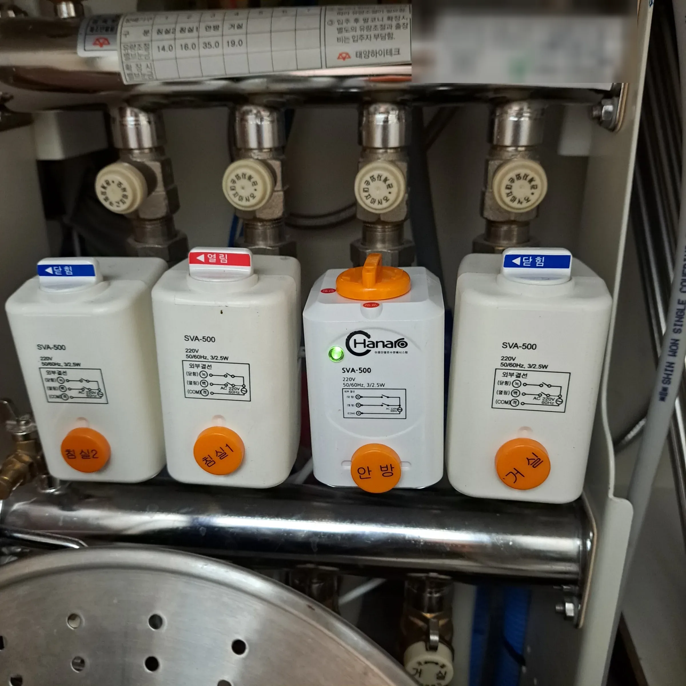

It is seven in the morning, the shower is cold, and the little box on
the wall is either dark or showing something you cannot read.

Before you look up boiler repair, check the valves. A surprising share
of "the boiler is broken" turns out to be gas or water that is not
reaching it, and the last time this happened to us the cause was
embarrassingly simple: the water valve under the boiler was closed.
Nothing was broken. Nothing needed paying for.

## First: is it only the hot water?

One gas boiler in a Korean flat does two separate jobs — **난방
(nanbang)**, the floor heating, and **온수 (onsu)**, the hot water at
the taps. Which of them is dead tells you where to look.

| What is happening | What it usually means |
|---|---|
| No hot water **and** no heating | Gas or power is not reaching the boiler |
| Heating works, no hot water | **Check the water inlet valve first.** Only then suspect the inside of the boiler |
| Hot water **comes and goes** | A different symptom with a different cause — see [hot water coming and going](/blog/korea-boiler-hot-water-problems/) |
| No water at all, hot or cold | Not the boiler. Building supply or a stopcock |

That last row is worth thirty seconds. Run a cold tap. If nothing comes
out of that either, the boiler was never the story.

## Check the valves first — gas and water

**If you have just moved in, do this before anything else.** Valves get
closed when a flat is emptied, cleaned or worked on, and nobody
remembers to open them again. A boiler with a closed valve behaves
exactly like a broken one.

There are two families of valve to check, and they are in different
places.

### The water valves, underneath the boiler

Look at the pipes running into the bottom of the unit. Each has a
handle, and the same rule applies to all of them: **handle parallel
with the pipe is open, handle across the pipe is closed.**

The one that strands people is the cold water inlet — the boiler cannot
heat water it is not being given. Heating still works, the controller
lights up, no fault code appears, and the taps stay cold.

### The gas, in this order

**1. Turn on the gas hob.** If a burner lights, gas is reaching the
flat. If it does not, the problem is upstream and no boiler engineer
will help you.

**2. Look at the middle valve.** On the gas pipe near the boiler there
is a small handle, usually yellow, and the same parallel-is-open rule
applies.

**3. Watch the meter.** Open a hot tap and look at your gas meter,
normally in the same space as the boiler. The small red **dm³** dial
should start turning within a few seconds. If it sits still while the
boiler is trying to fire, gas is not getting through.

**4. Consider the safety cut-off.** Korean domestic meters cut the
supply automatically after certain events — a strong tremor, a
suspected leak, or an unusually long stretch with no use at all, which
catches people coming back from a month abroad. Resetting it is the
supplier's job, not yours and not a plumber's.

**5. Check whether the bill is paid.** Supply gets suspended for
non-payment, and if you moved in recently the account may never have
been transferred into your name.

> **If you can smell gas, stop reading.** Do not touch light switches
> or plug sockets, open the windows, leave, and call **119** from
> outside. The [emergency numbers guide](/blog/korea-emergency-numbers-112-119/)
> covers what to say. Gas work is not a DIY category and it is not
> something we arrange either.

## Then check the power and the settings

The boiler needs electricity as well as gas. If the wall controller is
completely dark, look for a plug behind or beside the unit and check
your consumer unit for a tripped breaker.

If the controller is lit, two settings strand people:

- **The mode dial.** Korean controllers have positions for 실내
  (room temperature), 온돌 (floor), and 온수전용 (hot water only). On
  the wrong setting in summer, the heating is off — which is fine —
  but a mis-set controller can leave you with nothing.
- **The hot water temperature.** It is set separately from the heating
  temperature, and it can be turned down far enough to feel cold.

If a fault code is showing instead, the codes and what they mean are in
[hot water coming and going](/blog/korea-boiler-hot-water-problems/),
along with the two resets worth trying before anyone comes out.

## In winter, suspect frozen pipes first

Below about −5°C, and especially in older buildings and on top floors,
the culprit is usually not the boiler at all but a frozen pipe or a
frozen condensate drain. The tell is timing: it worked last night and
stopped overnight during a cold snap.

Do not use a naked flame on a pipe. Warm water on towels wrapped around
the exposed section is the standard approach, and it is slow. If the
boiler is throwing a code and the outside temperature explains it,
waiting until midday is often the whole repair.

## When to stop and call someone

Call once you have confirmed gas is arriving, power is on, and the
settings are right — and it still will not produce hot water. At that
point the fault is inside the unit, and inside the unit is not a place
to experiment.

*The cover comes off and it stops being a DIY job · ⓒ @BalliBalliSeoul*

Also call, rather than investigate, if you find water under the boiler,
if the flue pipe at the top looks loose or disconnected, or if the
thing is making a noise it did not make last week.

> **Stuck on the Korean part?** Send us a photo of the controller and
> the boiler on [WhatsApp](https://wa.me/821075191282) — we'll tell you
> what the code means and whether this is a supplier call or an engineer
> call, in English. First answer is free.

## Every brand has its own service line

There is no single national boiler helpline. The maker's service number
is printed on the front of the unit, usually on a sticker near the
bottom, and **the self-check and reset steps differ by brand** — the
button sequence that clears a code on one will do nothing on another.

| Brand | Printed service line |
|---|---|
| 경동나비엔 (Kyungdong Navien) | 1588-1144 |
| 린나이 (Rinnai) | 1544-3651 |

Those are the two we have on units in front of us as of 2026; other
makers print theirs the same way. For anything on the supply side
rather than the appliance — a meter reset, a suspended account, a smell
of gas — the number you want is the **city gas company's**, which is on
the sticker on the meter itself. It differs by district, so the one on
your meter is the right one, not the one from a search result.

Photograph the sticker before you need it. It is a great deal easier to
read at your desk than crouched behind a boiler at seven in the morning.

## What it costs in Seoul

Two numbers we have actually paid, as of 2026:

| Job | Cost |
|---|---|
| Call-out on its own | around ₩18,000 |
| A three-way valve replaced, all in | around ₩80,000 |
| A condensing boiler replaced, fitted, with VAT | [₩1,045,000](/blog/boiler-replacement-cost-korea/) |

The gap between the middle row and the last one is the reason to insist
on hearing what the fault actually is before agreeing to a replacement.
A boiler under about eight years old is usually worth repairing.

If the heating is dead as well as the hot water and the manifold is
accessible, it is worth a look at the zone valves before assuming the
worst — a closed zone is not a broken boiler.

*Each valve feeds one room, and each is marked 열림 (open) or 닫힘 (closed) · ⓒ @BalliBalliSeoul*

## Who pays — you or the landlord

The boiler is part of the flat's fixed equipment, so repairs and
replacement normally fall to the landlord rather than the tenant. What
tends to land on you is anything caused by how the flat was used — the
classic being pipes that froze because the heating was left fully off
while nobody was home in January.

Two practical points. Tell the landlord **on the day**, in writing, with
a photo — a message with a timestamp settles arguments that a phone call
does not. And do not commission a replacement yourself and send the
bill afterwards; agree who is instructing the work before it starts.

## The Korean part

Four places this stalls for English speakers:

1. **Working out who to call.** Gas supply is the city gas company,
   the meter is theirs too, and the boiler is a separate engineer.
   Calling the wrong one costs a day.
2. **The supplier's phone line.** Reset requests and supply questions
   go through a Korean call centre, and the number on the meter sticker
   is the right one to use.
3. **Describing the symptom.** "No hot water" and "hot water that comes
   and goes" send an engineer out with different parts on the van.
4. **The landlord conversation.** Who pays, and who instructs the work,
   is a negotiation that goes better in writing and in Korean.

## Get it sorted

Check the valves under the boiler, run a hot tap and watch the meter,
light the hob. Those checks take two minutes, they cost nothing, and
they sort the "open a valve" cases from the "call the gas company"
cases from the "call an engineer" cases. In a flat you have just moved
into, start with the valves every time.

We make both of those calls in English and stay on it until someone is
booked — and if it turns into a landlord conversation, that part is in
Korean too. The [plumbing page](/plumbing) has the guide ranges.
