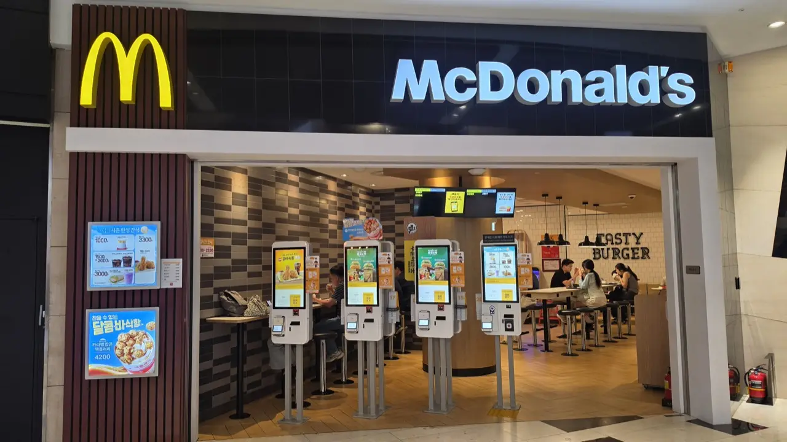
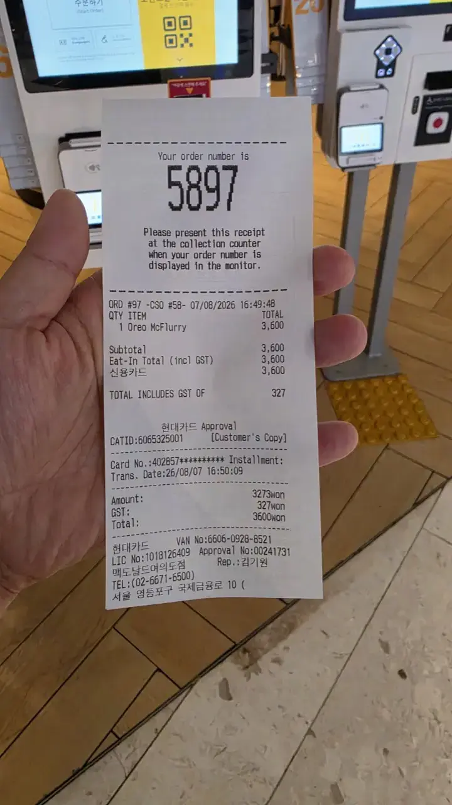

You've just paid at a Korean cafe kiosk and something feels off.
The screen went straight from "total" to "insert card" — no 15%,
18%, 20% buttons, no guilt-inducing "custom tip" option, no
signature line with a blank space daring you. Nothing. So you
stand there wondering whether you just stiffed someone.

You didn't. **Korea has no tipping culture, and the payment system
reflects that by simply not having the feature.** Here's the whole
rule, and what to do instead when service genuinely impresses you.

## The short answer

**No tipping. Anywhere. Not restaurants, not cafes, not taxis, not
hotels, not delivery, not hair salons.** The price on the menu is
the price you pay — Korean prices are quoted with VAT and any
service charge already inside them, so what you see is what's
charged.

This isn't a "technically optional but everyone does it" situation
like tipping in some countries. It's genuinely not the custom, and
not tipping is not rude. Koreans don't tip each other either.

## The kiosk will not ask you

This is the part that trips up visitors from tip-screen countries
most, so let's be blunt: **Korean kiosks, tablets and card
terminals have no tip step.** There is no percentage screen, no
"add gratuity?" prompt, no default 18% pre-selected. The flow is
order → pay → done.

If you're used to the modern tablet-swivel moment — where a screen
turns toward you and a cashier watches while you choose a
percentage — you can relax. That moment does not exist here. Its
absence isn't a system error, and no one is waiting for you to
find a hidden button.

*Four kiosks, no tip screen among them · ⓒ @BalliBalliSeoul*

Fast food, cafes, cinemas, even many mid-range restaurants now run
on kiosks like these — often with an English toggle right on the
first screen. You will touch a lot of them in Korea, and not one
will ask you for a gratuity.

And the receipt closes the case:

*Menu price = subtotal = total. Tax inside, no tip line · ⓒ @BalliBalliSeoul*

Look at what that receipt does and doesn't have. A ₩3,600 item
comes to a ₩3,600 subtotal and a ₩3,600 charge — with the note
"TOTAL INCLUDES GST OF 327," meaning the tax was inside the menu
price all along. There is no gratuity line, no suggested-tip
table at the bottom, no space to write one in.

The same goes for taxis: the meter is the fare, apps charge the
meter, and drivers don't expect a rounded-up bill. Food delivery
apps? The delivery fee is in the order total, and there's no tip
field.

## What if I really want to tip?

Occasionally a visitor hands over cash anyway — a token of thanks
after exceptional service. It's a kind impulse, so here's what
actually happens if you try:

- **Staff will often politely decline.** Not because they're
  offended, but because it isn't done, and many workplaces have
  policies about accepting money from customers.
- **It can create an awkward moment** for someone who now has to
  explain, in a second language, why they're refusing your money.
- **In some settings it's flatly not allowed** — anything involving
  public employees, and many hotel and hospital contexts.

If you insist and it's accepted, nothing terrible happens. But
you're doing something culturally foreign, not something generous
by local standards.

## What Koreans do instead

Appreciation here runs through channels that actually help the
person or the business:

- **Say it.** *Gamsahamnida* (감사합니다, "thank you") or the
  warmer *jal meogeosseumnida* (잘 먹었습니다, "I ate well") on the
  way out of a restaurant lands better than cash ever would.
- **Leave a review.** Naver Map, Google Maps and Kakao Map reviews
  are what small Korean businesses genuinely live and die by — a
  good one is worth far more than a ₩5,000 note.
- **Come back, and bring people.** Regulars are the currency of
  neighborhood restaurants here.
- **Take the free refill graciously.** If a place likes you, the
  gratitude tends to flow in your direction — extra banchan, an
  extra scoop, a free drink. Accepting warmly is the correct
  response.

## The two edge cases

Two situations occasionally get mistaken for tipping:

- **Service charge at luxury hotels and some fine dining** — a
  10% service charge may be added to the bill. That's a line item,
  not a tip, and it means *no additional tip* is expected.
- **Movers, delivery of large furniture, or a long private tour** —
  some residents offer drinks (a cold coffee, a bottle of water)
  rather than cash. That's the Korean-flavored version of a tip:
  hospitality, not money.

## The Korean part

Tipping confusion is really a symptom of a bigger question —
*what's actually normal here?* Payment norms, table buzzers,
self-serve water, when to bow, what the kiosk expects. Kiosks in
particular reward a little preparation: our
[movie ticket guide](/blog/how-to-book-movie-tickets-korea/) walks
through one screen by screen, English toggle included. And when a
specific moment stumps you, our
[anything-else concierge service](/etc) is a message away.

## Get it sorted

> **Standing at a counter unsure what the local script is?**
> Message us on [WhatsApp](https://wa.me/821075191282) — send a
> photo of the screen or the menu and we'll tell you what's
> expected, in English, before the awkward pause gets long. First
> answer is free.

The one-line version: **the listed price is the whole price, the
kiosk has no tip button, and "gamsahamnida" plus a five-star
review is the local way to say thanks.** Keep your cash — you'll
need it for the convenience store.
