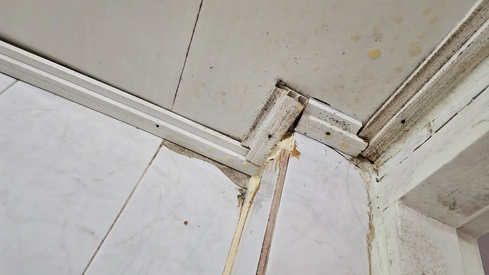
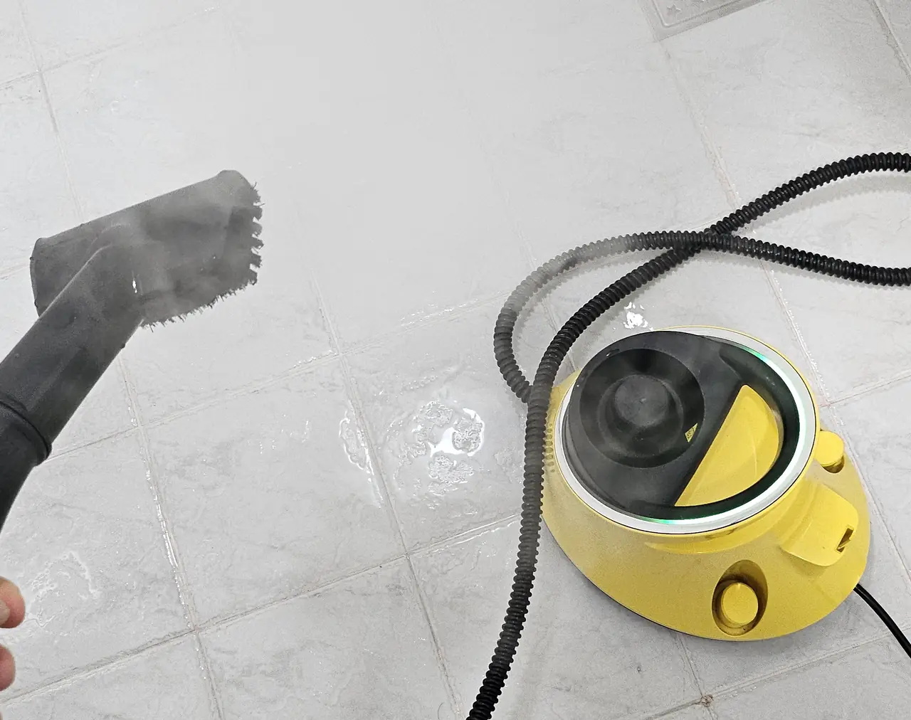
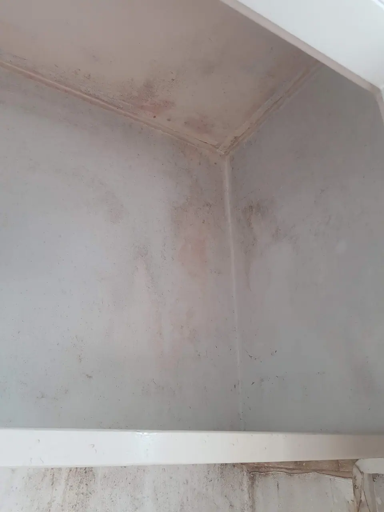

You saw one. In the kitchen, after midnight, and it did not move like
something that had wandered in from the street — it moved like something
that lives here.

The English-language internet will tell you to call an exterminator.
That is the third step. **The first two are free, and skipping them is
how foreigners in Korea end up paying for something the building was
already obliged to do.**

## Step one: find out whether it is already paid for

Korea has a law about this. Under the Infectious Disease Control and
Prevention Act, certain buildings must be disinfected on a fixed
schedule by a registered firm — and **apartment complexes of 300
households or more are on that list**, at roughly quarterly intervals
through the warm half of the year and less often in winter.

You are already paying for it. It sits inside your 관리비 (*gwallibi*,
the monthly management charge) and it is carried out by a contractor the
complex has hired.

**Here is the part nobody tells you.** The scheduled visit covers the
common areas — stairwells, the basement, the bin store, the car park.
Getting the same crew inside *your* unit, on the same day, at no extra
cost, usually requires you to put your name down in advance. A notice
goes up in the lift a week before. It is in Korean, it looks like every
other notice in the lift, and almost no foreign tenant ever signs up.

So before anything else, go to the 관리사무소 (*gwalli samuso*, the
management office) and ask:

> **정기 소독 언제 해요? 세대 안도 신청할 수 있나요?**
> *When is the scheduled disinfection? Can I sign up for inside my unit?*

If you live in a small 빌라 or a 원룸 building with no management office,
ask the 집주인 (landlord) or the 부동산 who arranged your lease. Many
smaller buildings still run a contract; it is just less visible.

## Step two: work out whose problem this is

Korean law puts a repair duty on landlords — the obligation to keep the
property in a usable state. Pests fall on one side of that line or the
other depending on **cause, not on who noticed first.**

| Usually the landlord's | Usually yours |
| --- | --- |
| Gaps around pipes, cracked walls, failed seals | Food waste left out, unwashed dishes |
| A floor drain with no working trap | Cardboard and clutter stored on the floor |
| An infestation that was there before you moved in | Bringing them in with second-hand furniture |
| A problem running through the whole building | Leaving the balcony door open all summer |
| Bed bugs in a mattress the flat came with | Bed bugs you brought back from a trip |

*Not a pest photo. A pest route · ⓒ @BalliBalliSeoul*

That gap behind the trim is the whole argument in one picture. Nothing
is living in it today. But it is a warm, dark, permanently damp channel
that runs from the bathroom into the wall cavity, and it exists because
a seal failed — **which makes it a repair, not a housekeeping failure.**

**Report it in writing, and report it early.** A KakaoTalk message with
a photo and a date is enough, and it is worth far more than a phone call
you cannot prove. If the same fault was already on the record from the
day you moved in, you are not arguing about it three years later — which
is the entire case for
[photographing the flat on handover day](/blog/photograph-your-flat-move-in-day/),
and for going through
[what to check before you sign](/blog/what-to-check-before-renting-seoul/).

Left undocumented, this turns up again at the other end of the tenancy,
as a line in the deduction list. That is the same mechanism described in
[move-out cleaning and your deposit](/blog/move-out-cleaning-korea/).

## 바퀴벌레 — cockroaches

Two different animals get the same English word here.

**독일바퀴** (*dogil bakwi*, German cockroach) is the small tan one,
around 1–1.5 cm, and it is the one that actually breeds indoors. It
likes kitchens, the warm gap behind the fridge, and the underside of the
sink cabinet.

**이질바퀴 / 집바퀴** are the big ones — 3 cm and up, glossy, usually
arriving from a basement, a bin store or a drain rather than living in
your cupboards. Alarming, less serious.

The Korean building detail that matters: **they travel the plumbing.**
Waste stacks and pipe risers connect flats vertically, which is why a
ground-floor restaurant or one badly kept unit becomes a problem for
everyone above it. If your neighbours are seeing them too, this is a
building job and belongs to the 관리사무소, not to you alone.

### What to do yourself, in this order

1. **Keep the drains sealed.** A Korean floor drain and a kitchen drain both
   rely on a water seal. If a bathroom or utility-room drain is rarely
   used, the seal dries out and the pipe becomes an open door — run
   water down every drain in the flat once a week. Add a 배수구 트랩 or
   a covered strainer where there isn't one. If yours is also slow, the
   fix is in [unblocking a bathroom sink](/blog/unclog-bathroom-sink-korea/).
2. **Bait, don't spray.** Gel bait — 컴배트 and similar, sold in any
   supermarket, Daiso or on Coupang — gets carried back and kills what
   you cannot see. Aerosol spray kills the one you can see and scatters
   the rest into the walls. **Do not use both**: spray residue makes
   roaches avoid the bait you just placed.
3. **Take the food away.** Food waste sealed and out nightly, nothing
   left in the sink. Korean food waste rules are their own subject —
   [how to throw things away in Korea](/blog/how-to-throw-away-trash-in-korea/).
4. **Wait two weeks.** Bait is slow by design. Judging it after three
   days is how people conclude it didn't work.

### When to stop and call someone

- You see them **in daylight**. Daytime activity means the population is
  large enough that the hiding places are full.
- You find **egg cases** (알집) — small brown capsules, often glued into
  a hinge or a seam.
- Neighbours have it too, or it came back within a month of baiting.

## 빈대 — bed bugs

Treat this as a completely separate problem, because almost everything
that works on roaches makes bed bugs worse.

Korea had very few for decades, then a visible national outbreak from
late 2023 — hostels, saunas, public transport seats and student housing.
It is no longer a foreign traveller's story here.

**What it looks like:** bites in a line or a cluster on skin that was
uncovered while you slept, small dark specks along mattress seams and
bed frame joints, blood spotting on the sheet.

**Three things not to do**

- **Do not move to the sofa or the next room.** They follow. A single
  infested bedroom becomes an infested flat.
- **Do not throw the mattress out.** Dragging it through the corridor
  seeds the building, and dumping it needs a 폐기물 스티커 anyway.
- **Do not fog the room with retail insecticide.** Korean researchers
  measured resistance to the common pyrethroids in the thousandfold
  range during the 2023 outbreak — which is why the government had to
  fast-track approval of different compounds. The usual result of a
  supermarket spray is that they disperse deeper into the walls.

**What actually works** is heat, and it is why this job costs more than
the others. Professionals use steam and heat treatment on frames and
seams, backed by vacuuming and a follow-up visit two to three weeks
later to catch what hatched. Your own contribution is the laundry:
everything washed hot and — more importantly — **tumble dried on high**,
which is the step that kills eggs.

Korean public health guidance during the outbreak added a detail worth
keeping: **if you have no steam cleaner, a hair dryer set to high heat
and low airflow** will do the seams and the bed frame joints. Low
airflow matters — on full blast you scatter them instead of cooking
them.

*Our own SC2 EasyFix. Useful — but not a heat treatment · ⓒ @BalliBalliSeoul*

That is a household steam cleaner, and it is worth being clear about
what it does and doesn't do. **It kills on contact and leaves nothing
behind** — steam that has cooled by the time it reaches the far side of
a seam has done nothing, and there is no residual effect protecting the
mattress an hour later. Professional bed bug work raises the temperature
of the whole item or the whole room, which is a different job with
different equipment.

So use it the way it actually works: slowly, held close, along seams and
frame joints rather than swept across a surface, and **dry everything
fully afterwards**. Steam is water, and a mattress left damp in a Korean
summer trades one problem for [another one](/blog/mould-behind-baseboard-korea/).

> **Disclosure:** the three links below are Coupang Partners affiliate
> links, and we earn a small commission if you buy through them. It costs
> you nothing extra and it does not change what we just said — a
> household steam cleaner is not a substitute for professional heat
> treatment, and a hair dryer you already own will do the same job on a
> mattress seam.
>
> 이 포스팅은 쿠팡 파트너스 활동의 일환으로, 이에 따른 일정액의 수수료를 제공받습니다.

  

    <strong style="color:var(--fg)">Domestic steam cleaners</strong> — the SC2 on the left is the one in the photo above and the cheapest way in. The SC4 heats faster and holds more water, which matters if you are doing a whole bed frame in one go. The Bissell set is the alternative if you want the floor tools. All three are household machines: handy for bathroom grout and silicone year-round, a supporting tool on bed bugs rather than the treatment.
  

  

    
    
    
  

  

    Affiliate links — we earn a small commission if you buy through them, at no extra cost to you. 
    이 포스팅은 쿠팡 파트너스 활동의 일환으로, 이에 따른 일정액의 수수료를 제공받습니다.
  

**Report it.** Your district 보건소 (public health centre) takes bed bug
reports, gives guidance, and can point you to registered firms; in
Seoul, the 120 city hotline is the easier route in English-adjacent
Korean. If you are in a 고시원, share house or dormitory, **tell the
operator in writing the same day** — one room is never one room in a
building where beds share walls.

## 좀벌레, 초파리, 개미 — the ones that are really a damp problem

*Nothing here is an infestation. It is the conditions for one · ⓒ @BalliBalliSeoul*

**좀벌레** (silverfish) are the small, fast, grey teardrop-shaped ones
in the bathroom or behind books. They do not bite, carry nothing, and
damage only paper and starch. They are a **humidity reading, not a
hygiene verdict** — they need sustained damp to survive, and a
dehumidifier plus ventilation removes them without any chemical at all.
If your flat is damp enough to keep them, it is damp enough for the
other problem: [mould behind the skirting](/blog/mould-behind-baseboard-korea/).

**초파리** (fruit flies) breed in the drain and in food waste, not in
your fruit bowl. Pour boiling water down the kitchen drain and take the
food waste out; they are gone in days.

**개미** (ants) appear in summer along a specific line — follow it to
where it enters and seal that, then bait. Ants are handled on the same
visit as roaches and are almost never priced separately.

## 흰개미 — termites are probably not your problem

Foreign-language guides to Korea list termite treatment next to
cockroach treatment, at three to six hundred thousand won, as though it
were a normal household expense. For most readers it is not.

Korean termites eat wood. A concrete apartment with 장판 or 강마루 over
a concrete slab offers them nothing. **If you live in an apartment,
officetel, villa or one-room, you are almost certainly not looking at
termites** — you are looking at ants, and the two get confused because
Korean calls termites "white ants".

Where it is real: 한옥 and other timber-framed houses, old wooden
outbuildings, and antique furniture. That is a specialist trade with its
own inspection and its own price band, and the first call is a
structural one, not a spray.

## 쥐 — rodents

Rats and mice in a Korean apartment block are almost never a single
flat's problem, because they get in at the building's edges — the bin
store, a service duct, a gap where a pipe passes through an outside
wall — and then move around inside the structure.

Which makes the order of calls different from every other pest on this
page. **Management office first**, so the building treats it as a
building; your district office (구청) 위생과 next if the complex will
not act, because rodent control in shared housing is a public health
matter and districts run baiting programmes. Paying a private firm to
bait inside your own flat, while the route in stays open, buys you a few
quiet weeks and nothing more.

## What it costs

Korean firms quote by **평수** (floor area in *pyeong*, about 3.3 m²)
and by pest, and almost none will give a number before they know both.
Ranges commonly quoted in Seoul, **as of September 2026**:

| Job | Typical range | What moves it |
| --- | --- | --- |
| Cockroaches or ants, 원룸 to small flat | ₩80,000 – ₩150,000 | Area, severity, whether the kitchen is stripped out |
| Cockroaches or ants, 25–35평 | ₩150,000 – ₩250,000 | Number of rooms and bathrooms |
| Bed bugs, per room | ₩200,000 – ₩500,000 | Heat treatment costs more than spray; follow-ups included or not |
| Rodents — baiting and sealing | ₩100,000 – ₩200,000 | Whether entry points can be closed |
| Annual contract, quarterly visits | Priced per visit, lower | Contract length |

These are **other companies' prices, not ours** — we do not sell pest
treatment and we take nothing from anyone who does. Two things reliably
push a quote up: evening or weekend slots, and a job outside Seoul where
travel is billed.

Before you agree to anything, ask three questions: **재방문 포함인가요?**
(is a return visit included), **보증 기간은요?** (how long is the
guarantee — one to three months is normal), and **견적을 문자로 보내
주실 수 있나요?** (can you send the quote by text). A firm that will not
put a number in writing before arriving is a firm whose number changes
at the door.

## How to check the company is a real one

Pest control in Korea is a **registered trade**. A company carrying out
disinfection work has to file with the local district office under the
Infectious Disease Control and Prevention Act, and it can show you the
registration. The one question that separates a proper firm from a man
with a sprayer:

> **소독업 신고된 업체인가요?**
> *Are you a registered disinfection business?*

Where to look, in the order that actually works:

1. **The 관리사무소.** The complex's existing contractor already knows
   the building, is already vetted, and will usually quote a resident
   less than a cold caller. This is the first call, not the last.
2. **Naver Map**, searched in Korean — 방역 or 소독 plus your district:
   `강남구 방역업체`, `마포구 해충 방역`. Read the 후기 (reviews).
3. **당근 (Karrot)**, for small local operators, with the same
   registration question asked before booking.

## Korean you can copy and paste

| English | Korean |
| --- | --- |
| I've seen cockroaches in my flat. | 집에 바퀴벌레가 나왔어요. |
| I think I have bed bugs. | 빈대가 있는 것 같아요. |
| How much for a one-room / a 30-pyeong flat? | 원룸 / 30평 얼마예요? |
| Are you a registered disinfection business? | 소독업 신고된 업체인가요? |
| Is a follow-up visit included? | 재방문 포함인가요? |
| Please send the quote by text message. | 견적 문자로 보내 주세요. |
| How long until I can go back inside? | 몇 시간 후에 들어가도 되나요? |
| There's a baby / a pregnant woman / a cat in the house. | 집에 아기 / 임산부 / 고양이가 있어요. |

That last one is not politeness. **Say it when you book, not when they
arrive** — it changes which product is used, and a firm that finds out
at the door will either work with the wrong chemical or leave.

## On the day

Empty the cupboard under the sink and the kitchen base units, because
that is where the work happens. Cover or remove fish tanks, take pets
out, and move toothbrushes and open food. Ask how long to stay out and
how long to ventilate afterwards — for a routine spray it is usually a
few hours, but the answer belongs to the technician, not to the
internet.

Then leave the bait where they put it. The most common reason a
treatment "didn't work" is that somebody wiped down the kitchen the next
morning.

---

**Stuck at the phone call?** That is the part we do. Send us a message
on KakaoTalk, tell us what you've seen and where you live, and we'll
ring the management office or a registered firm, ask the questions
above, and come back to you in English with what they said and what they
want to charge. **We take no commission from any pest control firm we
put in front of you** — see [what else we handle](/etc).
