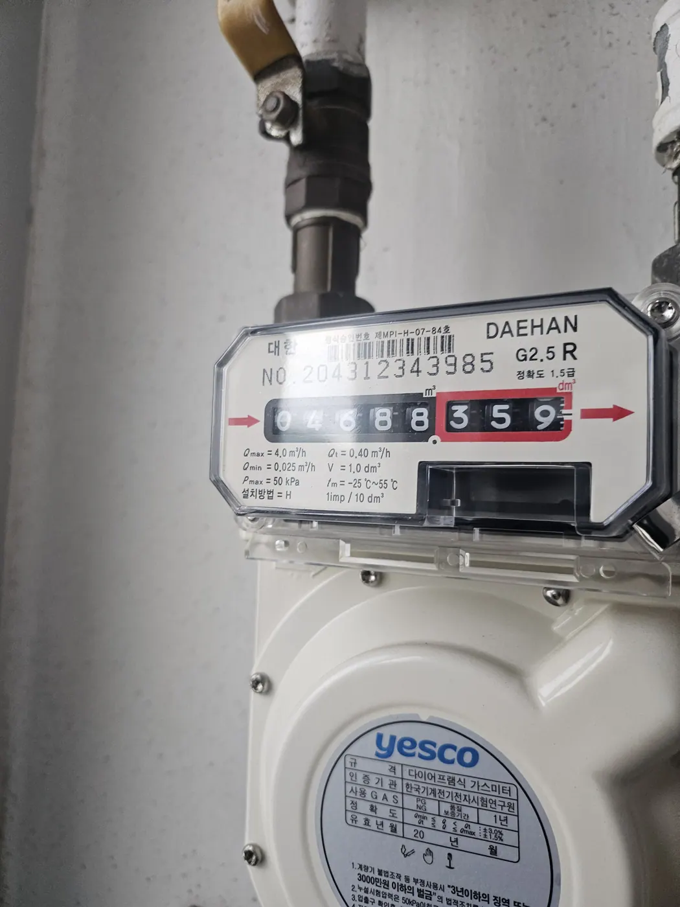
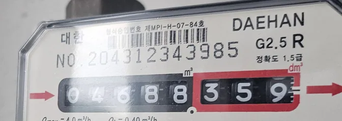
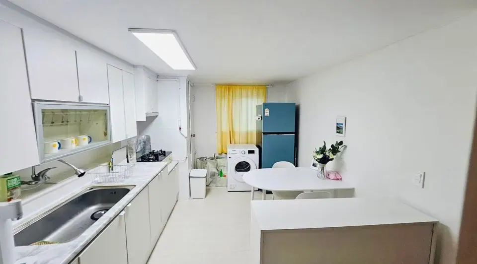
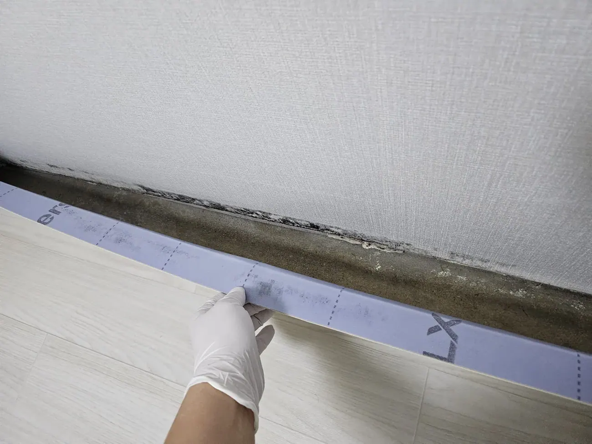

In most countries a rental deposit is a month or two of rent. In
Korea it's routinely **₩10,000,000 or more** — the largest single
sum you will hand to anyone here, sitting with a landlord for a year
or two. (If you have not signed yet, the checks that matter come
[before that](/blog/what-to-check-before-renting-seoul/).)

You get it back at the end, minus whatever gets deducted. Which
makes **move-in day**, before you unpack anything, the twenty
minutes that decide how that conversation goes.

## Start with the meters, not the walls

This is the one everybody skips, and it's the one that costs money
immediately rather than at the end.

*Gas meter, move-in day · ⓒ @BalliBalliSeoul*

Korean utility bills are calculated from meter readings, and the
reading doesn't reset because a new tenant arrived. **If the number
on the meter when you move in is higher than the number the utility
has on file, the difference lands on your first bill.**

*Black digits are whole cubic metres, red are decimals · ⓒ @BalliBalliSeoul*

Photograph all three, on the day:

| Meter | Where it usually is |
| ----- | ------------------- |
| **Gas** (도시가스) | On the pipe near the boiler, kitchen or the outside corridor |
| **Electricity** (전기) | In the corridor, entrance cupboard, or a shared panel by the stairs |
| **Water** (수도) | Often a shared box in the hallway or outside — sometimes only in the building's plant room |

Take one wide shot showing where the meter is, and one close enough
to read every digit. In shared buildings there will be a row of
identical meters, so **get the unit number in frame** — a photo of
the right number on the wrong meter is worse than no photo.

If a reading looks wildly different from what the landlord or agent
told you, that's a question to ask **now**, politely, not after the
first bill arrives.

## Then the rest of the flat

Work round the room once, and shoot in pairs: a wide shot for
context, a close one for the detail. The list is short because it
targets the places deposits actually get argued over.

- **Wall bases and corners**, especially exterior walls — the same
  places we said to check
  [before you sign](/blog/mould-behind-baseboard-korea/)
- **Ceilings**, for brown rings or a sagging cornice
- **Floors** — scratches, dents, lifted vinyl edges
- **Silicone** around the bath, sink and shower tray, which
  discolours and is a classic deduction
- **Window frames and screens** — condensation marks, tears, holes
- **Every appliance, switched on.** A photo of a working screen is
  the proof it worked

*Kitchen, day one — get every appliance in frame, switched on · ⓒ @BalliBalliSeoul*

- **Anything already broken or marked.** Don't tidy it out of the
  frame — this is the whole point

*Existing damage is the most valuable thing in the album · ⓒ @BalliBalliSeoul*

Twenty minutes, once.

## Make the date provable — quietly

The photos are only worth anything if it's clear they were taken on
day one rather than reconstructed later.

You don't need anything clever:

- **Leave automatic cloud backup on.** Google Photos or iCloud
  stamps the upload date independently of the file itself.
- **Email the batch to yourself** the same evening. A dated email in
  your own inbox is a simple, ordinary record.
- **Don't strip the metadata.** Sending photos through some
  messaging apps re-compresses them and drops the EXIF date — keep
  the originals somewhere untouched.

## What not to do

Here's where foreign advice goes wrong, so let's be direct.

**Don't send the landlord an album of every scratch on move-in day.**
It isn't the norm here, and it doesn't read as diligence — it reads
as somebody who has arrived expecting a fight. You will be dealing
with this person for a year or more, and the tone you set in week
one lasts.

**Do report actual defects.** These are two different things:

| Action | Normal in Korea? |
| ------ | ---------------- |
| Keeping your own photo record | ✅ Sensible, and invisible |
| Sending "here is every mark I found" | ❌ Reads as adversarial |
| Reporting mould, a leak stain, a broken appliance — with a photo | ✅ **Expected.** This is a repair request |

So: record everything for yourself, and raise **only the things that
actually need fixing**. If you signed through an agent (부동산),
raising them via the agent is smoother than going direct — that's
part of what the fee bought you.

And for anything that is genuinely a fault rather than a scuff — a
[stain spreading on the ceiling](/blog/water-leak-korean-apartment/),
[hot water that comes and goes](/blog/korea-boiler-hot-water-problems/)
— report it early and in writing. Waiting doesn't make it your
landlord's problem any less; it just makes it look like you caused
it.

## Wear and tear versus damage

The deduction argument almost always comes down to one distinction:
**ordinary living leaves marks, and that isn't damage.**

Broadly, and this is not legal advice:

- **Expected** — faded wallpaper, minor scuffs, furniture marks on
  vinyl flooring, general wear on fittings over a two-year tenancy
- **Chargeable** — holes drilled in walls, burns, broken fittings,
  a wall covered in mould because the room was never once
  ventilated, damage from a frozen pipe after the heating was left
  off all winter

The grey zone in between is exactly where your day-one photos do
their work. **You can't win that argument with a memory.**

## Do it again on the way out

Before you hand the keys back, walk the same route and take the same
shots from the same angles.

A matched pair — this corner in March last year, this corner today —
settles in ten seconds what an argument would take a week to
resolve. It also tells you, honestly, whether a deduction is fair.

## The Korean part

Move-in day is usually the day everything else is happening at once:
the van, the contract, the internet installation, the agent, a
landlord speaking Korean at speed.

Our **[moving service](/moving)** handles the van and the crew, and
through our [anything-else concierge service](/etc) we'll walk the
flat with you, find the meters, read what's written on them, and
raise anything that needs raising with the landlord — in Korean, in
the tone that gets it fixed rather than the tone that starts a year
of friction.

## Get it sorted

> **Moving in and not sure what to record — or already staring at a
> deduction you don't agree with?** Message us on
> [WhatsApp](https://wa.me/821075191282) with photos and we'll tell
> you where you stand. First answer is free.

The one-line version: **photograph the three meters before you
unpack, shoot every wall base, corner and appliance, keep it in your
own cloud rather than the landlord's inbox, and repeat the same
angles on the day you leave.**
